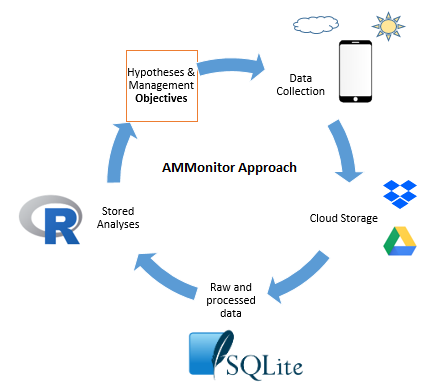

AMMonitor: Remote Monitoring of Biodiversity in an Adaptive Framework
================

  - [Background](#background)
  - [Gratitude](#gratitude)
  - [References](#references)

# Background

Amid climate change and rapidly shifting land uses, effective methods
for monitoring natural resources are critical to support
scientifically-informed resource management decisions \[1–5\]. The
practice of using Autonomous Monitoring Units (AMUs) to monitor wildlife
species has grown immensely in the past decade, with monitoring projects
across species from birds, to bats, amphibians, insects, terrestrial
mammals, and marine mammals \[6,7\].

AMUs have many benefits. Primarily, they can be deployed for long
periods of time to collect massive amounts of data, such as audio
recordings and photos. Having a record of audio and photo data allows
researchers to carefully verify and analyze species identifications *a
posteriori* \[8\].

However, automated methods have several limitations. First, individual
AMUs can be expensive, running over $800 USD for commercial devices
\[9\], although cost-effective models are becoming more common \[10\].
Second, data is typically stored on AMUs until researchers can retrieve
it, causing time lapses between data collection, analysis, and results.
Such delays hamper the ability to efficiently address pressing
ecological challenges and track progress toward management objectives.
Third, the data management requirements of an AMU research effort are
often immense. A monitoring program is a collection of people,
equipment, monitoring locations, location characteristics, research
objectives, and data files, with multiple moving parts to manage.
Without a comprehensive framework for efficiently moving from raw data
collection to results and analysis, monitoring programs are limited in
their capacity to characterize ecological processes and inform
management decisions \[12–18\].

**AMMonitor** is an open source R package dedicated to collecting,
storing, and analyzing AMU information in a way that 1) is
cost-effective, 2) can efficiently process and store information, and 3)
can take advantage of the vast and growing community of R analytics. We
created **AMMonitor** for the Bureau of Land Management to monitor high
priority wildlife across the southern California Solar Energy Zone
(SEZ), including the Couch’s Spadefoot (*Scaphiopus couchii*), kit fox
(*Vuples macrotis*), coyote (*Canis latrans*), and a variety of bird
species, such as the Verdin (*Auriparus flaviceps*), Black-tailed
Gnatcatcher (*Polioptila melanura*), and Eurasian Collared-Dove
(*Streptopelia decaocto*). The agency has established management
objectives (benchmarks) to ensure the persistence of sensitive species
and minimize the spread of invasive species across the SEZ as solar
energy projects are added to the landscape. In developing **AMMonitor**,
our primary goal was to create a system for handling and processing
massive amounts of data to allow BLM to quickly ascertain species
distribution patterns (e.g., an occupancy analysis) in relation to their
management objectives.

In broad terms, the **AMMonitor** approach starts with ecological
hypotheses or natural resource management objectives (Figure 0.1;
boxed). Data are collected with Autonomous Monitoring Units (AMUs) to
test hypotheses or to evaluate the state of a resource with respect to a
management objective. Acoustic recordings and photos are collected and
delivered to the cloud. Raw and processed data are stored in a SQLite
database. The data can be analyzed with a wide variety of analytical
methods, often models of abundance or occupancy pattern. These analyses
can be stored, and resulting outputs can be compared with research and
monitoring objectives to track progress toward management goals. The
final results are assessed with respect to hypotheses or objectives.
Thus, the **AMMonitor** package places the monitoring data into an
**a**daptive **m**anagement framework
\[19\].

<kbd>

</kbd>

> *Figure 0.1. The general AMMonitor framework begins with basic
> research hypotheses or applied resource management objectives
> (boxed).*

The **AMMonitor** approach was developed with a prototype of 20
smartphone-based AMUs \[20–22\]. Since then, we have added the capacity
to use the smartphone’s camera by enabling timed photographs as well as
motion-triggered photographs, allowing the smartphones to act as camera
traps. However, the **AMMonitor** approach does not require the use of
smartphones. Its flexibility allows the analyis of data collected by
other autonomous devices, and further permits the storage of results
from other analytical systems for additional processing in R.

This guide provides step-by-step instructions for using **AMMonitor** in
its current form for monitoring programs that rely on remotely-captured
data for use in adaptive management. We welcome collaborators who may be
interested in improving or building on our approach.

# Gratitude

We thank Mark Massar and the Bureau of Land Management for essential
field support and guidance, Jon Katz and Jim Hines for programming
assistance, and John Sauer for critical review of the software and
documentation.

# References

1\. Holling CS, United Nations Environment Programme. Adaptive
environmental assessment and management. Laxenburg, Austria; Chichester,
New York: International Institute for Applied Systems Analysis; Wiley;
1978. pp. xviii, 377p. 

2\. Walters C. Adaptive management of renewable resources. New York:
Macmillan; 1986. p. 374 p. 

3\. Lee K. Compass and gyroscope: Integrating science and politics for
the environment. Washington DC: Island Press; 1993. p. 255 p. 

4\. Pollock KH, Nichols JD, Simons TR, Farnsworth GL, Bailey LL, Sauer
JR. Large scale wildlife monitoring studies: Statistical methods for
design and analysis. Environmetrics. 2002;13: 105–119. 

5\. Allen CR, Garmestani AS, editors. Adaptive management of
social-ecological systems \[Internet\]. Springer Science Mathplus
Business Media; 2015.
doi:[10.1007/978-94-017-9682-8](https://doi.org/10.1007/978-94-017-9682-8)

6\. August T, Harvey M, Lightfoot P, Kilbey D, Papadopoulos T, Jepson P.
Emerging technologies for biological recording. Biological Journal of
the Linnean Society. 2015;115: 731–749. 

7\. Burton AC, Neilson E, Moreira D, Ladle A, Steenweg R, Fisher JT, et
al. Wildlife camera trapping: A review and recommendations for linking
surveys to ecological processes. Journal of Applied Ecology. 2015;52:
675–685. 

8\. Hobson KA, Rempel RS, Greenwood H, Turnbull B, Van Wilgenburg S.
Acoustic surveys of birds using electronic recordings: New potential
from an omnidirectional microphone system. Wildlife Society Bulletin.
2002;30: 709–720. 

9\. Song meter sm4 \[acoustic recording hardware\] \[Internet\].
Wildlife Acoustics; 2019. Available:
<https://www.wildlifeacoustics.com/products/song-meter-sm4>

10\. Whytock RC, Christie J. Solo: An open source, customizable and
inexpensive audio recorder for bioacoustic research. Methods in Ecology
and Evolution. 2017;8: 308–312. 

11\. Hill AP, Prince P, Piña Covarrubias E, Doncaster CP, Snaddon JL,
Rogers A. AudioMoth: Evaluation of a smart open acoustic device for
monitoring biodiversity and the environment. Methods in Ecology and
Evolution. 2018;9: 1199–1211. 

12\. Gregory R, Ohlson D, Arvai J. Deconstructing adaptive management:
Criteria for applications to environmental management. Ecological
Applications. 2006;16: 2411–2425. 

13\. Rehme SE, Powell LA, Allen CR. Multimodel inference and adaptive
management. Journal of Environmental Management. 2011;92: 1360–1364. 

14\. Fontaine JJ. Improving our legacy: Incorporation of adaptive
management into state wildlife action plans. Journal of Environmental
Management. 2011;92: 1403–1408. 

15\. Greig LA, Marmorek DR, Murray C, Robinson DCE. Insight into
enabling adaptive management. Ecology and Society. 2013;18. 

16\. Rist L, Felton A, Samuelsson L, Sandstrom C, Rosvall O. A new
paradigm for adaptive management. Ecology and Society. 2013;18: 63.
Available: <http://dx.doi.org/10.5751/ES-06183-180463>

17\. Fischman RL, Ruhl JB. Judging adaptive management practices of us
agencies. Conservation Biology. 2016;30: 268–275. 

18\. Williams BK, Brown ED. Technical challenges in the application of
adaptive management. Biological Conservation. 2016;195: 255–263. 

19\. Williams BK. Adaptive management of natural resources-framework and
issues. Journal of Environmental Management. 2011;92: 1346–1353. 

20\. Balantic CM, Donovan TM. Statistical learning mitigation of false
positives from template-detected data in automated acoustic wildlife
monitoring. Bioacoustics. Taylor & Francis; 2019;0: 1–26.
doi:[10.1080/09524622.2019.1605309](https://doi.org/10.1080/09524622.2019.1605309)

21\. Balantic C, Donovan T. Dynamic wildlife occupancy models using
automated acoustic monitoring data. Ecological Applications. 2019;29:
e01854. doi:[10.1002/eap.1854](https://doi.org/10.1002/eap.1854)

22\. Balantic C, Donovan T. Temporally-adaptive acoustic sampling to
maximize detection across a suite of focal wildlife species. Ecology and
Evolution. 

