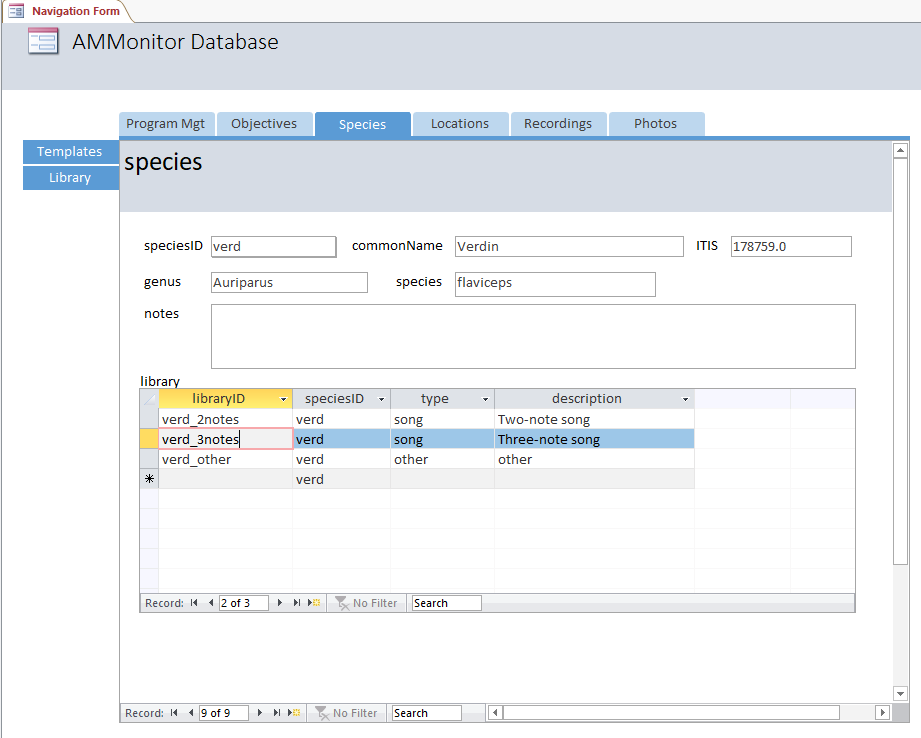
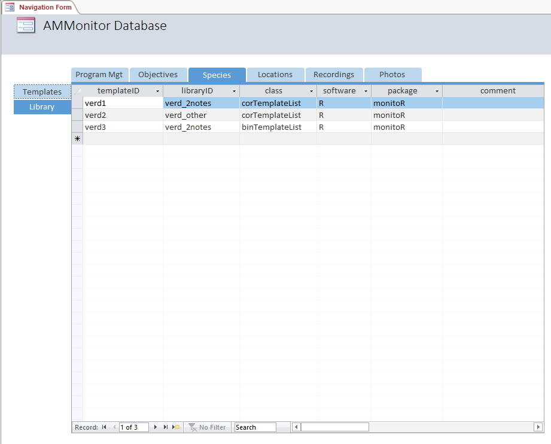

<div></div>

  - [Chapter Introduction](#chapter-introduction)
  - [The Templates Table](#the-templates-table)
  - [Creating a template](#creating-a-template)
  - [Saving Templates](#saving-templates)
  - [The Templates Table in Access](#the-templates-table-in-access)
  - [Chapter summary](#chapter-summary)
  - [Chapter References](#chapter-references)

# Chapter Introduction

In an acoustic monitoring context, a **template** is an example of a
type of sound a researcher hopes to automatically identify using the
computer. It might be a single identifying note, a phrase of multiple
notes, and/or a breeding song. If a focal species produces multiple
sound types, a researcher might create multiple templates.

In **AMMonitor**, a template is an R object that contains a signal of
interest. The database table **templates** stores information about each
template, including information on its class, minimum and maximum
frequency, and the template object itself. Once users have created a
template for a target signal, they can run the template against
recordings to acquire detected events similar to the target signal (as
demonstrated in the next chapter, **scores**).

To illustrate the process of creating a template in **AMMonitor**, we
use `dbCreateSample()` to create a database called “Chap15.sqlite”,
which will be stored in a folder called **database** within the
**AMMonitor** main directory (which should be your working directory in
R). Recall that `dbCreateSample()` generates all tables of an
**AMMonitor** database, and then pre-populates sample data into tables
specified by the user.

We will generate sample data for necessary tables in the
`dbCreateSample()` function below. We will also demonstrate how to
auto-populate the **templates** table with **AMMonitor** functions later
on in the chapter:

``` r
# Create a sample database for this chapter
dbCreateSample(db.name = "Chap15.sqlite", 
               file.path = paste0(getwd(),"/database"), 
               tables = c('species', 'library', 'people', 'templates'))
```

    ## An AMMonitor database has been created with the name Chap15.sqlite which consists of the following tables:

    ## accounts, annotations, assessments, classifications, deployment, equipment, library, listItems, lists, locations, logs, objectives, people, photos, priorities, prioritization, recordings, schedule, scores, scriptArgs, scripts, soundscape, spatials, species, sqlite_sequence, templates, temporals

    ## 
    ## Sample data have been generated for the following tables: 
    ## people, species, library, templates

Now, we connect to the database. First, we initialize a character
object, **db.path**, that holds the database’s full file path. Then, we
create a database connection object, **conx**, using RSQLite’s
`dbConnect()` function, where we identify the SQLite driver in the ‘drv’
argument, and our **db.path** object in the ‘dbname’ argument:

``` r
# Establish the database file path as db.path
db.path <- paste0(getwd(), '/database/Chap15.sqlite')

# Connect to the database
conx <- RSQLite::dbConnect(drv = dbDriver('SQLite'), dbname = db.path)
```

After that, we send a SQL statement that will enforce foreign key
constraints.

``` r
# Turn the SQLite foreign constraints on
RSQLite::dbSendQuery(conn = conx, statement = "PRAGMA foreign_keys = ON;" )
```

    ## <SQLiteResult>
    ##   SQL  PRAGMA foreign_keys = ON;
    ##   ROWS Fetched: 0 [complete]
    ##        Changed: 0

# The Templates Table

We begin by looking at the **templates** table. We can use `dbTables()`
to view the table’s field summary:

``` r
# Look at information about the templates table
dbTables(db.path = db.path, table = "templates")
```

    ## $templates
    ##    cid       name         type notnull dflt_value pk comment
    ## 1    0 templateID VARCHAR(255)       1         NA  1        
    ## 2    1  libraryID VARCHAR(255)       1         NA  0        
    ## 3    2      class VARCHAR(255)       0         NA  0        
    ## 4    3   software VARCHAR(255)       0         NA  0        
    ## 5    4    package VARCHAR(255)       0         NA  0        
    ## 6    5    comment         TEXT       0         NA  0        
    ## 7    6     minFrq         REAL       0         NA  0        
    ## 8    7     maxFrq         REAL       0         NA  0        
    ## 9    8         wl         REAL       0         NA  0        
    ## 10   9       ovlp         REAL       0         NA  0        
    ## 11  10         wn VARCHAR(255)       0         NA  0        
    ## 12  11   template         BLOB       0         NA  0        
    ## 13  12   personID VARCHAR(255)       0         NA  0

The primary key for this table is *templateID*, which is the template’s
unique name (a character of up to 255 characters in length). Each
template must be tagged to a signal given in the **library** table
(*libraryID*). The fields *class*, *software*, and *package* store
information about the class of the template object and how it was
created. *Comment* is a text field where users can store additional
information. The fields *minFrq* and *maxFrq* store the template’s
minimum and maximum frequency. The fields *wl* (window length), *ovlp*
(overlap), and *wn* (window type) provide information on how to convert
the audio signal into a visible spectrogram. The field *template* is the
actual template itself, stored as a SQLite BLOB. The [SQLite
tutorial](http://www.sqlitetutorial.net/sqlite-data-types/) page defines
a BLOB as “a binary large object that can be used to store any kind of
data. The maximum size of BLOBs is unlimited.” The final column,
*personID* identifies the team member who created the template.

Foreign key assigments can be confirmed as follows:

``` r
# Return foreign key information for the templates table
RSQLite::dbGetQuery(conn = conx, statement = "PRAGMA foreign_key_list(templates);")
```

    ##   id seq   table      from        to on_update on_delete match
    ## 1  0   0  people  personID  personID   CASCADE NO ACTION  NONE
    ## 2  1   0 library libraryID libraryID   CASCADE NO ACTION  NONE

Notice that the field *personID* from table **people** maps to the
*personID* field in the **templates** table, and the field *libraryID*
from table **library** maps to the *libraryID* field in the
**templates** table.

Below, we view the library that comes with the sample database:

``` r
# Retrieve the lists in the sample database
RSQLite::dbGetQuery(conn = conx, 
                    statement = "SELECT * 
                                 FROM library")
```

    ##         libraryID speciesID  type                                     description
    ## 1      btgn_other      btgn other                                           other
    ## 2       btgn_zhee      btgn  song        Typical zhee-zhee-zhee territorial sound
    ## 3      copo_other      copo other                                           other
    ## 4       copo_song      copo  song                               a loud "poorwill"
    ## 5  coyote_general    coyote  call                                Any coyote sound
    ## 6    ecdo_1phrase      ecdo  song                                Coo-coo-cup song
    ## 7    ecdo_2phrase      ecdo  song                     Two phrase coo-coo-cup song
    ## 8      ecdo_other      ecdo other                                           other
    ## 9       ecdo_song      ecdo  song Coo coo cup song, number of phrases unspecified
    ## 10    fox_general       fox  call                               Any kit fox sound
    ## 11      gaqu_call      gaqu  call                                    Typical call
    ## 12     gaqu_other      gaqu other                                           other
    ## 13     leni_other      leni other                                           other
    ## 14     leni_trill      leni  call                         toadlike breeding trill
    ## 15   toad_general      toad  call                     Any Couch's Spadefoot sound
    ## 16    verd_2notes      verd  song                                   Two-note song
    ## 17    verd_3notes      verd  song                                 Three-note song
    ## 18     verd_other      verd other                                           other

Recall that the **library** table in an **AMMonitor** database
identifies target signals issued by a particular species. For example,
for the target species Verdin (speciesID = ‘verd’), three signals are
listed in the library: a two-note song, a three-note song, and other. At
least one template should be created for each signal so that
**AMMonitor** can search for these signals in audio recordings.

Before diving into the mechanics of creating and saving templates to the
database, we view example templates that come with the **AMMonitor**
sample database:

``` r
# Retrieve the templates in the templates table
sample.templates <- RSQLite::dbGetQuery(
  conn = conx, 
  statement = "SELECT templateID, libraryID, class, 
                      software, package, template, personID 
              FROM templates"
)

# View the structure of the sample.templates
str(sample.templates)
```

    ## 'data.frame':    3 obs. of  7 variables:
    ##  $ templateID: chr  "verd1" "verd2" "verd3"
    ##  $ libraryID : chr  "verd_2notes" "verd_other" "verd_2notes"
    ##  $ class     : chr  "corTemplateList" "corTemplateList" "binTemplateList"
    ##  $ software  : chr  "R" "R" "R"
    ##  $ package   : chr  "monitoR" "monitoR" "monitoR"
    ##  $ template  :List of 3
    ##   ..$ : raw  58 0a 00 00 ...
    ##   ..$ : raw  58 0a 00 00 ...
    ##   ..$ : raw  58 0a 00 00 ...
    ##   ..- attr(*, "class")= chr "blob"
    ##  $ personID  : chr  "fbaggins" "fbaggins" "bbaggins"

As shown, the sample database comes with three templates created by
Frodo Baggins: two for the ‘verd\_2notes’ signal and one for the
‘verd\_other’ signal. The *templateID* contains a unique character
name chosen by the user. The *libraryID* indicates which sound/call the
template intends to capture. In *class*, *software*, and *package*, we
state the type of template, the software, and the R package used to
create it. In our example, the classes are either **corTemplateList** or
**binTemplateList**, created using the R software package **monitoR**
\[1\]. The *template* field contains the template itself, stored as a
BLOB.

To use a template stored in the database, we retrieve the template with
`templatesUnserialize()`. This function converts the database BLOB
(serialized) back to the orignal R object. Here, we retrieve and plot
the template named ‘verd1’, which is a template designed to find the
‘verd\_2notes’ signal:

``` r
# Retrieve the template from the database
t1 <- templatesUnserialize(db.path = db.path, templateID = 'verd1')

# Look at the structure of this object
str(t1, max.level = 3)
```

    ## Formal class 'corTemplateList' [package "monitoR"] with 1 slot
    ##   ..@ templates:List of 1
    ##   .. ..$ verd1:Formal class 'corTemplate' [package "monitoR"] with 15 slots

``` r
# Plot it
plot(t1)
```


# Creating a template

For template creation, **AMMonitor** uses functions from the package
[**monitoR**](https://cran.r-project.org/web/packages/monitoR/index.html)
\[1\]. The **monitoR** [Quickstart Guide
PDF](https://cran.r-project.org/web/packages/monitoR/vignettes/monitoR_QuickStart.pdf)
provides instructions on how to create templates. Below, we summarize
the key points.

Users should put thought and care into constructing templates. It is an
iterative process, and users will likely wish to create many templates
and then conduct some testing to decide which ones are worth using.
Though no template will be perfect, the success of the automated
detection system may be fine-tuned later as described in the the
**scores** and **classifications** chapters.

The first step in creating a template is to read a recording into R.
Typically, recordings are stored in the **recordings** folder within the
main **AMMonitor** directory. For demonstration purposes, however, we
will load sample recordings that come with the **AMMonitor** package,
and write one of them to a wave file in our working directory:

``` r
# Read in data
data(sampleRecordings)

# Write the fourth recording to the working directory
tuneR::writeWave(object = sampleRecordings[[4]],
                 filename = "midEarth5_2016-03-21_07-30-00.wav ")
```

We view the recording using the **monitoR** function `viewSpec()`,
specifying the ‘clip’ name, ‘units’ of “seconds”, and a ‘page.length’ of
10 seconds.

``` r
monitoR::viewSpec(clip = "midEarth5_2016-03-21_07-30-00.wav", 
                  units = "seconds", 
                  page.length = 10)
```


Here, we see an example of vocalizations by a target Middle Earth
monitoring species, the Verdin, which has a species code of ‘verd’ in
the **species** table as shown below:

``` r
# Confirm that Verdin is in the species table
RSQLite::dbGetQuery(conx, 'SELECT * FROM species WHERE speciesID = "verd" ')
```

    ##   speciesID commonName     ITIS     genus   species notes
    ## 1      verd     Verdin 178759.0 Auriparus flaviceps  <NA>

As previously described, the Verdin has three distinct vocalizations
that are identified in the **library** table.

``` r
# Check on Verdin library selections
RSQLite::dbGetQuery(conx, 'SELECT * FROM library WHERE speciesID = "verd" ')
```

    ##     libraryID speciesID  type     description
    ## 1 verd_2notes      verd  song   Two-note song
    ## 2 verd_3notes      verd  song Three-note song
    ## 3  verd_other      verd other           other

Imagine that we decide this is a good example of a Verdin two-note song,
and that we want to construct a template with it. **monitoR** contains
two template types: spectrogram cross-correlation (created using the
`makeCorTemplate()` **monitoR** function), and binary point matching
(created using the `makeBinTemplate()` **monitoR** function). Find more
information about these functions in the [monitoR Quickstart Guide
PDF](https://cran.r-project.org/web/packages/monitoR/vignettes/monitoR_QuickStart.pdf).

Below, we use `makeCorTemplate()` to create a cross correlation
template. We input the file name in the ‘clip’ argument, specify time
limits in seconds in the ‘t.lim’ argument, and specify frequency limits
in the ‘frq.lim’ argument (essentially drawing a box around the signal).
In the ‘select’ argument, we have input the “auto” option so that the
template will be automatically created based on the time and frequency
limits. Alternatively, if desired, the “cell” and “rectangle” options
give the user finer control over which portions of the signal should be
included in the template. Next, the ‘score.cutoff’ argument identifies
the threshold above which similar signals are detected. Below, we select
a score.cutoff of 0. Lastly, we give the template a ‘name’, which will
become this template’s unique templateID in the database. Several other
arguments facilitate template customization that we have not covered
here, including buffers, density point selection, and Fourier transform
arguments window length (default 512), overlap (default 0), and window
type (default “hanning”). We encourage users to spend some time with the
template creation portion of the **monitoR** Quickstart Guide and
helpfiles for `makeCorTemplate()` and `makeBinTemplate()`.

``` r
# Create a template based on the first signal in the audio recording
verd4 <- monitoR::makeCorTemplate(
  clip = "midEarth5_2016-03-21_07-30-00.wav", 
  t.lim = c(4.45, 4.95), 
  frq.lim = c(3.8,6), 
  select = "auto", 
  score.cutoff = 0,
  name = "verd4")
```


    ## 
    ## Automatic point selection.
    ## 
    ## Done.

We practice again by creating a second template with the other
vocalization present on our recording:

``` r
# Create a template based on the second signal in the audio recording
verd5 <- monitoR::makeCorTemplate(
  clip = "midEarth5_2016-03-21_07-30-00.wav", 
  t.lim = c(8.8, 9.32), 
  frq.lim = c(3.8,6), 
  select = "auto", 
  score.cutoff = 0,
  name = 'verd5')
```


    ## 
    ## Automatic point selection.
    ## 
    ## Done.

# Saving Templates

When we are satisifed with our template(s), we can insert them into the
database **templates** table using `templatesInsert()`, which first
takes our **db.path** object as input to the ‘db.path’ argument. Next,
the argument ‘template.list’ requires an object of class
**corTemplateList** or **binTemplateList**. The **monitoR** template
system is designed to work with multiple templates, so even a single
template is considered either a corTemplateList or a binTemplateList. In
the ‘template.list’ argument, we may input a single template object,
such as **verd4**. Alternatively, if we wish to insert several templates
at once, we can wrap the **monitoR** function `combineCorTemplates()`
around multiple corTemplateList objects and send all of them to
`templatesInsert()`, which we do below. Lastly, into the ‘libraryID’
argument, we pass a character vector of the libraryIDs we want to
associate with each template, which should be ordered following the
templates in ‘template.list’. Below, both templates have the libraryID
‘verd\_2notes’.

``` r
# Insert the following templates
templatesInsert(db.path = db.path, 
                template.list = combineCorTemplates(verd4, verd5), 
                libraryID = c('verd_2notes', 'verd_2notes'),
                personID = 'fbaggins')
```

    ##    templateID   libraryID           class software package comment   minFrq   maxFrq  wl ovlp      wn              template personID
    ## 1:      verd4 verd_2notes corTemplateList        R monitoR    <NA> 3.875977 5.943164 512    0 hanning 58,0a,00,00,00,03,... fbaggins
    ## 2:      verd5 verd_2notes corTemplateList        R monitoR    <NA> 3.875977 5.943164 512    0 hanning 58,0a,00,00,00,03,... fbaggins

Next, we view the templates table, noting that there are now five
templates, four of which focus on the two-note song type.

``` r
RSQLite::dbGetQuery(conn = conx, 
                    statement = 'SELECT templateID, libraryID, class, 
                                        software, package, template, personID 
                                 FROM templates')
```

    ##   templateID   libraryID           class software package       template personID
    ## 1      verd1 verd_2notes corTemplateList        R monitoR blob[26.64 kB] fbaggins
    ## 2      verd2  verd_other corTemplateList        R monitoR blob[27.24 kB] fbaggins
    ## 3      verd3 verd_2notes binTemplateList        R monitoR blob[18.54 kB] bbaggins
    ## 4      verd4 verd_2notes corTemplateList        R monitoR blob[26.65 kB] fbaggins
    ## 5      verd5 verd_2notes corTemplateList        R monitoR blob[27.25 kB] fbaggins

Notice that the `templatesInsert()` function has converted our templates
into a SQLite data type called a “blob”, which itself contains a data
type called “raw”. Because SQLite does not allow columns containing R
objects of class list or S4, `templatesInsert()` serializes the template
into a format that SQLite accommodates.

As previously demonstrated, we can unserialize templates and read them
in as the original objects using `templatesUnserialize()`. We input our
**db.path** object into the ‘db.path’ argument. In ‘templateID’, we
provide a character vector of the templateIDs to be returned:

``` r
# Grab templates from the templates table and convert them back into templateList objects
unserialized.templates <- templatesUnserialize(db.path = db.path, 
                                               templateID = c('verd4', 'verd5'))

# View the object  -- it is a corTemplateList
unserialized.templates
```

    ## 
    ## Object of class "corTemplateList"
    ##  containing  2  templates
    ##                      original.recording sample.rate lower.frequency upper.frequency lower.amp upper.amp duration n.points score.cutoff
    ## verd4 midEarth5_2016-03-21_07-30-00.wav       44100           3.876           5.943    -72.34         0    0.488     1075            0
    ## verd5 midEarth5_2016-03-21_07-30-00.wav       44100           3.876           5.943    -67.98         0    0.499     1100            0

Creating good templates requires testing and evaluation; templates are
critical for searching through recordings collected by the monitoring
team in pursuit of species presence. This process is illustrated in
Chapter 16.

# The Templates Table in Access

The templates table is a secondary tab nestled under the primary Species
tab in the Access Navigation Form. First, we view the Species tab:

<kbd>



</kbd>

> *Figure 15.1. The templates table is associated with a target species.
> Templates can also be made for human-made sounds. Unique target
> signals issued by a given species are identified in the library table.
> The actual template is stored in the templates table.*

Here, each species is featured (verd is record 9 of 9, as shown at the
bottom of the form). This species has three signals of interest
(‘verd\_2notes’, ‘verd\_3notes’, and ‘verd\_other’) logged in the
signal library.

Clicking on the Templates secondary tab, we see that two templates exist
for the ‘verd\_2notes’ signal, one as a corTemplateList object, the
other as a binTemplateList object. A third template exists for the
‘verd\_other’ signal (a corTemplateList object).

<kbd>



</kbd>

> *Figure 15.2. The templates table tracks a template to a given library
> signal. The template itself is stored in the database as a ‘blob’.*

# Chapter summary

We use templates to search for target signals issued by a species of
monitoring interest. Currently, **AMMonitor** supports templates of
class corTemplateList or binTemplateList in R, which are produced by the
R package **monitoR** using the functions `makeCorTemplate()` and
`makeBinTemplate()`, respectively \[1\]. The function
`templatesInsert()` ensures that templates are serialized and stored as
BLOBs in the **templates** table of an **AMMonitor** database, while
`templatesUnserialize()` extracts templates from the database and
returns them in their proper forms for subsequent analysis in R.

# Chapter References

<div id="refs" class="references">

<div id="ref-monitoR">

1\. Hafner S, Katz J. MonitoR: Acoustic template detection in r (version
1.0.7) \[Internet\]. Comprehensive R Archive Network; 2018. Available:
<http://www.uvm.edu/rsenr/vtcfwru/R/?Page=monitoR/monitoR.htm>

</div>

<div id="ref-Katz2016">

2\. Katz J, Hafner S, Donovan T. Tools for automated acoustic monitoring
within the r package monitoR. Bioacoustics. 2016;12: 50–67. 

</div>

</div>
