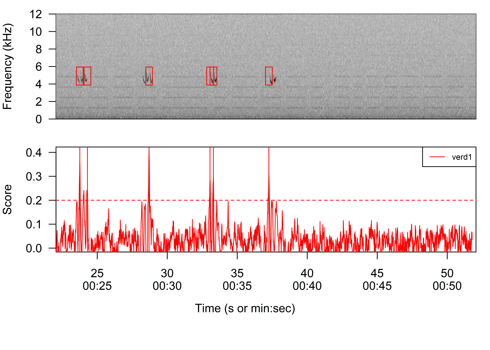
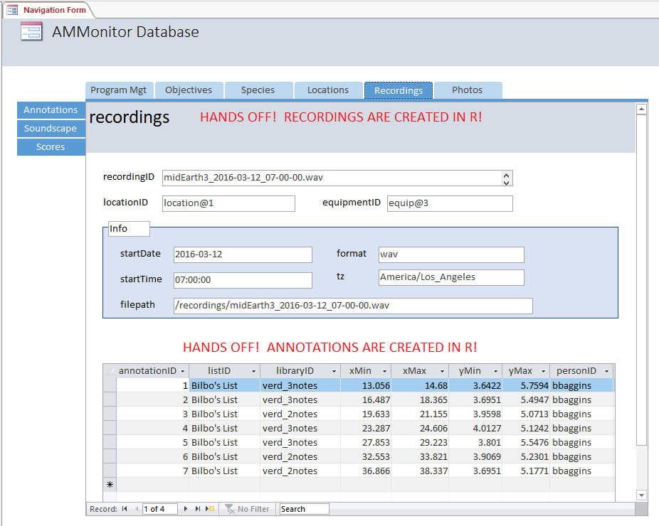

Chapter 16: The Scores Table
================

  - [The Scores Table](#the-scores-table)
  - [Acquiring automatic detections with
    scoresDetect()](#acquiring-automatic-detections-with-scoresdetect)
  - [Event Features](#event-features)
  - [The Scores Table in Access](#the-scores-table-in-access)
  - [Chapter Summary](#chapter-summary)
  - [Chapter References](#chapter-references)

The premise of automated acoustic monitoring is that a research team can
efficiently scan new audio recordings for target signals by creating
templates, which are models of a target signal. When a template is run
against a recording, all detected signals receive a score quantifying
similarity between the signal and the template.

If a score exceeds some user-chosen score threshold, it is a “detected
event”. A detected event is a signal with some chance of being a target
signal. Some detected events may be target signals issued from a focal
species (true positives), and others may be false alarms (false
positives).

The graph below conveys the idea of pitting a recording against a
template (here, the ‘verd1’ template). The lower panel shows the match
between the template and the audio file (\~24 - 51 seconds). Four
detected events exceed a user-defined threshold of 0.2. Each detected
event is highlighted in the upper panel, and these signals can be true
target signals or false alarms.



Given a recording and a template, this chapter highlights how to use
**AMMonitor** to obtain scores and simultaneously extract each detected
event’s acoustic *features*. Each detected event (and accompanying
acoustic features) is stored in the **scores** table, and the acoustic
features can later be used to distinguish true target signals from false
alarms (covered in Chapter 17: Classifications).

To illustrate the **scores** table, we will use `dbCreateSample()` to
create a database called “Chap16.sqlite”, to be stored in a folder
called “database” within the **AMMonitor** main directory (which should
be your working directory in R). Recall that `dbCreateSample()`
generates all tables of an **AMMonitor** database, and then
pre-populates sample data into tables specified by the user.

Below, we use `dbCreateSample()`to create sample data for necessary
tables. We will populate the **scores** table using **AMMonitor**
functions later on in the chapter.

``` r
> # Create a sample database for this chapter
> dbCreateSample(db.name = "Chap16.sqlite", 
+                file.path = paste0(getwd(),"/database"), 
+                tables = c('people', 'species','library', 
+                           'locations','equipment', 
+                           'accounts', 'templates', 
+                           'recordings', 'lists', 'listItems')
+               )
```

    An AMMonitor database has been created with the name Chap16.sqlite which consists of the following tables: 

    accounts, annotations, assessments, classifications, deployment, equipment, library, listItems, lists, locations, logs, objectives, people, photos, priorities, prioritization, recordings, schedule, scores, scriptArgs, scripts, soundscape, spatials, species, sqlite_sequence, templates, temporals

``` 

Sample data have been generated for the following tables: 
accounts, lists, people, species, equipment, locations, library, listItems, recordings, templates
```

Next, we connect to the database. First, we initialize a character
object, **db.path**, that holds the database’s full file path. Then, we
create a database connection object, **conx**, using RSQLite’s
`dbConnect()` function, where we identify the SQLite driver in the ‘drv’
argument, and our **db.path** object in the ‘dbname’ argument:

``` r
> # Establish the database file path as db.path
> db.path <- paste0(getwd(), '/database/Chap16.sqlite')
> 
> # Connect to the database
> conx <- RSQLite::dbConnect(drv = dbDriver('SQLite'), dbname = db.path)
```

After that, we send a SQL statement to enforce foreign key constraints.

``` r
> # Turn the SQLite foreign constraints on
> RSQLite::dbSendQuery(conn = conx, statement = "PRAGMA foreign_keys = ON;" )
```

    <SQLiteResult>
      SQL  PRAGMA foreign_keys = ON;
      ROWS Fetched: 0 [complete]
           Changed: 0

# The Scores Table

We begin by viewing a summary of the **scores** table using
`dbTables()`:

``` r
> # Look at information about the scores table
> dbTables(db.path = db.path, table = "scores")
```

``` 
$scores
   cid                  name         type notnull        dflt_value pk comment
1    0               scoreID      INTEGER       0              <NA>  1        
2    1           recordingID VARCHAR(255)       1              <NA>  0        
3    2            templateID VARCHAR(255)       1              <NA>  0        
4    3                  time         REAL       1              <NA>  0        
5    4        scoreThreshold         REAL       0              <NA>  0        
6    5                 score         REAL       0              <NA>  0        
7    6 manualVerifyLibraryID      INTEGER       0              <NA>  0        
8    7 manualVerifySpeciesID      INTEGER       0              <NA>  0        
9    8              features         BLOB       0              <NA>  0        
10   9             timestamp VARCHAR(255)       1 CURRENT_TIMESTAMP  0        
```

The primary key for this table is the *scoreID*, which is automatically
assigned by SQLite. The *recordingID* maps to a recordingID in the
**recordings** table, while the *templateID* maps to a templateID in the
**templates** table. We verify these key relationships with the
following code:

``` r
> # Return foreign key information for the scores table
> RSQLite::dbGetQuery(conn = conx, statement = "PRAGMA foreign_key_list(scores);")
```

    # A tibble: 2 x 8
         id   seq table      from        to          on_update on_delete match
      <int> <int> <chr>      <chr>       <chr>       <chr>     <chr>     <chr>
    1     0     0 templates  templateID  templateID  CASCADE   NO ACTION NONE 
    2     1     0 recordings recordingID recordingID CASCADE   NO ACTION NONE 

In all cases, *on\_update* is set to CASCADE, meaning that if a key in a
primary table is updated (e.g., a templateID is updated), the changes
trickle down to the **scores** table. Notice also that *on\_delete* is
set to NO ACTION, so if a key in a primary table is deleted (e.g., a
template is deleted from the **templates** table), the change does not
affect the **scores** table. Users can choose to manually delete
affected records in the **scores** table if desired.

The **scores** table stores additional information for each detected
event from a given recording and template. The *scoreThreshold* provides
the user-defined threshold used for detecting events. The *time* field
indicates the time (in seconds) when the event was detected on the
recording. The *manualVerifyLibraryID* and *manualVerifySpeciesID*
columns will be covered in the next chapter (Classifications). The
*features* field contains acoustic summary features associated with each
detected event. Features are stored as a “blob” data type because SQlite
does not accommodate lists or S4 objects (instead, the features have
been serialized for compatibility with SQLite). Finally, the *timestamp*
field records the system date and time at which the detection was
logged.

# Acquiring automatic detections with scoresDetect()

Our task in this chapter is to illustrate the process of acquiring
automatic detections with **AMMonitor’s** `scoresDetect()` function.
Here, we pit templates that come with the sample database (see Chapter
15) against sample recordings (see Chapter 11) in search of target
signals from species of interest.

To begin, we remind ourselves that templates are stored in the
**templates** table:

``` r
> # Retrieve the sample database templates table
> RSQLite::dbGetQuery(conn = conx, statement = "SELECT * FROM templates")
```

    # A tibble: 3 x 13
      templateID libraryID   class           software package comment minFrq maxFrq    wl  ovlp wn            template personID
      <chr>      <chr>       <chr>           <chr>    <chr>   <chr>    <dbl>  <dbl> <dbl> <dbl> <chr>           <blob> <chr>   
    1 verd1      verd_2notes corTemplateList R        monitoR <NA>      3.88   5.94   512     0 hanning <raw 26.64 kB> fbaggins
    2 verd2      verd_other  corTemplateList R        monitoR <NA>      3.88   5.94   512     0 hanning <raw 27.24 kB> fbaggins
    3 verd3      verd_2notes binTemplateList R        monitoR <NA>      3.88   5.94   512     0 hanning <raw 18.54 kB> bbaggins

Here, we see two templates of class “corTemplateList”, and one of class
“binTemplateList”. All three templates seek signals produced by the
Verdin (a songbird), with templateIDs of “verd1”, “verd2”, and “verd3”.
We would like to find instances of these signals in recordings.

To do so, we read in the recordings that come with the **AMMonitor**
package. Recall that in an established monitoring program, recordings
are wave files stored in the **recordings** directory in the cloud,
normally retrieved via `dropBoxGetOneFile()`. For the purposes of this
chapter, however, we will read in the sample recordings and write them
as waves to the working directory with **tuneR**’s \[1\] `writeWave()`
function:

``` r
> # Read in sample recordings
> data(sampleRecordings)
> 
> # Write recordings to working directory
> tuneR::writeWave(object = sampleRecordings[[1]], 
+                  filename = "midEarth3_2016-03-12_07-00-00.wav")
> tuneR::writeWave(object = sampleRecordings[[2]], 
+                  filename = "midEarth4_2016-03-04_06-00-00.wav")
> tuneR::writeWave(object = sampleRecordings[[3]], 
+                  filename = "midEarth4_2016-03-26_07-00-00.wav")
> tuneR::writeWave(object = sampleRecordings[[4]], 
+                  filename = "midEarth5_2016-03-21_07-30-00.wav")
```

Note that metadata for these four recordings is already tracked in the
sample **recordings** table in the database:

``` r
> # Retrieve the sample database recordings table
> RSQLite::dbGetQuery(conn = conx, statement = "SELECT * FROM recordings")
```

    # A tibble: 4 x 9
      recordingID                  locationID equipmentID startDate  startTime filepath                            tz              format timestamp       
      <chr>                        <chr>      <chr>       <chr>      <chr>     <chr>                               <chr>           <chr>  <chr>           
    1 midEarth3_2016-03-12_07-00-~ location@1 equip@3     2016-03-12 07:00:00  /recordings/midEarth3_2016-03-12_0~ America/Los_An~ wav    2018-10-22 17:2~
    2 midEarth4_2016-03-04_06-00-~ location@2 equip@4     2016-03-04 06:00:00  /recordings/midEarth4_2016-03-04_0~ America/Los_An~ wav    2018-10-22 17:2~
    3 midEarth4_2016-03-26_07-00-~ location@2 equip@4     2016-03-26 07:00:00  /recordings/midEarth4_2016-03-26_0~ America/Los_An~ wav    2018-10-22 17:2~
    4 midEarth5_2016-03-21_07-30-~ location@3 equip@5     2016-03-21 07:30:00  /recordings/midEarth5_2016-03-21_0~ America/Los_An~ wav    2018-10-22 17:2~

Thus, the recordings themselves are now in our working directory as wave
files, while the recording metadata and templates are stored in the
SQLite database.

At this point, we can use `scoresDetect()` to compare template
similarity to sounds encountered in the recordings, and extract acoustic
features associated with each detected event.

This function has several arguments, many of which have default values.

``` r
> # Retrieve the arguments for the scoresDetect function
> args(scoresDetect)
```

    function (db.path, date.range, timestamp, recordingID, templateID, 
        listID, score.thresholds, directory, token.path, db.insert, 
        parallel = FALSE, show.prog = FALSE, cor.method = "pearson") 
    NULL

In brief, `scoresDetect()` requires the ‘db.path’ to the SQLite
database, the name of the ‘directory’ that holds the recordings, a
‘token.path’ if the directory is cloud-based, the names of the
‘templateIDs’ to be analyzed, the ‘score.thresholds’ to be used for
detecting events, and additional arguments that specify how the analysis
is to be conducted and how to handle the output.

There are three ways to specify which recordings should be analyzed with
`scoresDetect()`:

  - The first option is to use the ‘date.range’ argument, where a user
    must specify a length 2 character vector of date ranges (inclusive)
    over which to run template matching. Dates should be given in
    YYYY-mm-dd format. e.g. c(‘2016-03-04’, ‘2016-03-12’).
  - The second option is to use the ‘timestamp’ argument, wherein a user
    specifies a length 1 character of a date or timestamp from which to
    run the function (in YYYY-mm-dd **or** YYYY-mm-dd hh:mm:ss format).
    Here, `scoresDetect()` will be run on all recordings more recent
    than or equal to the timestamp. For example, if the ‘timestamp’ is
    set to yesterday at midnight, `scoresDetect()` will analyze any new
    recordings present in the **recordings** table beginning with
    midnight yesterday up to the present moment today. This option is
    compatible with monitoring programs that routinely analyze data as
    new material becomes available.
  - The third option is to use the ‘recordingID’ argument, where a user
    specifies a character vector of recordingIDs against which to run
    templates. If scores should be run for all recordings, the user may
    set recordingID = ‘all’.

Similarly, there are two ways to specify which templates should be
analyzed in the `scoresDetect()` function.

  - First, the user can pass in a vector of templateIDs from the
    **templates** table.
  - Second, the user can provide a *listID* from the **listItems**
    table, and store the template names as a database list. For example,
    the sample database contains a list called “Target Species
    Templates”, which contains the *items* ‘verd1’ and ‘verd2’ from
    the **templates** table, column *templateID*. We can confirm this
    with the following query:

<!-- end list -->

``` r
> # Retrieve a list called 'Target Species Templates'
> RSQLite::dbGetQuery(conn = conx, 
+                     statement = "SELECT * 
+                                  FROM listItems 
+                                  WHERE listID = 'Target Species Templates' ")
```

    # A tibble: 2 x 4
      listID                   dbTable   dbColumn   item 
      <chr>                    <chr>     <chr>      <chr>
    1 Target Species Templates templates templateID verd1
    2 Target Species Templates templates templateID verd2

Thus, an **AMMonitor list** can be passed to `scoresDetect()` function
in lieu of a vector of templateIDs.

Finally, there are alternative approaches for specifying the score
thresholds to be used by the `scoresDetect()` function. First, the user
can pass in a vector of score thresholds used. In this case, the
threshold values should be ordered by the template order. Second, if the
user provides no threshold values, `scoresDetect()` will utilize the
score threshold value stored with the template directly via monitoR
functions (see Chapter 15); **be aware that monitoR uses default values
for score thresholds if you do not provide them yourself when creating
the template**.

We illustrate some alternative approaches in the three code blocks
below. In all cases, we are pitting templates against the recordings
‘midEarth3\_2016-03-12\_07-00-00’, ‘midEarth4\_2016-03-04\_06-00-00’,
‘midEarth4\_2016-03-26\_07-00-00’, and
‘midEarth5\_2016-03-21\_07-30-00’ (located in the working directory).
Here, the Chap16 database is identified in the *db.path* argument, and
the recordings are located in our working directory. For the
‘score.thresholds’ argument, we specify a numeric vector of score
thresholds to use for each template; any signal above this threshold
will be registered as a detected event. Lastly, we indicate whether we
want to insert the scores directly into the database (db.insert = TRUE)
or merely test the function while learning how to use it (db.insert =
FALSE).

``` r
> # Run scoresDetect using recordingID = 'all' and a vector of templateIDs
> # Example is not executed
> scores <- scoresDetect(db.path = db.path, 
+                        directory = getwd(), 
+                        recordingID = 'all',
+                        templateID = c('verd1', 'verd2', 'verd3'),
+                        score.thresholds = c(0.2, 0.2, 13),
+                        token.path = NULL, 
+                        db.insert = FALSE)
```

``` r
> # Run scoresDetect using a listID for templates, 
> # a timestamp for recordings, and omitting the score.thresholds argument 
> # Example is not executed
> scores <- scoresDetect(db.path = db.path, 
+                        directory = getwd(), 
+                        timestamp = '2018-10-21',  
+                        listID = 'Target Species Templates',     
+                        token.path = NULL, 
+                        db.insert = FALSE) 
```

``` r
> # Run scoresDetect using a listID for templates and a 
> # date.range for recordings; insert to database
> # This example IS executed and we insert results into the database
> scores <- scoresDetect(db.path = db.path, 
+                        directory = getwd(), 
+                        date.range = c('2016-03-04', '2016-03-12'),  
+                        listID = 'Target Species Templates',     
+                        score.thresholds = c(0.2, 0.2),
+                        token.path = NULL, 
+                        db.insert = TRUE) 
```

    Reading wave for spectrogram parameter set 1, recording 1 out of 2

    Processing scores for template 1 (verd1)

    Processing scores for template 2 (verd2)

    Reading wave for spectrogram parameter set 1, recording 2 out of 2

    Processing scores for template 1 (verd1)

    Processing scores for template 2 (verd2)

    New scores added to database

As shown, `scoresDetect()` generates a number of progress messages about
which recordings and templates it is currently processing (all of which
may be suppressed by wrapping the function in a call to
`suppressMessages()`). If we have previously run the same combination of
recordingID, templateID and score threshold and these records are
present in the database, the function will neither run nor insert this
combination again.

The results of `scoresDetect()` are provided in a data frame, which is
inserted into the database **scores** table if db.insert = TRUE. Below,
we view the first six scores from our analysis:

``` r
> # Retrieve a scores from the 'verd1' template
> RSQLite::dbGetQuery(conn = conx, 
+                     statement = "SELECT * 
+                                  FROM scores 
+                                  WHERE templateID = 'verd1' LIMIT 6")
```

    # A tibble: 6 x 10
      scoreID recordingID                  templateID   time scoreThreshold score manualVerifyLibrary~ manualVerifySpecie~       features timestamp       
        <int> <chr>                        <chr>       <dbl>          <dbl> <dbl>                <int>               <int>         <blob> <chr>           
    1       1 midEarth3_2016-03-12_07-00-~ verd1       0.499            0.2 0.267                   NA                  NA <raw 37.23 kB> 2019-06-21 12:4~
    2       2 midEarth3_2016-03-12_07-00-~ verd1       2.07             0.2 0.253                   NA                  NA <raw 37.23 kB> 2019-06-21 12:4~
    3       3 midEarth3_2016-03-12_07-00-~ verd1       3.31             0.2 0.254                   NA                  NA <raw 37.23 kB> 2019-06-21 12:4~
    4       4 midEarth3_2016-03-12_07-00-~ verd1       8.70             0.2 0.205                   NA                  NA <raw 37.23 kB> 2019-06-21 12:4~
    5       5 midEarth3_2016-03-12_07-00-~ verd1      10.7              0.2 0.251                   NA                  NA <raw 37.23 kB> 2019-06-21 12:4~
    6       6 midEarth3_2016-03-12_07-00-~ verd1      13.9              0.2 0.379                   NA                  NA <raw 37.23 kB> 2019-06-21 12:4~

Notice that the first detected event in the recording
midEarth3\_2016-03-12\_07-00-00.wav was produced by the template
“verd1”. This signal was detected at time 0.499 seconds, and had a
score of 0.267. This score was added to the results because it exceeded
the threshold of 0.2, which is also stored in the database.

The columns *manualVerifyLibraryID* and *manualVerifySpeciesID* will be
filled in later (See Chapter 17: Classifications). The features of each
event are stored in the database as a “blob” datatype, which is
displaying as “raw 37.41 kB”.

# Event Features

To explore detected event features in greater depth, we query the
database and extract the first record from the **scores** table:

``` r
> # Retrieve a scores from the 'verd1' template
> scores <- RSQLite::dbGetQuery(conn = conx, 
+                               statement = "SELECT * 
+                                            FROM scores 
+                                            WHERE templateID = 'verd1' LIMIT 1")
> 
> # Look at the structure
> str(scores)
```

    'data.frame':   1 obs. of  10 variables:
     $ scoreID              : int 1
     $ recordingID          : chr "midEarth3_2016-03-12_07-00-00.wav"
     $ templateID           : chr "verd1"
     $ time                 : num 0.499
     $ scoreThreshold       : num 0.2
     $ score                : num 0.267
     $ manualVerifyLibraryID: int NA
     $ manualVerifySpeciesID: int NA
     $ features             :List of 1
      ..$ : raw  58 0a 00 00 ...
      ..- attr(*, "class")= chr "blob"
     $ timestamp            : chr "2019-06-21 12:47:13"

Here, we confirm the returned object is a data.frame. *Features* of each
event are returned as a list of 1, and are of serialized “raw” data
type. We use `unserialize()` to unserialize the features into their
original state and see what they are:

``` r
> # Unserialize event features
> unserialized.features <- lapply(X = scores$features, FUN = 'unserialize')
```

The **unserialized.features** object is still a list, but the features
are now contained in a data.frame.

``` r
> # Confirm that features of an event are stored as a data.frame within a list
> class(unserialized.features[[1]])
```

    [1] "data.frame"

``` r
> # Get dimensions of this dataframe
> dim(unserialized.features[[1]])
```

    [1]    1 1205

The **unserialized.features** object contains a wealth of data about the
detected event, stored as a single row with 1204 columns.
`scoresDetect()` depends heavily on the sound analysis R package
**seewave** \[2\] to acquire these acoustic features. We will use this
collection of numbers in the next chapter to train models that fine-tune
the automated detection system, distinguishing target signals from false
alarms.

Below, we view features 1 through 10 of this event to get an idea of
what they are:

``` r
> # Extract row 1, columns 1:10 from this features dataframe
> unserialized.features[[1]][1,1:10]
```

    # A tibble: 1 x 10
      amp.1 amp.2 amp.3 amp.4 amp.5 amp.6 amp.7 amp.8 amp.9 amp.10
      <dbl> <dbl> <dbl> <dbl> <dbl> <dbl> <dbl> <dbl> <dbl>  <dbl>
    1 -33.0 -37.9 -37.8 -39.8 -40.7 -45.2 -46.2 -42.2 -53.6  -44.4

These particular features constitute the first through the tenth
amplitude values associated with the detected event, designated by the
prefix **amp**. They represent the magnitude of the first 10 pixels of
the spectrogram. The total number of **amp** values in a feature set
depends on the size of the template.

Features that begin with a prefix of **tc** or **fc** were generated by
the package **seewave**’s `acoustat()` function. `acoustat()` computes
the short-term Fourier transform (STFT) to produce a time by frequency
matrix, and then computes an aggregation function across rows and
columns of the matrix, giving the time and frequency contours. [From the
`acoustat()`
helpfile](http://rug.mnhn.fr/seewave/HTML/MAN/acoustat.html), “each
contour is considered as a probability mass function (PMF) and
transformed into a cumulated distribution function (CDF).”

The number of **tc** values is equal to the number of time bins in the
template. Each **tc** value is the amplitude probability mass function
for that time bin:

``` r
> # Extract row 1, columns 1076:1085 from this features dataframe
> unserialized.features[[1]][1,1076:1085]
```

    # A tibble: 1 x 10
        tc.1   tc.2  tc.3   tc.4   tc.5   tc.6   tc.7   tc.8   tc.9  tc.10
       <dbl>  <dbl> <dbl>  <dbl>  <dbl>  <dbl>  <dbl>  <dbl>  <dbl>  <dbl>
    1 0.0144 0.0186 0.101 0.0680 0.0543 0.0476 0.0631 0.0428 0.0308 0.0353

Features that begin with the prefix **fc** were also generated by
**seewave’s** `acoustat()`. The number of **fc** values is equal to the
number of frequency bins in the template. Each **fc** value is the
amplitude probability mass for that frequency bin:

``` r
> # Extract row 1, columns 1118:1127 from this features data.frame
> unserialized.features[[1]][1,1118:1127]
```

    # A tibble: 1 x 10
        fc.1   fc.2   fc.3   fc.4   fc.5   fc.6   fc.7   fc.8   fc.9  fc.10
       <dbl>  <dbl>  <dbl>  <dbl>  <dbl>  <dbl>  <dbl>  <dbl>  <dbl>  <dbl>
    1 0.0242 0.0243 0.0237 0.0281 0.0277 0.0325 0.0327 0.0313 0.0346 0.0418

Features with a **time** prefix were also generated by **seewave’s**
`acoustats()` function, and are calculated from the cumulative
distribution functions generated from the time probability mass function
(time.P1 = time initial percentile; time.M = time median; time.P2 = the
time terminal percentile; time.IPR = time interpercentile range):

``` r
> # Extract row 1, columns whose name includes 'time'
> unserialized.features[[1]][1, grep(pattern = 'time', names(unserialized.features[[1]]))]
```

    # A tibble: 1 x 4
      time.P1 time.M time.P2 time.IPR
        <dbl>  <dbl>   <dbl>    <dbl>
    1  0.0238  0.119   0.452    0.428

Features with a **freq** prefix were also generated by **seewave’s**
`acoustats()` function, and are calculated from the cumulative
distribution functions generated from the frequency probability mass
function (freq.M = freq median; freq.P2 = the freq terminal percentile;
freq.IPR = freq interpercentile range). ‘freq.p1’, or the frequency
initial percentile, is calculated by `acoustats()` but is not stored in
the feature set because it is the same for each detected event from a
given template, and therefore has no use for distinguishing between
target signals and false alarms.

``` r
> # Extract row 1, columns whose name includes 'freq'
> unserialized.features[[1]][1, grep(pattern = 'freq', names(unserialized.features[[1]]))]
```

    # A tibble: 1 x 3
      freq.M freq.P2 freq.IPR
       <dbl>   <dbl>    <dbl>
    1   5.08    5.86     1.81

Features with the prefix **sp** were calculated via the **seewave**
`specprop()` function, which returns a list of statistical properties of
a frequency spectrum (sp.mean = mean frequency of the amplitude matrix;
sp.sd = sd of the mean of the amplitude matrix; sp.sem = standard error
of the mean of the amplitude matrix; sp.median = median frequency of the
amp matrix; sp.mode = mode frequency (dominant frequency) of the amp
matrix; sp.Q25 = first quartile; sp.Q75 = third quartile; sp.IQR =
interquartile range; sp.cent = centroid of the amp matrix; sp.skewness =
skewness; sp.kurtosis = kurtosis (“peakedness”); sp.sfm = spectral
flatness measure; sp.sh = spectrol entropy):

``` r
> # Extract row 1, columns whose name includes 'sp'
> unserialized.features[[1]][1, grep(pattern = 'sp', names(unserialized.features[[1]]))]
```

    # A tibble: 1 x 13
      sp.mean sp.sd sp.median sp.sem sp.mode sp.Q25 sp.Q75 sp.IQR sp.cent sp.skewness sp.kurtosis   sp.sfm    sp.sh
        <dbl> <dbl>     <dbl>  <dbl>   <dbl>  <dbl>  <dbl>  <dbl>   <dbl>       <dbl>       <dbl>    <dbl>    <dbl>
    1    5.04 0.585      5.08  0.117    4.91   4.57   5.51  0.947    5.04    0.000524     0.00220 0.000958 0.000987

Finally, features preceded by **zc** were acquired via **seewave**’s
`zcr()` function, and reflect zero-crossing rates. A zero-crossing rate
is the average number that the sign of a time wave changes within a
given time bin. Because the template associated with these features has
42 time bins, there are 42 zero-crossing rate values:

``` r
> # Extract row 1, columns 1163:1172 from this features dataframe
> unserialized.features[[1]][1, 1163:1172]
```

    # A tibble: 1 x 10
       zc.1  zc.2  zc.3  zc.4  zc.5  zc.6  zc.7  zc.8  zc.9 zc.10
      <dbl> <dbl> <dbl> <dbl> <dbl> <dbl> <dbl> <dbl> <dbl> <dbl>
    1 0.234 0.238 0.254 0.242 0.230 0.230 0.246 0.227 0.215 0.223

As previously noted, the features for each detected event will be used
in our next chapter, 17: Classifications, where they can be used to
separate true positive events from false alarms.

# The Scores Table in Access

The scores table is a secondary tab in the Access Navigation Form,
located under the ‘Recordings’ primary tab. Below, we view the
Recordings tab, where you can see four recordings are present in the
database, and annotations are listed for each recording.

<kbd>



</kbd>

> *Figure 16.1. The Recordings primary tab shows each recording and any
> associated annotations.*

Clicking on the secondary tab labeled “Scores” will bring up the scores
themselves.

<kbd>


</kbd>

> *Figure 16.2. Each score is an event that was detected by AMMonitor.
> This event is identified with a particular recordingID and timestamp.
> The registered event may be a true positive event, in which the signal
> is the signal you seek, or it may be a false alarm, in which it is not
> the signal you seek. Each score can be assigned a probability that it
> is the signal you seek, as described in Chapter 17*.

Each score is listed individually (here, we are viewing the first of 52
scores in the database). The “Hands Off\!” message reiterates that these
entries are filled in automatically by the `scoresDetect()` function,
not entered manually. Each score can be manually verified, and
additionally run through sets of statistical learning classifiers that
return the probability that the signal is a target signal. These topics
are covered in the Classifications chapter (next).

# Chapter Summary

This chapter covered the **scores** table, which stores events detected
by templates that seek target signals within audio recordings. Detected
events are acquired via `scoresDetect()`, which runs template matching
functions and also extracts acoustic features associated with each
detected event. These features contain a rich amount of information
about each detected signal, which can be used to help the computer
separate target signals from false alarms.

# Chapter References

<div id="refs" class="references">

<div id="ref-tuneR">

1\. Ligges U. TuneR: Analysis of music and speech (version 1.3.3)
\[Internet\]. Comprehensive R Archive Network; 2018. Available:
<https://cran.r-project.org/web/packages/tuneR/index.html>

</div>

<div id="ref-seewave">

2\. Sueur J, Aubin T, Simonis C. Seewave: Sound analysis and synthesis
(version 2.1.0) \[Internet\]. Comprehensive R Archive Network; 2018.
Available: <https://cran.r-project.org/web/packages/seewave/index.html>

</div>

</div>
