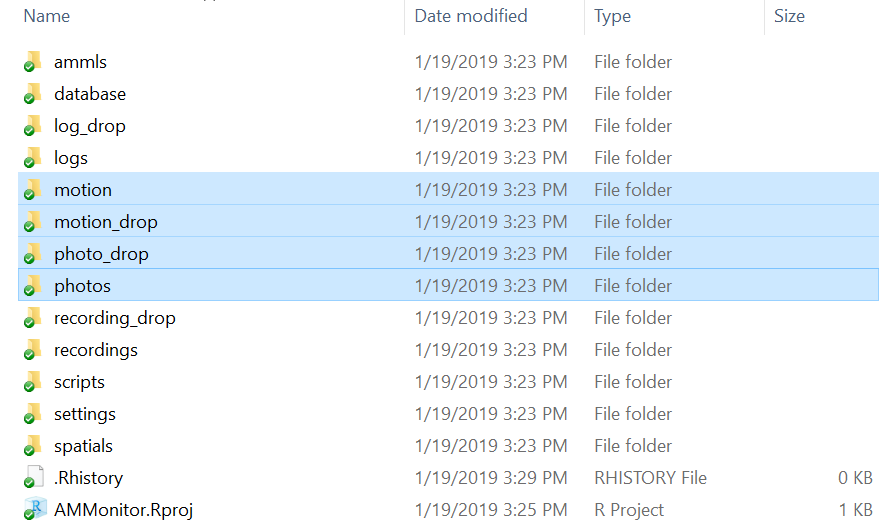
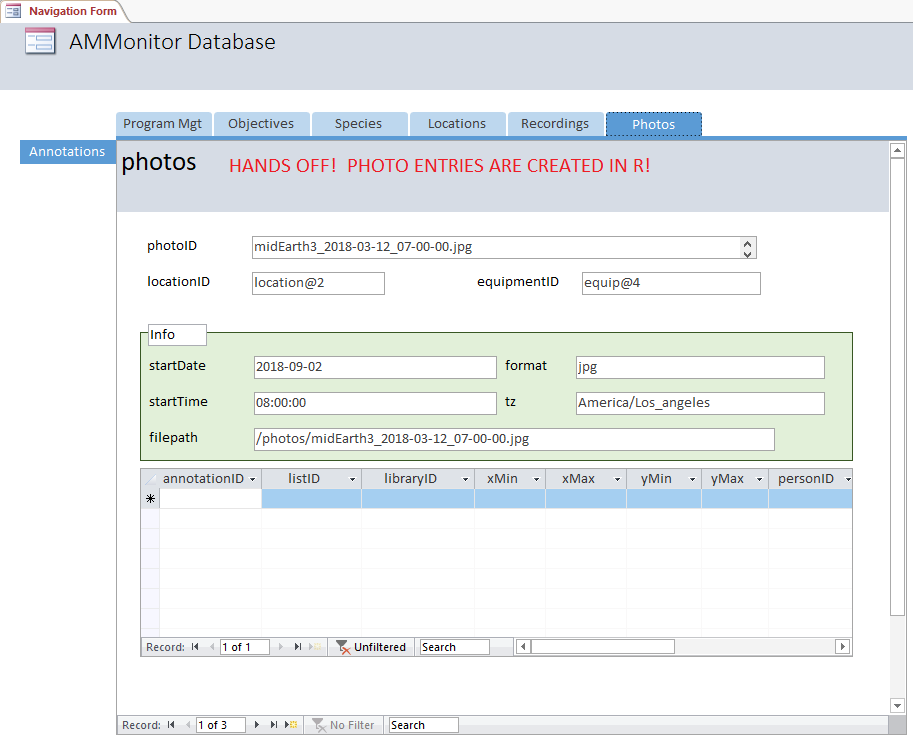

This chapter covers the **photos** table of an **AMMonitor** database,
which stores metadata about photos. Physical photos or motion captures
themselves are stored in the **photos** or **motion** folders within the
main **AMMonitor** directory. The only difference between these two
folders is that the **photos** folder stores photos captured as a
scheduled photograph, while the **motion** folders stores photos that
were triggered by a motion-detection smartphone app. If you have
recently read Chapter 11 (Recordings), note that several of the concepts
and functions will be identical for photos.

To begin, recall the standardized AMMonitor file directory structure. We
used the function `ammCreateDirectories()` to establish the standardized
file directory located within Dropbox. Ideally, this Dropbox account is
associated with the monitoring program and does not contain any personal
information. Below, we confirm the file structure, assuming that your
working directory is the main **AMMonitor** directory (top-level
directory):

<kbd>

</kbd>

> *Figure 12.1. Photos should be placed (manually or automatically) into
> the “photo\_drop” directory or into the “motion\_drop” directory (if
> captured by motion trigger). AMMonitor functions will move them to the
> more permanent “photos” directory, and log each file’s metadata into
> the database.*

For this chapter, the directories (folders) of interest are the
‘photo\_drop’, ‘photos’, ‘motion\_drop’, and ‘motion’ directories, which
store photos for photo monitoring. Folders may end up storing many
terabytes of data, and this content is best left in the cloud until
needed. The ‘photo\_drop’ and ‘motion\_drop’ folders are landing folders
for any new photo files collected by the monitoring team. These files
may be manually collected by the monitoring team and placed there, or
automatically placed in the drop folder via the cellular network (as
described in chapters 9 and 10; also see xxx in prep).

Similar to Chapter 11 (Recordings), the primary function for this
chapter is `dropboxMoveBatch()`, which searches the ‘photo\_drop’ or
‘motion\_drop’ folders on Dropbox for new files. If new files are found,
the function moves the files to the more permanent ‘photos’ or ‘motion’
directory on Dropbox, and simultaneously records metadata about these
files to the **photos** table of an **AMMonitor** database. We will
describe `dropboxMoveBatch()` later in the chapter.

To illustrate this process, we will use the `dbCreateSample()` function
to create a database called “Chap12.sqlite”, which will be stored in a
folder (directory) called “database” within the **AMMonitor** main
directory (which should be your working directory in R). Recall that
`dbCreateSample()` generates all tables of an **AMMonitor** database,
and then pre-populates sample data into tables specified by the user.

Below, we create sample data for a few necessary tables using
`dbCreateSample()`. We will auto-populate the **photos** tables with
**AMMonitor** functions later on in the chapter:

    > # Create a sample database for this chapter
    > dbCreateSample(db.name = "Chap12.sqlite", 
    +                file.path = paste0(getwd(),"/database"), 
    +                tables =  c('people', 'deployment',
    +                            'equipment', 'locations',
    +                            'accounts', 'schedule'))

    An AMMonitor database has been created with the name Chap12.sqlite which consists of the following tables: 

    accounts, annotations, assessments, classifications, deployment, equipment, library, listItems, lists, locations, logs, objectives, people, photos, priorities, prioritization, recordings, schedule, scores, scriptArgs, scripts, soundscape, spatials, species, sqlite_sequence, templates, temporals

    Sample data have been generated for the following tables: 
    accounts, people, equipment, locations, deployment, schedule

Now, we connect to the database. First, we initialize a character
object, **db.path**, that holds the database’s full file path. Then, we
create a database connection object, **conx**, using RSQLite’s
`dbConnect()` function, where we identify the SQLite driver in the ‘drv’
argument, and our **db.path** object in the ‘dbname’ argument:

    > # Establish the database file path as db.path
    > db.path <- paste0(getwd(), '/database/Chap12.sqlite')
    > 
    > # Connect to the database
    > conx <- RSQLite::dbConnect(drv = dbDriver('SQLite'), dbname = db.path)

After that, we send a SQL statement that will enforce foreign key
constraints.

    > # Turn the SQLite foreign constraints on
    > RSQLite::dbSendQuery(conn = conx, statement = "PRAGMA foreign_keys = ON;" )

    <SQLiteResult>
      SQL  PRAGMA foreign_keys = ON;
      ROWS Fetched: 0 [complete]
           Changed: 0

As mentioned, we will assume that any new photos taken as a timed
photograph will be placed in the ‘photo\_drop’ directory in the Dropbox
cloud, while motion-triggered photographs are delivered to the
‘motion-drop’ directory. The process of working with photos is the same
for timed and motion-triggered photos. Because of that, we will only
focus our attention on the **photo\_drop** and **photos** directories to
illustrate photographic monitoring with **AMMonitor**.

To begin, our sample **photo\_drop** directory has no files in it. Just
as we rely on the package, tuneR \[1\], to work with recordings, we rely
on the package, magick \[2\], to work with photos. Specifically, we will
use the function `image_read()` to read in some jpeg files from the web.

    > # Load magick
    > library(magick)

    Linking to ImageMagick 6.9.9.14
    Enabled features: cairo, freetype, fftw, ghostscript, lcms, pango, rsvg, webp
    Disabled features: fontconfig, x11

    > # Grab some stock free images from web
    > coyote <- magick::image_read("https://images.stockfreeimages.com/2128/sfi226w/21284204.jpg")
    > 
    > kitfox <- magick::image_read("https://thumbs.dreamstime.com/t/red-fox-kit-sleeping-36129660.jpg")
    > 
    > toad <- magick::image_read("https://thumbs.dreamstime.com/x/desert-dwelling-spadefoot-toad-and-flowers-21249004.jpg")
    > 
    > # Return image info
    > magick::image_info(coyote)

    # A tibble: 1 x 7
      format width height colorspace matte filesize density
      <chr>  <int>  <int> <chr>      <lgl>    <int> <chr>  
    1 JPEG     226    150 sRGB       FALSE     6012 300x300

    > # Look at one image
    > magick::image_browse(coyote)

We now imagine that these photo jpg files were collected by the Middle
Earth monitoring team and deposited in the ‘photo\_drop’ folder on
Dropbox. We will use the `image_write()` function to simulate this
process.

    > magick::image_write(coyote, path = "photo_drop/midEarth3_2018-03-12_07-00-00.jpg", format = "jpeg")
    > 
    > magick::image_write(kitfox, path = "photo_drop/midEarth4_2018-09-02_22-30-00.jpg", format = "jpeg")
    > 
    > magick::image_write(toad, path = "photo_drop/midEarth5_2018-09-05_08-30-00.jpg", format = "jpeg")

Notice that each file name is standardized as
“accountID\_date\_time.jpg”, as described in \[Donovan et al. in prep\].
If your monitoring program does not use smartphones, the locationID may
be used instead of accountID. We have just simulated the process by
which photos are populated into the ‘photo\_drop’ folder in your
**AMMonitor** Dropbox directory. In practice, files may be collected by
hand and manually placed in this folder, or files can be collected and
sent via the cellular network as described in previous chapters.

The next step is to move these files out of the ‘photo\_drop’ directory
to the more permanent ‘photos’ directory. During this process, we create
metadata entries in the **photos** database table for each photo.
Logging this metadata is critical because **AMMonitor** needs an easy
way to track all files collected by the monitoring team. To move files
from ‘photo\_drop’ to the ‘photos’ directory (and simultaneously log new
audio file metadata in the **photos** table), we use the function
`dropboxMoveBatch()`.

The Photos Table
================

Before asking `dropboxMoveBatch()` to move our sample photos to the
‘photos’ directory, we will view a summary of the **photos** table using
`dbTables()`:

    > # Look at information about the photos table
    > dbTables(db.path = db.path, table = 'photos')

    $photos
      cid        name         type notnull        dflt_value pk comment
    1   0     photoID VARCHAR(255)       1              <NA>  1        
    2   1  locationID VARCHAR(255)       1              <NA>  0        
    3   2 equipmentID VARCHAR(255)       1              <NA>  0        
    4   3   startDate VARCHAR(255)       0              <NA>  0        
    5   4   startTime VARCHAR(255)       0              <NA>  0        
    6   5    filepath VARCHAR(255)       0              <NA>  0        
    7   6          tz VARCHAR(255)       0              <NA>  0        
    8   7      format VARCHAR(255)       0              <NA>  0        
    9   8   timestamp VARCHAR(255)       1 CURRENT_TIMESTAMP  0        

The *photoID* serves as the primary key and the name of the .jpg file.
For example, the *photoID* for “midEarth4\_2018-09-02\_08-00-00.jpg” is
"“midEarth4\_2018-09-02\_08-00-00”. The table’s *locationID* and
*equipmentID* fields are foreign keys that identify the locationID and
equipmentID associated with any given audio file. The table also tracks
the *date* and *time* of day the photo was taken, the relative
*filepath* to the photo in Dropbox, the [Olson names-formatted time
zone](https://en.wikipedia.org/wiki/List_of_tz_database_time_zones#List)
(*tz*), and the file *format* (e.g. jpg, which is the typical file
format for Android smartphones). Finally, we store a *timestamp* to
indicate when file metadata was appended to the SQLite database.

Foreign key assigments can be confirmed with the following code:

    > # Return foreign key information for the equipment table
    > RSQLite::dbGetQuery(conn = conx, statement = "PRAGMA foreign_key_list(photos);")

      id seq     table        from          to on_update on_delete match
    1  0   0 equipment equipmentID equipmentID   CASCADE NO ACTION  NONE
    2  1   0 locations  locationID  locationID   CASCADE NO ACTION  NONE

Here, we can see that the *equipmentID* column in the **photos** table
maps to the *equipmentID* column in the **equipment** table, and the
*locationID* column in the **photos** table maps to the *locationID*
column in the **locations** table.

To summarize, the **photos** table stores information about which photos
have been collected in a monitoring program, where they were collected,
and which piece of equipment gathered the photo data. It does not store
the photo itself, but rather stores the filepath leading to it. The
table is currently empty:

    > # Return records in the photos table as a tibble
    > RSQLite::dbGetQuery(conn = conx, statement = "SELECT * FROM photos;")

    [1] photoID     locationID  equipmentID startDate   startTime   filepath    tz          format      timestamp  
    <0 rows> (or 0-length row.names)

### Functions that work with Dropbox

Now that we have new photos in our ‘photo\_drop’ directory, we can use
`dropboxMoveBatch()` to move files from the ‘photo\_drop’ directory to
the ‘photos’ directory. Simultaneously, we will populate the **photos**
table.

To do this, you must allow R to connect to your Dropbox account, which
we can do with the **rdrop2** package \[3\]. See the “Getting an API
token for Dropbox” section in Chapter 11 (Recordings) if you have not
saved a token into your **settings** folder yet.

The token you generated in Chapter 11 can be used repeatedly to interact
with Dropbox through R. We use the `readRDS()` function to read the
token into R’s environment, and then use the `drop_acc()` function in
**rdrop2** to return information about our account:

    > library(rdrop2)
    > 
    > # Read in the token to R
    > token <- readRDS(file = 'settings/dropbox-token.RDS')
    > 
    > # Confirm that your dropbox account is associated with the token
    > account_info <- rdrop2::drop_acc(dtoken = token)
    > 
    > # View a few items in the account_info object
    > account_info['name']

    $name
    $name$given_name
    [1] "Frodo"

    $name$surname
    [1] "Baggins"

    $name$familiar_name
    [1] "Frodo"

    $name$display_name
    [1] "Frodo Baggins"

    $name$abbreviated_name
    [1] "FB"

If users have granted **rdrop2** access to their Dropbox folder, the
token can be used with any **rdrop2** functions to interact with files
stored in the cloud. Below, we view a list of **rdrop2** functions:

    > # Return the functions in rdrop2 as a data.frame
    > data.frame(ls("package:rdrop2"))

         ls..package.rdrop2..
    1                     %>%
    2                drop_acc
    3               drop_auth
    4               drop_copy
    5             drop_create
    6             drop_delete
    7                drop_dir
    8           drop_download
    9             drop_exists
    10               drop_get
    11      drop_get_metadata
    12           drop_history
    13 drop_list_shared_links
    14             drop_media
    15              drop_move
    16          drop_read_csv
    17            drop_search
    18             drop_share
    19            drop_upload

For example, the `drop_upload()` function *could* have been used to
upload our photo file to the ‘photo\_drop’ directory. When using
**rdrop2** functions, remember that the file path is no longer your R
working directory; it is the file path on the Dropbox cloud.

The **AMMonitor** functions `dropboxMetadata()`, `dropboxMoveBatch()`,
and `dropboxGetOneFile()` allow us to work with Dropbox cloud files
through our working directory paths in R, and read in the token stored
in the **settings** folder directly.

For example, the function `dropboxMetadata()` retrieves file information
for all files within a Dropbox directory; we simply need to point to our
stored token. Below, in the ‘directory’ argument, we specify the
‘photo\_drop’ directory, but this argument can take any Dropbox
directory path so long as no slashes are included at the beginning or
end of the string. In the ‘token.path’ argument, we input the path to a
Dropbox API token, which should be stored in your **settings**
directory.

    > meta <- dropboxMetadata(directory = 'photo_drop', 
    +                         token.path = 'settings/dropbox-token.RDS') 
    > 
    > # Look at all rows of metdata, column 'path_display'
    > as.data.frame(meta[,'path_display'])

                             meta[, "path_display"]
    1 /photo_drop/midEarth3_2018-03-12_07-00-00.jpg
    2 /photo_drop/midEarth4_2018-09-02_22-30-00.jpg
    3 /photo_drop/midEarth5_2018-09-05_08-30-00.jpg

A lot of information is passed back in the **meta** object, but we only
view the filepath on Dropbox (*path\_display*). Here, we can see that
there are three files in the ‘photo\_drop’ folder.

The **AMMonitor** function `dropboxMetdata()` is convenient for checking
whether Dropbox files are present in a folder of choice without having
to manually log in to Dropbox.

Users will more regularly invoke the function `dropboxMoveBatch()`,
which grabs Dropbox metadata, moves files from a directory of choice to
another directory of choice in Dropbox, parses information about files,
and adds metadata to the **photos** or **recordings** table. Below, we
indicate the ‘db.path’, use the ‘table’ argument to specify that we are
dealing with the database’s **photos** table, put our ‘photo\_drop’
directory in ‘dir.from’, and our long-term storage folder, ‘photos’, in
the ‘dir.to’ argument. Lastly, we input our Dropbox API token in
‘token.path’.

    > # Move files and insert metadata to the photos database table
    > dropboxMoveBatch(db.path = db.path,
    +                  table = 'photos', 
    +                  dir.from = 'photo_drop', 
    +                  dir.to = 'photos', 
    +                  token.path = 'settings/dropbox-token.RDS')

    Move in progress, waiting 10 seconds for server to catch up...

    Move status: complete

    Added 3 new records to photos table.

                                 photoID locationID equipmentID  startDate startTime                                  filepath                  tz format
    1: midEarth3_2018-03-12_07-00-00.jpg location@1     equip@3 2018-03-12  07:00:00 /photos/midEarth3_2018-03-12_07-00-00.jpg America/Los_Angeles    jpg
    2: midEarth4_2018-09-02_22-30-00.jpg location@2     equip@4 2018-09-02  22:30:00 /photos/midEarth4_2018-09-02_22-30-00.jpg America/Los_Angeles    jpg
    3: midEarth5_2018-09-05_08-30-00.jpg location@3     equip@5 2018-09-05  08:30:00 /photos/midEarth5_2018-09-05_08-30-00.jpg America/Los_Angeles    jpg
                 timestamp
    1: 2019-06-21 10:34:39
    2: 2019-06-21 10:34:39
    3: 2019-06-21 10:34:39

The function provides feedback on the success of the move. If you like,
you can log in to Dropbox to verify that files have been moved
automatically. Alternatively, invoke `dropboxMetadata()` at this stage.
For example, we can quickly check the ‘dir.to’ folder (photos), to
confirm that photos have been moved.

    > # Check metadata for the directory we moved files TO 
    > photos.meta <- dropboxMetadata(
    +   directory = 'photos',
    +   token.path = 'settings/dropbox-token.RDS')
    > as.data.frame(photos.meta[,'path_display'])

                  photos.meta[, "path_display"]
    1 /photos/midEarth3_2018-03-12_07-00-00.jpg
    2 /photos/midEarth4_2018-09-02_22-30-00.jpg
    3 /photos/midEarth5_2018-09-05_08-30-00.jpg

A metadata check for the ‘dir.from’ folder (photo\_drop), confirms that
it now contains nothing, returning an empty list() object.

    > # Check metadata for the directory we moved files FROM 
    > recording.drop.meta <- dropboxMetadata(
    +   directory = 'photo_drop', 
    +   token.path = 'settings/dropbox-token.RDS')

    There are no files in directory "photo_drop".

    > recording.drop.meta

    NULL

In addition to moving files, `dropboxMoveBatch()` logs metadata when
files are moved from the ‘photo\_drop’ to the ‘photos’ directory. Now we
can look at the **photos** table to see what was added:

    > RSQLite::dbGetQuery(conn = conx, 
    +                     statement = 'SELECT * 
    +                                  FROM photos')

                                photoID locationID equipmentID  startDate startTime                                  filepath                  tz format
    1 midEarth3_2018-03-12_07-00-00.jpg location@1     equip@3 2018-03-12  07:00:00 /photos/midEarth3_2018-03-12_07-00-00.jpg America/Los_Angeles    jpg
    2 midEarth4_2018-09-02_22-30-00.jpg location@2     equip@4 2018-09-02  22:30:00 /photos/midEarth4_2018-09-02_22-30-00.jpg America/Los_Angeles    jpg
    3 midEarth5_2018-09-05_08-30-00.jpg location@3     equip@5 2018-09-05  08:30:00 /photos/midEarth5_2018-09-05_08-30-00.jpg America/Los_Angeles    jpg
                timestamp
    1 2019-06-21 10:34:39
    2 2019-06-21 10:34:39
    3 2019-06-21 10:34:39

The example table contains three photos. Because we followed the
instructions in the phone set-up guide in the Chapter 7 and xxx in prep,
*photoID* is a unique ID that contains the *accountID* directly in the
string (e.g. midEarth4), followed by underscores that separate the
recording date (*startDate*), recording time (*startTime*), and format
(*format*). The *equipmentID*, *locationID*, *filepath*, *tz*, and
*timestamp* columns were also auto-populated.

Downloading and looking at photos
=================================

All of the photos remain in Dropbox cloud storage until retrieved and
called into R. The function `dropboxGetOneFile()` can be used for this
purpose. Here, we will retrieve a photo file stored in the **photos**
folder on the cloud, and save this file to our working directory. This
*copies* the file from the cloud to a directory of interest; it is not
yet readable by R. We put the file’s name in the ‘file’ argument,
specify ‘photos’ as the ‘directory’, and indicate the path to our
Dropbox token in ‘token.path’. Lastly, the ‘local.directory’ argument
allows us to specify where the file should land locally on our machine.
Here, we have indicated that we want the file to land in our current
working directory.

    > dropboxGetOneFile(
    +   file = 'midEarth4_2018-09-02_22-30-00.jpg', 
    +   directory = 'photos', 
    +   token.path = 'settings/dropbox-token.RDS', 
    +   local.directory = getwd())

    [1] TRUE

This file is now in our working directory. We will read the file into
R’s global environment with magick’s `image_read()` function, and view
it with the `image_browse()` function.

    > # Read the photo in with magick function
    > img <- magick::image_read('midEarth4_2018-09-02_22-30-00.jpg', 
    +                           density = 200, depth = 16, strip = T)
    > 
    > # Look at one image
    > magick::image_browse(img)

The image should now be opened in a new window on your computer.

Assessing the performance of equipment at active monitoring locations
=====================================================================

If your monitoring program takes advantage of the **schedule** table,
the function `photosCheck()` can be used to check the number of photos
logged in the **photos** table against the number of photos *scheduled*
in the **schedules** table. If there is a mismatch – where photos are
being scheduled but not taken – `photosCheck()` offers a convenient
method for users to see which equipment might need attention.

To illustrate this process, we look at the scheduled photos for our
three pieces of equipment in the sample data:

    > # Return the schedules table as a tibble
    > RSQLite::dbGetQuery(
    +   conn = conx, 
    +   statement = "SELECT equipmentID, locationID, subject, startDate, startTime
    +                FROM schedule
    +                WHERE subject = 'photo'
    +                ORDER BY locationID")

      equipmentID locationID subject  startDate startTime
    1     equip@4 location@2   photo 2018-09-02  08:00:00
    2     equip@4 location@2   photo 2018-09-02  22:30:00
    3     equip@5 location@3   photo 2018-09-01  07:45:00
    4     equip@5 location@3   photo 2018-09-05  08:30:00

Here, notice that two photos were scheduled for location@2, and two
photos were scheduled for location@3. We can use `photosCheck()` to see
if the four files were actually collected. The only required input to
`photosCheck()` is the ‘db.path’ argument. The default for the
‘locationID’ argument is ‘all’, the default ‘start.date’ argument is
‘1900-01-01’, and the default ‘plot’ argument is set to TRUE.

    > # Return
    > check.all <- photosCheck(db.path = db.path,
    +                          locationID = 'all',
    +                          plot = TRUE)

The bar graph shows the number of scheduled and received timed photos by
location and date.

The returned data.frame identifies the *equipmentID*, *locationID*, the
number of scheduled events, and the number of photographic events. In
this example, we see that three photos were collected, but there is a
timing mismatch between when the photos were scheduled and when they
were taken.

Users can optionally limit the performance summary to specific
monitoring locations (‘locationID’ arugment) and the start date
(‘start.date’), and simply return the data to use as desired.

    > # Check schedule at location@3
    > check.loc3 <- photosCheck(db.path = db.path,
    +                           locationID = 'location@3',
    +                           plot = FALSE)
    > check.loc3

       locationID equipmentID  startDate subject scheduled received proportion
    1: location@3     equip@5 2018-09-01   photo         1        0          0
    2: location@3     equip@5 2018-09-05   photo         1        1          1

If scheduled photos are not arriving in Dropbox, the monitoring team may
visit and troubleshoot misbehaving equipment. Additionally, the team may
inspect smartphone logs (stored in the **logs** table and logs folder
within the **AMMonitor** directory) to discover the causes of suboptimal
equipment performance.

An important consideration in using `photosCheck()` is that it will
check scheduled photographs versus delivery. This works fine for
timed-photographs, but may show quite different results for
motion-triggered photographs. With the motion-triggered schedule, an
event is scheduled which tells the phone when to run the motion-trigger
app, and photos are collected as triggered. If nothing triggers a photo,
we would expect no photos to be logged. However, if an animal repeatedly
triggers a photo to be taken, multiple photographs may be received for
one scheduled event.

The Photos Table in Access
==========================

The photos table is a primary tab in the Access Navigation Form.

<kbd>

</kbd>

> *Figure 12.2. The photos table is populated by R.*

Notice that there are three photos in the sample database. The
not-so-friendly ‘Hands Off’ note indicates that photos are logged
automatically by R. Photos can be annotated by members of the monitoring
team, in which case a team member views each photo and identifies target
signals within it. Each photos’s annotations are displayed (in this
case, none). We will illustrate how to annotate files in Chapter 14.

Chapter Summary
===============

In this chapter, you learned that the **AMMonitor** approach is to store
photos in the **photo\_drop** folder or the **motion\_drop** folder in
the cloud. The function`dropboxMoveBatch()` relocates files to the more
permanant **photos** or **motion** directory, and simultaneously logs
metadata entries into the database **photos** table. This allows the
monitoring team to track all photos within the database. If the
**schedules** table is used to push timed photo schedules to each
phone’s Google calendar, `photosCheck()` can be used to assess phone
performance.

Chapter References
==================

1. Ligges U. TuneR: Analysis of music and speech (version 1.3.3)
\[Internet\]. Comprehensive R Archive Network; 2018. Available:
<https://cran.r-project.org/web/packages/tuneR/index.html>

2. Ooms J. Magick: Advanced graphics and image-processing in r (version
2.0) \[Internet\]. Comprehensive R Archive Network; 2018. Available:
<https://cran.r-project.org/web/packages/magick/>

3. Ram K, Yochum C. Rdrop2: Programmatic interface to the ’dropbox’ api
(version 0.8.1.9999) \[Internet\]. Comprehensive R Archive Network;
2017. Available:
<https://cran.r-project.org/web/packages/rdrop2/index.html>
