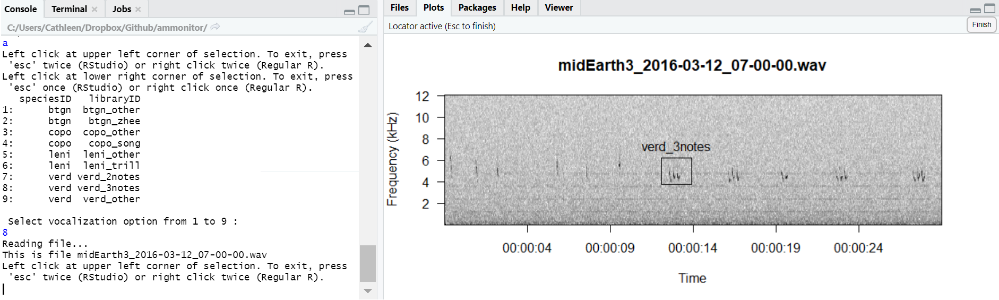
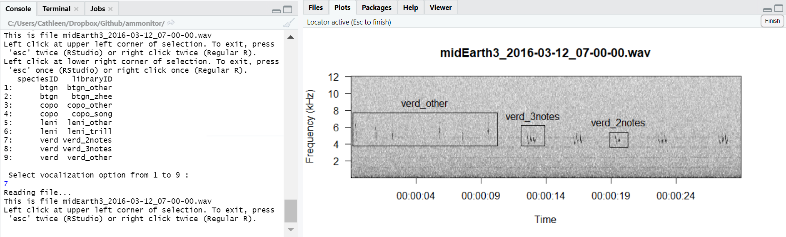
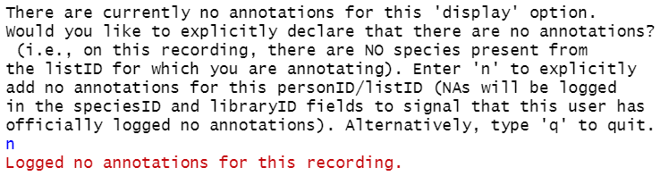

In this chapter, we discuss the **annotations** table of an
**AMMonitor** database. This table stores information about
human-created annotations of photos or recordings. For example, a
monitoring team member may listen to an audio recording (stored in the
**AMMonitor** recordings directory) while viewing a spectrogram of the
recording, and identify signals of interest belonging to a specific
species. Alternatively, a monitoring team member may view photos (stored
in the **AMMonitor** photos or motion directories), and identify
specific targets that may have been captured.

Annotations are crucial for two reasons. First, the raw annotations
identify which target signals are present within a given recording or
photo. This information alone can be used to analyze species occurrence
patterns, which may help meet monitoring objectives. Second,
**AMMonitor** has many functions that automate the signal detection
process (without human interaction). Even if only some files are
manually annotated, they can be of great value in improving
**AMMonitor** statistical learning models (detailed in the
Classifications chapter), thus improving the ability of automated
functions to correctly identify signals.

To illustrate the process of annotating a photo or recording, we will
use the `dbCreateSample()` function to create a database called
“Chap14.sqlite”, which will be stored in a folder (directory) called
“database” within the **AMMonitor** main directory (which should be your
working directory in R). Recall that `dbCreateSample()` generates all
tables of an **AMMonitor** database, and then pre-populates sample data
into tables specified by the user.

Here, we create sample data for several tables in the `dbCreateSample()`
function below. Note that we have not added sample data to the
**annotations** table. We will demonstrate how to create new entries in
the **annotations** table later in the chapter:

    > # Create a sample database for this chapter
    > dbCreateSample(db.name = "Chap14.sqlite", 
    +                file.path = paste0(getwd(),"/database"), 
    +                tables = c('accounts', 'lists', 
    +                           'people', 'species',
    +                            'equipment', 'locations',
    +                           'deployment', 'library',
    +                           'listItems', 'recordings', 
    +                           'photos'))

    An AMMonitor database has been created with the name Chap14.sqlite which consists of the following tables: 

    accounts, annotations, assessments, classifications, deployment, equipment, library, listItems, lists, locations, logs, objectives, people, photos, priorities, prioritization, recordings, schedule, scores, scriptArgs, scripts, soundscape, spatials, species, sqlite_sequence, templates, temporals

    Sample data have been generated for the following tables: 
    accounts, lists, people, species, equipment, locations, deployment, library, listItems, recordings, photos

Now, we connect to the database. First, we initialize a character
object, **db.path**, that holds the database’s full file path. Then, we
create a database connection object, **conx**, using RSQLite’s
`dbConnect()` function, where we identify the SQLite driver in the ‘drv’
argument, and our **db.path** object in the ‘dbname’ argument:

    > # Establish the database file path as db.path
    > db.path <- paste0(getwd(), '/database/Chap14.sqlite')
    > 
    > # Connect to the database
    > conx <- RSQLite::dbConnect(drv = dbDriver('SQLite'), dbname = db.path)

After that, we send a SQL statement that will enforce foreign key
constraints.

    > # Turn the SQLite foreign constraints on
    > RSQLite::dbSendQuery(conn = conx, statement = "PRAGMA foreign_keys = ON;" )

    <SQLiteResult>
      SQL  PRAGMA foreign_keys = ON;
      ROWS Fetched: 0 [complete]
           Changed: 0

The Annotations Table
=====================

We begin by looking at the **annotations** table. We can use the
`dbTables()` function to view the table’s field summary:

    > # Look at information about the annotations table
    > dbTables(db.path = db.path, table = "annotations")

    $annotations
       cid         name         type notnull        dflt_value pk comment
    1    0 annotationID      INTEGER       1              <NA>  1        
    2    1  recordingID VARCHAR(255)       0              <NA>  0        
    3    2      photoID VARCHAR(255)       0              <NA>  0        
    4    3       listID VARCHAR(255)       1              <NA>  0        
    5    4    speciesID VARCHAR(255)       0              <NA>  0        
    6    5    libraryID VARCHAR(255)       0              <NA>  0        
    7    6         xMin         REAL       0              <NA>  0        
    8    7         xMax         REAL       0              <NA>  0        
    9    8         yMin         REAL       0              <NA>  0        
    10   9         yMax         REAL       0              <NA>  0        
    11  10           wl         REAL       0              <NA>  0        
    12  11         ovlp         REAL       0              <NA>  0        
    13  12           wn VARCHAR(255)       0              <NA>  0        
    14  13   annotation         BLOB       0              <NA>  0        
    15  14     personID VARCHAR(255)       0              <NA>  0        
    16  15    timestamp VARCHAR(255)       1 CURRENT_TIMESTAMP  0        

The primary key for this table is *annotationID*, which the SQLite
database provides automatically. The *recordingID* maps to a recordingID
in the **recordings** table, while the *photoID* maps to a photoID in
the **photos** table. The *listID* maps to a list from the **lists**
table, which could be a list of species or target signals. The
*speciesID* indicates which species was found (and maps to a valid
speciesID contained in the **species** table). Any identified signal may
also be tagged to a specific *libraryID* from the **library** table. The
columns *xMin*, *xMax*, *yMin*, and *yMax* provide the exact location in
the recording or photo containing the target signal. If annotating a
recording, the *wl* (window length), *ovlp* (overlap), and *wn* (window
type) columns store information about the Fourier transform parameters
used to create the spectrogram and resulting annotation – these elements
will be NA if annotating a photo. The *annotation* column stores a
serialized version of the annotation; *personID* identifies the
annotator who produced this record. The last column, *timestamp*, is
automatically entered to log the date and time at which the annotation
was created.

Foreign key assigments can be confirmed with the following code:

    > # Return foreign key information for the equipment table
    > RSQLite::dbGetQuery(conn = conx, statement = "PRAGMA foreign_key_list(annotations);")

      id seq      table        from          to on_update on_delete match
    1  0   0     people    personID    personID   CASCADE NO ACTION  NONE
    2  1   0      lists      listID      listID   CASCADE NO ACTION  NONE
    3  2   0    library   libraryID   libraryID   CASCADE NO ACTION  NONE
    4  3   0     photos     photoID     photoID   CASCADE NO ACTION  NONE
    5  4   0 recordings recordingID recordingID   CASCADE NO ACTION  NONE

Here, we can trace the mapping of the keys in primary tables to the
fields in the **annotations** table. Notice that in all cases,
*on\_update* is set to CASCADE, meaning that if a key in a primary table
is updated, the changes trickle down to the **annotations** table.
Notice also that *on\_delete* is set to NO ACTION, so if a key in a
primary table is deleted, the change does not affect the **annotations**
table. Users can choose to manually delete affected records in the
**annotations** table if they wish.

The *listID* concept is crucial for this chapter. Below, we view the
lists stored in the sample **listItems** database table:

    > # Retrieve the lists in the sample database
    > RSQLite::dbGetQuery(conn = conx, 
    +                     statement = "SELECT * 
    +                                  FROM listItems")

                         listID   dbTable   dbColumn   item
    1              Bilbo's List   species  speciesID   btgn
    2              Bilbo's List   species  speciesID   copo
    3              Bilbo's List   species  speciesID   leni
    4              Bilbo's List   species  speciesID   verd
    5              Frodo's List   species  speciesID   ecdo
    6              Frodo's List   species  speciesID   gaqu
    7              Frodo's List   species  speciesID   verd
    8              Middle Earth   species  speciesID   btgn
    9              Middle Earth   species  speciesID   copo
    10             Middle Earth   species  speciesID coyote
    11             Middle Earth   species  speciesID   ecdo
    12             Middle Earth   species  speciesID    fox
    13             Middle Earth   species  speciesID   gaqu
    14             Middle Earth   species  speciesID   leni
    15             Middle Earth   species  speciesID   toad
    16             Middle Earth   species  speciesID   verd
    17       Middle Earth Birds   species  speciesID   btgn
    18       Middle Earth Birds   species  speciesID   copo
    19       Middle Earth Birds   species  speciesID   ecdo
    20       Middle Earth Birds   species  speciesID   gaqu
    21       Middle Earth Birds   species  speciesID   leni
    22       Middle Earth Birds   species  speciesID   verd
    23     Middle Earth Mammals   species  speciesID coyote
    24     Middle Earth Mammals   species  speciesID    fox
    25 Target Species Templates templates templateID  verd1
    26 Target Species Templates templates templateID  verd2

In **AMMonitor**, a list is a collection of items to select from (see
Chapter 4). It is highly customizable (i.e., a user can create a list
with any name that contains any number of items). For annotations, a
list serves to identify *which* target signals are sought. For example,
when Bilbo annotates a recording and specifies “Bilbo’s list” in the
annotation process, he indicates that he will be searching for the
species “btgn”, “copo”, “leni” and “verd”. Frodo has different
expertise, and has his own unique list that identifies three targets of
interest. The ‘listID’ in the **annotations** table allows users of
**AMMonitor** to log ‘non-detections’ (confirmed absences) as well as
detections (confirmed presences) for a given audio file or photo.

Next, we use `dbGetQuery()` to view the current contents of the
**annotations** table:

    > # Retrieve the sample data stored in the annotations table
    > RSQLite::dbGetQuery(conn = conx, 
    +                     statement = "SELECT * FROM annotations;")

     [1] annotationID recordingID  photoID      listID       speciesID    libraryID   
     [7] xMin         xMax         yMin         yMax         wl           ovlp        
    [13] wn           annotation   personID     timestamp   
    <0 rows> (or 0-length row.names)

As shown, this table has no records. Our goal is to add annotations to
the sample recordings and photos that come with the **AMMonitor**
package.

Annotating recordings
=====================

The process of annotating a recording involves reading in an audio file
(stored in the **recordings** directory on the cloud, and located within
the main **AMMonitor** directory structure), and then invoking
`annotateRecording()`.

Although audio files should be stored in the cloud, for demonstration
purposes, we will read in the four sample recordings that come with the
package:

    > # Load the recordings
    > data(sampleRecordings)
    > 
    > # Look at the structure of this object 
    > str(sampleRecordings, max.level = 1)

    List of 4
     $ :Formal class 'Wave' [package "tuneR"] with 6 slots
     $ :Formal class 'Wave' [package "tuneR"] with 6 slots
     $ :Formal class 'Wave' [package "tuneR"] with 6 slots
     $ :Formal class 'Wave' [package "tuneR"] with 6 slots

Note the sampleRecordings object is a list of four wave objects (each
with six slots) that we created with the package **tuneR** \[1\]. Below,
we view the first element in this list:

    > # View the first recording
    > sampleRecordings[[1]]

    Wave Object
        Number of Samples:      2295552
        Duration (seconds):     52.05
        Samplingrate (Hertz):   44100
        Channels (Mono/Stereo): Mono
        PCM (integer format):   TRUE
        Bit (8/16/24/32/64):    16 

This object is a wav file. It is 52.05 seconds long, and has a sampling
rate of 44100 samples per second, with 52.05 \* 44100 = ~ 2295405 number
of samples. The file was recorded with a single channel microphone
(mono).

Next, we write this file to our working directory so we can annotate it.
We will name this file with our standardized file naming convention:
accountID\_date\_time.wav. (Please note that this is not the normal
**AMMonitor** workflow. Recordings should be stored in the cloud in the
**recordings** directory, with metadata stored in the **recordings**
table. The file itself can be retrieved with `dropboxGetOneFile()`,
which will copy the file to your working directory. See Chapter 11:
Recordings for the standard workflow.)

    > # Write the first recording to the working directory
    > tuneR::writeWave(object = sampleRecordings[[1]],
    +                  filename = "midEarth3_2016-03-12_07-00-00.wav")

Next, we use `annotateRecording()` to add annotations to this file. This
**AMMonitor** function is built upon the `viewSpec(interactive = TRUE)`
function from the package **monitoR** \[2\], modified to work with the
**AMMonitor** database. Function arguments are shown below:

    > # Look at the arguments for the annotateRecording function
    > args(AMMonitor::annotateRecording)

    function (db.path, recordingID = NULL, directory, display = "focused", 
        token.path = NULL, db.insert = FALSE, start.time = 0, units = "seconds", 
        page.length = 30, frq.lim = c(0, 12), spec.col = gray.3(), 
        page.ovlp = 0.25, player = "start", wl = 512, ovlp = 0, wn = "hanning", 
        consistent = TRUE) 
    NULL

The argument ‘db.path’ is required to add annotations to the
**annotations** table. The user must specify a single ‘recordingID’ for
annotation. The ‘directory’ argument seeks a file path pointing to the
location of the audio file, with the current working directory as a
default. The ‘display’ argument presents a critical choice for the user
– here, the user indicates which annotations should be displayed to
them. Options are either ‘all’ or ‘focused’. If ‘all’ is selected, all
existing annotations for the recording will be displayed to the user. If
‘focused’, the only annotations displayed will be those for the personID
and listID declared in the interactive session. Use display = ‘all’ with
caution! Note that if using display = ‘all’, an annotater may delete
annotations made under another personID and listID. To avoid this
danger, stick to using display = ‘focused’, which is the default. Note
that if display = ‘focused’, the data.table returned by the function
will only return annotations for the listID and personID combination
entered (and not necessarily all annotations for this recording, if
others exist).

The ‘token.path’ argument is required if the file to be annotated is
located in the Dropbox cloud (point to your Dropbox token in the
**settings** folder of the **AMMonitor** directory). The ‘db.insert’
argument has a default of FALSE, indicating that annotations will not be
inserted to the **annotations** database table. It is a good idea to
practice making annotations before committing them to the database.
Remaining arguments allow the user to customize the audio file
spectrogram they will see during the annotation process.

The **AMMonitor** `annotateRecording()` function is an interactive
function, defined this way in [R’s
documentation](https://stat.ethz.ch/R-manual/R-devel/library/base/html/interactive.html):
“An interactive R session is one in which it is assumed that there is a
human operator to interact with, so for example R can prompt for
corrections to incorrect input or ask what to do next or if it is OK to
move to the next plot.”

We illustrate the general steps for annotating the file
‘midEarth3\_2016-03-12\_07-00-00.wav’ using screenshots. In practice,
users interact with this function via keyboard strokes and mouse clicks
in R. Below, the ‘db.insert’ argument is set to FALSE, and the
‘token.path’ argument is set to NULL because we are working with a local
file.

    > annos <- annotateRecording(db.path = db.path, 
    +                            recordingID = 'midEarth3_2016-03-12_07-00-00.wav',
    +                            directory = getwd(), 
    +                            display = 'focused',
    +                            token.path = NULL,   
    +                            db.insert = FALSE)

This line of code initiates a variety of interactive options. First, you
will be prompted to declare your personID to identify who is creating
the annotation for this session. This list of people is drawn from the
**AMMonitor** database **people** table. If you are Bilbo Baggins, you
will enter the number 1 in the R console. If you are Frodo Baggins, you
will enter the number 2.

<kbd>

</kbd>

> *Figure 14.1. Enter the number 1 in the console to identify yourself
> as Bilbo.*

Next, you will be prompted to declare the list for which you are
annotating. Below, we select Bilbo’s List (a list of species in which
Bilbo has expertise) by entering the number 1 in the console, and then
return.

<kbd>

</kbd>

> *Figure 14.2. Enter the number 1 to declare the list of species Bilbo
> will be looking for. *

Now, a new annotation file begins. Users may select from various options
to interactively move through the spectrogram, annotate, and delete.
Below, we select ‘a’ to begin a new annotation.

<kbd>

</kbd>

> *Figure 14.3. Use the keypad to select an action. Selecting the letter
> “a” will launch the annotations page.*

You will be prompted to click on the spectrogram to annotate signals of
interest. Create a box by clicking on the spectrogram to mark the upper
left corner of the annotation, and clicking on the spectrogram again to
mark the lower right corner of the annotation. Creating the box
generates a list of library call options associated with the species in
Bilbo’s List. Below, we choose the option that best describes this
annotation, which is 12 (“verd\_3notes”).

<kbd>

</kbd>

> *Figure 14.4. When a target signal is found, use the left click button
> to draw a box around the signal.*

We can continue adding annotations until we are finished.

<kbd>

</kbd>

> *Figure 14.5. Press the ‘esc’ button twice (RStudio) or once (R) to
> stop the annotations window.*

To exit this screen, press ‘esc’ twice (RStudio) or right click twice
(base R), and then press ‘q’ to quit the interactive mode. After
quitting, `annotateRecording()` returns a data.table as below:

    > # Look at the returned annotations
    > subset(annos, select = -timestamp)

        annotationID                       recordingID photoID               listID speciesID
     1:           NA midEarth3_2016-03-12_07-00-00.wav    <NA>         Bilbo's List      verd
     2:           NA midEarth3_2016-03-12_07-00-00.wav    <NA>         Bilbo's List      verd
     3:           NA midEarth3_2016-03-12_07-00-00.wav    <NA>         Bilbo's List      verd
     4:           NA midEarth3_2016-03-12_07-00-00.wav    <NA>         Bilbo's List      verd
     5:           NA midEarth3_2016-03-12_07-00-00.wav    <NA>         Bilbo's List      verd
     6:           NA midEarth3_2016-03-12_07-00-00.wav    <NA>         Bilbo's List      verd
     7:           NA midEarth3_2016-03-12_07-00-00.wav    <NA>         Bilbo's List      verd
     8:           NA midEarth4_2016-03-04_06-00-00.wav    <NA>         Bilbo's List      verd
     9:           NA midEarth4_2016-03-04_06-00-00.wav    <NA>         Bilbo's List      verd
    10:           NA midEarth4_2016-03-04_06-00-00.wav    <NA>         Bilbo's List      verd
    11:           NA midEarth4_2016-03-04_06-00-00.wav    <NA>         Bilbo's List      verd
    12:           NA midEarth4_2016-03-04_06-00-00.wav    <NA>         Bilbo's List      verd
    13:           NA midEarth4_2016-03-26_07-00-00.wav    <NA> Middle Earth Mammals    coyote
    14:           NA midEarth5_2016-03-21_07-30-00.wav    <NA>         Frodo's List      verd
    15:           NA midEarth5_2016-03-21_07-30-00.wav    <NA>         Frodo's List      verd
             libraryID   xMin   xMax   yMin   yMax  wl ovlp      wn            annotation
     1:    verd_3notes 13.056 14.680 3.6422 5.7594 512    0 hanning 58,0a,00,00,00,03,...
     2:    verd_3notes 16.487 18.365 3.6951 5.4947 512    0 hanning 58,0a,00,00,00,03,...
     3:    verd_2notes 19.633 21.155 3.9598 5.0713 512    0 hanning 58,0a,00,00,00,03,...
     4:    verd_3notes 23.287 24.606 4.0127 5.1242 512    0 hanning 58,0a,00,00,00,03,...
     5:    verd_3notes 27.853 29.223 3.8010 5.5476 512    0 hanning 58,0a,00,00,00,03,...
     6:    verd_2notes 32.553 33.821 3.9069 5.2301 512    0 hanning 58,0a,00,00,00,03,...
     7:    verd_2notes 36.866 38.337 3.6951 5.1771 512    0 hanning 58,0a,00,00,00,03,...
     8:    verd_3notes  3.813  4.777 3.7481 4.9125 512    0 hanning 58,0a,00,00,00,03,...
     9:    verd_3notes 24.033 25.047 3.5364 4.7537 512    0 hanning 58,0a,00,00,00,03,...
    10:    verd_2notes 28.669 29.354 3.5364 4.5420 512    0 hanning 58,0a,00,00,00,03,...
    11:    verd_2notes 31.914 32.674 3.4305 4.5949 512    0 hanning 58,0a,00,00,00,03,...
    12:    verd_3notes 35.307 36.296 3.4834 4.5420 512    0 hanning 58,0a,00,00,00,03,...
    13: coyote_general  2.767 18.502 1.4721 3.0600 512    0 hanning 58,0a,00,00,00,03,...
    14:     verd_other  2.564 10.584 3.5364 6.4474 512    0 hanning 58,0a,00,00,00,03,...
    15:     verd_other 23.769 41.187 3.1129 5.7594 512    0 hanning 58,0a,00,00,00,03,...
        personID
     1: bbaggins
     2: bbaggins
     3: bbaggins
     4: bbaggins
     5: bbaggins
     6: bbaggins
     7: bbaggins
     8: bbaggins
     9: bbaggins
    10: bbaggins
    11: bbaggins
    12: bbaggins
    13: fbaggins
    14: fbaggins
    15: fbaggins

Annotations are returned in a table formatted according to the
**annotations** table of the database. These records could have been
inserted directly into the **annotations** table if we had set argument
‘db.insert’ = TRUE. However, we recommend practicing with the function
before inserting records.

It is important to note the following:

1.  Annotations are not stored on the recording itself. Rather, the
    annotations are stored in the database.

2.  Annotations stored in the database table **annotations** can be
    deleted at any time.

3.  A file may be re-visited at any time to add more annotations.

4.  A file may be annotated by multiple people. For instance, notice
    that Frodo searched for only those targets in Frodo’s list. Bilbo
    may also annotate those same files and search for targets identified
    in Bilbo’s list. In this way, different members of the monitoring
    team with different expertise can contribute to the annotation
    process.

5.  Annotating files should not be done in haste. The monitoring team
    should strive for 100% accuracy in file annotations.

6.  Critically, some recordings may not contain a target signal of
    interest. If a recording is searched by a user and no target signals
    are found, then upon clicking ‘q’ to exit, `annotateRecording()`
    will ask the user to explicitly declare that no annotations were
    found by this personID searching under this listID (demonstrated in
    the screenshot below). If the user declares ‘n’ for “No
    Annotations”, this action will append a record filled with NAs in
    the speciesID, libraryID, xMin, xMax, yMin, and yMax fields. Because
    annotators have explicitly declared that no signals of interest were
    found, records with NAs in these columns may used to characterize
    definitive absences of target species from recordings.

<kbd>

</kbd>

> *Figure 14.6. Entering a ‘n’ when annotating is used to declare that
> you have searched the file for target signals, and have found none.*

Lastly, note that collections of recording annotations may be plotted
with `plotAnnotations()`. Below, we view the function arguments.

    > args(plotAnnotations)

    function (db.path, table = "recordings", speciesID = NULL, libraryID = NULL, 
        annotationID = NULL, spec.col = gray.3(), box.draw = FALSE, 
        box.col = "black", box.lwd = 1) 
    NULL

As usual, the function takes the **db.path** object. In the ‘table’
argument, we specify that we want to plot annotations from the
recordings table (i.e. spectrograms) rather than photo annotations. When
plotting spectrograms, annotations may be plotted according to
speciesID, libraryID, or annotationID (only one of these arguments may
be used in a single function call). Below, we set speciesID and
annotationID to NULL, and specify that we want to plot all annotations
labelled with the libraryID ‘verd\_3notes’. In the ‘directory’ argument,
we either provide a file.path to a local recordings directory or the
Dropbox directory. Remaining arguments to `plotAnnotations()` allow
users some control over customizing the aesthetics, such as plot colors
and whether to draw boxes around each annotation.

    > # Add sample annotations to the database
    > data(annotations)
    > RSQLite::dbWriteTable(conn = conx, name = 'annotations', 
    +                       value = annotations, append = TRUE)
    > 
    > # Plot existing annotations for a libraryID of choice
    > plotAnnotations(db.path = db.path, 
    +                 table = 'recordings', 
    +                 speciesID = NULL,
    +                 libraryID = 'verd_3notes',
    +                 annotationID = NULL, 
    +                 spec.col = gray.3())

Annotating photos
=================

A photo annotation is similar to a recording annotation, except that the
photo is a single snapshot in time, and all that is required is to log
the presence or absence of target species within the image. Rather than
target signals, photo annotation focuses strictly on target species.

In practice, photos are stored in the **photos** directory of the
**AMMonitor** file structure within the Dropbox cloud.
`dropboxGetOneFile()` can be used to retrieve a photo and place it in
your working directory. For demonstration purposes, however, we will
simply grab photos from the web and add them to our working directory:

    > # Load magick
    > library(magick)

    Linking to ImageMagick 6.9.9.14
    Enabled features: cairo, freetype, fftw, ghostscript, lcms, pango, rsvg, webp
    Disabled features: fontconfig, x11

    > # Grab some stock free images from web
    > coyote <- magick::image_read("https://images.stockfreeimages.com/11102/sfixl/111027410.jpg")
    > 
    > kitfox <- magick::image_read("https://thumbs.dreamstime.com/t/red-fox-kit-sleeping-36129660.jpg")
    > 
    > toad <- magick::image_read("https://thumbs.dreamstime.com/x/desert-dwelling-spadefoot-toad-and-flowers-21249004.jpg")
    > 
    > # Return image info
    > magick::image_info(coyote)

    # A tibble: 1 x 7
      format width height colorspace matte filesize density
      <chr>  <int>  <int> <chr>      <lgl>    <int> <chr>  
    1 JPEG     880    657 sRGB       FALSE   113825 300x300

We now imagine that these photo jpg files were collected by the Middle
Earth monitoring team, and write them to our working directory with the
name of a photoID already contained in our sample database.

    > magick::image_write(coyote, 
    +                     path = paste0(getwd(), "/midEarth3_2018-03-12_07-00-00.jpg"), 
    +                     format = "jpeg")

Notice that each file name is standardized as
“accountID\_date\_time.jpg”.

The `annotatePhoto()` function can now be run to add annotations to this
photo.

    > annos <- annotatePhoto(db.path = db.path, 
    +                        photoID = 'midEarth3_2018-03-12_07-00-00.jpg',
    +                        directory = getwd(), 
    +                        display = 'focused',
    +                        token.path = NULL,   
    +                        db.insert = FALSE)

While `plotAnnotations()` can be used reliably to plot annotation data
from recordings (i.e., spectrograms), the function is still in beta for
plotting photo annotations, and may produce unexpected results.

The Annotations Table in Access
===============================

The recordings table is a primary tab in the Access Navigation Form, and
annotations are displayed for each recording in the subform immediately
beneath the recording record.

<kbd>

</kbd>

> *Figure 14.7. The annotations data are created in R. They can be found
> with an associated Recording or Photo.*

Notice that there are four recordings in the sample database, and the
recording “midEarth3\_2016-03-12\_07-00-00.wav” has been selected. The
not-so-friendly ‘Hands Off’ note indicates that recordings and their
annotations are logged by R. Here, we see that Bilbo has added seven
annotations to this recordingID.

Recording annotations can also be accessed via the secondary tab called
“Annotations”, which are displayed in spreadsheet-type view with red
font.

<kbd>

</kbd>

> *Figure 14.8. The full Annotations table can also be found in the left
> menu as a submenu under the Recordings or Photo tab.*

Notice that the “Filtered” button toward the bottom of the screen is
highlighted. This alerts users that the annotations tables has been
filtered here to display only those annotations associated with
Recordings (as the Recordings primary tab has been selected).

The photos table is also primary tab in the Access Navigation Form.
Similar to recordings, annotations are displayed for each photo directly
on the Photos tab.

<kbd>

</kbd>

> *Figure 14.9. Photographic annotations appear the same way they do
> with recordings.*

Notice that there are three photos in the sample database. As with
recordings, these entries are logged by R. Photos can be annotated by
members of the monitoring team, in which case a team member view each
photo and identify target signals within it. Each photos’s annotations
are displayed (in this case, none). Photographic annotations can also be
viewed by selected the secondary tab labeled “Annotations,” in which
case the annotations are displayed in spreadsheet like view and are
filtered to show only annotations for photos.

Chapter Summary
===============

In this chapter, you learned the **AMMonitor** approach for annotating
recordings or photos. Annotations are an essential component of a
monitoring program. They identify exactly where target signals occur in
a file, which can aid the computer in locating true signals. They also
can be used to identify true absences, in which cases files are viewed
by monitoring team members who confirm absence. We will revisit these
concepts in Chapter 17: Classifications.

Chapter References
==================

1. Ligges U. TuneR: Analysis of music and speech (version 1.3.3)
\[Internet\]. Comprehensive R Archive Network; 2018. Available:
<https://cran.r-project.org/web/packages/tuneR/index.html>

2. Hafner S, Katz J. MonitoR: Acoustic template detection in r (version
1.0.7) \[Internet\]. Comprehensive R Archive Network; 2018. Available:
<http://www.uvm.edu/rsenr/vtcfwru/R/?Page=monitoR/monitoR.htm>
