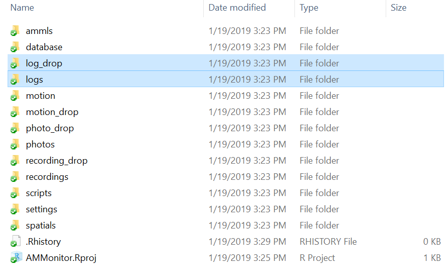
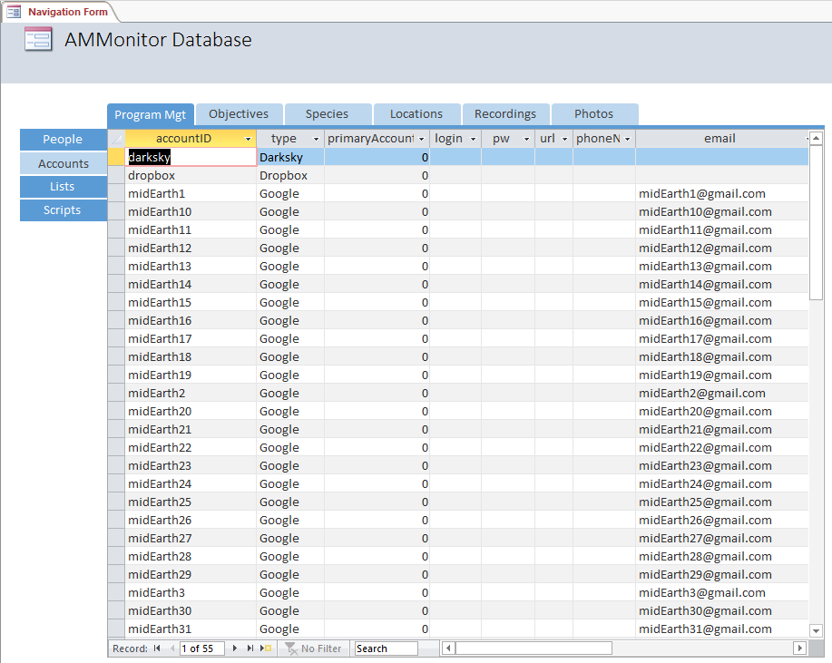
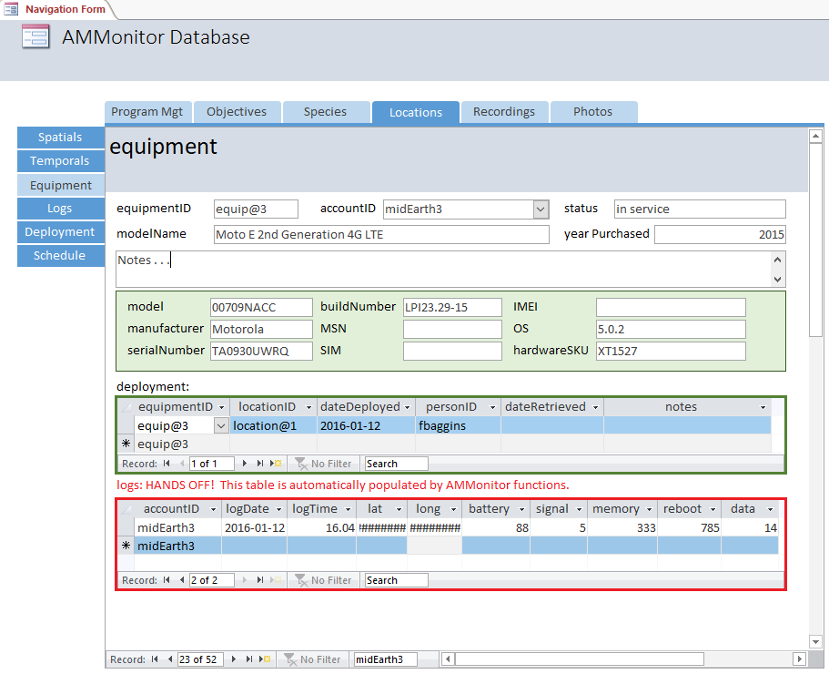

This chapter covers the **accounts**, **equipment**, **deployment** and
**logs** tables of an **AMMonitor** database, and explains their utility
for a monitoring program. Briefly, the **accounts** table is used to
store information about accounts, such as Google accounts or a Dropbox
account. The **equipment** table stores information about each piece of
monitoring equipment, such as a smartphone. The **deployment** table is
used to track which piece of equipment is deployed at a given monitoring
location. The **logs** table stores smartphone device logs that can be
used for troubleshooting (see xxx, in prep, for details on our
smartphone approach and setup).

Here, we use the `dbCreateSample()` function to create a database called
“Chap7.sqlite”, which will be stored in a folder (directory) called
“database” within the **AMMonitor** main directory, which should be your
working directory in R. Recall that `dbCreateSample()` generates all
tables of an **AMMonitor** database, and then pre-populates sample data
into tables specified by the user. For the demonstration purposes of
this chapter, we will only pre-populate a few necessary tables:

    > # Create a sample database for this chapter
    > dbCreateSample(db.name = "Chap7.sqlite", 
    +                file.path = paste0(getwd(),"/database"), 
    +                tables =  c("people", "accounts", 
    +                            "equipment", "deployment",
    +                            "locations", "logs"))

    An AMMonitor database has been created with the name Chap7.sqlite which consists of the following tables: 

    accounts, annotations, assessments, classifications, deployment, equipment, library, listItems, lists, locations, logs, objectives, people, photos, priorities, prioritization, recordings, schedule, scores, scriptArgs, scripts, soundscape, spatials, species, sqlite_sequence, templates, temporals

    Sample data have been generated for the following tables: 
    accounts, people, equipment, locations, deployment, logs

We begin by connecting to the database. First, we initialize a character
object, **db.path**, that holds the database’s full file path. Then, we
create a database connection object, **db**, using RSQLite’s
`dbConnect()` function, where we identify the SQLite driver in the ‘drv’
argument, and our **db.path** object in the ‘dbname’ argument:

    > # Establish the database file path as db.path
    > db.path <- paste0(getwd(), '/database/Chap7.sqlite')
    > 
    > # Connect to the database
    > conx <- RSQLite::dbConnect(drv = dbDriver('SQLite'), dbname = db.path)

Finally, we send a SQL statement that will enforce foreign key
constraints.

    > # Turn the SQLite foreign constraints on
    > RSQLite::dbSendQuery(conn = conx, statement = 
    +               "PRAGMA foreign_keys = ON;"
    +           )

    <SQLiteResult>
      SQL  PRAGMA foreign_keys = ON;
      ROWS Fetched: 0 [complete]
           Changed: 0

Now we are ready to begin.

The Accounts Table
==================

The **accounts** table stores information about various accounts that
you may use in your monitoring program. For example, if you use Dropbox,
your login information may be stored here. In this chapter, we are most
concerned with storing account credentials associated Google accounts
that are set up for each monitoring smartphone (see Donovan and
Balantic, in prep, for further details).

To begin, we view the **accounts** table metadata:

    > # Look at information about the accounts table
    > dbTables(db.path = db.path, table = "accounts")

    $accounts
      cid           name         type notnull dflt_value pk comment
    1   0      accountID VARCHAR(255)       1         NA  1        
    2   1           type VARCHAR(255)       0         NA  0        
    3   2 primaryAccount      INTEGER       0         NA  0        
    4   3          login VARCHAR(255)       0         NA  0        
    5   4             pw VARCHAR(255)       0         NA  0        
    6   5            url VARCHAR(255)       0         NA  0        
    7   6    phoneNumber VARCHAR(255)       0         NA  0        
    8   7          email VARCHAR(255)       0         NA  0        
    9   8          notes         TEXT       0         NA  0        

This table stores typical credentials for an account, with a mix of data
types (VARCHAR, INTEGER, TEXT). The primary key is the column
*accountID*, which must be unique. The field *type* indicates the type
of account (e.g., google, dropbox, darksky). Importantly, for smartphone
monitoring that utilizes Google, your monitoring program must identify
one Google acccount that serves as the ‘primary account’. The primary
account is designated with the number 1 in the *primaryAccount* column;
non-primary accounts have entries of 0. For Google accounts, the *email*
column will be necessary to populate if researchers intend to make use
of the **schedule** and **prioritization** capacities covered in later
chapters. The password column, *pw*, can be used to store passwords
however you want, encrypted or unencrypted. This field is not required
should you wish to store passwords external to the **AMMonitor**
database.

Below, we view records in the sample **accounts** table using
`dbGetQuery()`. Although the sample data actually contains 55 accounts,
we limit the returned table to the first six records:

    > # Retrieve the first 6 records from the accounts table
    > RSQLite::dbGetQuery(conn = conx, statement = "SELECT * FROM accounts LIMIT 6")

        accountID    type primaryAccount login   pw  url phoneNumber                 email notes
    1 midEarthMgt  Google              1  <NA> <NA> <NA>        <NA> midEarthMgt@gmail.com  <NA>
    2     dropbox Dropbox              0  <NA> <NA> <NA>        <NA>                  <NA>  <NA>
    3     darksky Darksky              0  <NA> <NA> <NA>        <NA>                  <NA>  <NA>
    4   midEarth1  Google              0  <NA> <NA> <NA>        <NA>   midEarth1@gmail.com  <NA>
    5   midEarth2  Google              0  <NA> <NA> <NA>        <NA>   midEarth2@gmail.com  <NA>
    6   midEarth3  Google              0  <NA> <NA> <NA>        <NA>   midEarth3@gmail.com  <NA>

The sample data stores account information for various Google accounts,
a Dropbox account, and a DarkSky account (see Chapter 8: Temporals).
Notice that we have set up a (fake) Google account called “midEarthMgt”,
which serves as the “primary” Google account. The emails for each Google
account are also listed. Three additional Google accounts are shown
(“midEarth1”, “midEarth2”, and “midEarth3”), which are identified as
non-primary Google accounts.

In previous chapters, we provided CRUD (create, read, update, delete)
examples for working with records in a table via R. All of the examples
apply to the **accounts** table as well. We will review some of these
operations in the **deployment** section of this chapter.

The Equipment Table
===================

The **equipment** table tracks all equipment used in a monitoring
program. In a program that utilizes smartphones for monitoring, each
smartphone should be linked to a particular Google account. This table
can be used even if smartphones are not the monitoring equipment of
choice.

The `dbTables()` function provides a summary of the table’s field names
and data types. Below, we note that the table has several fields, most
of which are not required, that include a mix of VARCHAR, TEXT, and
INTEGER data. The *equipmentID* (primary key) is the only required
field. Optional fields may be used to record information about
smartphone-based monitoring (see xxx, in prep).

    > # Look at information about the equipment table
    > dbTables(db.path = db.path, table = "equipment")

    $equipment
       cid          name         type notnull dflt_value pk comment
    1    0   equipmentID VARCHAR(255)       1         NA  1        
    2    1     accountID VARCHAR(255)       0         NA  0        
    3    2         model VARCHAR(255)       0         NA  0        
    4    3     modelName VARCHAR(255)       0         NA  0        
    5    4  manufacturer VARCHAR(255)       0         NA  0        
    6    5  serialNumber VARCHAR(255)       0         NA  0        
    7    6 yearPurchased      INTEGER       0         NA  0        
    8    7   buildNumber VARCHAR(255)       0         NA  0        
    9    8           MSN VARCHAR(255)       0         NA  0        
    10   9           SIM VARCHAR(255)       0         NA  0        
    11  10          IMEI VARCHAR(255)       0         NA  0        
    12  11            OS VARCHAR(255)       0         NA  0        
    13  12   hardwareSKU VARCHAR(255)       0         NA  0        
    14  13        status VARCHAR(255)       0         NA  0        
    15  14         notes         TEXT       0         NA  0        

Importantly, the *accountID* links a particular piece of equipment with
an account listed in the table **accounts**. We confirm this
relationship with a PRAGMA statement in `dbGetQuery()`:

    > # Return foreign key information for the equipment table
    > RSQLite::dbGetQuery(conn = conx, statement = "PRAGMA foreign_key_list(equipment);")

      id seq    table      from        to on_update on_delete match
    1  0   0 accounts accountID accountID   CASCADE NO ACTION  NONE

This output shows that the field *accountID* from the table **accounts**
maps to the field *accountID* in the table **equipment**. Note that the
*on\_update* column value is set to “CASCADE”, indicating that when a
primary key in the **account** table is changed, the mapped keys in the
**equipment** table will be automatically updated. Also note that the
*on\_delete* column value is set to “NO ACTION”, indicating that when a
primary key is deleted from the **account** table, no records will be
removed from the linked **equipment** table.

We view records in the sample **equipment** table using `dbGetQuery()`.
Below, we specify only a few columns of interest, and although the
sample data contains 52 pieces of equipment, we limit the returned table
to the first five records:

    > RSQLite::dbGetQuery(conn = conx, statement = "SELECT 
    +                                      equipmentID, accountID, model, manufacturer, 
    +                                      OS, status 
    +                                      FROM equipment
    +                                      LIMIT 5")

      equipmentID accountID     model manufacturer    OS     status
    1     equip@1 midEarth1 00709NACC     Motorola 5.0.2     broken
    2     equip@2 midEarth2 00709NACC     Motorola 5.0.2     stolen
    3     equip@3 midEarth3 00709NACC     Motorola   5.1 in service
    4     equip@4 midEarth4 00709NACC     Motorola   5.1 in service
    5     equip@5 midEarth5 00709NACC     Motorola 5.0.2 in service

The *equipmentID* can be any identifier we want. Here, we chose basic
equipment names like equip@1, equip@2, but the *equipmentID* names are
up to the user so long as they are unique and do not break any SQLite
naming conventions. Notice that each piece of equipment has a
corresponding accountID, as would be the case with smartphone
monitoring. Remaining columns are used optionally to track hardware
information. In this example, note that we have described the *status*
of equipment pieces equip@1 and equip@2 as ‘broken’ and ‘stolen’,
respectively (in a long-term monitoring program, some equipment will
likely be retired over time). Thus, when we discuss the **deployment**
table later in this chapter, we should anticipate that neither of these
pieces of equipment will be currently deployed at an active monitoring
location. Users are encouraged to standardize a list of acceptable
entries for the *status* field that meet their programmatic needs, and
may do so using the **lists** and **listItems** tables introduced in
Chapter 4.

The Deployment Table
====================

The **deployment** table links both the **locations** and **equipment**
tables to track which equipment is deployed (physically located) at
which monitoring locations. This table is crucial to account for the
possibility that some of our monitoring equipment might be deployed at
different locations over time.

As always, `dbTables()` provides a summary of the field names and data
types in the **deployment** table, which has six fields. The primary key
for this table is a composite key consisting of the fields
*equipmentID*, *locationID*, and *dateDeployed*. Importantly,
**AMMonitor** functions will use the *dateDeployed* and *dateRetrieved*
fields to infer which sites are actively being monitored: if
*dateRetrieved* is NULL, **AMMonitor** assumes that the site is actively
being monitored.

    > # Look at information about the deployment table
    > dbTables(db.path = db.path, table = "deployment")

    $deployment
      cid          name         type notnull dflt_value pk comment
    1   0   equipmentID VARCHAR(255)       1         NA  1        
    2   1    locationID VARCHAR(255)       1         NA  2        
    3   2  dateDeployed VARCHAR(255)       1         NA  3        
    4   3 dateRetrieved VARCHAR(255)       0         NA  0        
    5   4      personID VARCHAR(255)       0         NA  0        
    6   5         notes         TEXT       0         NA  0        

We view records in the sample **deployment** table using either
`dbReadTable()` or `dbGetQuery()`. There are a total of 53 records in
this sample table, but we limit the query below to show only the first
six records, printed as a tibble:

    > RSQLite::dbGetQuery(conn = conx, statement = "SELECT * FROM deployment LIMIT 6")

      equipmentID locationID dateDeployed dateRetrieved personID notes
    1     equip@1 location@1   2015-11-14    2016-01-12 fbaggins  <NA>
    2     equip@1 location@3   2016-01-13    2016-01-18 fbaggins  <NA>
    3     equip@2 location@2   2015-11-14    2016-01-17 fbaggins  <NA>
    4     equip@3 location@1   2016-01-12          <NA> fbaggins  <NA>
    5     equip@4 location@2   2016-02-02          <NA> fbaggins  <NA>
    6     equip@5 location@3   2016-01-19          <NA> fbaggins  <NA>

The *equipmentID* and *locationID* show us which piece of equipment is
currently deployed at which location. The *dateDeployed* column
specifies when a piece of equipment was deployed to a particular
location. The *dateRetrieved* column tells us when a device’s deployment
ended at a particular location; values of NA indicate that a specific
piece of equipment is still currently deployed at that location. The
*personID* column can be used to track the monitoring team member
responsible for initiating a particular deployment, and the *notes*
column records any additional details.

The above example underscores the need for a deployment table. Notice
that equipmentID equip@1 underwent two deployments. The first deployment
was overseen by ‘fbaggins’ at location@1 from 2015-11-14 to 2016-01-12.
Next, ‘fbaggins’ moved this piece of equipment to location@3, where it
recorded from 2016-01-13 to 2016-01-18. After that, equip@1 has no more
deployments – based on the first record of the **equipment** table, we
presume this is because equip@1 is now broken. The notes column can be
used to provide more details if desired. EquipmentID equip@2 was
deployed by ‘fbaggins’ at location@2 from 2015-11-14 to 2016-01-17, and
serves no more deployments after this point (a glance at the second row
of the **equipment** table reminds us that this piece of equipment was
stolen). Later rows indicate that *equipmentID* equip@3, equip@4, and
equip@5 were deployed at location@1, location@2, and location@3,
respectively. NAs in the *dateRetrieved* column for these records convey
that these deployments are ongoing.

Importantly, all entries in the *locationID* column must match a
*locationID* present in the **locations** table, and all entries in the
*equipmentID* column must match an *equipmentID* present in the
**equipment** table. Additionally, if a *personID* is provided, the
entry must match an entry in the *personID* column in the **people**
table. Thus, the fields *locationID*, *equipmentID*, and *personID* in
the **deployment** table are foreign keys that reference primary keys in
other tables. This can be confirmed with the following SQL statement:

    > # Return foreign key information for the deployment table
    > RSQLite::dbGetQuery(conn = conx, statement = "PRAGMA foreign_key_list(deployment);")

      id seq     table        from          to on_update on_delete match
    1  0   0    people    personID    personID   CASCADE NO ACTION  NONE
    2  1   0 locations  locationID  locationID   CASCADE NO ACTION  NONE
    3  2   0 equipment equipmentID equipmentID   CASCADE NO ACTION  NONE

This output shows that the field *personID* (if provided) from the table
**people** maps to the field *personID* in the **deployment** table.
Further, the field *locationID* from the table **locations** maps to the
field *locationID* in the **deployment** table, and the field
*equipmentID* from the table **equipment** maps to the field
*equipmentID* in the **deployment** table.

Note that in all cases, the *on\_update* column value is set to
“CASCADE”, indicating that when a primary key is changed in the
**locations**, **equipment**, or **people** tables, the mapped keys in
the **deployment** table will be automatically updated. Also note that
the *on\_delete* column value is set to “NO ACTION”, indicating that
when a primary key is deleted from the primary tables, no records will
be removed from the linked **deployment** table. We encourage readers to
verify these actions.

To avoid writing cumbersome SQLite statements, we can use the
**AMMonitor** function `qryDeployment()` as a tool for pulling up basic
information about deployment status at active monitoring sites. In the
‘locationID’ argument, we can query for a specific site or sites of
interest to see which monitoring equipment is currently deployed there.

    > # Query deployment status at specific actively monitored locations: 
    > qryDeployment(conn = conx, locationID = 'location@3')

      equipmentID locationID accountID dateDeployed dateRetrieved               email      lat      long                  tz
    1     equip@5 location@3 midEarth5   2016-01-19          <NA> midEarth5@gmail.com 33.60673 -115.2148 America/Los_Angeles

We can check the status of *all* actively monitored locations by
indicating ‘all’ in the ‘locationID’ argument:

    > # Query deployment status at all actively monitored locations: 
    > qryDeployment(conn = conx, locationID = 'all')

       equipmentID  locationID  accountID dateDeployed dateRetrieved                email      lat      long                  tz
    1      equip@3  location@1  midEarth3   2016-01-12          <NA>  midEarth3@gmail.com 33.62687 -115.1551 America/Los_Angeles
    2      equip@4  location@2  midEarth4   2016-02-02          <NA>  midEarth4@gmail.com 33.57669 -114.8350 America/Los_Angeles
    3      equip@5  location@3  midEarth5   2016-01-19          <NA>  midEarth5@gmail.com 33.60673 -115.2148 America/Los_Angeles
    4      equip@6  location@4  midEarth6   2016-01-19          <NA>  midEarth6@gmail.com 33.67328 -115.0898 America/Los_Angeles
    5      equip@7  location@5  midEarth7   2016-01-19          <NA>  midEarth7@gmail.com 33.52128 -115.2446 America/Los_Angeles
    6      equip@8  location@6  midEarth8   2016-01-19          <NA>  midEarth8@gmail.com 33.55636 -115.0292 America/Los_Angeles
    7      equip@9  location@7  midEarth9   2016-01-19          <NA>  midEarth9@gmail.com 33.56863 -115.0973 America/Los_Angeles
    8     equip@10  location@8 midEarth10   2016-01-19          <NA> midEarth10@gmail.com 33.56808 -115.0929 America/Los_Angeles
    9     equip@11  location@9 midEarth11   2016-01-19          <NA> midEarth11@gmail.com 33.65396 -115.1301 America/Los_Angeles
    10    equip@12 location@10 midEarth12   2016-01-19          <NA> midEarth12@gmail.com 33.60742 -115.0721 America/Los_Angeles
    11    equip@13 location@11 midEarth13   2016-01-19          <NA> midEarth13@gmail.com 33.66291 -115.3325 America/Los_Angeles
    12    equip@14 location@12 midEarth14   2016-01-19          <NA> midEarth14@gmail.com 33.64193 -115.2870 America/Los_Angeles
    13    equip@15 location@13 midEarth15   2016-01-19          <NA> midEarth15@gmail.com 33.52838 -115.0921 America/Los_Angeles
    14    equip@16 location@14 midEarth16   2016-01-19          <NA> midEarth16@gmail.com 33.64898 -115.1317 America/Los_Angeles
    15    equip@17 location@15 midEarth17   2016-01-19          <NA> midEarth17@gmail.com 33.58951 -114.8915 America/Los_Angeles
    16    equip@18 location@16 midEarth18   2016-01-19          <NA> midEarth18@gmail.com 33.60720 -114.9314 America/Los_Angeles
    17    equip@19 location@17 midEarth19   2016-01-19          <NA> midEarth19@gmail.com 33.51298 -115.0346 America/Los_Angeles
    18    equip@20 location@18 midEarth20   2016-01-19          <NA> midEarth20@gmail.com 33.56604 -115.1039 America/Los_Angeles
    19    equip@21 location@19 midEarth21   2016-01-19          <NA> midEarth21@gmail.com 33.59970 -115.3039 America/Los_Angeles
    20    equip@22 location@20 midEarth22   2016-01-19          <NA> midEarth22@gmail.com 33.70903 -115.2295 America/Los_Angeles
    21    equip@23 location@21 midEarth23   2016-01-19          <NA> midEarth23@gmail.com 33.71618 -115.3084 America/Los_Angeles
    22    equip@24 location@22 midEarth24   2016-01-19          <NA> midEarth24@gmail.com 33.65384 -115.0561 America/Los_Angeles
    23    equip@25 location@23 midEarth25   2016-01-19          <NA> midEarth25@gmail.com 33.69378 -114.9972 America/Los_Angeles
    24    equip@26 location@24 midEarth26   2016-01-19          <NA> midEarth26@gmail.com 33.58889 -115.0608 America/Los_Angeles
    25    equip@27 location@25 midEarth27   2016-01-19          <NA> midEarth27@gmail.com 33.60146 -115.3284 America/Los_Angeles
    26    equip@28 location@26 midEarth28   2016-01-19          <NA> midEarth28@gmail.com 33.67666 -115.0498 America/Los_Angeles
    27    equip@29 location@27 midEarth29   2016-01-19          <NA> midEarth29@gmail.com 33.70957 -115.1450 America/Los_Angeles
    28    equip@30 location@28 midEarth30   2016-01-19          <NA> midEarth30@gmail.com 33.55990 -114.8213 America/Los_Angeles
    29    equip@31 location@29 midEarth31   2016-01-19          <NA> midEarth31@gmail.com 33.69269 -115.2085 America/Los_Angeles
    30    equip@32 location@30 midEarth32   2016-01-19          <NA> midEarth32@gmail.com 33.58897 -115.2356 America/Los_Angeles
    31    equip@33 location@31 midEarth33   2016-01-19          <NA> midEarth33@gmail.com 33.63390 -114.8762 America/Los_Angeles
    32    equip@34 location@32 midEarth34   2016-01-19          <NA> midEarth34@gmail.com 33.52327 -115.0946 America/Los_Angeles
    33    equip@35 location@33 midEarth35   2016-01-19          <NA> midEarth35@gmail.com 33.54245 -115.2274 America/Los_Angeles
    34    equip@36 location@34 midEarth36   2016-01-19          <NA> midEarth36@gmail.com 33.72496 -115.0071 America/Los_Angeles
    35    equip@37 location@35 midEarth37   2016-01-19          <NA> midEarth37@gmail.com 33.60566 -115.2380 America/Los_Angeles
    36    equip@38 location@36 midEarth38   2016-01-19          <NA> midEarth38@gmail.com 33.68694 -115.3392 America/Los_Angeles
    37    equip@39 location@37 midEarth39   2016-01-19          <NA> midEarth39@gmail.com 33.70566 -114.9111 America/Los_Angeles
    38    equip@40 location@38 midEarth40   2016-01-19          <NA> midEarth40@gmail.com 33.73866 -115.1991 America/Los_Angeles
    39    equip@41 location@39 midEarth41   2016-01-19          <NA> midEarth41@gmail.com 33.67136 -115.2584 America/Los_Angeles
    40    equip@42 location@40 midEarth42   2016-01-19          <NA> midEarth42@gmail.com 33.62513 -115.2564 America/Los_Angeles
    41    equip@43 location@41 midEarth43   2016-01-19          <NA> midEarth43@gmail.com 33.56887 -115.0813 America/Los_Angeles
    42    equip@44 location@42 midEarth44   2016-01-19          <NA> midEarth44@gmail.com 33.55723 -114.9587 America/Los_Angeles
    43    equip@45 location@43 midEarth45   2016-01-19          <NA> midEarth45@gmail.com 33.50361 -115.0244 America/Los_Angeles
    44    equip@46 location@44 midEarth46   2016-01-19          <NA> midEarth46@gmail.com 33.68224 -115.0656 America/Los_Angeles
    45    equip@47 location@45 midEarth47   2016-01-19          <NA> midEarth47@gmail.com 33.56247 -115.1401 America/Los_Angeles
    46    equip@48 location@46 midEarth48   2016-01-19          <NA> midEarth48@gmail.com 33.54030 -114.8909 America/Los_Angeles
    47    equip@49 location@47 midEarth49   2016-01-19          <NA> midEarth49@gmail.com 33.50426 -115.2130 America/Los_Angeles
    48    equip@50 location@48 midEarth50   2016-01-19          <NA> midEarth50@gmail.com 33.62153 -115.0527 America/Los_Angeles
    49    equip@51 location@49 midEarth51   2016-01-19          <NA> midEarth51@gmail.com 33.52573 -114.9409 America/Los_Angeles
    50    equip@52 location@50 midEarth52   2016-01-19          <NA> midEarth52@gmail.com 33.70039 -115.3335 America/Los_Angeles

As shown, 50 locations are actively monitored. Alternatively, users can
invoke `dbGetQuery()` to work with the **deployment** table for more
customized queries.

CRUD operations
===============

As demonstrated in Chapter 3, the easiest way to add records to the
database using R is to generate a data.frame of records, and then use
the `dbWriteTable()` function to insert them. However, to successfully
insert new records into the **deployment** table, the user must be
vigilant about current equipment status, active monitoring locations,
and current deployments. The sample **locations** table shows that we
are actively monitoring 50 locations, and 52 phones are listed in the
**equipment** table.

Imagine that, due to equipment failure, we need to terminate equip@52’s
deployment at location@50 on 2016-02-05. Further imagine that we will
replace it with equip@1 (which has undergone a repair – previously, it
was broken). First, we indicate that equip@52 has been retrieved with an
*update* query:

    > # Indicate the retrieval of equip@52
    > RSQLite::dbExecute(conn = conx, 
    +           statement = "UPDATE deployment 
    +                        SET dateRetrieved = '2016-02-05', 
    +                            notes = 'Apparently broken'
    +                        WHERE equipmentID = 'equip@52' ")

    [1] 1

R returns a ‘1’ to indicate that one record was updated, and the update
can be confirmed by the reader with a call to `dbGetQuery()`.

In service of sound recordkeeping, we update the **equipment** table to
reflect a change in status for equip@1 and equip@52 according to the
status standards we have chosen in our monitoring program:

    > # Update equip@1's status to 'in service'
    > RSQLite::dbExecute(conn = conx, 
    +           statement = "UPDATE equipment 
    +                        SET status = 'in service' 
    +                        WHERE equipmentID = 'equip@1'")

    [1] 1

    > # Update equip@52's status to 'broken'
    > RSQLite::dbExecute(conn = conx, 
    +           statement = "UPDATE equipment 
    +                        SET status = 'broken' 
    +                        WHERE equipmentID = 'equip@52'")

    [1] 1

Finally, we are positioned to demonstrate the addition of a new record
to the **deployment** table. We are going to take the recently repaired
equipment equip@1 and deploy it at location@50.

To record our new deployment, we create a data.frame of one record,
ensuring that all column names in the data.frame exactly match the field
names in the database itself, and making sure that the data types in the
data.frame match those expected by the database. We then add the
contents of this data.frame directly to the **deployment** table in the
database using the `dbWriteTable()` function, ensuring that ‘overwrite’
= FALSE and ‘append’ = TRUE.

    > # Generate a new record
    > new.deployment <- data.frame(equipmentID = 'equip@1',
    +                              locationID = 'location@50',
    +                              dateDeployed = '2016-02-05',
    +                              dateRetrieved = NA,
    +                              personID = 'bbaggins',
    +                              notes = 'Swapped phones for servicing.',
    +                              stringsAsFactors = FALSE)
    > 
    > # Add the record to the database
    > RSQLite::dbWriteTable(conn = conx, name = 'deployment', 
    +              value = new.deployment,
    +              row.names = FALSE, overwrite = FALSE,
    +              append = TRUE, header = FALSE)
    > 
    > # Verify this record has been added by looking at deployments at location@50
    > RSQLite::dbGetQuery(conn = conx, 
    +            statement =  "SELECT * FROM deployment 
    +                          WHERE locationID = 'location@50' ")

      equipmentID  locationID dateDeployed dateRetrieved personID                         notes
    1    equip@52 location@50   2016-01-19    2016-02-05 fbaggins             Apparently broken
    2     equip@1 location@50   2016-02-05          <NA> bbaggins Swapped phones for servicing.

The Logs Table
==============

The **logs** table is used with smartphone monitoring, where each phone
sends a performance log on a scheduled basis to the monitoring team (see
xxx, in prep, for full details). Briefly, in our smartphone monitoring
approach, each phone sends its performance logs to the log\_drop
directory as shown below on a schedule, with a file name such as
‘midEarth3\_log.txt’. Each phone’s log file is then parsed on a daily
basis, and the information is inserted to the **logs** table via the
**AMMonitor** function `xxx()`. Once the data are logged into the
database table, the log\_drop file is deleted.

<kbd>

</kbd>

> *Figure 7.1. The logs and log\_drop directory are used to store
> equipment logs that are delivered remotely, and allow a research team
> to monitor the performance of equipment.*

The directory ‘logs’ also stores performance logs for each smartphone,
and these contain different information than what is stored in the
**logs** table. The “log\_drop” and “logs” directories, along with a
full description of our smartphone monitoring approach, is outlined in
Donovan et al. (in prep).

As always, `dbTables()` provides a summary of the field names and data
types in the **logs** table, which has 10 fields. The primary key for
this table is a composite key consisting of the fields *accountID*,
*logDate*, and *logTime*.

    > # Look at information about the logs table
    > dbTables(db.path = db.path, table = "logs")

    $logs
       cid      name         type notnull dflt_value pk comment
    1    0 accountID VARCHAR(255)       1         NA  1        
    2    1   logDate VARCHAR(255)       1         NA  2        
    3    2   logTime         REAL       1         NA  3        
    4    3       lat         REAL       0         NA  0        
    5    4      long         REAL       0         NA  0        
    6    5   battery      INTEGER       0         NA  0        
    7    6    signal      INTEGER       0         NA  0        
    8    7    memory      INTEGER       0         NA  0        
    9    8    reboot      INTEGER       0         NA  0        
    10   9      data      INTEGER       0         NA  0        

The remaining columns store information that is provided by each
smartphone. The *lat* and *long* columns provide the device’s location
as registered by the device itself. The field *battery* gives the
battery strength at the time the log was written. The field *signal*
gives the cell phone signal strength; *memory* gives the device memory
in use in MB; *reboot* gives the time (in seconds) since a reboot
occurred; and *data* gives the total amount of mobile data used by the
device since the last reboot.

An example of parsed data that is inserted to the **logs** table can be
seen below:

    > # Retrieve the first record from the logs table
    > RSQLite::dbGetQuery(conn = conx, statement = "SELECT * FROM logs LIMIT 1")

      accountID    logDate logTime      lat      long battery signal memory reboot data
    1 midEarth3 2016-01-12   16.04 33.63348 -115.2039      88      5    333    785   14

Finally, when we are finished using the database, we disconnect.

    > # Disconnect from the database
    > RSQLite::dbDisconnect(conx)

The Accounts Table in Access
============================

For monitoring programs that use the Microsoft Access front end, the
**accounts** form provides a convenient ‘spreadsheet’ type method for
tracking accounts. It is located as a secondary tab under the primary
tab “Program Mgt”.

<kbd>

</kbd>

> *Figure 7.2. The Accounts table is located under the Program Mgt tab,
> and is shown in spreadsheet-type view.*

Note that 55 records are present in the **acounts** table (which
underlies this form).

The Equipment, Deployment, and Log Tables in Access
===================================================

The Equipment form can be accessed as a secondary tab under the
Locations tab. The deployment table is linked to this form to
conveniently display the deployment history for a given piece of
equipment.

<kbd>

</kbd>

> *Figure 7.3. The Equipment table and associated tables are located
> under the Locations primary tab. Equipment is deployed across
> locations. The search bar at the very bottom of the form can be useed
> to quickly find a particular equipmentID or accountID.*

Note that there are 52 entries for equipment, and the arrow keys at the
bottom of the form can be used to navigate to or search for new records.
Each piece of equipment has **deployment** information stored in the
green box. Above, we show equip@1, which was deployed at location@1,
later retrieved, re-deployed at location@3 on 2016-01-13, and later
retrieved on 2016-01-18. If using smartphone monitoring, each equipment
is linked to an account, and the accounts log is shown in the red box.
Note the unfriendly “Hands off!” warning, which alerts users that the
table is automatically populated by **AMMonitor** functions.

The **deployment** and **logs** tables can also be accessed directly by
clicking on their tabs in the left menu. These bring up datasheet views
of the tables and are not subset to a particular piece of equipment or a
particular account. Uers can use the deployment tab to insert, update,
or delete records if the deployment subform highlighted in green is not
helpful. As always, monitoring teams are free to adjust the Access front
end in any way to meet their needs.

Chapter Summary
===============

This chapter covered the **equipment**, **deployment**, **logs**, and
**account** tables. The deployment table is necessary to account for the
possibility that monitoring equipment might be moved to different
locations over time. As with the **locations** table, special care
should be taken by the user to ensure that data entered in these tables
is correct and up-to-date. The **logs** table is described in depth in
xxx (in prep), where we outline our approach to monitoring with
smartphones. The remaining tables are used extensively in future
chapters.
