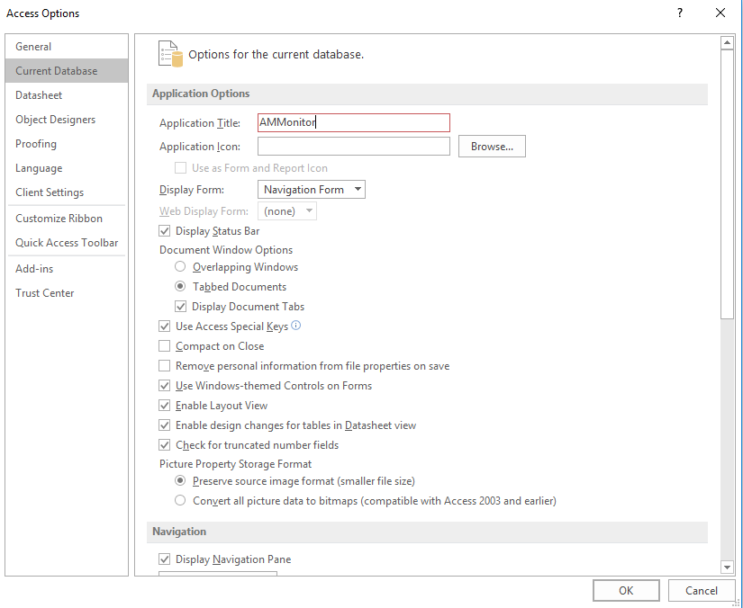

The primary goal of **AMMonitor** is to provide a system that
efficiently processes remotely captured data so that agencies or
organizations tasked with managing natural resources can easily compare
the current state of the ecosystem (e.g., species occupancy patterns) to
management objectives. Autonomous Monitoring Units (AMUs) have the
capacity to collect a massive amount of information in a short period of
time, requiring that monitoring teams have an effective data management
plan in place.

In the **AMMonitor** system, raw monitoring files such as recordings and
photos are stored in the Dropbox Cloud (intentionally not synced to a
user’s computer). All other data, including photo and recording
metadata, are stored within a [SQLite
database](https://www.sqlite.org/index.html). SQLite is a
self-contained, high-reliability, embedded, full-featured,
public-domain, SQL database engine. **AMMonitor** uses the R package
RSQLite \[1\] to connect R with the database.

SQLite is a **relational database**, which is simply a collection of
tables that are related in some way. Each table stores specific
information, and specific columns in one table may be formally linked to
other tables. Information stored in or across tables can be retrieved
using a language called SQL, which stands for Structured Query Language.
You will learn some basic SQL commands in this chapter, but much of your
work will done in R.

Typically, SQL databases are stored on a large server (such as the
server at a university or agency) that requires management and oversight
by a database administrator. In contrast, a SQLite database does not
require a server or administrator. Instead, the entire database is
stored as a single file, which may reside on a single computer or in the
cloud. The SQLite home page explains: “SQLite is an in-process library
that implements a self-contained, serverless, zero-configuration,
transactional SQL database engine. The code for SQLite is in the public
domain and is thus free for use for any purpose, commercial or private.
SQLite is the most widely deployed database in the world with more
applications than we can count, including several high-profile
projects.” \[2\]

An **AMMonitor** SQLite database is created with the `dbCreate()`
function, and should be stored in the “database” folder within the main
AMMonitor directory.

<kbd>

</kbd>

> *Figure 2.1. The “database” directory should store the AMMonitor
> SQLite database file.*

Before we actually create the database, we provide an overview of the
tables within an **AMMonitor** database.

<kbd>

</kbd>

> *Figure 2.2. AMMonitor database schema, showing key tables with a few
> columns. Lines between tables indicate how tables are related to each
> other.*

If you are new to relational databases, think of a database as several
Excel worksheets (a workbook), where each sheet is a table that stores
specific information. The tables are linked in a specific way.

Database tables (keyed to Figure 2.2 in this paragraph) store data and
metadata about the overall monitoring effort. Each rectangle in Figure
2.2 represents a table, and displays a sample of column names within
that table. The tables are linked to other tables by connecting lines,
and are organized here to cleanly illustrate table linkages (rather than
representing a workflow). First, a monitoring effort is driven by an
agency’s **objectives** (2.2t). A monitoring team consists of **people**
(2.2a), who deploy **equipment** (2.2f) across various **locations**
(2.2h) to monitor ecosystems via smartphone-based AMUs, each connected
to a Google **account** (2.2e) and tracked through the **deployment**
table (2.2b). Temporal information about each location is stored in the
**temporals** (2.2c) table, while the **spatials** (2.2d) table points
to spatial layers such as rasters or shapefiles. The deployed equipment
collects recordings and/or photos on a **schedule** (2.2g), which is
transmitted to each phone’s Google calendar daily. The schedules can be
optimized based on the monitoring team’s monitoring **priorities**
(2.2i), which drive the outputs of the **prioritization** table (2.2n).
Collected audio and photo files are delivered to and remain in the cloud
– metadata about cloud-based files is stored in the **photos** (2.1q)
and **recordings** tables (2.2k). Team members can manually search files
for target **species** (2.2p) or target signals, identified in a signal
**library** (2.2o), and log **annotations** (2.2r) for any targets found
manually. General acoustic features of an audio file are summarized and
stored in the **soundscapes** table (2.2j). To facilitate automated
detection of target sounds, team members can create **templates** of
target signals (2.2m). After a template is run against a recording, the
**scores** table (2.2l) stores metrics indicating the closeness of a
signal to the template. Subsets of these scores can be verified manually
by people on the research team. Verified scores are then used to develop
and test several machine learning classifiers to return the probability
that a detected event is a target signal, stored in the
**classifications** table (2.2s). Classifications, along with
annotations, can be used in a variety of statistical approaches to
analyze the state of the ecosystem with respect to management objectives
(2.2t), bringing us back to the beginning. The **analysis** table (2.2y)
identifies the model library that houses the analytical results, and the
**assessments** table (not shown) matches an analysis with a particular
objective. The tables **lists** (2.2u) and **listItems** (2.2v) are
general purpose tables that control what values can be entered into a
particular table. The tables **scripts** (2.2w) and **scriptArgs**
(2.2x) store information that allow certain **AMMonitor** functions to
be run semi-automatically.

Though Fig. 2.2 provides an overview of the **AMMonitor** database, we
will introduce each table in depth in the coming chapters.

Keys
====

Keys are an important concept in relational databases. We highlight two
types of keys below:

### Primary Keys

Each table has a “primary” key, which is a column or columns used to
identify a unique record (row) in the table. For example, in the
**people** table (Figure 2.1a), the column labeled *personID* has a
small key symbol next to it, indicating that this column is the table’s
primary key. You can see that the table has two other columns, labeled
*firstName* and *lastName*. Thus, a record (a row in the table) in this
table may have an entry such as *personID* = “bbaggins”, *firstName* =
“Bilbo”, and *lastName* = “Baggins”. We can use SQLite code to retrieve
this unique row in the table by simply finding the record where the
‘personID’ column has a value of “bbaggins”. The primary key cannot be
duplicated, thus “bbaggins” will always point to Bilbo’s record.

In some tables, mutiple columns compose the primary key. For example,
the **deployment** table (2.1b) uses three columns as the primary key,
referred to as a “composite primary key”. The columns *equipmentID*,
*locationID*, and *dateDeployed* combine to make the primary key in this
table because all three entries are required to identify a unique
deployment (a row that identifies a specific piece of equipment deployed
at a specific location on a specific date).

### Foreign Keys

Foreign keys are used to link two tables together, wherein a foreign key
in one table refers to a primary key in another table. For example,
notice the column named *personID* in the **deployment** table (Figure
2.1b). This is a foreign key that connects back to the **people** table
(Figure 2.1a), where *personID* is a primary key. Thus, if Bilbo Baggins
deploys an AMU at a given location on a given date, we can expect to see
“bbaggins” listed in the *personID* column of the **deployment** table.
If we need to know more about “bbaggins”, we can find his information in
the **people** table by extracting the row associated with this key.

The concept of primary keys and foreign keys is essential to relational
databases. Primary and foreign keys allow information to be distributed
across tables so that the same information is never duplicated, and they
help maintain the integrity of the data collected. We will examine the
table relationships as a matter of practice in future chapters. For more
information, view a
[tutorial](https://www.tutorialspoint.com/sql/sql-rdbms-concepts.htm) on
relational database concepts.

Create the database
===================

Creating the **AMMonitor** database is extremely simple. Here, users
have two options:

1.  Use the `dbCreate()` function to create a blank database. This is
    what users should do after reading or skimming through the entire
    book and are ready to launch a monitoring program. This function has
    two arguments: the ‘db.name’ (desired name of the database) and the
    ‘file.path’ (where to store this SQLite file). All tables and keys
    are generated automatically. Tables are empty, but fully equipped to
    intake new information.

2.  Use the `dbCreateSample()` function to generate a sample database.
    This is the approach we will use throughout this book.
    `dbCreateSample()` generates all tables in an **AMMonitor**
    database, and, for demonstration purposes, pre-populates certain
    tables with sample data that comes with the package. This function
    has three arguments: the ‘db.name’, ‘file.path’, and ‘tables’ (the
    names of the database tables that should be filled with sample data;
    all other tables are present but empty).

For this chapter, we will use `dbCreateSample()` to generate a sample
SQLite database named “Chap2.sqlite”. Below, we fill all tables with
sample data by specifying ‘all’ for the tables argument.

    # Create a sample database for this chapter
    dbCreateSample(db.name = "Chap2.sqlite", 
                   file.path = paste0(getwd(),"/database"), 
                   tables =  'all')

    ## An AMMonitor database has been created with the name Chap2.sqlite which consists of the following tables:

    ## accounts, annotations, assessments, classifications, deployment, equipment, library, listItems, lists, locations, logs, objectives, people, photos, priorities, prioritization, recordings, schedule, scores, scriptArgs, scripts, soundscape, spatials, species, sqlite_sequence, templates, temporals

    ## 
    ## Sample data have been generated for the following tables: 
    ## accounts, lists, people, species, spatials, scripts, equipment, locations, deployment, library, listItems, objectives, priorities, prioritization, recordings, photos, annotations, schedule, templates, scores, classifications, soundscape, temporals, scriptArgs, analysis, logs, assessments

Next, we connect to the database in R using RSQLite’s `dbConnect()`
function, where we identify the SQLite driver in the ‘drv’ argument:

    # Establish the database file path as db.path
    db.path <- paste0(getwd(), '/database/Chap2.sqlite')

    # Connect to the database
    conx <- RSQLite::dbConnect(drv = dbDriver('SQLite'), dbname = db.path)

Finally, we send a SQLite statement to enforce foreign key constraints:

    # Turn the SQLite foreign constraints on
    RSQLite::dbExecute(conn = conx, statement = 
                  "PRAGMA foreign_keys = ON;"
              )

    ## [1] 0

This is our first look at SQLite syntax, passed through the
`dbExecute()` ‘statement’ argument. The word PRAGMA (from “pragmatic”)
is a computer programming directive that tells SQLite how to process
input. Here, we are telling SQLite to enforce foreign key contraints.
That means if a person named Gandalf deploys equipment, and we create a
new record in the **deployment** table indicating so, Gandalf must be
present in the **people** table, or an error will occur. This ensures
the database stays tidy and clean.

Sending a SQLite statement with the `dbExecute()` function is one way to
interact with the database. Another way is through **AMMonitor**
functions. For example, throughout this vignette, we will be using the
`dbTables()` function to view a particular table’s columns, the type of
data it stores, and its primary keys. For example:

    # Look at the structure of the deployment table
    dbTables(db.path = db.path, table = 'deployment')

    ## $deployment
    ##   cid          name         type notnull dflt_value pk comment
    ## 1   0   equipmentID VARCHAR(255)       1         NA  1        
    ## 2   1    locationID VARCHAR(255)       1         NA  2        
    ## 3   2  dateDeployed VARCHAR(255)       1         NA  3        
    ## 4   3 dateRetrieved VARCHAR(255)       0         NA  0        
    ## 5   4      personID VARCHAR(255)       0         NA  0        
    ## 6   5         notes         TEXT       0         NA  0

Here, the output tells us about each of the columns (fields) in the
**deployment** table. The field *cid* is simply the column identifier
(automatically created). The field *name* gives the names of the table’s
columns. Here, we see that the **deployment** table has columns named
‘equipmentID’, ‘locationID’, ‘dataDeployed’, and so on.

The field *type* tells what sort of data are stored in each column.
These data types are different from R’s datatypes (e.g., character,
number, integer, logical). Because this is a SQLite database, the
character types must be recognized by SQLite. Here, notice that most
columns are set to VARCHAR(255), which means the columns store
characters that are variable in length (up to 255 characters). The
‘notes’ column stores TEXT, which can accommodate lengthy text entries.
See <https://www.sqlite.org/datatype3.html> for more information on
SQLite data types.

The field *notnull* indicates whether an entry is required for each
column or not (1 = required; 0 = not required). You can see that the
first three columns are all required. The field *dflt\_value* provides
the default value for each column, if specified.

Finally, the field *pk* identifies column(s) that make up the primary
key. Every table must have a primary key. Here, the *equipmentID*,
*locationID*, and *dateDeployed* columns combine to create the table’s
primary key (a composite key).

We mentioned that the **deployment** table contains foreign keys, which
means that some columns reference primary keys from other tables. In
fact, the **deployment** table’s primary key consists of two foreign
keys. We can send a **query** to the SQLite database, and request the
foreign key information for the **deployment** table with the following
code:

    # Return foreign key information for the deployment table
    RSQLite::dbGetQuery(conn = conx, statement = "PRAGMA foreign_key_list(deployment);")

Here, we use the `dbGetQuery()` function to send a SQLite query to the
database (i.e., we are asking for something from the database). We
provide the database connection, and then pass the SQLite query in the
‘statement’ argument. In this case, the SQLite query is “PRAGMA
foreign\_key\_list(deployment);”. The query returns a data.frame with 3
rows, indicating that the **deployment** table has 3 foreign keys. For
instance, the column *personID* in the table **people** maps to the
column *personID* in the **deployment** table.

The columns *on\_update* and *on\_delete* are important settings: in
**AMMonitor**, most foreign key columns are set to CASCADE on\_update
and NO ACTION on\_delete. If Bilbo deploys a piece of equipment (logged
in the **deployment** table as “bbaggins”), but later “bbaggins” in the
**people** table is updated to “BBaggins”, this change will trickle
through and update the **deployment** table due to CASCADE on\_update
setting. However, if Bilbo is later deleted from the **people** table,
his deployments will remain in the **deployments** table due to the NO
ACTION on\_delete setting. If you want to delete Bilbo’s deployments,
you will need to do so intentionally (with SQLite commands or through
the Microsoft Access interface, described later).

Interacting with Tables
=======================

There are many ways to interact with tables in a SQLite database, and
many tables are automatically populated by **AMMonitor** functions.
There two options for viewing the contents of a SQLite table using R. If
the table is relatively small, we can use the RSQLite function
`dbReadTable()` to read the entire table into R’s memory. Below, we
specify our **conx** object in the ‘conn’ argument, and “people” as the
table of interest in the ‘name’ argument.

    # Read the entire table and store as get.people
    get.people <- RSQLite::dbReadTable(conn = conx, name = "people")

    # Look at the entire table (printed as a tibble)
    get.people

As shown, the sample **people** table has two records. There are four
primary ways to work with records: Create, Read, Update, or Delete
(CRUD). C means “Create a new record”, R means “Read a record”, U means
“Update a record” and D means “Delete a record”. We will demonstrate the
CRUD operations in Chapter 3, when we look at the **people** table in
depth.

The standard **people** table comes with six columns. The *personID* is
the primary key of this table, and uniquely identifies each record in
the **people** table (duplicate *personID* records are not allowed).

Users can add any additional columns necessary for their monitoring
program by passing an ALTER TABLE SQL command to the function
`dbExecute()`. For example, in the code below, we add a column named
*startDate* and indicate that this column will store VARCHAR (character)
data.

    # Add a new column called StartDate
    RSQLite::dbExecute(conn = conx, statement = 
              "ALTER TABLE people ADD COLUMN startDate varchar;"
    ) 

ALTER TABLE may also be used to delete columns. However, we strongly
advise against deleting any default **AMMonitor** tables or columns –
doing so may produce function errors, and we will not be able to assist
you in fixing them.

The AMMonitor Database Front End
================================

While a monitoring team member can always interact with the database
through R (as shown above), not all team members will be proficient in
R, and may prefer an alternative database interface. To that end,
**AMMonitor** comes with a Microsoft Access front end, which is simply
an Access navigation form that connects to the SQLite database. This
front end provides users with a form-like feel for entering or updating
records. The actual data, however, remain in the SQLite database.

<kbd>

</kbd>

> *Figure 2.3. The AMMonitor Access front end is a navigation form,
> which is a collection of many different forms.*

Figure 2.3 shows the **AMMonitor** Access front end, which is a
Navigation Form in Access (a form containing many forms). The top of the
form consists of primary tabs (2.2a), which are Program Mgt, Objectives,
Species, Locations, Recordings, and Photos. When a primary tab is
selected (e.g,. the Program Mgt tab has been selected), the left menu
displays a set of secondary tabs (2.2b). Thus, People, Accounts, and
Lists fall under the realm of Program Mgt. When a secondary tab such as
**People** is selected, its form is displayed. This form maps to the
database table **people** (2.2c). The table’s fields are displayed in a
form-like view above, and can alternatively be displayed in a
spreadsheet-like table view. As previously mentioned, the **people**
table consists of six columns (fields), and a single record is displayed
in the form (2.2d). Toward the bottom of the form, we can advance from
record to record using the arrow buttons (2.2e), or we can create a new
record by pressing the sun icon button (2.2f). Access has a built-in
search form (2.2g) which can be used to locate particular records.

Users may modify this form at will to meet the needs of their own
monitoring program. Several online tutorials demonstrate how to edit and
customize Microsoft Access forms to your liking. If you do not have
Access, you may consider using the [Open Office
Base](https://www.openoffice.org/product/base.html) program instead.

This form is stored in the **ext** folder of the **AMMonitor** package
itself with the file name “AMMonitor\_sqlite.accdb”, and you can save it
to your **database** folder as “Chap2\_sqlite.accdb” with the following
code:

    # Save the Access form to your database directory
    save(list = system.file("extdata", "AMMonitor_sqlite.accdb",
                package = "AMMonitor"), 
         file = "database/Chap2_demo.accdb")

Hopefully, you now have the Access file in your **AMMonitor** database
folder, recognizable by the “accdb” extension. Remember, this file is
simply a collection of forms that can connect to a SQLite database, such
as the “Chap2.sqlite” database that we have been working with. The next
step is to actually make that connection.

SQLite ODBC
-----------

To connect Access to our Chap2.sqlite database, we need a “driver”,
which is a code snippet that will allow the SQLite database to connect
to Microsoft Access. We will be using an ODBC driver, which stands for
Open Database Connectivity. You can obtain the SQLite driver from
<a href="http://www.ch-werner.de/sqliteodbc/" class="uri">http://www.ch-werner.de/sqliteodbc/</a>.
Make sure you select the appropriate driver for your machine’s operating
system, and install it. As of this writing, we have been using the
SQLite3 ODBC Driver on a machine running Windows 10 with no problems.

Download the driver for your machine and install it. Then follow these
steps for Windows users (Mac users may need a different approach):

1.  Navigate to your computer’s ODBC Data Source Administrator. You can
    likely search “ODBC” to find this on your machine, and it should
    look something like the below. Under the User DSN tab, click the Add
    button.

<kbd>

</kbd>

> *Figure 2.4. The ODBC Data Source Administrator dialogue box allows
> you to create new ODBC connections (Open Data Base Connectivity)*.

1.  A new dialogue box will open, prompting you to select a driver.
    Locate the SQLite3 ODBC Driver you just installed, and click Finish.

<kbd>

</kbd>

> *Figure 2.5. Select the SQLite3 ODBC Driver to let your computer
> communicate with the SQLite database*.

1.  Another new dialogue box will open. You need to name your data
    source, navigate to a particular SQLite database, and press OK.
    Here, we are naming our data source Chap2\_sqlite, and will connect
    to the sqlite database called chap2.sqlite using the Browse button.
    It is a good idea to have the data source name match up with the
    name of the database so that you can identify the database based on
    the data source name. Additionally, there are a few options that may
    be enforced, including a timeout entry (if there is database
    inactivity after a given period of time, the connection will
    automatically break). Other options for this dialogue box can be
    found [here](http://www.ch-werner.de/sqliteodbc/html/index.html).

<kbd>

</kbd>

> *Figure 2.6. Give your connection a unique name, and browse to your
> SQLite database file.*

1.  You should now see this new data source listed in the User DSN tab;
    it will allow you to connect to your SQLite database. You may have
    many data sources (e.g., one for each chapter if you wish). When it
    is time to launch your own monitoring program, however, the data
    source will connect to your program’s **AMMonitor** SQLite database.

<kbd>

</kbd>

> *Figure 2.7. The new DNS should now be listed in your ODBC Data Source
> dialogue box.*

Linking Access to the SQLite database
-------------------------------------

The next step is connect the Microsoft Access file to the SQLite
database, employing the connection you just created. Here are the
required steps.

1.  Open the “Chap2\_demo.accdb” file now stored in your **AMMonitor**
    database directory.

2.  Click the External Data tab. This tab allows us to connect Access to
    an external database, such as an Excel file, another Access
    database, a text file or XML file. Here, we will use an ODBC
    connection, where ODBC stands for Open Database Connectivity. <kbd>

</kbd>

> *Figure 2.8. Open Access, and click on the External Data tab.*

1.  Clicking on the ODBC Database button will bring up a new dialogue
    box. Here, we want to **link** to the data source by creating a
    linked table. Press OK.

<kbd>

</kbd>

> *Figure 2.9. Indicate that you would like to link to the SQLite
> database (as opposed to importing the database into Access.*

1.  Now, we wish to locate and use the data source we just created
    (which uses a SQLite3 driver to connect to our SQLite database). It
    will likely be listed under the Machine Data Source tab, and is
    highlighted in blue when clicked. Press OK.

<kbd>

</kbd>

> *Figure 2.10. Locate your new database connection.*

1.  The previous action will display a new dialogue box. This new box
    will ask which SQLite tables you wish to connect to. Press the
    Select All button to the right, which will highlight all of the
    tables in blue. Then press OK.

<kbd>

</kbd>

> *Figure 2.11. Press the Select All button to connect all the SQLite
> tables to Access.*

1.  Under the “All Access Objects” left menu, you will see the tables.
    Each table has a globe symbol and arrow, indicating that each table
    is linked to the SQLite database table. This means we can now use
    Access to work with the data in our database tables.

<kbd>

</kbd>

> *Figure 2.12. The linked tables appear as “globes” in the left menu.*

Click on the **people** table, and you will see the two records
currently in the SQLite database in a spreadsheet view:

<kbd>

</kbd>

> *Figure 2.13. You can work with tables in Access, but most tables will
> be filled in by R!*

A new record can be added by entering data into the row with the \*
symbol. Keep in mind, however, that many tables will be automatically
populated by **AMMonitor** functions.

Access Forms
------------

Though you may work with tables directly as above, you can alternatively
use the Navigation form introduced earlier in the chapter. Locate the
Navigation form by collapsing the list of Tables (press the double arrow
icon to the right of the word “Tables”), and opening the list of Forms.

<kbd>

</kbd>

> *Figure 2.14. The Access forms are diplayed in the left menu. The
> Navigation Form is the master form.*

Here, you can see that the **AMMonitor** front end comes with many
individual forms that can be customized; these individual forms are
combined into the Navigation Form. Opening the Navigation will bring you
to the **AMMonitor** Navigation Form introduced earlier in the chapter.

<kbd>

</kbd>

> *Figure 2.15. The AMMonitor Navigation Form. This form can be
> customized to your liking.*

The Navigation Form can be set as the default form that appears when the
Access database is first opened. This can be achieved by going to File |
Options | Current Database, and setting the Navigation Form as the
Display Form. You may also add a customized title and icon here as well.

<kbd>

</kbd>

> *Figure 2.16. Force the Navigation Form to open when you open the
> Access file.*

Chapter Summary
===============

Our intention for this chapter was to introduce you to the **AMMonitor**
database. We have covered a short introduction to relational databases,
primary and secondary keys, drivers, ODBC connections, and Microsoft
Access forms. Throughout this book, we will discuss specific tables
within the **AMMonitor** SQLite database, and illustrate how these
tables are displayed in the Navigation Form.

In the chapters that follow, we will create new, chapter-specific
databases to illustrate each chapter’s key points. If your monitoring
team adopts the **AMMonitor** framework, you will likely maintain a
single database, and begin by establishing database standards that apply
to your team. You can also modify the Access front-end to meet the needs
of your monitoring effort.

Bibliography
============

1. Müller K, Wickham H, James DA, Falcon S. RSQLite: ’SQLite’ interface
for r (version 2.1,1) \[Internet\]. Comprehensive R Archive Network;
2018. Available:
<https://cran.r-project.org/web/packages/RSQLite/index.html>

2. SQLite \[Internet\]. SQLite.org; 2018. Available:
<https://www.sqlite.org/index.html>
