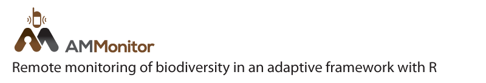
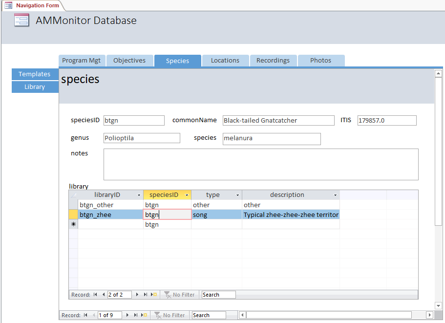
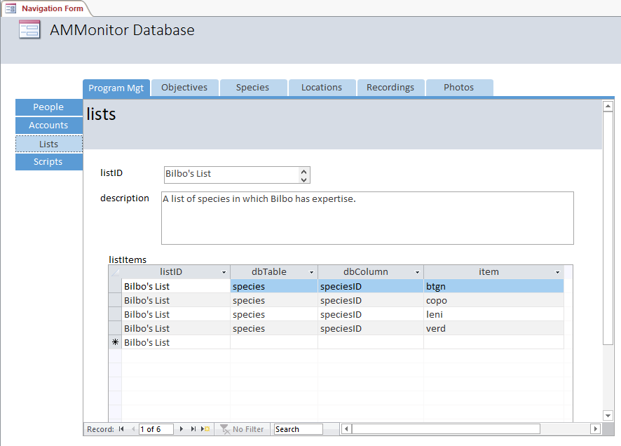

<div></div>

-   [Chapter Introduction](#chapter-introduction)
-   [The Species Table in R](#the-species-table-in-r)
    -   [Reading records](#reading-records)
    -   [Creating records](#creating-records)
    -   [Updating records](#updating-records)
    -   [Deleting records](#deleting-records)
-   [The Library Table in R](#the-library-table-in-r)
-   [The List and listItems Tables in
    R](#the-list-and-listitems-tables-in-r)
-   [The Species and Library Tables in
    Access](#the-species-and-library-tables-in-access)
-   [The List and listItems Tables in
    Access](#the-list-and-listitems-tables-in-access)
-   [Chapter Summary](#chapter-summary)
-   [Chapter References](#chapter-references)

Chapter Introduction
====================

This chapter covers the **species**, **library**, **lists**, and
**listItems** tables in the **AMMonitor** database. The **species** and
**library** tables can be used to track groups of target monitoring
species, as well as the sounds by which they are detected and monitored.
The **lists** and **listItems** tables allow users to create lists of
items, which can be used to enhance the integrity of the database.

In this chapter, we will use `dbCreateSample()` to create a database
called “Chap4.sqlite”, which will be stored in a folder (directory)
called **database** within the **AMMonitor** main directory, which
should be your working directory in R. Recall that `dbCreateSample()`
generates all tables of an **AMMonitor** database, and then
pre-populates sample data into tables specified by the user. For
demonstration purposes in this chapter, we will only pre-populate the
**species**, **lists**, **listItems**, and **library** tables.

``` r
# Create a sample database for this chapter
dbCreateSample(db.name = "Chap4.sqlite", 
               file.path = paste0(getwd(),"/database"), 
               tables =  c("species", "lists", "listItems", "library"))
```

    ## An AMMonitor database has been created with the name Chap4.sqlite which consists of the following tables:

    ## accounts, annotations, assessments, classifications, deployment, equipment, library, listItems, lists, locations, logs, objectives, people, photos, priorities, prioritization, recordings, schedule, scores, scriptArgs, scripts, soundscape, spatials, species, sqlite_sequence, templates, temporals

    ## 
    ## Sample data have been generated for the following tables: 
    ## lists, species, library, listItems

Next, we connect to the database with RSQLite’s `dbConnect()` function,
where we must identify the SQLite driver in the ‘drv’ argument:

``` r
# Establish the database file path as db.path
db.path <- paste0(getwd(), '/database/Chap4.sqlite')

# Connect to the database
conx <- RSQLite::dbConnect(drv = dbDriver('SQLite'), dbname = db.path)
```

Finally, we send a SQL statement that will enforce foreign key
constraints.

``` r
# Turn the SQLite foreign constraints on
RSQLite::dbSendQuery(conn = conx, statement = "PRAGMA foreign_keys = ON;")
```

    ## <SQLiteResult>
    ##   SQL  PRAGMA foreign_keys = ON;
    ##   ROWS Fetched: 0 [complete]
    ##        Changed: 0

The output of this query indicates that 0 rows of data were returned or
changed, but that the foreign key constraint has been enabled. We will
return to this topic below.

The Species Table in R
======================

The **species** table stores all species of monitoring interest, with
the option to link each species’ Integrated Taxonomic Information System
[ITIS](https://www.itis.gov/) number for standardized species tracking.

We invoke `dbTables()` to see the schema for the **species** table,
noting that most of the fields are of the VARCHAR data type (storing up
to 255 characters). The *notes* column is TEXT data type, and more than
255 characters may be entered. A *speciesID* is required because it is
the table’s primary key.

``` r
# Look at information about the species table
dbTables(db.path = db.path, table = "species")
```

    ## $species
    ##   cid       name         type notnull dflt_value pk comment
    ## 1   0  speciesID VARCHAR(255)       1         NA  1        
    ## 2   1 commonName VARCHAR(255)       0         NA  0        
    ## 3   2       ITIS VARCHAR(255)       0         NA  0        
    ## 4   3      genus VARCHAR(255)       0         NA  0        
    ## 5   4    species VARCHAR(255)       0         NA  0        
    ## 6   5      notes         TEXT       0         NA  0

Reading records
---------------

If we are confident that the **species** table is small enough to read
into memory, we can use `dbReadTable()` to read the entire table into R,
specifying the **conx** object in the ‘conn’ argument, and “species” as
the table of interest in the ‘name’ argument.

``` r
# Read the entire table and store as get.species
get.species <- RSQLite::dbReadTable(conn = conx, name = "species")

# Look at the entire table (printed as a tibble)
get.species
```

    ##   speciesID               commonName     ITIS        genus     species notes
    ## 1      btgn Black-tailed Gnatcatcher 179857.0   Polioptila    melanura  <NA>
    ## 2      copo          Common Poorwill 177979.0   Chordeiles       minor  <NA>
    ## 3    coyote                   Coyote 180599.0        Canis     latrans  <NA>
    ## 4      ecdo   Eurasian Collared-dove 177139.0 Streptopelia    decaocto  <NA>
    ## 5       fox                  Kit Fox 180606.0       Vulpes    macrotis  <NA>
    ## 6      gaqu           Gambel's Quail 175877.0   Callipepla    gambelii  <NA>
    ## 7      leni         Lesser Nighthawk 177988.0   Chordeiles acutipennis  <NA>
    ## 8      toad   Couch's Spadefoot Toad 173429.0   Scaphiopus     couchii  <NA>
    ## 9      verd                   Verdin 178759.0    Auriparus   flaviceps  <NA>

Recall that the SQLite query is returned as a data.frame:

``` r
class(get.species)
```

    ## [1] "data.frame"

Alternatively, we can invoke `dbGetQuery()`, using a ‘\*’ symbol in the
SQLite statement to indicate that we want to select all columns. The
statement below also ensures that we select all rows.

``` r
# Retrieve all columns and rows from the species table
RSQLite::dbGetQuery(conn = conx, statement = "SELECT * FROM species")
```

The *speciesID*, which is the primary key, can be any type of code
meaningful to users of the monitoring program. For example, as
demonstrated above, researchers monitoring birds might elect to use
standard [four or six-letter alpha
codes](https://www.birdpop.org/pages/birdSpeciesCodes.php) familiar to
many bird monitoring programs. The *commonName* records the species
common name, while *genus* and *species* combine to provide consistent
taxonomic information about the species. The *notes* column can be used
to include any additional desired information.

The [*ITIS* number](https://www.itis.gov/) is a unique number assigned
to each taxa in the Integrated Taxonomic Information System, which
provides authoritative taxonomic information on plants, animals, fungi,
and microbes of North America and the world. ITIS partners with Species
2000 and the Global Biodiversity Information Facility, and provides the
taxonomic backbone to the Encyclopedia of Life (EOL). Storing the ITIS
number of focal monitoring species can aid in standardization and
collaboration across monitoring efforts.

The R package **taxize** \[1\] provides a convenient method for
accessing taxonomic information across the web.

``` r
# Install the package taxize to link to the ITIS database
install.packages(taxize)

# Load the taxize package
library(taxize)
```

We can retrieve information about any species stored in the ITIS
database by providing its taxonomic species number (TSN). The TSN can be
found using the `get_ids()` function.

``` r
get_ids(names = "Black-tailed Gnatcatcher", db = "itis")
```

    ## 
    ## Retrieving data for taxon 'Black-tailed Gnatcatcher'

    ## $itis
    ## Black-tailed Gnatcatcher 
    ##                 "179857" 
    ## attr(,"match")
    ## [1] "found"
    ## attr(,"multiple_matches")
    ## [1] FALSE
    ## attr(,"pattern_match")
    ## [1] FALSE
    ## attr(,"uri")
    ## [1] "http://www.itis.gov/servlet/SingleRpt/SingleRpt?search_topic=TSN&search_value=179857"
    ## attr(,"class")
    ## [1] "tsn"
    ## 
    ## attr(,"class")
    ## [1] "ids"

Once the TSN is known, the **taxize** function `itis_getrecord()`
retrieves information stored in the ITIS database when the species
taxonomic species number (TSN) is provided in the ‘values’ argument.

``` r
# Retrieve the Black-tailed Gnatcatcher ITIS TSN (taxonomic species number)
gnatcatcher <- taxize::itis_getrecord(values = '179857')

# The returned record contains taxonomic information stored in a list
str(gnatcatcher, max.level = 1)
```

    ## List of 23
    ##  $ acceptedNameList        :List of 3
    ##  $ commentList             :List of 3
    ##  $ commonNameList          :List of 3
    ##  $ completenessRating      :List of 4
    ##  $ coreMetadata            :List of 8
    ##  $ credibilityRating       :List of 3
    ##  $ currencyRating          :List of 4
    ##  $ dateData                :List of 4
    ##  $ expertList              :List of 3
    ##  $ geographicDivisionList  :List of 3
    ##  $ hierarchyUp             :List of 7
    ##  $ jurisdictionalOriginList:List of 3
    ##  $ kingdom                 :List of 4
    ##  $ otherSourceList         :List of 3
    ##  $ parentTSN               :List of 3
    ##  $ publicationList         :List of 3
    ##  $ scientificName          :List of 13
    ##  $ synonymList             :List of 3
    ##  $ taxRank                 :List of 6
    ##  $ taxonAuthor             :List of 4
    ##  $ tsn                     : chr "179857"
    ##  $ unacceptReason          :List of 3
    ##  $ usage                   :List of 3

Recall from chapter 3 that you may opt to read data in using the
**AMMonitor** `qry()` function, which only requires a **db.path** object
input to the ‘db.path’ argument, and either a table name input to the
‘table’ argument (if you wish to read an entire table into memory), or a
SQLite statement input to the ‘statement’ argument. `qry()` acts as a
wrapper function for either `dbReadTable()` or `dbGetQuery()`, and takes
care of connecting and disconnecting from the database for you. It
returns the results as a data.table in R. The below code shows how you
can use `qry()` to read in an entire table, or to use a SQLite statement
to select records of interest:

``` r
# Read in the entire species table
qry(db.path = db.path, 
    table = 'species')
```

    ##    speciesID               commonName     ITIS        genus     species notes
    ## 1:      btgn Black-tailed Gnatcatcher 179857.0   Polioptila    melanura  <NA>
    ## 2:      copo          Common Poorwill 177979.0   Chordeiles       minor  <NA>
    ## 3:    coyote                   Coyote 180599.0        Canis     latrans  <NA>
    ## 4:      ecdo   Eurasian Collared-dove 177139.0 Streptopelia    decaocto  <NA>
    ## 5:       fox                  Kit Fox 180606.0       Vulpes    macrotis  <NA>
    ## 6:      gaqu           Gambel's Quail 175877.0   Callipepla    gambelii  <NA>
    ## 7:      leni         Lesser Nighthawk 177988.0   Chordeiles acutipennis  <NA>
    ## 8:      toad   Couch's Spadefoot Toad 173429.0   Scaphiopus     couchii  <NA>
    ## 9:      verd                   Verdin 178759.0    Auriparus   flaviceps  <NA>

``` r
# Only select the Black-tailed Gnatcatcher record
qry(db.path = db.path, 
    table = NULL,
    statement = "SELECT * 
                 FROM species 
                 WHERE commonName = 'Black-tailed Gnatcatcher' ") 
```

    ##    speciesID               commonName     ITIS      genus  species notes
    ## 1:      btgn Black-tailed Gnatcatcher 179857.0 Polioptila melanura  <NA>

The `qry()` approach is essentially the same as `dbReadTable()` or
`dbGetQuery()`, except that it allows you to input a **db.path** object
rather than a **conx** object.

Creating records
----------------

As demonstrated in Chapter 3, the easiest way to add records to the
database in R is to generate a data.frame of records, and then use
`dbWriteTable()` to insert them. We demonstrate with a data.frame of one
record, ensuring that all column names in the data.frame exactly match
the field names in the database itself, and making sure that the data
types in the data.frame match those expected by the database. We then
add the contents of this data.frame directly to the species table in the
database using `dbWriteTable()`, ensuring that ‘overwrite’ = FALSE and
‘append’ = TRUE.

``` r
# Generate a new record
new.species <- data.frame(speciesID = 'phaino', 
                          commonName = 'Phainopepla',
                          ITIS = NA,
                          genus = 'Phainopepla',
                          species = 'nitens',
                          notes = NA, 
                          stringsAsFactors = FALSE)

# Add the record to the database
RSQLite::dbWriteTable(conn = conx, name = 'species', value = new.species,
                      row.names = FALSE, overwrite = FALSE,
                      append = TRUE, header = FALSE)
```

Updating records
----------------

To modify information in an existing record in R, we use an UPDATE
statement in `dbExecute()`, ensuring that any VARCHAR or TEXT values are
enclosed in quotes. Below, we pass a SQL statement that finds all
records in **species** where *commonName* is equal to Phainopepla, and
modify the *speciesID* to become ‘phai’:

``` r
# Update speciesID for Phainopepla
RSQLite::dbExecute(conn = conx, 
                   statement = "UPDATE species 
                                SET speciesID = 'phai'
                                WHERE commonName = 'Phainopepla' ")
```

    ## [1] 1

This action returns a “1” to convey that 1 record was updated. We can
also make updates using `dbWriteTable()` by storing the record to be
updated as a data.frame, and then passing in TRUE for the ‘overwrite’
argument.

We can use `dbGetQuery()` to check that our Phainopepla *speciesID*
modification was successful:

``` r
# Check on the table
RSQLite::dbGetQuery(conn = conx, statement = "SELECT * FROM species")
```

    ##    speciesID               commonName     ITIS        genus     species notes
    ## 1       btgn Black-tailed Gnatcatcher 179857.0   Polioptila    melanura  <NA>
    ## 2       copo          Common Poorwill 177979.0   Chordeiles       minor  <NA>
    ## 3     coyote                   Coyote 180599.0        Canis     latrans  <NA>
    ## 4       ecdo   Eurasian Collared-dove 177139.0 Streptopelia    decaocto  <NA>
    ## 5        fox                  Kit Fox 180606.0       Vulpes    macrotis  <NA>
    ## 6       gaqu           Gambel's Quail 175877.0   Callipepla    gambelii  <NA>
    ## 7       leni         Lesser Nighthawk 177988.0   Chordeiles acutipennis  <NA>
    ## 8       toad   Couch's Spadefoot Toad 173429.0   Scaphiopus     couchii  <NA>
    ## 9       verd                   Verdin 178759.0    Auriparus   flaviceps  <NA>
    ## 10      phai              Phainopepla     <NA>  Phainopepla      nitens  <NA>

Note that *speciesID* is the primary key for the species table, and it
has just been updated. As mentioned in Chapter 2, an **AMMonitor**
database invokes “cascade updates;” when a primary key is altered,
entries in other tables that utilize this primary key will automatically
be updated, ensuring that the integrity of the database is maintained.

Deleting records
----------------

To delete specific records from a table, we again invoke `dbExecute()`,
this time with a DELETE statement. Below, we combine the DELETE
statement with a WHERE statement to eliminate any records containing
‘Phainopepla’ in the *genus* column:

``` r
# Get rid of unwanted record
RSQLite::dbExecute(conn = conx, 
                   statement = "DELETE FROM species 
                                WHERE genus = 'Phainopepla' ")
```

    ## [1] 1

This operation returns a “1” to indicate that one record was deleted
from the table. We can confirm this with a SELECT COUNT(\*) command, and
count the number of records in the species table.

``` r
# Check on the table
RSQLite::dbGetQuery(conn = conx, statement = "SELECT COUNT(*) FROM species")
```

    ##   COUNT(*)
    ## 1        9

The query returns the number 9, indicating that our table now contains 9
records.

**Records should be deleted with extreme care.** As mentioned in Chapter
2, an **AMMonitor** database does not invoke “cascade delete;” when a
record is deleted, entries in other tables that utilize the primary key
of the deleted record will not be automatically be deleted. For example,
if we delete the record with *speciesID* = “phai” from the **species**
table, we may produce dangling records in other tables that reference
the *speciesID* “phai” (e.g., tables **annotations**, **speciesList**,
**templates**). These tables may reference “phai” as the *speciesID*,
but the key now cannot be traced back the parent table. When deleting
records, it is the user’s responsibility to delete downstream records if
desired.

The Library Table in R
======================

For acoustic monitoring programs, all target monitoring species will
have target sound signals by which they can be positively identified to
the species level. Some target monitoring species may have multiple call
types, so we might choose to track multiple signals from a single
species. All target signals from target monitoring species are named and
briefly described in the **library** table. The actual signals of
interest are stored in the **templates** table, described in Chapter 15.

`dbTables()` provides a summary of the field names and data types in the
library table. Below, we note that the library table has four fields,
all characters (limited to 255 entries) or text (unlimited in size). The
*libraryID* is the primary key. The *notnull* = 1 column indicates that
both a *libraryID* and a *speciesID* are strictly required in *any*
record added to the **library** table.

``` r
# Look at information about the library table
dbTables(db.path = db.path, table = "library")
```

    ## $library
    ##   cid        name         type notnull dflt_value pk comment
    ## 1   0   libraryID VARCHAR(255)       1         NA  1        
    ## 2   1   speciesID VARCHAR(255)       1         NA  0        
    ## 3   2        type VARCHAR(255)       0         NA  0        
    ## 4   3 description         TEXT       0         NA  0

Importantly, the *speciesID* column is a *foreign key*: The *speciesID*
column in the **library** table is mapped to the *speciesID* column in
the **species** table, and referential integrity is enforced. This can
be confirmed with the following code:

``` r
# Return foreign key information for the speciesList table
RSQLite::dbGetQuery(conn = conx, statement = "PRAGMA foreign_key_list(library);")
```

    ##   id seq   table      from        to on_update on_delete match
    ## 1  0   0 species speciesID speciesID   CASCADE NO ACTION  NONE

Thus, any attempt to enter a new library record that does have an entry
in the **species** table will throw an error. Human-made sounds that may
be of monitoring interest, such as mechanical sounds \[2\], traffic, or
others, should be be connected to a “Homo sapiens” record (TSN 180092)
in the **species** table.

We can view the contents of the sample **library** table using either
`dbReadTable()`, the more customizable `dbGetQuery()`, or the `qry()`
wrapper function:

``` r
qry(db.path = db.path, 
    statement = "SELECT * FROM library LIMIT 5")
```

    ##         libraryID speciesID  type                              description
    ## 1:     btgn_other      btgn other                                    other
    ## 2:      btgn_zhee      btgn  song Typical zhee-zhee-zhee territorial sound
    ## 3:     copo_other      copo other                                    other
    ## 4:      copo_song      copo  song                        a loud "poorwill"
    ## 5: coyote_general    coyote  call                         Any coyote sound

The *libraryID* denotes a unique ID for each target signal. In rows 1
and 2 of the **library** object, note that the *speciesID* is ‘btgn’ for
both rows. This means we are tracking multiple vocalization types for
the same species. The ‘btgn\_zhee’ record tracks the Black-tailed
Gnatcatcher’s typical territorial “zhee zhee zhee” advertisement sound.
The ‘btgn\_other’ record will serve as a catch-all for any other
unspecified Black-tailed Gnatcatcher sound types (it is useful to
include such generalized “species\_other” records for annotation
purposes; these grant annotators the capacity to flag any unanticipated
or atypical sounds a species may make; See Chapter 14). We elected to
name each *libraryID* by attaching the speciesID at the front, but we
could have chosen to name these signals according to any convention. The
third column, *type*, is not required, but furnishes the opportunity to
distinguish the signal type (if useful). For example, bird sounds are
often categorized as songs or calls. Lastly, the *description* column
can contain information describing the signal of interest, but is not
required.

The List and listItems Tables in R
==================================

The **list** table simply stores the names of lists; ultimately each
list is a collection of items, like a menu, which are stored in the
**listItems** table. A list here means a general list of items that have
some sort of grouping; it is not an object of class “list” in R.

Lists provide a flexible way to enforce structure in a database. To
illustrate, soon we will view a list called “Frodo’s List” which
identifies all of the species for which Frodo has expertise.
Furthermore, a list can be used to create a drop-down in the
**AMMonitor** Access form, restricting users to select items from the
list instead of choosing their own entries. For example, when adding a
new record to the **people** table (which has a column called
“projectRole”), we may generate a list called “projectRole” and create
entries for it, such as “PI”, “Lead-Ring Monitor”,and “Field
Technician”. This list can be linked to the Access form’s field
“projectRole”, forcing users to select from this an entry from the list.
See
[here](https://support.office.com/en-us/article/create-a-list-of-choices-by-using-a-list-box-or-combo-box-70abf4a9-0439-4885-9099-b9fa83517603#__toc356995225)
for more information.

`dbTables()` provides a summary of the field names and data types in the
**lists** table.

``` r
# Look at schema for the speciesList table
dbTables(db.path = db.path, table = "lists")
```

    ## $lists
    ##   cid        name         type notnull dflt_value pk comment
    ## 1   0      listID VARCHAR(255)       1         NA  1        
    ## 2   1 description         TEXT       0         NA  0

This table has only two fields; the *listID* field serves as the primary
key, and *description* field stores a brief description of what the list
will hold. We can view the contents of the sample **lists** table with
`dbReadTable()` or `qry()`:

``` r
# Return  the lists table from the database (shown as a tibble)
RSQLite::dbReadTable(conn = conx, name = "lists")
```

    ##                     listID                                                        description
    ## 1             Bilbo's List                    A list of species in which Bilbo has expertise.
    ## 2             Frodo's List                    A list of species in which Frodo has expertise.
    ## 3             Middle Earth    All monitoring targets for the Middle Earth monitoring program.
    ## 4       Middle Earth Birds    A list of all the birds in the Middle Earth monitoring program.
    ## 5     Middle Earth Mammals  A list of all the mammals in the Middle Earth monitoring program.
    ## 6 Target Species Templates A list of templateIDs to use for automatic scanning of recordings.

Our **lists** table identifies six lists. The descriptions indicate that
five of these are lists of species (subsets of the **species** table),
while the sixth is a list of templates used for automatic scanning of
audio recordings (See Chapter 15).

To see the items associated with a given list, we can query the
**listItems** table:

``` r
# Return  the listItems table from the database (shown as a tibble)
RSQLite::dbGetQuery(conn = conx, 
                    statement = "SELECT * 
                                 FROM listItems
                                 WHERE listID = 'Frodo''s List' ")
```

    ##         listID dbTable  dbColumn item
    ## 1 Frodo's List species speciesID ecdo
    ## 2 Frodo's List species speciesID gaqu
    ## 3 Frodo's List species speciesID verd

Here, we see a list called “Frodo’s List” containing three items (ecdo,
gaqu, and verd). These items originate from the *speciesID* column in
the **species** table. Notice also the double apostrophe used in the
SQLite query to avoid issues with the quote in “Frodo’s list”.

“Frodo’s List” contains the three speciesIDs that indicate the species
for which Frodo is an expert. “Bilbo’s List” contains five species.
These lists will be explained in Chapter 14: Annotations, where we will
illustrate how Frodo can annotate an audio recording or photo, focusing
attention on only those species within “Frodo’s List”; in doing so, he
will indicate the presence or absence of three species for each file he
annotates. In contrast, when Bilbo annotates a file, he will be focusing
on five species in which he has expertise. Thus, the **listItems** table
allows different members of a monitoring team to have unique expertise.

Importantly, all entries in the *listID* column must match a *listID*
present in the **lists** table. The field *listID* in the **listItems**
table is a foreign key that references a primary key in another table.
We confirm this with the following statement:

``` r
# Return foreign key information for the listItems table
RSQLite::dbGetQuery(conn = conx, statement = "PRAGMA foreign_key_list(listItems);")
```

    ##   id seq table   from     to on_update on_delete match
    ## 1  0   0 lists listID listID   CASCADE NO ACTION  NONE

Resulting output shows that the field *listID* from the table
**listItems** maps to the field *listID* in the table **lists**. Note
the *on\_update* column value is set to “CASCADE”, indicating that when
a primary key in the **lists** table is changed, the mapped keys in the
**listItems** table will be automatically updated. For example, if we
change the primary key “Frodo’s List” to “FrodoList” in the **lists**
table, it will also be updated to “FrodoList” in the **listItems**
table.

Also note that the *on\_delete* column value is set to “NO ACTION”,
indicating that when a primary key is deleted from the **lists** table,
no records will be removed from the linked **listItems** table.

Because of the foreign key constraint, a user may not add records to the
**listItems** table if a *listID* is not present in the **lists** table,
as we illustrate with the following example:

``` r
# Insert a new record using SQL syntax; note that it will fail
RSQLite::dbExecute(conn = conx, 
                   statement = 
               "INSERT INTO listItems (
                  listID, 
                  dbTable,
                  dbColumn,
                  item
                  )
                VALUES (
                  'Gandalf''s List',
                  null,
                  null,
                  'orc'
                  )"
          
) # close the dbExecute statement
```

    ## Error in result_create(conn@ptr, statement): FOREIGN KEY constraint failed

Note, however, that if “Gandalf’s List” did exist, this entry would have
been acceptable even though ‘orc’ is not listed in the **species**
table. List items can be mostly anything so long as a **listID** exists
in the **lists** table. The columns *dbTable* and *dbColumn* are not
enforced in the table *per se*, but are useful for tracking items if
desired. (Note: these can be enforced through the Microsoft Access
front-end if desired.)

When you are finished with your **AMMonitor** session, make sure to
disconnect from the database:

``` r
# Disconnect from the database
RSQLite::dbDisconnect(conx)
```

The Species and Library Tables in Access
========================================

The **species** table plays a prominent role in **AMMonitor**, and as
such is a primary tab in the Access front end. Selecting the species tab
displays the species form, with each form element tagged to a specific
column in the **species** table. Further, the **library** form is nested
within the **species** form, providing a convenient way to view all
library items associated with a given species.

<kbd>



</kbd>

> *Figure 4.1. The Species Table is a primary tab in the AMMonitor
> navigation form. All signals related to a given species are located in
> the library subform.*.

Notice that the library is also a secondary tab under the Species
primary tab. This facilitates more generic searching.

The List and listItems Tables in Access
=======================================

Because lists are so flexible and used in many different capacities in
**AMMonitor**, they are listed as a sub-tab under the “Program Mgt” tab.
Here, Bilbo’s list is displayed on the **list** form (in which listID
and description are tagged to the table’s columns). The **listItems**
form is nested within the **lists** form, providing an easy way to
create, read, update, or delete records for any given list.

<kbd>



</kbd>

> *Figure 4.2. Lists are extremely versatile, and are used in many
> different examples throughout this book*.

Notice at the bottom of this form that Bilbo’s List is record 1 of 6
(six lists come with the sample database). We can use the scroll arrows
to view other lists, and click on the sun icon button to create a new
list and add new items to it.

Chapter Summary
===============

In this chapter, you learned about the **species** and **library**
tables. The **species** table allows species to be identified by ITIS
number – useful if you plan on sharing your data in any way. The
**library** table allows the monitoring team to identify different
signals issued by a species. These signals will be the subject of
Chapter 15: Templates.

You also learned about **lists** and **listItems**, tables that can be
used for multiple purposes in an **AMMonitor** framework. We use lists
in many of the coming chapters.

Chapter References
==================

1. Chamberlain S, Szocs E. Taxize: Taxonomic search and retrieval in r
\[Internet\]. Comprehensive R Archive Network; 2013. Available:
<https://cran.r-project.org/web/packages/taxize/index.html>

2. Mporas I, Paraskevas M. Automatic forest wood logging identification
based on acoustic monitoring. Proceedings of the 9th Hellenic Conference
on Artificial Intelligence. 2016;35.
