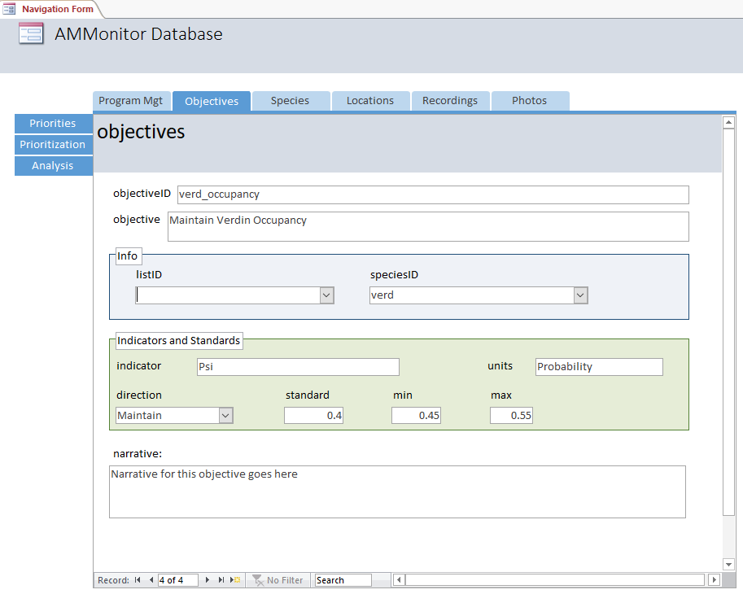

This chapter is about documenting the objectives of a monitoring effort.
Setting natural resource objectives can be very difficult, but they are
usually the primary reason a monitoring program exists. Generally
speaking, an objective identifies a vision that a person, organization,
or agency may have. Monitoring can be used to assess whether or not that
vision has been met. When an objective is not being met, it may trigger
the individual, organization, or agency to act in a way that will push
the objective towards its intended target.

Objectives can be broadly placed into two categories:

1.  **Fundamental objectives** are objectives that a decision maker
    truly values and wants to achieve \[1\]. E.g., “Increase loon
    populations.”
2.  **Means objectives** are a means to achieving the fundamental
    objectives. E.g., “Minimize lead in fishing tackle.”

Conroy and Peterson \[1\] state, "We can sort out fundamental from means
objectives by asking the questions *‘why is that important’* and *‘how
can we accomplish that’* for each objective. If our answer to ‘why is
that important’ is along the lines of ‘to achieve another (perhaps more
fundamental) objective’, then it is probably a means objective. If the
answer to ‘why is that important’ is simply ‘because that is what we
desire’ or for many regulatory agencies, ‘because that is our legal
mandate’, then it is probably a fundamental objective. Other authors
\[2\] distinguish between fundamental, means, strategic, and process
objectives.

In the book, “Structured Decision Making: A Practical Guide to
Environmental Management Choices” \[3\], Robin Gregory suggests that the
"statement of objectives can be kept pretty simple. Essentially, they
consist of the thing that matters and (usually) a verb that indicates
the desired direction of change:

1.  Increase revenues to the regional government.
2.  Reduce the probability of extinction of wild salmon.
3.  Minimize emissions of greenhouse gasses.
4.  Maximize year-round employment."

These examples include indicators (also called attributes; what exactly
will be measured, such as revenue, probability of extinction, emissions,
employment) and direction (the intended level or direction, such as
increase, decrease, minimize, maximize, or maintain). Units of measure
may also be specified.

**AMMonitor** facilitates the tracking of objectives generically, but
what is most important from the monitoring perspective is that an
objective can be quantitatively assessed through the analysis of
monitoring data, such as remotely captured acoustic data or images. As
such, example objectives may include:

1.  Maximize occupancy rate of desired species x.
2.  Minimize occupancy rate of undesired species y.
3.  Minimize human-made sounds.

Setting objectives can be difficult, and a discussion of how to set
objectives is well beyond our scope. For additional information, see
\[1–8\]. Here, we simply wish to highlight how objectives (of any type)
can be logged in the **AMMonitor** database. In Chapter 19, we will
illustrate how to use monitoring results to assess an example objective.

Create the chapter database
===========================

Here, we use `dbCreateSample()` to create a database called
“Chap5.sqlite”, which will be stored in a folder (directory) called
**database** within the **AMMonitor** main directory, which should be
your working directory in R. Recall that `dbCreateSample()` generates
all tables of an **AMMonitor** database, and then pre-populates sample
data into tables specified by the user. For the demonstration purposes
of this chapter, we will only pre-populate a few necessary tables.

    # Create a sample database for this chapter
    dbCreateSample(db.name = "Chap5.sqlite", 
                   file.path = paste0(getwd(),"/database"), 
                   tables =  c("objectives", "species", 
                               "lists", "listItems"))

    ## An AMMonitor database has been created with the name Chap5.sqlite which consists of the following tables:

    ## accounts, annotations, assessments, classifications, deployment, equipment, library, listItems, lists, locations, logs, objectives, people, photos, priorities, prioritization, recordings, schedule, scores, scriptArgs, scripts, soundscape, spatials, species, sqlite_sequence, templates, temporals

    ## 
    ## Sample data have been generated for the following tables: 
    ## lists, species, listItems, objectives

Next, we initialize a character object, **db.path**, that holds the
database’s full file path. We connect to the database with RSQLite’s
`dbConnect()` function, where we must identify the SQLite driver in the
‘drv’ argument:

    # Establish the database file path as db.path
    db.path <- paste0(getwd(), '/database/Chap5.sqlite')

    # Connect to the database
    conx <- RSQLite::dbConnect(drv = dbDriver('SQLite'), dbname = db.path)

Finally, we send a SQL statement that will enforce foreign key
constraints within the database.

    # Turn the SQLite foreign constraints on
    RSQLite::dbSendQuery(conn = conx, statement = "PRAGMA foreign_keys = ON;")

    ## <SQLiteResult>
    ##   SQL  PRAGMA foreign_keys = ON;
    ##   ROWS Fetched: 0 [complete]
    ##        Changed: 0

The Objectives Table in SQLite
==============================

We begin by viewing the structure of the **objectives** table:

    # Look at information about the objectives table
    dbTables(db.path = db.path, table = "objectives")

    ## $objectives
    ##    cid        name         type notnull dflt_value pk comment
    ## 1    0 objectiveID VARCHAR(255)       1         NA  1        
    ## 2    1      listID VARCHAR(255)       0         NA  0        
    ## 3    2   speciesID VARCHAR(255)       0         NA  0        
    ## 4    3   objective VARCHAR(255)       1         NA  0        
    ## 5    4   indicator VARCHAR(255)       0         NA  0        
    ## 6    5       units VARCHAR(255)       0         NA  0        
    ## 7    6   direction VARCHAR(255)       0         NA  0        
    ## 8    7         min         REAL       0         NA  0        
    ## 9    8         max         REAL       0         NA  0        
    ## 10   9    standard         REAL       0         NA  0        
    ## 11  10   narrative         TEXT       0         NA  0

`dbTables()` identifies the name of each column, the primary key, the
type of data stored in each column, and required column entries.

-   *objectiveID* - the table’s primary key (must be unique and less
    than 255 characters). Should be a brief identifier that is easily
    typed.
-   *listID* - a list record that is provided in the **lists** table, if
    applicable.
-   *speciesID* - a species record that is given in the **species**
    table, if applicable.
-   *objective* - the stated objective in report-ready form.
-   *indicator* - specifies what exactly will be measured.
-   *units* - specifies the units of measure.
-   *direction* - indicates the desired direction, such as increase,
    maximize, decrease, minimize, or maintain.
-   *min* - the minimum acceptable target, if applicable.
-   *max* - the maximum acceptable target, if applicable.
-   *standard* - the stated target, if applicable.
-   *narrative* - A text field that allows any number of characters to
    be stored.

This table also contains foreign keys that are linked to other database
tables, identified using the PRAGMA statement below:

    # Return foreign key information for the speciesList table
    RSQLite::dbGetQuery(conn = conx, statement = "PRAGMA foreign_key_list(objectives);")

Resulting output shows that the field *speciesID* from the table
**objectives** maps to the field *speciesID* in the table **species**.
Additionally, the field *listID* from the table **objectives** maps to
the field *listID* in the table **lists**. In both cases, the
*on\_update* column value is set to “CASCADE”, indicating that when a
primary key in the **species** or **lists** tables is changed, the
mapped keys in the **objectives** table will be automatically updated.
Also note that the *on\_delete* column value is set to “NO ACTION”,
indicating that when a primary key is deleted from the **species** or
**lists** tables, no records will be removed from the linked
**objectives** table.

Notice that the **objectives** table simply contains objectives, and
does not map objective hierarchies or identify objectives by type. The
reason is that these characterizations may change depending on context,
requiring a different approach for handling such cases (perhaps in
future versions of **AMMonitor**).

Below, we view the sample objectives.

    # Retrieve the first objective, returned as a data.frame
    objectives <- RSQLite::dbGetQuery(conn = conx, 
                                      statement = "SELECT * FROM objectives")

    # Show the  sample objective (columns 1:6)
    objectives[1:6]

Here, our sample data consists of four records, and we are displaying
the first six columns only. The first objective’s ID is simply
“midEarth”, and the objective is “Conserve native biodiversity”. The
*listID* for this objective is the list called “Middle Earth” (from the
**lists** table), which identifies all species of Middle Earth. The next
three objectives deal with specific species and their desired occupancy
rates; we have elected to set the primary keys by the species
abbreviation, followed by the word “occupancy” for the primary keys. In
each case, the *listID* is set to <NA>, the *speciesID* is linked to the
primary key in the **species** table, the indicator to be measured is
“Psi” (which is the Greek symbol *ψ*, and is commonly used to denote
“occupancy rate”), and “Probability” is the unit of measure.

Objectives are not required to be associated with a **speciesID** or
**listID**, however. For example, in some U.S. National Parks,
monitoring objectives center around maximizing characteristics of
soundscapes.

Below, we focus on a specific sample objective centered on the
[Verdin](https://www.allaboutbirds.org/guide/Verdin/id), a songbird
species of the southwestern U.S. and northern Mexico.

    # Show the sample objective (row 4; columns 1, 7:10)
    objectives[4, c(1, 7:10)]

Here, we see an objective with the *objectiveID* of “verd\_occupancy”.
Note that *direction* is set to “Maintain.” Directions are typically
“Maximize”, “Minimize”, or “Maintain” to indicate which direction the
monitoring (and management) team wishes to push the state of the Verdin
population. Here, we wish to manage such that *standard* is 0.4, but can
range between the upper (*max*) and lower (*min*) boundary of acceptable
occupancy.

The final column of the **objectives** table (not shown) stores the
objective narrative. The *narrative* field can be used to provide
additional narrative, which might, for example, include a description of
the type of analysis that may be used to assess the objective, and may
highlight the name of the **AMModels** library used to store results.

The purpose of a monitoring effort is to compare the state of the system
(e.g., Verdin occupancy rate) with a stated objective. Much later in the
book (Chapter 18: Occupancy), the Middle Earth team will be using
multi-season (dynamic) occupancy modeling approaches to make this
comparison, where the team will analyze the **AMMonitor** acoustic
monitoring data with the package RPresence \[9,10\], and will store the
results in a dedicated AMModels library. In Chapter 19 (Assessment), we
will compare the results of the occupancy analysis against Objective 3.

The Objectives Table in Access
==============================

In the **AMMonitor** Access front end, Objectives are a primary tab,
located at the top of the Navigation Form. Once selected, the tab
reveals a form linked to the **objectives** table, where each objective
is displayed singly.

<kbd>

</kbd>

> *Figure 5.1. The Objectives form is a primary tab in the Navigation
> form. Objectives may be research objectives or management objectives,
> as shown with the Verdin.*

Looking toward the bottom of the form, we see the “verd\_occupancy”
objective is to maintain Verdin populations at an occupancy rate of 0.4.
Later in the book, we will eventually pit this objective against some
analyses to gauge how well Middle Earth is doing with respect to this
objective.

Chapter Summary
===============

In this chapter, you learned about the **AMMonitor** database table that
stores objectives. Setting objectives can be very difficult, but they
are usually the reason a monitoring program exists. This may be the
hardest table to fill out in the entire SQLite database, but is perhaps
the most important.

Chapter References
==================

1. Conroy M, Peterson J. Decision making in natural resource management:
A structured, adaptive approach \[Internet\]. Wiley-Blackwell; 2013.
Available:
<http://www.wiley.com/WileyCDA/WileyTitle/productCd-0470671742.html>

2. Keeney RL. Developing objectives and attributes. In: Edwards W, Miles
RFJ, Winterfeldt D von, editors. Advances in decision analysis.
Cambridge University Press; pp. 104–128.
doi:[10.1017/cbo9780511611308.008](https://doi.org/10.1017/cbo9780511611308.008)

3. Gregory R. Structured decision making: A practical guide to
environmental management choices. New York: Wiley-Blackwell; 2012. p.
312 p.

4. Goodwin P, Wright G. Decision analysis for management judgment. John
Wiley & Sons; 2014.

5. Walters C. Adaptive management of renewable resources. New York:
Macmillan; 1986. p. 374 p.

6. Fuller AK. Decision making in natural resource management: A
structured adaptive approach. Journal of Wildlife Management. 2014;78:
175–176.

7. Williams BK. Adaptive management of natural resources-framework and
issues. Journal of Environmental Management. 2011;92: 1346–1353.

8. Runge MC. An introduction to adaptive management for threatened and
endangered species. Journal of Fish and Wildlife Management. 2011;2:
220–233.

9. Hines J. RPresence for presence: Software to estimate patch occupancy
and related parameters (version 12.10) \[Internet\]. U.S. Geological
Survey, Patuxent Wildlife Research Center; 2018. Available:
<https://www.mbr-pwrc.usgs.gov/software/presence.html>

10. Fiske IJ, Chandler RB. Unmarked: An r package for fitting
hierarchical models of wildlife occurrence and abundance. Journal of
Statistical Software. 2011;43: 1–23.
