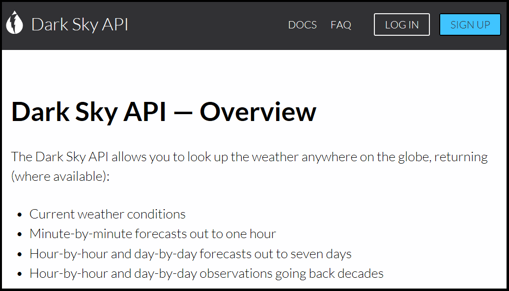

<div></div>

  - [Chapter Introduction](#chapter-introduction)
  - [The Temporals Table](#the-temporals-table)
  - [The Dark Sky API](#the-dark-sky-api)
  - [Gathering forecast data for
    tomorrow](#gathering-forecast-data-for-tomorrow)
  - [Gathering historical data](#gathering-historical-data)
  - [Querying the temporals table](#querying-the-temporals-table)
  - [Running temporalsGet() in a
    script](#running-temporalsget-in-a-script)
  - [The Temporals Table in Access](#the-temporals-table-in-access)
  - [Chapter Summary](#chapter-summary)

# Chapter Introduction

The **temporals** table tracks temporal information – such as weather
conditions and sunrise times – at monitoring locations. Temporal
information can be used as covariates in an analysis. For example,
species distribution patterns may be limited by a range of temperatures,
species behavioral patterns may be affected by moon phase, and species
detectability may be a function of weather conditions. Additionally,
temporal information can be leveraged to automatically set the recording
or photo **schedule** (Chapter 9: Schedule) and to automatically update
the **prioritization** table (Chapter 10). Thus, this chapter and the
two that follow differ from previous chapters in that the **temporals**,
**schedule**, and **prioritization** tables are all updated
automatically. Instead of using SQLite syntax or an MS Access interface,
you will use **AMMonitor** functions to directly populate these tables
in R.

In this chapter, we will use the `dbCreateSample()` function to create a
database called “Chap8.sqlite”, which will be stored in a folder
(directory) called **database** within the **AMMonitor** main directory
(which should be your working directory in R). Recall that
`dbCreateSample()` generates all tables of an **AMMonitor** database,
and then pre-populates sample data into tables specified by the user.
For demonstration purposes, we will only pre-populate a few necessary
tables below, though the **temporals** table will start out empty.

``` r
# Create a sample database for this chapter
dbCreateSample(db.name = "Chap8.sqlite", 
               file.path = paste0(getwd(),"/database"), 
               tables =  c('people', 'locations',
                           'deployment', 'equipment',
                           'accounts'))
```

    ## An AMMonitor database has been created with the name Chap8.sqlite which consists of the following tables:

    ## accounts, annotations, assessments, classifications, deployment, equipment, library, listItems, lists, locations, logs, objectives, people, photos, priorities, prioritization, recordings, schedule, scores, scriptArgs, scripts, soundscape, spatials, species, sqlite_sequence, templates, temporals

    ## 
    ## Sample data have been generated for the following tables: 
    ## accounts, people, equipment, locations, deployment

We begin by connecting to the database. First, we initialize a character
object, **db.path**, that holds the database’s full file path. Then, we
create a database connection object, **conx**, using RSQLite’s
`dbConnect()` function, where we identify the SQLite driver in the ‘drv’
argument, and our **db.path** object in the ‘dbname’ argument:

``` r
# Establish the database file path as db.path
db.path <- paste0(getwd(), '/database/Chap8.sqlite')

# Connect to the database
conx <- RSQLite::dbConnect(drv = dbDriver('SQLite'), dbname = db.path)
```

As always, we send a SQL statement that will enforce foreign key
constraints.

``` r
# Turn the SQLite foreign constraints on
RSQLite::dbSendQuery(conn = conx, statement = "PRAGMA foreign_keys = ON;")
```

    ## <SQLiteResult>
    ##   SQL  PRAGMA foreign_keys = ON;
    ##   ROWS Fetched: 0 [complete]
    ##        Changed: 0

Finally, to keep the demonstrations in this chapter concise, we will
assume that only three of our 50 example monitoring locations are
actively being monitored. That is, we will assume that the equipment
deployed at 47 locations has been retrieved. We will deactivate
deployments at monitoring locations ‘location@4’ through ‘location@50’
by sending an UPDATE query to `dbExecute()`, wherein we assign an
arbitrary date to the *dateRetrieved* column of the deployment table to
indicate that these locations are not actively monitored:

``` r
RSQLite::dbExecute(conn = conx, 
                   statement =  "UPDATE deployment 
                                 SET dateRetrieved = '2016-01-20'
                                 WHERE locationID NOT IN 
                                 ('location@1', 'location@2', 'location@3')")
```

    ## [1] 47

This action returns a ‘47’ to indicate that 47 records have applied the
action of setting *dateRetrieved* equal to ‘2016-01-20’. Next, we will
gather temporal data for the three active stations that remain.

# The Temporals Table

The **temporals** table tracks temporal data at monitoring locations.
**AMMonitor** collects weather data via the [Dark Sky
API](https://darksky.net/forecast/40.7127,-74.0059/us12/en). We will
cover the Dark Sky API later in this chapter.

We begin with a look at the **temporals** table summary information
using `dbTables()`:

``` r
# Look at information about the temporals table
dbTables(db.path = db.path, table = "temporals")
```

    ## $temporals
    ##    cid              name         type notnull        dflt_value pk comment
    ## 1    0        locationID VARCHAR(255)       1              <NA>  1        
    ## 2    1              type VARCHAR(255)       1              <NA>  2        
    ## 3    2              date VARCHAR(255)       1              <NA>  3        
    ## 4    3              time VARCHAR(255)       1              <NA>  4        
    ## 5    4              hour         REAL       0              <NA>  0        
    ## 6    5       sunriseTime VARCHAR(255)       0              <NA>  0        
    ## 7    6        sunsetTime VARCHAR(255)       0              <NA>  0        
    ## 8    7   precipIntensity         REAL       0              <NA>  0        
    ## 9    8 precipProbability         REAL       0              <NA>  0        
    ## 10   9        precipType VARCHAR(255)       0              <NA>  0        
    ## 11  10       temperature         REAL       0              <NA>  0        
    ## 12  11          dewPoint         REAL       0              <NA>  0        
    ## 13  12          humidity         REAL       0              <NA>  0        
    ## 14  13          pressure         REAL       0              <NA>  0        
    ## 15  14         windSpeed         REAL       0              <NA>  0        
    ## 16  15          windGust         REAL       0              <NA>  0        
    ## 17  16       windBearing         REAL       0              <NA>  0        
    ## 18  17        cloudCover         REAL       0              <NA>  0        
    ## 19  18           uvIndex         REAL       0              <NA>  0        
    ## 20  19        visibility         REAL       0              <NA>  0        
    ## 21  20             ozone         REAL       0              <NA>  0        
    ## 22  21         moonPhase         REAL       0              <NA>  0        
    ## 23  22    nearestStation         REAL       0              <NA>  0        
    ## 24  23             units VARCHAR(255)       0              <NA>  0        
    ## 25  24         timestamp VARCHAR(255)       1 CURRENT_TIMESTAMP  0

Notice that the **temporals** table contains 25 fields (columns) that
are a mix of mostly VARCHAR and REAL number data types. The *locationID*
specifies the monitoring location.

The *locationID*, *type*, *date* and *time* serve as primary keys (a
composite primary key), and all four are required values (*notnull* =
1). The *locationID* field maps to the *locationID* field in the
**locations** table, which serves as a foreign key, as confirmed with
the following code:

``` r
# Return foreign key information for the deployment table
RSQLite::dbGetQuery(conn = conx, statement = "PRAGMA foreign_key_list(temporals);")
```

    ##   id seq     table       from         to on_update on_delete match
    ## 1  0   0 locations locationID locationID   CASCADE NO ACTION  NONE

Here, one can see that the *locationID* field in table **locations**
maps to the *locationID* field in table **temporals**.

The **temporals** table can store both forecast data and historical
(observed) weather data. Thus, the *type* column will either contain the
word “forecast” or “historical”. The column *type* is included in the
primary key in the event that both forecast *and* historical data are
gathered for a given *locationID*, *date*, and *time*.

All other fields, such as *sunriseTime*, *temperature*, *humidity*, and
*moonPhase*, are not technically required. Depending on the weather
forecast and/or historical data available, certain locations, dates, and
times may not contain data for certain columns. For example, if there is
no precipitation during a given hour, the *precipType* column will
contain NAs.

We can use `dbGetQuery()` to send a query that will return the number of
records present in our **temporals** table in the sample **AMMonitor**
database:

``` r
RSQLite::dbGetQuery(conn = conx, statement = "SELECT COUNT(*) FROM temporals;")
```

    ##   COUNT(*)
    ## 1        0

As shown, there are no records in this table. We do not interact with
the **temporals** table the way we have with previously introduced
tables. Instead, we use the **AMMonitor** function `temporalsGet()` to
acquire data and auto-populate this table.

# The Dark Sky API

The function `temporalsGet()` uses the [Dark Sky
API](https://darksky.net/) to collect weather data. Read more about Dark
Sky’s data sources [here](https://darksky.net/dev/docs/sources).
`temporalsGet()` allows users to obtain weather information around the
world (where available) either as 24-hour forecasts or as hourly
historical observation data. Dark Sky draws from several weather data
sources, aggregating them to provide forecasts for selected locations.
Their data sources include the USA NCEP’s Canadian Meteorological Center
ensemble model (‘cmc’), the Environment and Climate Change Canada’s
Public Alert System (‘ecpa’), U.S. NOAA’s Global Forecast System
(‘gfs’), U.S. NOAA’s High-Resolution Rapid Refresh Model (‘hrrr’),
the German Meteorological Office’s icosahedral nonhydrostatic (‘icon’),
U.S. NOAA’s Integrated Surface Database (‘isd’), U.S. NOAA/ESRL’s
Meteorological Assimilation Data Ingest System (‘madis’), U.S. NOAA’s
North American Mesoscale Model (‘nam’), U.S. NOAA’s Public Alert System
(‘nwspa’), and U.S. NOAA/NCEP’s Short-Range Ensemble Forecast (‘sref’),
in addition to several non-North American [weather data and weather
forecast sources](https://darksky.net/dev/docs/sources). Not all data
sources will be available for all points on the globe.

To use `temporalsGet()` for your project, you first need to set up a
Dark Sky account as a developer by visiting their [API Development Page
(https://darksky.net/dev/docs)](https://darksky.net/dev/docs) and
clicking the Sign Up button in the upper righthand corner:

``` r
# Browse to the Dark Sky Development Page
browseURL("https://darksky.net/dev/docs")
```

<kbd>



</kbd>

> *Figure 8.1. You will need to acquire a Dark Sky API in order to
> automatically populate the temporals table.*

After providing an email address and a password, you will receive a Dark
Sky key, which is a character string along the lines of
‘d8db31f709f973f61x4d29afe0b67e93’ (merely an example; it is not a
real key). You should store this string in the **settings folder** as an
RDS file with a name of your choice.

<kbd>


</kbd>

> *Figure 8.2. The “settings” directory is a reasonable place to store
> all AMMonitor keys.*

The code below provides an example of how to save this key as an RDS
file, assuming that your working directory is the main **AMMonitor**
directory, with a folder called **settings** as a sub-directory:

``` r
saveRDS(object = 'd8db31f709f973f61x4d29afe0b67e93', 
        file = 'settings/dark-sky-key.RDS')
```

The first 1000 API calls you make per day are free. In effect, if you
are gathering forecasts for fewer than 1000 monitoring sites per day,
you will pay nothing. If you wish to gather large amounts of historical
data in one day, you will pay a fee.

# Gathering forecast data for tomorrow

The first way to use `temporalsGet()` is to acquire 24-hour forecast
data for tomorrow, which we demonstrate below. The function will output
24 records (one for each hour) for each actively monitored location (as
specified in the **deployment** table).

The `temporalsGet()` function has six arguments. First, as usual, we
point to our database by putting the **db.path** object in the ‘db.path’
argument. Second, we put the file path to our stored RDS Dark Sky key
into the ‘temporals.key’ argument. Third, we indicate the type of data
we want in the ‘type’ argument. The options are “forecast” (default), or
“historical”, and below we select “forecast”. Fourth, we set the ‘dates’
argument to NULL, which is the default action when gathering forecast
data. Fifth, the ‘locationID’ argument allows us to specify individual
locationIDs for which we want to gather temporal data. If ‘locationID’
is left as the default NULL, the function automatically gathers weather
data for all locationIDs actively monitored according to the
**deployment** table. Alternatively, a user can pass in a vector of
specific locationIDs, or indicate “all” to retrieve weather information
for all locations, regardless of whether they are actively being
monitored. Lastly, we have an argument called ‘db.insert’. Often, we may
wish to test a function before adding data to the database, and in
`temporalsGet()`, we accomplish this by setting the ‘db.insert’ argument
to FALSE. This action returns a list object for us to inspect, but
ensures that no new data are automatically added to the **temporals**
table:

``` r
# Gather forecast data, set db.insert to FALSE
# Leave dates = NULL to get 24-hr forecast for tomorrow
test_temporals <- temporalsGet(db.path = db.path,
                               temporals.key = 'settings/dark-sky-key.RDS',
                               type = 'forecast', 
                               dates = NULL,
                               locationID = NULL,
                               db.insert = FALSE)
```

    ## Powered by Dark Sky: visit https://darksky.net/poweredby/ for details

    ## Gathering temporal data for 1 out of 3 cases.

    ## Gathering temporal data for 2 out of 3 cases.

    ## Gathering temporal data for 3 out of 3 cases.

The function generates progress messages telling us that it is gathering
forecast data for all three monitoring locations in the sample database.

When finished, `temporalsGet()` returns a list object containing two
items: 1) a data.table of temporal data, and 2) a list of data sources
used for each call to the API.

``` r
# View the top level structure of the returned results
str(test_temporals, max.level = 1)
```

    ## List of 2
    ##  $ temporal.data:Classes 'data.table' and 'data.frame':  72 obs. of  25 variables:
    ##   ..- attr(*, ".internal.selfref")=<externalptr> 
    ##  $ data.sources :List of 3

Below, we view the data sources Dark Sky used to generate the forecast,
using the ‘$’ sign to access this list. Here, we look at the structure
of the list only.

``` r
# View the structure of data sources list
str(test_temporals$data.sources)
```

    ## List of 3
    ##  $ location@1:List of 4
    ##   ..$ sources        : chr [1:10] "cmc" "gfs" "hrrr" "icon" ...
    ##   ..$ date           : chr "2019-07-13"
    ##   ..$ nearest.station: num 3.83
    ##   ..$ units          : chr "us"
    ##  $ location@2:List of 4
    ##   ..$ sources        : chr [1:10] "cmc" "gfs" "hrrr" "icon" ...
    ##   ..$ date           : chr "2019-07-13"
    ##   ..$ nearest.station: num 7.41
    ##   ..$ units          : chr "us"
    ##  $ location@3:List of 4
    ##   ..$ sources        : chr [1:10] "cmc" "gfs" "hrrr" "icon" ...
    ##   ..$ date           : chr "2019-07-13"
    ##   ..$ nearest.station: num 7.52
    ##   ..$ units          : chr "us"

The **test\_temporals$data.sources** object is a list of three because
there is data source information about all three locations. Each set of
location-specific source data contains four elements. The **sources**
element provides codes for each of the data sources Dark Sky used to
generate the aggregated forecast. For example, the code ‘gfs’ stands for
NOAA’s [Global Forecast
System](https://www.ncdc.noaa.gov/data-access/model-data/model-datasets/global-forcast-system-gfs),
and ‘hrrr’ stands for NOAA’s [High Resolution Rapid
Refresh](https://rapidrefresh.noaa.gov/hrrr/) model. [All Dark Sky data
source codes are available here](https://darksky.net/dev/docs/sources).
The **date** element tells us the date for which certain sources were
used. The **nearest.station** object gives the distance, in **units**,
to the nearest weather station used. Because the units returned here are
“us”, the distance to the nearest station is given in miles.

Secondly, we can view the temporal data itself, also by using list
indexing notation ($):

``` r
# View the data, rows 1:10 and columns 1:5 
test_temporals$temporal.data[1:10, 1:5]
```

    ##     locationID     type       date                    time hour
    ##  1: location@1 forecast 2019-07-13 2019-07-13 00:00:00 PDT    0
    ##  2: location@1 forecast 2019-07-13 2019-07-13 01:00:00 PDT    1
    ##  3: location@1 forecast 2019-07-13 2019-07-13 02:00:00 PDT    2
    ##  4: location@1 forecast 2019-07-13 2019-07-13 03:00:00 PDT    3
    ##  5: location@1 forecast 2019-07-13 2019-07-13 04:00:00 PDT    4
    ##  6: location@1 forecast 2019-07-13 2019-07-13 05:00:00 PDT    5
    ##  7: location@1 forecast 2019-07-13 2019-07-13 06:00:00 PDT    6
    ##  8: location@1 forecast 2019-07-13 2019-07-13 07:00:00 PDT    7
    ##  9: location@1 forecast 2019-07-13 2019-07-13 08:00:00 PDT    8
    ## 10: location@1 forecast 2019-07-13 2019-07-13 09:00:00 PDT    9

With three active monitoring stations, this example returns 3 locations
\* 24 hours = 72 records and 25 columns, confirmed with `dim()`.

``` r
# Get the dimensions of the returned data.table
dim(test_temporals$temporal.data)
```

    ## [1] 72 25

The first 10 records of the **test\_temporals$temporal.data** object
show hourly data for location@1 starting at 12AM (or 00:00:00). The
*type* column indicates forecast data, while the *date* and *time*
columns track date and time. The *hour* column logs the hour of the day.

Many columns of temporal data are returned by this function. Below, we
view columns 7:12:

``` r
# View the data, rows 1:10 and columns 7:12
test_temporals$temporal.data[1:10, 7:12]
```

    ##                  sunsetTime precipIntensity precipProbability precipType temperature dewPoint
    ##  1: 2019-07-13 19:53:39 PDT           0.001              0.01       rain      101.26    43.54
    ##  2: 2019-07-13 19:53:39 PDT           0.000              0.00       <NA>       96.12    45.43
    ##  3: 2019-07-13 19:53:39 PDT           0.000              0.00       <NA>       94.32    45.53
    ##  4: 2019-07-13 19:53:39 PDT           0.000              0.00       <NA>       91.58    45.28
    ##  5: 2019-07-13 19:53:39 PDT           0.000              0.00       <NA>       89.22    44.84
    ##  6: 2019-07-13 19:53:39 PDT           0.000              0.00       <NA>       87.62    44.50
    ##  7: 2019-07-13 19:53:39 PDT           0.000              0.00       <NA>       88.05    44.36
    ##  8: 2019-07-13 19:53:39 PDT           0.000              0.00       <NA>       91.04    44.33
    ##  9: 2019-07-13 19:53:39 PDT           0.000              0.00       <NA>       95.34    44.59
    ## 10: 2019-07-13 19:53:39 PDT           0.000              0.00       <NA>      100.27    45.36

Sun activity is logged in the *sunriseTime* and *sunsetTime* columns. If
*precipIntensity* and *precipProbability* are 0, then *precipType* will
have an NA value (read more about Dark Sky’s precipitation probabilities
[here](https://darksky.net/dev/docs/faq#faq-data-availability-and-accuracy)).
Remaining columns track the *temperature* (in degrees Fahrenheit),
*dewPoint* (in degrees Fahrenheit), *humidity* (in relative humidity;
value between 0 and 1 inclusive), *pressure* (sea level air pressure in
millibars), *windSpeed* (in miles per hour), *windGust* (in miles per
hour), *windBearing* (wind origin direction in degrees, with true north
at 0 degrees and progressing clockwise), *cloudCover* (the percentage of
sky covered by clouds; value between 0 and 1 inclusive), *uvIndex*,
*visibility* (average visibility in miles, capped at 10 miles), *ozone*
(columnar density of total atmospheric ozone at the given time in Dobson
units), and *moonPhase* (“fractional part of the lunation number during
the given day: a value of 0 corresponds to a new moon, 0.25 to a first
quarter moon, 0.5 to a full moon, and 0.75 to a last quarter moon.
Ranges in between these represent waxing crescent, waxing gibbous,
waning gibbous, and waning crescent moons, respectively”). The
*nearestStation* column tracks the distance to the nearest weather
station identified by Dark Sky, and the *units* give the distance units
to the nearest weather station (units of ‘us’ indicate that the distance
is given in miles). Lastly, the *timestamp* column tracks the system
time on your computer at which the data were acquired.

Once we have tested the function and are satisfied that we understand
how it works, we can add the data to the database by re-running the
function with ‘db.insert’ set to TRUE. (Note that the content of the
**$data.sources** object is not added to the database.)

``` r
# Gather forecast data and add it to the database
temporals <- temporalsGet(db.path = db.path,
                          temporals.key = 'settings/dark-sky-key.RDS',
                          type = 'forecast',
                          dates = NULL,
                          locationID = NULL,
                          db.insert = TRUE)
```

Alternatively, if we were satisfied with the test output and saved it as
an object, we could simply append the **$temporal.data** list object to
the **temporals** table using `dbWriteTable()` instead of rerunning the
function.

We can verify that our data have been added to the database by using
`dbGetQuery()`, returning only a handful of columns and invoking the
term ‘LIMIT 10’ in our SQL statement to limit the returned table to the
first ten records:

``` r
# Confirm that the data has been added to the database,
# Viewing a few selected columns and the first 10 records:
RSQLite::dbGetQuery(conn = conx, 
                    statement = "SELECT locationID, type, date, 
                                  time, dewpoint, pressure, moonPhase 
                                 FROM temporals LIMIT 10") 
```

    ##    locationID     type       date                    time dewPoint pressure moonPhase
    ## 1  location@1 forecast 2019-07-13 2019-07-13 00:00:00 PDT    43.54  1005.17      0.41
    ## 2  location@1 forecast 2019-07-13 2019-07-13 01:00:00 PDT    45.43  1005.59      0.41
    ## 3  location@1 forecast 2019-07-13 2019-07-13 02:00:00 PDT    45.53  1005.68      0.41
    ## 4  location@1 forecast 2019-07-13 2019-07-13 03:00:00 PDT    45.28  1005.74      0.41
    ## 5  location@1 forecast 2019-07-13 2019-07-13 04:00:00 PDT    44.84  1005.79      0.41
    ## 6  location@1 forecast 2019-07-13 2019-07-13 05:00:00 PDT    44.50  1006.03      0.41
    ## 7  location@1 forecast 2019-07-13 2019-07-13 06:00:00 PDT    44.36  1006.64      0.41
    ## 8  location@1 forecast 2019-07-13 2019-07-13 07:00:00 PDT    44.33  1007.43      0.41
    ## 9  location@1 forecast 2019-07-13 2019-07-13 08:00:00 PDT    44.59  1007.98      0.41
    ## 10 location@1 forecast 2019-07-13 2019-07-13 09:00:00 PDT    45.36  1008.11      0.41

# Gathering historical data

The second way to use `temporalsGet()` is to gather historical data.
This time, instead of setting the ‘dates’ argument to NULL, we input a
few dates over which we want to gather data for our three sample
database locations. We can add a character vector containing as many
dates as we want to this argument, but all dates must be in the format
YYYY-mm-dd. We are mindful that **the number of dates in the vector**
times **the number of active monitoring locations in the deployment
table** will give us the number of API calls `temporalsGet()` makes to
the Dark Sky API. In this case, two dates times three active monitoring
locations equals a total of six calls to the API.

``` r
# Gather historical data, but don't add it to the database

# Set db.insert to FALSE to return the data without adding it to the database
test_temporals <- temporalsGet(db.path = db.path,
                               temporals.key = './settings/dark-sky-key.RDS',
                               type = 'historical',
                               dates = c('2016-04-01', '2016-04-02'),
                               locationID = NULL,
                               db.insert = FALSE)

# View a subset of the temporal data (rows 1:10, columns 1:6): 
test_temporals$temporal.data[1:10, 1:6]
```

    ##     locationID       type       date                    time hour             sunriseTime
    ##  1: location@1 historical 2016-04-01 2016-04-01 00:00:00 PDT    0 2016-04-01 06:28:10 PDT
    ##  2: location@1 historical 2016-04-01 2016-04-01 01:00:00 PDT    1 2016-04-01 06:28:10 PDT
    ##  3: location@1 historical 2016-04-01 2016-04-01 02:00:00 PDT    2 2016-04-01 06:28:10 PDT
    ##  4: location@1 historical 2016-04-01 2016-04-01 03:00:00 PDT    3 2016-04-01 06:28:10 PDT
    ##  5: location@1 historical 2016-04-01 2016-04-01 04:00:00 PDT    4 2016-04-01 06:28:10 PDT
    ##  6: location@1 historical 2016-04-01 2016-04-01 05:00:00 PDT    5 2016-04-01 06:28:10 PDT
    ##  7: location@1 historical 2016-04-01 2016-04-01 06:00:00 PDT    6 2016-04-01 06:28:10 PDT
    ##  8: location@1 historical 2016-04-01 2016-04-01 07:00:00 PDT    7 2016-04-01 06:28:10 PDT
    ##  9: location@1 historical 2016-04-01 2016-04-01 08:00:00 PDT    8 2016-04-01 06:28:10 PDT
    ## 10: location@1 historical 2016-04-01 2016-04-01 09:00:00 PDT    9 2016-04-01 06:28:10 PDT

The function again generates progress messages (not displayed here)
informing us it is gathering forecast data for all six location-dates.
Most of the columns are the same as for the forecast data, except that
the *type* column now indicates we that we have gathered historical
data. Some columns may contain NAs if no historical data are available
for that time period and location.

As before, once we have tested the function and are satisfied with the
results, we can add the data to the database either by binding it in
manually with `dbWriteTable()`, or by re-running the function with the
‘db.insert’ argument set to TRUE.

``` r
# If satisfied with testing, can set test = FALSE to run the function
# and add historical (observed) data directly to the database
temporals <- temporalsGet(db.path = db.path,
                          temporals.key = './settings/dark-sky-key.RDS',
                          type = 'historical',
                          dates = c('2016-04-01', '2016-04-02'),
                          locationID = NULL,
                          db.insert = TRUE)
```

# Querying the temporals table

Briefly, the **AMMonitor** function `qryTemporals()` is a simple
convenience function that returns all data from the most recent date
available in the **temporals** table. This function is used internally
within functions covered in subsequent chapters, but may also be helpful
for users who have already initialized a **conx** object connected to
the database, and who wish to avoid constructing a SQLite query to view
the most recent available **temporals** data.

``` r
# Query the temporals table
latest_temporals <- qryTemporals(conn = conx)

# Look at the first ten records of the latest_temporals object
latest_temporals[1:10,1:6]
```

    ##    locationID     type       date                    time hour             sunriseTime
    ## 1  location@1 forecast 2019-07-13 2019-07-13 00:00:00 PDT    0 2019-07-13 05:41:23 PDT
    ## 2  location@1 forecast 2019-07-13 2019-07-13 01:00:00 PDT    1 2019-07-13 05:41:23 PDT
    ## 3  location@1 forecast 2019-07-13 2019-07-13 02:00:00 PDT    2 2019-07-13 05:41:23 PDT
    ## 4  location@1 forecast 2019-07-13 2019-07-13 03:00:00 PDT    3 2019-07-13 05:41:23 PDT
    ## 5  location@1 forecast 2019-07-13 2019-07-13 04:00:00 PDT    4 2019-07-13 05:41:23 PDT
    ## 6  location@1 forecast 2019-07-13 2019-07-13 05:00:00 PDT    5 2019-07-13 05:41:23 PDT
    ## 7  location@1 forecast 2019-07-13 2019-07-13 06:00:00 PDT    6 2019-07-13 05:41:23 PDT
    ## 8  location@1 forecast 2019-07-13 2019-07-13 07:00:00 PDT    7 2019-07-13 05:41:23 PDT
    ## 9  location@1 forecast 2019-07-13 2019-07-13 08:00:00 PDT    8 2019-07-13 05:41:23 PDT
    ## 10 location@1 forecast 2019-07-13 2019-07-13 09:00:00 PDT    9 2019-07-13 05:41:23 PDT

In future chapters, the **temporals** data plays a role in optimizing
the recordings and photo schedules, and can also be used in downstream
analyses.

When finished, we disconnect from the database with the `dbDisconnect()`
function.

``` r
# Disconnect from the database
RSQLite::dbDisconnect(conx)
```

# Running temporalsGet() in a script

While the `temporalsGet()` function can be used to gather historical
temporal data associated with monitoring sites, it may be employed on a
daily basis to retrieve predicted temporal information (i.e., weather
data for the next 24 hours). To ease the process of manually running
this function each day, a monitoring team may automatically retrieve
temporal data via a “script” sourced each morning. Scripts are described
in detail in Chapter 19: Scripts.

# The Temporals Table in Access

The temporals form in the Microsoft Access front end can be accessed as
a secondary tab under the Locations tab. This is the first look at a
“Hands Off\!” form in Access. The **temporals** table is entirely
populated by the `temporalsGet()` function, so it should not be edited
by hand.

<kbd>


</kbd>

> *Figure 8.3. The temporals table is displayed in form view here. It is
> located under the primary tab, Locations.*

# Chapter Summary

In this chapter, we reviewed how to use the **AMMonitor**
`temporalsGet()` function to gather temporal and weather data for active
study locations in a monitoring program. `temporalsGet()` operates via
the Dark Sky API, and offers options for acquiring either forecast or
historical data. This function also offers a ‘db.insert’ argument that
allows users to test the function before adding data directly to the
database’s **temporals** table. Temporal data will be used in future
chapters, starting with Chapter 9.
