The **schedule** table may be used by smartphone monitoring programs.
This table links each piece of equipment (e.g., a smartphone with an
**account**) to its associated Google Calendar, and contains entries
specifying when audio recordings or photos should be collected. The
**schedule** table stores both past and future calendar entries.
**AMMonitor** functions create future calendar entries that can be
pushed to the Google cloud on a daily basis via a Google API key. When
the phone connects to a cellular or Wi-Fi network, its calendar is
synced with Google Calendar. Calendar entries are then dispatched to the
smartphone’s camera or audio apps, providing instructions on when to
collect data (see xxx in prep for full details).

Historical calendar entries stored in the **schedule** table are useful
for comparing scheduled events with the recordings or photos delivered
to the **AMMonitor** cloud-based storage. **AMMonitor** functions can
compare expected vs. actual deliveries to identify potential equipment
failure. We describe these functions in Chapter 11: Recordings.

As with the **temporals** table in the previous chapter, we interact
with the **schedule** table via specific **AMMonitor** functions rather
than with SQLite syntax. In this chapter, we review two ways to generate
schedules: at times staggered around sunrise and sunset using the
`scheduleSun()` function, or at user-specified times of day with the
`scheduleFixed()` function. In the next chapter, **prioritization**, we
describe a third way to set the schedule using an optimization scheme
based on target species monitoring priorities \[1\].

We begin by using the `dbCreateSample()` function to create a database
called “Chap9.sqlite”, which will be stored in a folder (directory)
called “database” within the **AMMonitor** main directory, which should
be your working directory in R. Recall that `dbCreateSample()` generates
all tables of an **AMMonitor** database, and then pre-populates sample
data into tables specified by the user. For demonstration purposes, we
will only pre-populate a few necessary tables below:

    # Create a sample database for this chapter
    dbCreateSample(db.name = "Chap9.sqlite", 
                   file.path = paste0(getwd(),"/database"), 
                   tables =  c('locations', 'deployment',
                               'equipment', 'schedule',
                               'accounts', 'people'))

    ## An AMMonitor database has been created with the name Chap9.sqlite which consists of the following tables:

    ## accounts, annotations, assessments, classifications, deployment, equipment, library, listItems, lists, locations, logs, objectives, people, photos, priorities, prioritization, recordings, schedule, scores, scriptArgs, scripts, soundscape, spatials, species, sqlite_sequence, templates, temporals

    ## 
    ## Sample data have been generated for the following tables: 
    ## accounts, people, equipment, locations, deployment, schedule

We begin by connecting to the database. First, we initialize a character
object, **db.path**, that holds the database’s full file path. Then, we
create a database connection object, **conx**, using RSQLite’s
`dbConnect()` function, where we identify the SQLite driver in the ‘drv’
argument, and our **db.path** object in the ‘dbname’ argument:

    # Establish the database file path as db.path
    db.path <- paste0(getwd(), '/database/Chap9.sqlite')

    # Connect to the database
    conx <- RSQLite::dbConnect(drv = dbDriver('SQLite'), dbname = db.path)

Finally, we send a SQL statement that will enforce foreign key
constraints.

    # Turn the SQLite foreign constraints on
    RSQLite::dbSendQuery(conn = conx, statement = 
                  "PRAGMA foreign_keys = ON;"
              )

    ## <SQLiteResult>
    ##   SQL  PRAGMA foreign_keys = ON;
    ##   ROWS Fetched: 0 [complete]
    ##        Changed: 0

Introduction to the Schedule Table
==================================

The **schedule** table tracks monitoring events assigned to smartphone
monitoring equipment. Scheduled events are synced to Google Calendar,
and include acoustic recordings, timed photographs, or motion-triggered
photographs that can be used for natural resource monitoring.

If you use Google Calendar, the fields in the **schedule** table will
look familiar:

<kbd>

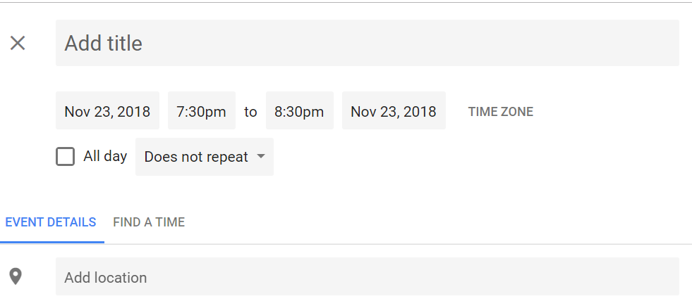

</kbd>

> *Figure 9.1. Adding an event in Google Calendar brings up this
> dialogue box.*

Each phone’s Google Calendar will be populated with information stored
in the **schedule** table. Below, we use `dbTables()` to view the
metadata for this table.

    # Look at information about the schedule table
    dbTables(db.path = db.path, table = "schedule")

    ## $schedule
    ##    cid        name         type notnull dflt_value pk comment
    ## 1    0 equipmentID VARCHAR(255)       1         NA  1        
    ## 2    1  locationID VARCHAR(255)       1         NA  2        
    ## 3    2     subject VARCHAR(255)       1         NA  3        
    ## 4    3   startDate VARCHAR(255)       1         NA  4        
    ## 5    4   startTime VARCHAR(255)       1         NA  5        
    ## 6    5     endDate VARCHAR(255)       0         NA  0        
    ## 7    6     endTime VARCHAR(255)       0         NA  0        
    ## 8    7 allDayEvent VARCHAR(255)       0         NA  0        
    ## 9    8 description VARCHAR(255)       0         NA  0        
    ## 10   9     private VARCHAR(255)       0         NA  0        
    ## 11  10          tz VARCHAR(255)       0         NA  0

The **schedule** table contains 11 fields. The *equipmentID*,
*locationID*, *subject*, *startDate*, and *startTime* together serve as
the primary key (a composite key). These fields, in addition to most of
the remaining fields – *endDate*, *endTime*, *allDayEvent*,
*description*, and *private* – contain information required by the
Google Calendar API, and will be generated automatically based on user
input fed to the **AMMonitor** functions covered in this chapter. The
*subject* field can be set to ‘recording’, ‘photo’, or ‘motion’, and is
the vehicle that identifies what type of data should be collected by the
smartphone: recording will capture an audio recording, photo will
capture a timed photograph, and motion will enable motion-triggered
photos, similar to a camera trap. (The *subject* field can also be used
to schedule mobile data mode, in which the phones connect to mobile data
and sync with cloud-based storage; see xxx in prep for details). Lastly,
the *tz* column records the timezone associated with a particular
scheduled event, based on the location of deployed equipment.

We use `dbGetQuery()` to retrieve the records present in our sample
**schedule** table:

    # Retrieve the first 5 sample records stored in the schedule table
    schedule <- RSQLite::dbGetQuery(conn = conx, 
                           statement = "SELECT * 
                                        FROM schedule
                                        LIMIT 5;")

    # Display a few selected columns
    schedule[, c(1:7, 10)]

    ##   equipmentID locationID   subject  startDate startTime    endDate  endTime private
    ## 1     equip@3 location@1 recording 2016-03-12  07:00:00 2016-03-12 07:01:00   False
    ## 2     equip@3 location@1 recording 2016-03-13  07:00:00 2016-03-13 07:01:00   False
    ## 3     equip@4 location@2 recording 2016-03-04  06:00:00 2016-03-04 06:01:00   False
    ## 4     equip@4 location@2 recording 2016-03-26  07:00:00 2016-03-26 07:01:00   False
    ## 5     equip@5 location@3 recording 2016-03-21  07:30:00 2016-03-21 07:31:00   False

Observe that the *equipmentID* (which is linked to a specific Google
account via the **accounts** table) is assigned to each record. The
*locationID* is automatically populated based on the current deployment
for that equipment, based on the **deployment** table.

Importantly, the *equipmentID* field maps to the *equipmentID* field in
the **equipment** table, and the *locationID* field maps to the
*locationID* field in the **locations** table. Thus, both fields serve
as foreign keys, which we confirm with the following code:

    # Return foreign key information for the deployment table
    RSQLite::dbGetQuery(conn = conx, statement = "PRAGMA foreign_key_list(schedule);")

    ##   id seq     table        from          to on_update on_delete match
    ## 1  0   0 locations  locationID  locationID   CASCADE NO ACTION  NONE
    ## 2  1   0 equipment equipmentID equipmentID   CASCADE NO ACTION  NONE

Note that if the primary key entries in the **equipment** or
**locations** tables are updated, changes will cascade to the
**schedule** table as well.

Setting a sun-based sampling schedule with scheduleSun()
========================================================

Sun-based sampling allows us to schedule monitoring events that are
automatically staggered around sunrise and/or sunset at actively
monitored locations. To set a sun-based schedule, we use the
**AMMonitor** function `scheduleSun()`. This function was inspired by
[Hillary Parker’s blog
post](https://hilaryparker.com/2014/05/27/sunsets-in-google-calendar-using-r/)
on how to create a sunset-based calendar formatted for Google.

The `scheduleSun()` function has multiple arguments, many of which
contain default values; some are not required:

    # View scheduleSun's arguments and defaults
    args(scheduleSun)

    ## function (db.path = NULL, locationID, calendar.key = NULL, start.date, 
    ##     end.date, subject = "recording", duration = 1, n.rise = 5, 
    ##     n.set = 5, spacing = 10, playback.file = NULL, lat = NULL, 
    ##     long = NULL, timezone = NULL, db.insert = FALSE, google.push = FALSE) 
    ## NULL

As usual, the ‘db.path’ argument will take our **db.path** object, which
is the full file path to our database. Next, the ‘locationID’ argument
allows us to input a string of locationIDs for which we want to generate
sun-based calendars. In this argument, we want to make sure that the
string of locationIDs we input actually matches locationIDs present in
the **locations** table, and that these locations are currently being
actively monitoring with a piece of equipment in the **deployment**
table. The third argument is ‘calendar.key’, where we can specify a
Google API service token (discussed later). Below, we set ‘calendar.key’
to NULL to start out by testing the function. In the ‘subject’ argument,
we indicate that this scheduled event will be a “recording”. The
‘start.date’ and ‘end.date’ arguments allow us to set the limits of the
calendar (inclusive) and must be characters in YYYY-mm-dd format. The
‘duration’ argument is a scalar integer for specifying the recording
length in minutes; below, we set a ‘duration’ of 3 to indicate that each
recording should be three minutes long. In ‘n.rise’, we specify the
number of recording events that should be staggered around sunrise;
below, we’ve chosen a value of 3. In ‘n.set’, we specify the number of
recording events that should be staggered around sunset; below we’ve
chosen a value of 2. The ‘spacing’ argument lets us specify the number
of minutes providing space between the end of one recording and the
start of the next. In a Wi-Fi or cellular-based monitoring program, we
require at least one minute of spacing between recordings to allow the
smartphone’s internal operations to keep up with the scheduled events.
We set the ‘db.insert’ and ‘google.push’ options to FALSE to test the
function without adding the resulting schedule to the database, and
without pushing any events to Google Calendar:

    # ------------------------------------------------------------
    # Example 1: If argument 'db.insert' and 'google.push' == FALSE, 
    # schedules are created and returned to the user as a data.table 
    # for inspection. The schedule is not added to the database, and 
    # is not pushed to Google Calendar. 
    # A calendar.key to connect to Google is not needed.
    # ------------------------------------------------------------

    scheduleSun(db.path = db.path,
                locationID = c('location@1', 'location@2'),
                calendar.key = NULL,
                subject = 'recording', 
                start.date = '2018-06-01',
                end.date = '2018-06-02',
                duration = 2,
                n.rise = 3,
                n.set = 2,
                spacing = 1,
                db.insert = FALSE,
                google.push = FALSE)

    ##     equipmentID locationID   subject  startDate startTime    endDate  endTime allDayEvent  description private                  tz
    ##  1:     equip@3 location@1 recording 2018-06-01  05:27:00 2018-06-01 05:29:00       False Sun Calendar   False America/Los_Angeles
    ##  2:     equip@3 location@1 recording 2018-06-01  05:30:00 2018-06-01 05:32:00       False Sun Calendar   False America/Los_Angeles
    ##  3:     equip@3 location@1 recording 2018-06-01  05:33:00 2018-06-01 05:35:00       False Sun Calendar   False America/Los_Angeles
    ##  4:     equip@3 location@1 recording 2018-06-01  19:43:00 2018-06-01 19:45:00       False Sun Calendar   False America/Los_Angeles
    ##  5:     equip@3 location@1 recording 2018-06-01  19:46:00 2018-06-01 19:48:00       False Sun Calendar   False America/Los_Angeles
    ##  6:     equip@3 location@1 recording 2018-06-02  05:27:00 2018-06-02 05:29:00       False Sun Calendar   False America/Los_Angeles
    ##  7:     equip@3 location@1 recording 2018-06-02  05:30:00 2018-06-02 05:32:00       False Sun Calendar   False America/Los_Angeles
    ##  8:     equip@3 location@1 recording 2018-06-02  05:33:00 2018-06-02 05:35:00       False Sun Calendar   False America/Los_Angeles
    ##  9:     equip@3 location@1 recording 2018-06-02  19:44:00 2018-06-02 19:46:00       False Sun Calendar   False America/Los_Angeles
    ## 10:     equip@3 location@1 recording 2018-06-02  19:47:00 2018-06-02 19:49:00       False Sun Calendar   False America/Los_Angeles
    ## 11:     equip@4 location@2 recording 2018-06-01  05:26:00 2018-06-01 05:28:00       False Sun Calendar   False America/Los_Angeles
    ## 12:     equip@4 location@2 recording 2018-06-01  05:29:00 2018-06-01 05:31:00       False Sun Calendar   False America/Los_Angeles
    ## 13:     equip@4 location@2 recording 2018-06-01  05:32:00 2018-06-01 05:34:00       False Sun Calendar   False America/Los_Angeles
    ## 14:     equip@4 location@2 recording 2018-06-01  19:42:00 2018-06-01 19:44:00       False Sun Calendar   False America/Los_Angeles
    ## 15:     equip@4 location@2 recording 2018-06-01  19:45:00 2018-06-01 19:47:00       False Sun Calendar   False America/Los_Angeles
    ## 16:     equip@4 location@2 recording 2018-06-02  05:26:00 2018-06-02 05:28:00       False Sun Calendar   False America/Los_Angeles
    ## 17:     equip@4 location@2 recording 2018-06-02  05:29:00 2018-06-02 05:31:00       False Sun Calendar   False America/Los_Angeles
    ## 18:     equip@4 location@2 recording 2018-06-02  05:32:00 2018-06-02 05:34:00       False Sun Calendar   False America/Los_Angeles
    ## 19:     equip@4 location@2 recording 2018-06-02  19:43:00 2018-06-02 19:45:00       False Sun Calendar   False America/Los_Angeles
    ## 20:     equip@4 location@2 recording 2018-06-02  19:46:00 2018-06-02 19:48:00       False Sun Calendar   False America/Los_Angeles

In the output, we see that `scheduleSun()` has automatically populated
the subject field with the word ‘recording’. It has tracked our start
and end dates as well as start and end times according to the user
inputs we provided. Users can experiment with re-running this function
using different inputs for ‘duration’, ‘n.rise’, ‘n.set’, and ‘spacing’
to observe how the function behaves.

Once we feel comfortable with the function outputs, we can set the
arguments ‘db.insert’ and ‘google.push’ to TRUE to create schedules, add
them to the database, and finally push them to Google Calendar.

In order to successfully push to Google Calendar, we need to provide a
file.path to the ‘calendar.key’, which we will discuss below.

    # ------------------------------------------------------------
    # Example 2: If argument 'db.insert' = TRUE and google.push = 'TRUE',
    # schedules are created and returned to the user as a
    # data.table, added to the database, and are pushed to
    # Google Calendar. A calendar.key is required.
    # ------------------------------------------------------------  

    scheduleSun(db.path = db.path,
                locationID = c('location@1', 'location@2'),
                calendar.key = 'settings/calendar-10b0fdaac306.json',
                subject = 'recording',
                start.date = '2018-06-01',
                end.date = '2018-06-02',
                duration = 2,
                n.rise = 3, 
                n.set = 2, 
                spacing = 1,
                db.insert = TRUE,
                google.push = TRUE)

`scheduleSun()` returns status messages (not shown) informing us as to
whether events were successfully uploaded to the Google Calendar and
added to the database for each monitoring location. It also returns a
data.table of the information that was added to the database.

If we change our minds about the events we have added to the Google
Calendar, we can delete them using the function `scheduleDelete()`. In
addition to the ‘db.path’ object and the service token ‘calendar.key’,
`scheduleDelete()` requires us to identify the locations and date ranges
(inclusive) for which events should be eliminated from the calendar:

    # Delete events from the Google Calendar itself:
    scheduleDelete(db.path = db.path,
                   locationID = c('location@1', 'location@2'),
                   calendar.key = 'settings/calendar-10b0fdaac306.json',
                   start.date = '2018-06-01',
                   end.date = '2018-06-02')

`scheduleDelete()` will yield status messages to inform us that events
were successfully deleted.

One last option with the `scheduleSun()` function is the capacity to
create a sun-based calendar without any database at all. In this case,
users can set the ‘db.path’ argument to NULL. We pass our desired inputs
to the ‘start.date’, ‘end.date’, ‘duration’, ‘n.rise’, ‘n.set’, and
‘spacing’ arguments just as we did in the previous examples. However, if
we aren’t using a database, we have to provide some location names of
our choice in the ‘locationID’ argument (this input is required by
Google Calendar), as well as latitude and longitude vectors of the same
length as the ‘locationID’ vector. We also need to identify the
‘timezone’ argument as an [Olson names-formatted time
zone](https://en.wikipedia.org/wiki/List_of_tz_database_time_zones#List).
We set ‘db.insert’ and ‘google.push’ to FALSE since we aren’t working
with a database.

    # ------------------------------------------------------------
    # Example 3: Users can create a sun-based calendar independent
    # of the database by ignoring the db.path argument and instead
    # using the optional lat, long, and timezone arguments.
    # ------------------------------------------------------------

    scheduleSun(locationID = c('one_place', 'another_place'),
                start.date = '2018-06-01',
                end.date = '2018-06-02',
                duration = 1,
                n.rise = 2,
                n.set = 1,
                spacing = 4,
                lat = c(44.475856, 43.234555),
                long = c(-73.195142, -72.103589), 
                timezone = 'America/New_york',
                db.insert = FALSE,
                google.push = FALSE)

    ##       Subject Start Date Start Time   End Date End Time All Day Event  Description      Location Private
    ##  1: recording 2018-06-01   05:08:00 2018-06-01 05:09:00         False Sun Calendar     one_place   False
    ##  2: recording 2018-06-01   05:13:00 2018-06-01 05:14:00         False Sun Calendar     one_place   False
    ##  3: recording 2018-06-01   20:30:00 2018-06-01 20:31:00         False Sun Calendar     one_place   False
    ##  4: recording 2018-06-02   05:08:00 2018-06-02 05:09:00         False Sun Calendar     one_place   False
    ##  5: recording 2018-06-02   05:13:00 2018-06-02 05:14:00         False Sun Calendar     one_place   False
    ##  6: recording 2018-06-02   20:31:00 2018-06-02 20:32:00         False Sun Calendar     one_place   False
    ##  7: recording 2018-06-01   05:08:00 2018-06-01 05:09:00         False Sun Calendar another_place   False
    ##  8: recording 2018-06-01   05:13:00 2018-06-01 05:14:00         False Sun Calendar another_place   False
    ##  9: recording 2018-06-01   20:22:00 2018-06-01 20:23:00         False Sun Calendar another_place   False
    ## 10: recording 2018-06-02   05:08:00 2018-06-02 05:09:00         False Sun Calendar another_place   False
    ## 11: recording 2018-06-02   05:13:00 2018-06-02 05:14:00         False Sun Calendar another_place   False
    ## 12: recording 2018-06-02   20:23:00 2018-06-02 20:24:00         False Sun Calendar another_place   False

In the third example, the field names on the returned data.table object
look slightly different from those returned by a call to `scheduleSun()`
when working with the database. There are no *locationID* or
*equipmentID* columns because we are not linked with a database, and the
column names are formatted for direct use with the Google Calendar API
(e.g., “Start Date” instead of “startDate”, “Location” instead of
“locationID”). If desired, we could save this output to an R object,
write it to a CSV, and manually load it into a Google Calendar ourselves
(or apply it to other uses).

Setting a fixed sampling schedule with scheduleFixed()
======================================================

Fixed sampling allows us to schedule audio recording events at the
precise times we want to sample. To set a fixed schedule, we use the
function `scheduleFixed()`.

The arguments to `scheduleFixed()` are similar to `scheduleSun()`,
except that the sun-based arguments disappear, and we instead have a
‘sampling.times’ argument that we use to feed fixed sampling times into
the function. As usual, the ‘db.path’ argument will take our **db.path**
object, which has stored the full file path to our database. Next, the
‘locationID’ argument allows us to input a string of locationIDs for
which we want to generate fixed calendars. In this argument, since we
are using the database, we need to make sure that the string of
locationIDs we input actually matches locationIDs present in the
**locations** table, and that these locations are currently being
actively monitoring with a piece of equipment in the **deployment**
table. The third argument is ‘calendar.key’, where we can specify a
Google API service token we generated (see below). For now, we set this
argument to NULL since we begin with a test of the function. In the
‘subject’ argument, we indicate that the event should be a “recording”.
The ‘start.date’ and ‘end.date’ arguments allow us to set the limits of
the calendar (inclusive) and must be characters in YYYY-mm-dd format.
For the ‘sampling.times’ argument, our character vector of sampling
times must be input in hh:mm:ss format using a 24-hour calendar (e.g.,
we use 20:00:00 to indicate a sampling time at 8pm, rather than
08:00:00, which would indicate a sampling time at 8am). The ‘duration’
function again specifies how long the recording should be in minutes.
Lastly, we set ‘db.insert’ and ‘google.push’ to FALSE to test out the
function without adding the resulting schedule to the database, or
pushing events to Google Calendar:

    # ------------------------------------------------------------
    # Example 1: If argument 'db.insert' and 'google.push' == FALSE, 
    # schedules are created and returned to the user as a data.table 
    # for inspection. The schedule is not added to the database, and 
    # is not pushed to Google Calendar. 
    # A calendar.key to connect to Google is not needed.
    # ------------------------------------------------------------

    scheduleFixed(db.path = db.path,
                  locationID = c('location@1', 'location@2'),
                  calendar.key = NULL,
                  subject = 'recording', 
                  start.date = '2018-06-01',
                  end.date = '2018-06-02',
                  sampling.times = c('06:00:00', '06:30:00', '20:00:00'),
                  duration = 1, 
                  db.insert = FALSE,
                  google.push = FALSE)

    ##     equipmentID locationID   subject  startDate startTime    endDate  endTime allDayEvent    description private                  tz
    ##  1:     equip@3 location@1 recording 2018-06-01  06:00:00 2018-06-01 06:01:00       False Fixed Calendar   False America/Los_Angeles
    ##  2:     equip@3 location@1 recording 2018-06-01  06:30:00 2018-06-01 06:31:00       False Fixed Calendar   False America/Los_Angeles
    ##  3:     equip@3 location@1 recording 2018-06-01  20:00:00 2018-06-01 20:01:00       False Fixed Calendar   False America/Los_Angeles
    ##  4:     equip@3 location@1 recording 2018-06-02  06:00:00 2018-06-02 06:01:00       False Fixed Calendar   False America/Los_Angeles
    ##  5:     equip@3 location@1 recording 2018-06-02  06:30:00 2018-06-02 06:31:00       False Fixed Calendar   False America/Los_Angeles
    ##  6:     equip@3 location@1 recording 2018-06-02  20:00:00 2018-06-02 20:01:00       False Fixed Calendar   False America/Los_Angeles
    ##  7:     equip@4 location@2 recording 2018-06-01  06:00:00 2018-06-01 06:01:00       False Fixed Calendar   False America/Los_Angeles
    ##  8:     equip@4 location@2 recording 2018-06-01  06:30:00 2018-06-01 06:31:00       False Fixed Calendar   False America/Los_Angeles
    ##  9:     equip@4 location@2 recording 2018-06-01  20:00:00 2018-06-01 20:01:00       False Fixed Calendar   False America/Los_Angeles
    ## 10:     equip@4 location@2 recording 2018-06-02  06:00:00 2018-06-02 06:01:00       False Fixed Calendar   False America/Los_Angeles
    ## 11:     equip@4 location@2 recording 2018-06-02  06:30:00 2018-06-02 06:31:00       False Fixed Calendar   False America/Los_Angeles
    ## 12:     equip@4 location@2 recording 2018-06-02  20:00:00 2018-06-02 20:01:00       False Fixed Calendar   False America/Los_Angeles

As before, once we are satisfied with our tests of `scheduleFixed()`, we
can set the arguments ‘db.insert’ and ‘google.push’ to TRUE to create
schedules, add them to the database, and push them to Google Calendar.

    # ------------------------------------------------------------
    # Example 2: If argument 'db.insert' = TRUE and google.push = 'TRUE',
    # schedules are created and returned to the user as a
    # data.table, added to the database, and pushed to
    # Google Calendar. A calendar.key is required.
    # ------------------------------------------------------------           

    scheduleFixed(db.path = db.path,
                  locationID = c('location@1', 'location@2'),
                  calendar.key = './settings/calendar-10b0fdaac306.json',
                  subject = 'recording', 
                  start.date = '2018-06-01',
                  end.date = '2018-06-02',
                  sampling.times = c('06:00:00', '06:30:00', '20:00:00'),
                  duration = 1, 
                  db.insert = TRUE,
                  google.push = TRUE)

`scheduleFixed()` will provide status messages informing us whether
events were successfully uploaded to the Google Calendar and added to
the database for each monitoring location. It also returns a data.table
of the information that was added to the database.

As before, if we change our minds about the fixed events we have added
to the Google Calendar, we can delete them using `scheduleDelete()`. In
addition to the db.path object and the service token calendar.key,
`scheduleDelete()` requires us to identify the locations and date ranges
(inclusive) for which events should be eliminated from the calendar:

    # Delete events from the Google Calendar itself:
    scheduleDelete(db.path = db.path,
                   locationID = c('location@1', 'location@2'),
                   calendar.key = './settings/calendar-10b0fdaac306.json',
                   start.date = '2018-06-01',
                   end.date = '2018-06-02') 

`scheduleDelete()` yields status messages (not shown) confirming that
events were successfully deleted.

One last option with the `scheduleFixed()` function is the capacity to
create a fixed calendar without any database at all. In this case, users
can ignore the ‘db.path’ argument. We pass our desired inputs to the
‘start.date’, ‘end.date’, ‘sampling.times’, and ‘duration’ arguments
just as we did in the previous examples. However, since we aren’t using
a database, we have to provide some location names of our choice in the
‘locationID’ argument (required by Google Calendar), as well as latitude
and longitude vectors of the same length as the ‘locationID’ vector. We
also need to identify the ‘timezone’ as an [Olson names-formatted time
zone](https://en.wikipedia.org/wiki/List_of_tz_database_time_zones#List).
We set ‘db.insert’ and ‘google.push’ to FALSE since we aren’t working
with a database.

    # ------------------------------------------------------------
    # Example 3: Users can create a sun-based calendar independent 
    # of the database by ignoring the db.path argument and instead 
    # using the optional lat, long, and timezone arguments. 
    # ------------------------------------------------------------   

    scheduleFixed(locationID = 'mylocation', 
                  start.date = '2018-06-01',
                  end.date = '2018-06-02', 
                  sampling.times = c('06:00:00', '06:30:00', '20:00:00'),
                  duration = 1, 
                  lat = 33.6178, 
                  long = -114.5883, 
                  timezone = 'America/Los_angeles',
                  db.insert = FALSE, 
                  google.push = FALSE)

    ##      Subject Start Date Start Time   End Date End Time All Day Event    Description   Location Private
    ## 1: recording 2018-06-01   06:00:00 2018-06-01 06:01:00         False Fixed Calendar mylocation   False
    ## 2: recording 2018-06-01   06:30:00 2018-06-01 06:31:00         False Fixed Calendar mylocation   False
    ## 3: recording 2018-06-01   20:00:00 2018-06-01 20:01:00         False Fixed Calendar mylocation   False
    ## 4: recording 2018-06-02   06:00:00 2018-06-02 06:01:00         False Fixed Calendar mylocation   False
    ## 5: recording 2018-06-02   06:30:00 2018-06-02 06:31:00         False Fixed Calendar mylocation   False
    ## 6: recording 2018-06-02   20:00:00 2018-06-02 20:01:00         False Fixed Calendar mylocation   False

Once again, the field names on the returned data.table object look
slightly different from those returned by a call to `scheduleFixed()`
when working with the database. There are no *locationID* or
*equipmentID* columns because we are not linked with a database, and the
column names are formatted for direct use with the Google Calendar API
(e.g., “Start Date” instead of “startDate”, “Location” instead of
“locationID”). If desired, we could save this output to an R object,
write it to a CSV, and manually load it into a Google Calendar ourselves
(or apply it to other uses).

Working with the Google Calendar API
====================================

As mentioned in Chapter 7: Equipment, you should have one primary Google
account which is not connected to a piece of monitoring equipment,
through which you will manage the Google Calendar API described below.
The primary Google account will also be used to manage the Dropbox API
covered in Chapter 11: Recordings. Meanwhile, each piece of
smartphone-based monitoring equipment will have its own Google account
independent of the primary account.

To illustrate, we begin by viewing the first few records of the
**accounts** table:

    # Retrieve sample data stored in the accounts table
    accounts <- RSQLite::dbGetQuery(conn = conx,
                           statement = "SELECT * 
                                        FROM accounts;")

    # Display the first 10 records and a few selected columns
    accounts[1:10, c(1:4,8)]

    ##      accountID    type primaryAccount login                 email
    ## 1  midEarthMgt  Google              1  <NA> midEarthMgt@gmail.com
    ## 2      dropbox Dropbox              0  <NA>                  <NA>
    ## 3      darksky Darksky              0  <NA>                  <NA>
    ## 4    midEarth1  Google              0  <NA>   midEarth1@gmail.com
    ## 5    midEarth2  Google              0  <NA>   midEarth2@gmail.com
    ## 6    midEarth3  Google              0  <NA>   midEarth3@gmail.com
    ## 7    midEarth4  Google              0  <NA>   midEarth4@gmail.com
    ## 8    midEarth5  Google              0  <NA>   midEarth5@gmail.com
    ## 9    midEarth6  Google              0  <NA>   midEarth6@gmail.com
    ## 10   midEarth7  Google              0  <NA>   midEarth7@gmail.com

Notice that several Google accounts have been created for
smartphone-based monitoring, and one Google account, “midEarthMgt”, is
designated as the primary Account (‘primaryAccount’ = 1). The remaining
Google accounts are secondary accounts.

To send monitoring schedules directly to a Google Calendar using
**AMMonitor**, you must first complete two steps: 1) set up a Google API
service account that is associated with the primary management account,
and 2) share the main Google Calendar of each smartphone device with
this service account.

Begin by navigating to the Google API development dashboard at:
<https://console.developers.google.com/apis/api/calendar/overview>. This
link will take you to any Google account you are currently logged into,
**so make sure you are logged into the primary Google account connected
to a smartphone used in your monitoring program.**

Step 1: Setting up a Google API Service Account
-----------------------------------------------

1.  Once you have logged into your principal smartphone monitoring
    account and opened
    <https://console.developers.google.com/apis/api/calendar/overview>,
    you should accept any welcome pop-ups and Terms of Service
    notifications. Then, you will see a Google API Developer’s screen
    like the one below. Click “Enable”.

<kbd>

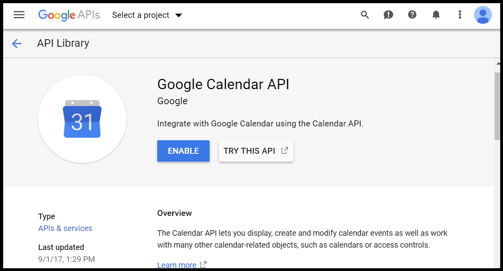

</kbd>

> *Figure 9.2. Log into your main Google account, and then enable the
> calendar API.*

1.  On the left-hand tab, select “Credentials”, and then “Create”.

<kbd>

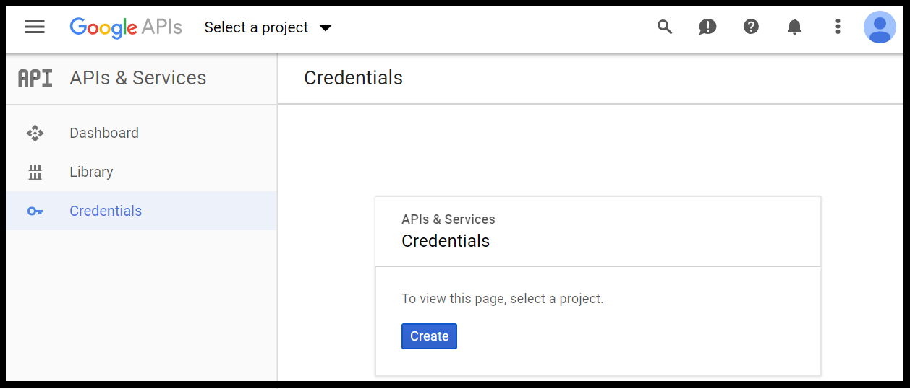

</kbd>

> *Figure 9.3. Create credentials.*

1.  You will arrive at a new project landing page that looks like the
    one below. Choose a project name, then click “Create”.

<kbd>

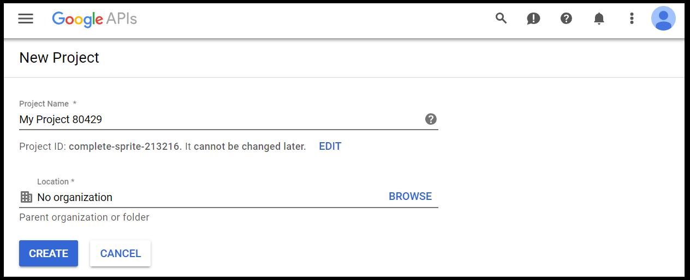

</kbd>

> *Figure 9.4. Give your project name something meaningful.*

1.  Click the blue “Create credentials” button, which will bring up a
    drop-down menu of options as shown below. Select the “Service
    Account Key” option.

<kbd>

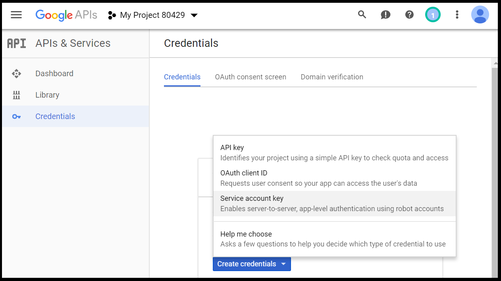

</kbd>

> *Figure 9.5. Select the “Service account key” option.*

1.  Finally, you will arrive at the page that allows you to create a
    service account key. Under “Service account”, select the “New
    service account” option. Create a name of your choosing in the
    “Service account name” field (this will also auto-populate the
    “Service account ID” field). Below, our demonstration service
    account is named
    ‘AMMonitor@complete-sprite-213216.iam.gserviceaccount.com’. (COPY
    THIS SERVICE ACCOUNT NAME onto a Sticky Note or notebook for
    safekeeping – you will need it later on in Step 2.) In the “Role”
    dropdown menu, choose Project &gt; Owner. Lastly, for “Key type”,
    make sure that the JSON option is selected. Your screen should look
    something like the one below (though be sure to choose a Service
    account name meaningful to you). When finished, click “Create”.

<kbd>

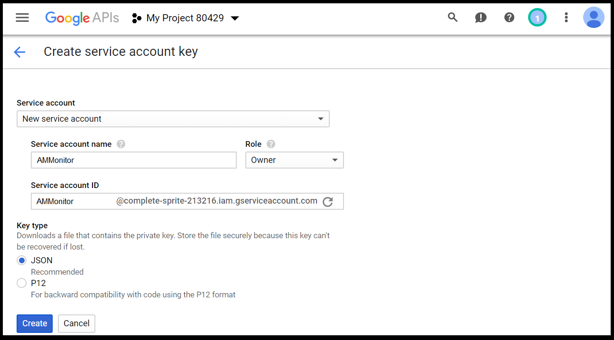

</kbd>

> *Figure 9.6. Finalize your service account.*

1.  A new dialogue box will prompt an automatic download of the JSON
    key. On a PC running Windows 10, you will experience a download of
    the JSON file and a pop up prompting you to store the file in a
    folder of your choosing. You should navigate to the **settings**
    folder in your monitoring project directory, and store the file
    there. This process may vary on different operating systems.
    Incidentally, the **settings** folder also holds our dark-sky key
    from Chapter 8: Temporals.

<kbd>

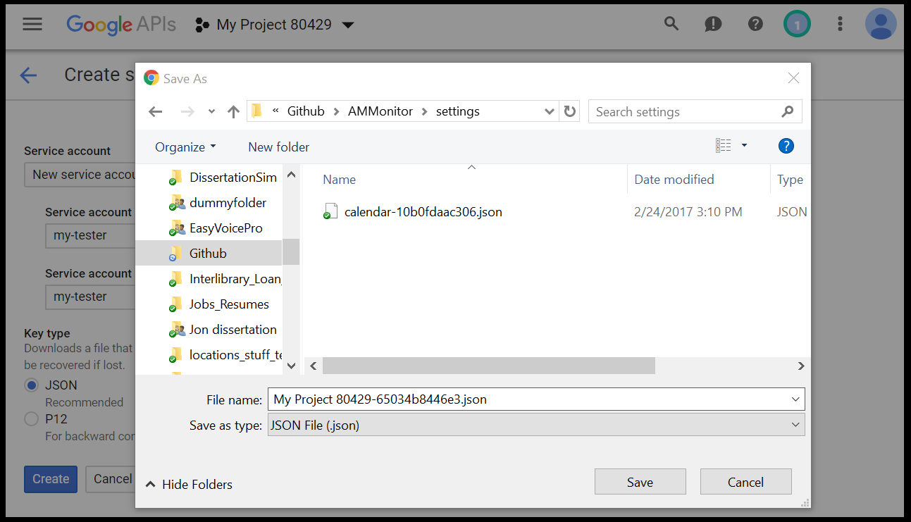

</kbd>

> *Figure 9.7. Store the json file somewhere logical. We store ours in
> the “settings” directory with other API settings.*

1.  Finally, you will recieve a message notifying you that the private
    key has been saved to your computer.

<kbd>

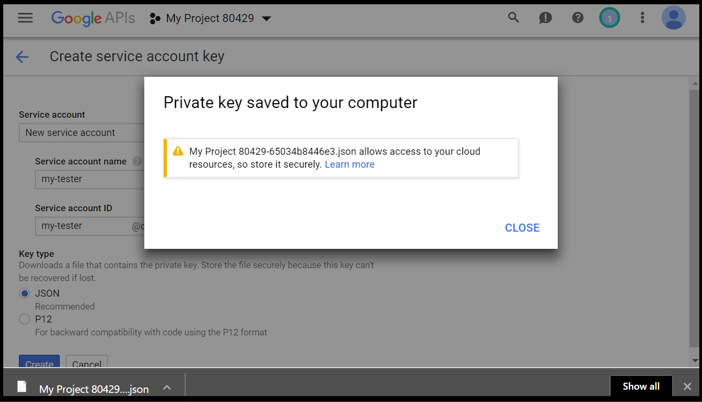

</kbd>

> *Figure 9.8. You’re done!*

Incidentally, [JSON](https://en.wikipedia.org/wiki/JSON) is a data
format commonly exchanged by internet servers such as Google. You can
use a text editor to view the file, where you will see several sets of
key-value entries that allow **AMMonitor** functions to connect to the
Google accounts of each smartphone.

Step 2: Sharing the Service Token with Monitoring Equipment
-----------------------------------------------------------

The service account key generated in Step 1 should be associated with
your primary Google management account (in our example, the primary
management account is “midEarthMgt”). We now need to share each
monitoring smartphone’s main Google Calendar with this service account
by logging into the Google account for each piece of monitoring
equipment.

For example, if we have a piece of equipment named “equip@4”, whose
Google account is “midEarth4” in the **accounts** table, then we need to
log into that account and navigate to the following web address:
<https://calendar.google.com/calendar/render#main_7>

1.  Once you have logged into the Google account for an individual piece
    of monitoring equipment (e.g., “midEarth4”) and navigated to
    <https://calendar.google.com/calendar/render#main_7>, accept any
    Google welcome pop-ups and notifications. Then, in the left-hand
    pane, select the main calendar account for this device. In the
    demonstration image below, our main account’s name is ‘midEarth4’.
    Select the 3 vertical dots that say “Options for \[Name\] Account”,
    and then select “Settings and sharing”.

<kbd>

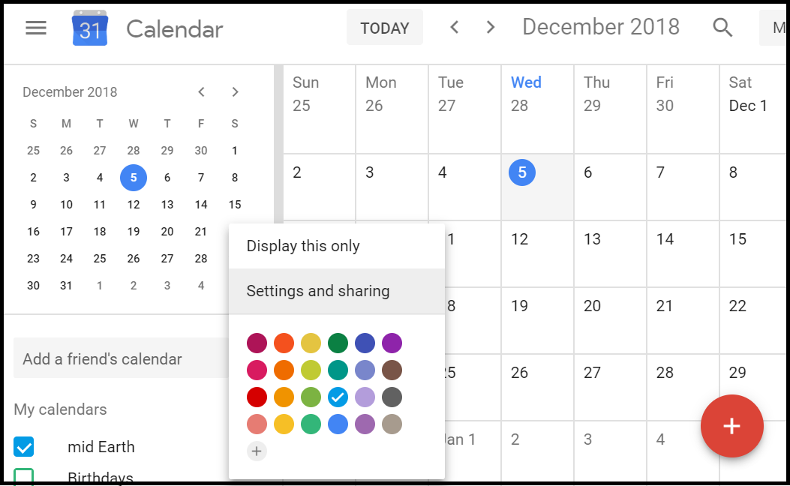

</kbd>

> *Figure 9.9. If you use smart phones as an autonomous monitoring
> device, you will need to share each unique account with the main
> account to allow R to communicate with each piece of equipment.*

1.  In the left-hand panel, select “Share with specific people”. Then,
    click “Add people”, and paste in the name of the Service Account ID
    you generated in Step 1.5. Below, our demonstration service account
    is named ‘AMMonitor@complete-sprite-213216.iam.gserviceaccount.com’.
    Next, under “Permissions”, select “Make changes to events”. Finally,
    click “SEND” to save these settings.

<kbd>

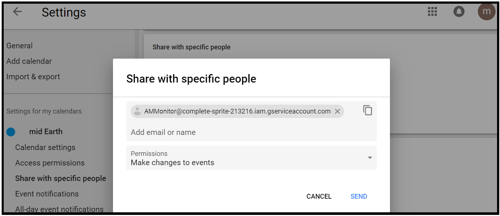

</kbd>

> *Figure 9.10. Share the account with specific ‘people’.*

1.  The settings for your monitoring smartphone’s calendar should now
    look something like the image below. The settings page should
    contain the device’s Google account name (in this example,
    “midEarth4@gmail.com (Owner)”, followed by the Service Account ID
    address generated in step 1.5. This action is what allows us to
    interact with the monitoring device’s calendar directly through R
    functions that use the Google Calendar API.

<kbd>

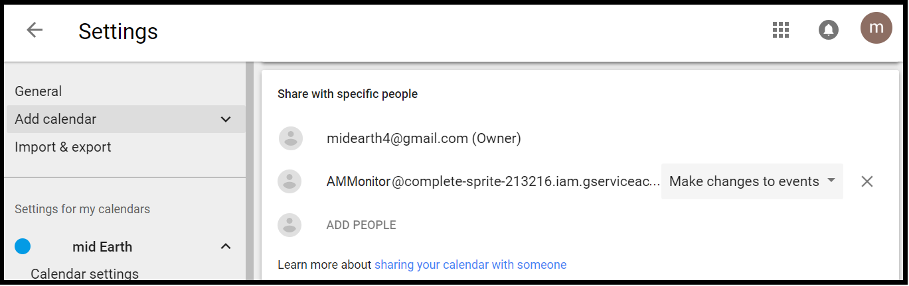

</kbd>

> *Figure 9.11. The account named ‘midearth4’ is now shared with the
> primary account’s API.*

You will have to repeat steps 2.1, 2.2, and 2.3 for each piece of
monitoring equipment for which you would like to conduct remote
scheduling. Depending on the number of phones in your program, this may
take some time, but you will only need to do this once per phone.

While you are logged in to each monitoring account, you should make sure
your monitoring equipment’s Google Calendar is set to the timezone in
which it is monitoring. For example, if you (and your computer) are
located in Vermont, USA, but your study site is located in California,
USA, you have a three hour time difference between the monitoring device
and your computer (which is communicating the schedule to the device).
In this example, if your Google Calendar’s schedule is not set to the
timezone *in which it is monitoring*, your schedules will
unintentionally contain a three hour time difference.

It is fairly easy to use the **AMMonitor** functions to create either
sun-based or fixed schedules, but take care to set up the Google API
correctly.

When finished with the day’s work, we disconnect from the database.

    # Disconnect from the database
    RSQLite::dbDisconnect(conx)

The Schedule Table in Access
============================

The schedule form can be accessed in a few different ways. Under the
Locations primary tab, the **schedule** table is located as a secondary
tab.

<kbd>

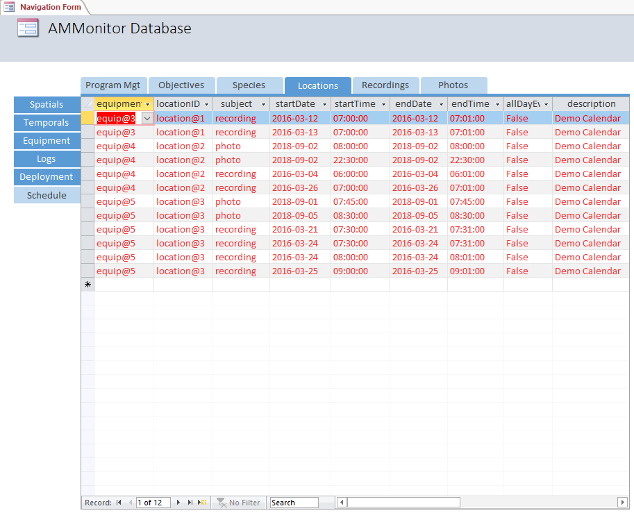

</kbd>

> *Figure 9.13. The schedule table in Access is located under the
> primary tab, Locations. It is populated with AMMonitor functions and
> should not be edited by hand.*

The data are displayed in red to remind users that schedules are
generated in R, and should not edited directly.

Chapter Summary
===============

This chapter covered the **schedule** table, with which users interact
via the `scheduleFixed()` or `scheduleSun()` functions, which can be
used to generate either fixed or sun-based recording schedules at active
monitoring locations. Both functions offer a variety of options for
schedule customization, and each provides the opportunity to schedule
recording events directly to an equipment’s Google Calendar via the
Google Calendar API. In the next chapter, we introduce a third schedule
function, `scheduleOptim()`, which can be used to set schedules that
have been optimized according to the weather forecast and target species
activity models.

Chapter References
==================

1. Balantic C, Donovan T. Temporally-adaptive acoustic sampling to
maximize detection across a suite of focal wildlife species. Ecology and
Evolution.
