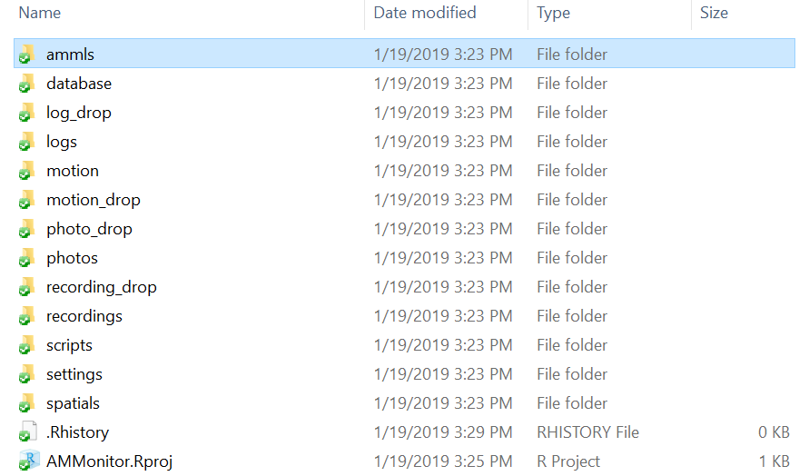

<div></div>

  - [Chapter Introduction](#chapter-introduction)
  - [The Priorities Table](#the-priorities-table)
  - [The Prioritization Table](#the-prioritization-table)
  - [Simulating activity models with
    simGlm()](#simulating-activity-models-with-simglm)
  - [Setting an optimized schedule with
    scheduleOptim()](#setting-an-optimized-schedule-with-scheduleoptim)
  - [Running a simulation experiment on historical temporal
    data](#running-a-simulation-experiment-on-historical-temporal-data)
  - [Running scheduleOptim() in a
    script](#running-scheduleoptim-in-a-script)
  - [The Priorities Table in Access](#the-priorities-table-in-access)
  - [The Prioritization Table in
    Access](#the-prioritization-table-in-access)
  - [Chapter Summary](#chapter-summary)
  - [Chapter References](#chapter-references)

# Chapter Introduction

In Chapter 9, we introduced the `scheduleSun()` and `scheduleFixed()`
functions to populate a Google Calendar for smartphone-based monitoring.
In this chapter, we introduce new functions that optimize the sampling
schedules based on when species are most likely to be captured by
smartphone monitoring (i.e. adaptive sampling). This process involves
the **temporals**, **priorities**, **prioritization** and **schedule**
tables of an **AMMonitor** database.

The premise of adaptive sampling with **AMMonitor** is to schedule
sampling events such that false negatives are minimized. For example, if
a target monitoring species is present on site but does not vocalize
during a scheduled audio recording session, researchers may incorrectly
conclude that the species is absent from the site (‘false negative’).
The risk of false negatives increases when devices do not monitor on a
continuous basis and must be scheduled to operate at specific times of
day, due to data transmission constraints, for example. However,
determining the optimal sampling schedule is challenging, especially
when monitoring multiple species whose activity patterns vary across
temporal and environmental conditions. If data transmission constraints
limit the total amount of monitoring that can occur, we want to leverage
the sampling resources we have by scheduling monitoring events that
maximize the probability of capture (*sensu* \[1\]) for all target
species.

**AMMonitor’s** temporally adaptive sampling algorithm is designed to
maximize detection probabilities for a suite of focal species amid
sampling constraints. The algorithm combines user-supplied species
“activity” models (stored in the **ammls directory**) with
site-specific weather forecasts (stored in the **temporals** table) to
set an optimized sampling schedule for the following day. For example,
an activity model for the Verdin (a songbird) provides the probability
that a Verdin will be acoustically available (i.e., singing) within each
hour at each site for the next 24 hours, given forecasted temporal
conditions at a site and knowledge of Verdin behavior. A “stopping rule”
for monitoring Verdin at each site can be invoked based on the
cumulative likelihood that the species has already been acoustically
captured. Thus, if it is likely that Verdin vocalized in previous
monitoring efforts, we can drop Verdin from the prioritization scheme
and focus our monitoring resources on species that have yet to be
captured. In simulation work, we have found that over the course of a
study season, the probability of acoustically capturing a focal species
at least once via automated acoustic monitoring is higher (and acoustic
capture occurs earlier in the season) when using the temporally adaptive
optimized schedule as compared to a fixed schedule, potentially reducing
the risk of false negatives and providing more confidence in detection
probability estimates \[2\].

For this chapter, we will use the `dbCreateSample()` function to create
a database called “Chap10.sqlite”, which will be stored in a folder
(directory) called **database** within the **AMMonitor** main directory
(which should be your working directory in R). Recall that
`dbCreateSample()` generates all tables of an **AMMonitor** database,
and then pre-populates sample data into tables specified by the user.

Below, we use `dbCreateSample()` to pre-populate several necessary
tables. We will auto-populate additional tables using **AMMonitor**
functions later on in the chapter:

``` r
# Create a sample database for this chapter
dbCreateSample(db.name = "Chap10.sqlite", 
               file.path = paste0(getwd(),"/database"), 
               tables =  c('locations', 'deployment', 'equipment',
                           'accounts', 'species', 'priorities',
                           'temporals', 'people'))
```

    ## An AMMonitor database has been created with the name Chap10.sqlite which consists of the following tables:

    ## accounts, annotations, assessments, classifications, deployment, equipment, library, listItems, lists, locations, logs, objectives, people, photos, priorities, prioritization, recordings, schedule, scores, scriptArgs, scripts, soundscape, spatials, species, sqlite_sequence, templates, temporals

    ## 
    ## Sample data have been generated for the following tables: 
    ## accounts, people, species, equipment, locations, deployment, priorities, temporals

Now, we connect to the database. First, we initialize a character
object, **db.path**, that holds the database’s full file path. Then, we
create a database connection object, **conx**, using RSQLite’s
`dbConnect()` function, where we identify the SQLite driver in the ‘drv’
argument, and our **db.path** object in the ‘dbname’ argument:

``` r
# Establish the database file path as db.path
db.path <- paste0(getwd(), '/database/Chap10.sqlite')

# Connect to the database
conx <- RSQLite::dbConnect(drv = dbDriver('SQLite'), dbname = db.path)
```

After that, we send a SQL statement that will enforce foreign key
constraints.

``` r
# Turn the SQLite foreign constraints on
RSQLite::dbSendQuery(conn = conx, statement = "PRAGMA foreign_keys = ON;")
```

    ## <SQLiteResult>
    ##   SQL  PRAGMA foreign_keys = ON;
    ##   ROWS Fetched: 0 [complete]
    ##        Changed: 0

Finally, to keep the demonstrations in this chapter concise, we will
assume that only three of our 50 sample monitoring locations are
actively being monitored. That is, we will pretend that the equipment
deployed at 47 locations has been retrieved.

We will deactivate deployments at monitoring locations ‘location@4’
through ‘location@50’ by sending an UPDATE query to `dbExecute()`,
wherein we assign an arbitrary date to the *dateRetrieved* column of the
deployment table to indicate that the devices at these locations have
been retrieved and the locations are not actively monitored:

``` r
# Set an equipment retrieval date for all locations but 3
RSQLite::dbExecute(
  conn = conx, 
  statement =  "UPDATE deployment 
                SET dateRetrieved = '2016-01-20'
                WHERE locationID 
                NOT IN ('location@1', 'location@2', 'location@3')")
```

    ## [1] 47

This action returns a ‘47’ to indicate that 47 records have applied the
action of setting *dateRetrieved* equal to ‘2016-01-20’.

# The Priorities Table

The **priorities** table allows us to store monitoring priorities for
focal species at each active monitoring location. Depending on our
research program, we might prioritize the capture of certain species
more highly than that of other species, and/or we might be particularly
interested in capturing activity at certain sites more than others.

We begin by viewing the **priorities** table’s metadata with the
function `dbTables()`:

``` r
# Look at information about the priorities table
dbTables(db.path = db.path, table = "priorities")
```

    ## $priorities
    ##   cid       name         type notnull dflt_value pk comment
    ## 1   0 locationID VARCHAR(255)       1         NA  1        
    ## 2   1  speciesID VARCHAR(255)       1         NA  2        
    ## 3   2     weight         REAL       0         NA  0        
    ## 4   3       pMax         REAL       0         NA  0

This table contains only four fields. The *locationID* and *speciesID*
constitute primary keys, and reference *locationID* and *speciesID* from
the **locations** and **species** tables, respectively. The *weight*
value indicates the proportion of monitoring weight assigned to a
particular species at a particular site, and depends on the monitoring
program’s goals.

The *pMax* column stores the “probability of capture” value above which
monitoring is no longer required for a target species at a given
location. *pMax* values are chosen by the user, and indicate how certain
users want to be that a target species has been captured before dropping
that species from the schedule optimization scheme. Thus, *pMax*
functions as a stopping rule. For example, a *pMax* value of 0.95 for a
target species at a location indicates that monitoring will continue for
that species at that location until we are 95% certain the species has
been captured at least once on an audio recording or photo, given it is
present. *pMax* may be greater than 1 for monitoring programs that focus
on abundance of captures (e.g., number of vocalizations by a target
species, or number of times a species was camera-trapped) rather than
probability of a single capture throughout the monitoring period.

To see how the **priorities** table works, we use `dbGetQuery()` to view
all records in the sample table.

``` r
# Retrieve the sample data stored in the priorites table
RSQLite::dbGetQuery(conn = conx, statement = 'SELECT * FROM priorities')
```

This example contains four target species at three locations. Focusing
on location@1 only, “btgn” and “verd” have weights of 0.2, while “copo”
and “leni” have weights of 0.3. From a monitoring perspective, this
means “copo” and “leni” are 1.5 times more important than the other
species (0.3/0.2 = 1.5). **Importantly, for any given location, the sum
of the weights must equal 1 in the priorities table.** For location@1,
0.2 + 0.3 + 0.3 + 0.2 = 1. The *pMax* value for each species and site is
set to 0.95, indicating that we wish to monitor each species with
smartphones until we have exceeded a probability of 0.95 that we have
captured the species at least once during the duration of our monitoring
program.

Here, we have chosen to set the same *weight* and *pMax* values for all
four species at each of three active monitoring locations. However, a
user could elect to assign different monitoring weights to different
species based on the location in order to better customize the
monitoring optimization scheme to their needs.

**Note that this sample monitoring program is not necessarily limited to
these four species. Rather, the four species listed drive the monitoring
schedule that is pushed to each smartphone’s Google Calendar.**

The convenience function `prioritySet()` can be used to populate the
**priorities** table. `prioritySet()` takes the database path in the
‘db.path’ argument. A vector of speciesIDs may be supplied in the
‘speciesID’ argument, or users may input a value of “all” to indicate
that all species in the **species** table should be used. Lastly, the
‘p.max’ argument takes a real number. This function automatically
populates the **priorities** table by first identifying all actively
monitored locations. At each active location, it assigns equal priority
weights to all species specified in the ‘speciesID’ argument. The same
‘p.max’ value is assigned for each species at each location. Lastly,
the ‘db.insert’ argument allows users to test the function and view the
outputs before committing new records to the **priorities** table.
Below, we leave ‘db.insert’ as the default FALSE to demonstrate the
function. The ‘db.insert’ argument in this function should be used with
additional care: **If ‘db.insert’ is set to TRUE, any existing records
in the priorities table will be overwritten.**

``` r
# Demonstrate prioritySet(), but set db.insert to FALSE 
prioritySet(db.path = db.path,
            speciesID = c('verd', 'btgn'),
            p.max = 0.99,
            db.insert = FALSE)
```

    ## Returning priorities, but no records have been overwritten in 
    ##  the existing priorities table because db.insert = FALSE

In the above example, monitoring priorities for the three locations are
driven by two species of equal monitoring importance. Monitoring for
each species at each location will continue until a *pMax* of 0.99 is
attained. Because *db.insert* is set to FALSE, this prioritization
scheme will not be implemented; the priorities from the sample data will
be used in the examples that follow.

# The Prioritization Table

While the **priorities** table is filled in manually by the monitoring
team, the **prioritization** table is automatically filled by
**AMMonitor** functions. The primary purpose of the **prioritization**
table is to track, *through time*, the probability that a target species
has been captured at a site. This table is populated by **AMMonitor**
functions based on the probability that the species has been previously
captured, given presence. Users do not interact with this table
directly.

Below, we view the **prioritization** table’s metadata using
`dbTables()`:

``` r
# Look at information about the prioritization table
dbTables(db.path = db.path, table = "prioritization")
```

    ## $prioritization
    ##   cid       name         type notnull dflt_value pk comment
    ## 1   0 locationID VARCHAR(255)       1         NA  1        
    ## 2   1  speciesID VARCHAR(255)       1         NA  2        
    ## 3   2       date VARCHAR(255)       1         NA  3        
    ## 4   3       pMax         REAL       0         NA  0        
    ## 5   4   pCurrent         REAL       0         NA  0        
    ## 6   5     weight         REAL       0         NA  0        
    ## 7   6       init         REAL       0         NA  0

The *locationID*, *speciesID*, and *date* together constitute primary
keys (a composite key), signifying that we are interested in tracking a
target species’ probability of capture through time at each location.
The *pMax* value is supplied by the **priorities** table.

On the first day of an optimized monitoring program, *init* is set to 1,
the *weight* values are equal to those in the **priorities** table, and
*pCurrent* is set to 0 for all species and location combinations.
*pCurrent* tracks the current probability of having captured at least
one signal from the target species throughout the monitoring period up
to the current date. Monitoring may be initialized at any point in time.
For instance, a user may reinitialize the monitoring program on the
first day of the week, the first day of each month, or at any desired
interval.

To initialize a monitoring program with an optimized recording schedule,
we use the function `priorityInit()`, which contains two arguments.
First, the ‘db.path’ argument receives the **db.path** object as an
input. Second, we declare a date in YYYY-mm-dd format in the ‘init.date’
argument. Below, we input **Sys.Date()** to the ‘init.date’ argument to
indicate that we want to initialize an optimized monitoring program
today.

``` r
# Run the priorityInit function: 
priorityInit(db.path = db.path, init.date = Sys.Date())
```

    ## Finished initializing prioritization table.

We can use `dbGetQuery()` to confirm that our prioritization table has
been initialized:

``` r
# Check the freshly-initialized prioritization table using dbGetQuery:
RSQLite::dbGetQuery(conn = conx, 
                    statement = 'SELECT * FROM prioritization')
```

Note that `priorityInit()` has initialized monitoring with a total of 12
rows, having repeated all four target species at each of our three
active monitoring sites, and having assigned our specified *weight* and
*pMax* values. Since monitoring has just been initialized, *pCurrent*
values all begin at zero (because we have not detected any species yet),
and the *init* column contains all ones. If you are following along and
running the code in R, the *date* column should contain today’s date.

Our goal next is to create future monitoring events (e.g., recordings)
that are pushed to each smartphone’s Google Calendar, given our
monitoring priorities and any data transmission constraints limiting the
number of events that can be collected. As monitoring progresses (where
*init* \(\ne\) 1), **AMMonitor** functions will change the *weight* and
*pCurrent* values through time based on *previous* predicted probability
of capture values that have accumulated since initialization. Weights
generally recede for species with higher probabilities of capture, and
increase for species whose probability of capture remains inadequate.

As a preview of the prioritization process, the figure below
demonstrates how *pCurrent* and *weight* values change from the
beginning (2016-03-01) to the end (2016-03-31) of a hypothetical
monitoring scenario for location@1 only:

<kbd>


</kbd>

> *Figure 10.1. Hypothetical illustration of how pCurrent and weights
> change as monitoring progresses.*

In this example, on 2016-03-31, the probability that ‘btgn’ has been
captured at this site is 0.42, while the probability that ‘leni’ has
been captured at this site is 0.88. Because all *pCurrent* scores are
less than *pMax*, all monitoring weights are greater than 0 (indicating
that some monitoring effort will be applied for each of the four species
at this location in the future). The *weight* column indicates that the
future monitoring schedule (e.g., tomorrow) will target ‘btgn’ much more
than the other species, because the *pCurrent* value for ‘btgn’ remains
much lower.

# Simulating activity models with simGlm()

Creating an optimized schedule of future monitoring at various locations
requires models that predict activity patterns for each target species
across time and space. In this section, we will create “activity” models
that reflect our knowledge about when our target species are likely to
be detected. Thus, we will be creating models based on our expert
opinion. Models may also be created through analysis of monitoring data.
“Activity” is a generic term that may represent, for example, calling
activity in birds or amphibians, movement activity in mammals, or
pollination activity in bees. Activity patterns can be a function of
julian date, time of day, precipitation, and a host of other factors.
These covariates are stored in the **temporals** table of an
**AMMonitor** database.

Activity models will ultimately be stored in an AMModels library located
in the **ammls** folder within the main **AMMonitor** directory.

<kbd>



</kbd>

> *Figure 10.2. All models for a monitoring program should be stored in
> an accessible location. We store models in the ‘ammls’ directory
> within the main AMMonitor directory.*

In Chapter 1, we created an AMModel library called “activity.RDS”, which
will be dedicated to storing activity-based models. Below, we retrieve
this library and view its contents:

``` r
# Read in the AMModels library called activity
activity <- readRDS('ammls/activity.RDS')

# Show the library
activity
```

    ## 
    ## Description:
    ## [1] This library stores models that predict species activity patterns.
    ## 
    ## Info:
    ##   PI 
    ##    [1] Bilbo Baggins
    ##   Organization 
    ##    [1] Middle Earth Conservancy
    ## 
    ## Models:
    ## 
    ##  --- There are no models --- 
    ## 
    ## Data:
    ## 
    ##  --- There are no datasets ---

This library currently contains no models. We will soon use our expert
knowledge about the species of Middle Earth to create activity models
for our four target species, and store the models in this library.

Model creation constitutes a challenging aspect of optimizing a
monitoring program because we may not know exactly when a target species
will make itself available for capture (e.g., vocalize). We might create
a model based on empirical data for some species, but use existing
literature or expert opinion for others.

For simplicity, we will use the **AMMonitor** function `simGlm()` in
this chapter to create an expert, binomial-based activity model of class
*glm* for each of our four target species. The binomial version of this
function allows us to model the probability that the species vocalizes
at least once within a minute or hour, given covariates that are stored
in the **temporals** table.

Below, we view the arguments for `simGlm()`:

``` r
# View SimGlm arguments 
args(simGlm)
```

    ## function (db.path, equation.list, model.type, model.family, data, 
    ##     seed = NULL, ...) 
    ## NULL

As shown, there are four arguments: *db.path* points to our
**AMMonitor** database, *data* is a dataset with temporal covariates,
*model.type* specifies the kind of model we wish to create (e.g. an
activity model), *model.family* is the family of generalized linear
models we wish to use (poisson or binomial), and *equation.list* is a
named list of model coefficients and their values, where the name will
be the name of the model.

To begin, we retrieve the historical sample data stored in the
**temporals** table, which will be passed into `simGlm()`’s *data*
argument.

``` r
# Retrieve temporal data for our 3 locations
temporal.data <- RSQLite::dbGetQuery(
  conn = conx, 
  statement = 'SELECT * 
               FROM temporals 
               WHERE locationID == "location@1" 
               OR locationID = "location@2" 
               OR locationID = "location@3" ')

# Show the column names of the temporal data as a data table
data.table(names(temporal.data))
```

The **temporals** table was described in detail in Chapter 8: Temporals.
Here, it is returned as a data.frame called **temporal.data** with 2229
rows and 25 columns. Column names (n = 25) above are coerced to
data.table for easier printing. Several of our temporal variables are
circular in nature, such as the day of the year (*date*), hour of the
day (*hour*), and lunar phase (*moonPhase*). Hour of the day, for
example, ranges in value from 0 to 23. However, the starting point of
the hour of the day is arbitrary because days occur cyclically. It can
be tricky to model vocalization activity directly based on the hour
value because hour values are a linear representation of a circular time
pattern, producing undesirable results in our vocalization models. To
address the challenge of circular data, we can use the function
`scheduleAddVars()` to add sine and cosine-based variables to the
temporals dataset. Specifically, we model the 24-hour day as two
variables: the sine of the hour of the day, calculated as
sin(2\*pi\*hour.of.day/24), and the cosine of the hour of the day,
calculated as cos(2\*pi\*hour.of.day/24). `scheduleAddVars()` requires
only one input, which is our **temporal.data** object.

``` r
# Add circular variables to temporal data
temporal.data <- scheduleAddVars(temporal.data)

# show the names of the temporal data; note there are now 38 columns
data.table(names(temporal.data))
```

`scheduleAddVars()` appends a number of variables we have found useful
for modeling species activity patterns in our work. The *dayOfYear*
variable is the linear day of the year, with *dayCos* and *daySin*
reflecting circular forms of this variable. The *dayCosEquinox* and
*daySinEquinox* variables allow users to model equinox-based shifts in
activity. The *hour* variable is split into two cyclical options,
modeled either based on a 24-hour hour cycle (*hourCos24*, *hourSin24*),
or a 12-hour cycle to account for morning and evening changes in
activity patterns (*hourCos12*, *hourSin12*). In addition to circular
variables, *scheduleAddVars()* also contributes a few more potentially
useful variables, such as the absolute value distance (in minutes) an
hour is from sunrise or sunset (*distRise*, *distSet*) and associated
cyclical variables (*distRiseCos*, *distSetCos*, *distRiseSin*,
*distSetSin*). Lastly, since the raw moon phase data runs on an
arbitrary 0 to 1 scale, these values are converted into circular
variables in the form of *moonCos* and *moonSin*. Note that it is not
strictly necessary to run `scheduleAddVars()` in advance of running
`simGlm()`, which will add and use them automatically if desired – we
only demonstrate the output of `scheduleAddVars()` here to show some of
the additional variable options it provides.

Next, we need to create an equation list required for the `simGlm()`
function. Generally speaking, an equation will yield the probability
that a target species will be active at a given time at a given
location, given the temporal covariates associated with that time and
location.

Below, we generate an object called **equations** that is formatted
correctly for `simGlm()`. The list should contain a number of named
elements equal to the number of target species, where the name of each
element will be the model name (e.g., ‘btgn\_vocals’). The ‘names’ list
element contains a character vector of the temporal covariates in the
model for that species; each covariate (with the exception of
‘intercept’) must match the name of a column available in the
**temporal.data** object (case sensitive, pay attention to camelCase
column conventions here). If desired, polynomial terms may be added to
covariate names by including ‘.N’ next to the covariate
(e.g. ‘distRise.2’ or ‘temperature.3’ to denote distRise^2 or
temperature^3 in the below example). Polynomial terms are automatically
parsed and applied within `simGlm()` via the ‘.’ character. Lastly, the
‘coefficients’ list element contains a numeric vector of the
coefficient values we want to use in our model. For example, in the
‘btgn\_vocals’ model below, the ‘intercept’ coefficient is -0.3, the
‘dayOfYear’ coefficient is -0.002, and so on. Importantly, the
coefficients are on the logit (log odds) scale to ensure that the final
probability is constrained between 0 and 1. Take care to ensure that all
covariate names match up correctly in order with the coefficient values
you want to use.

``` r
# Example list of model equations for vocalization for each of four species
equations <- list(
  btgn_vocals = list(
    names = c('intercept', 'dayOfYear', 'daySin',
              'hourCos12', 'distRise.2','temperature',
              'temperature.3', 'windSpeed'),
    coefficients = c(-0.3, -0.002, 1, 
                     -0.5, -0.000007, 0.009, 
                     -0.000001, -0.35)
  ),
  copo_vocals = list(
    names = c('intercept', 'dayOfYear', 'dayCos',
              'daySin', 'hourCos24', 'hourCos12',
              'distRise', 'distSet', 'windSpeed',
              'moonCos'),
    coefficients = c(-2, -0.003, 0.5, 
                     0.6, 1, -0.5,             
                     -0.0005, -0.0005, -0.1, 
                     -0.2)
  ),
  leni_vocals = list(
    names = c('intercept', 'dayOfYear', 'dayCos', 
              'daySin', 'hourCos24', 'hourCos12',
              'distRise', 'distSet', 'windSpeed',
              'moonCos'),
    coefficients = c(-3, -0.006, 0.4, 
                     0.7, 1, -0.5, 
                     -0.0005, -0.0005, -0.25, 
                     -0.3)
  ),
  verd_vocals = list(
    names = c('intercept', 'dayOfYear', 'daySin',
              'hourCos12', 'distRise.2','temperature',
              'temperature.3', 'windSpeed'),
    coefficients = c(-0.5, -0.004, 1, 
                     -1.5, -0.000007, 0.009,
                     -0.000001, -0.25)
  )
)
```

Once the **equations** object is correctly formatted, we are ready to
generate our models with `simGlm()`. If we want to use all data stored
in the **temporals** database table to create the model, we feed our
**db.path** object to the ‘db.path’ argument, and our **equations**
object to the ‘equation’ argument (which is a list of four, so four
models will be created). In the ‘model.type’ argument, we specify that
we are creating actitivity models. R will recycle the **model.type** and
**model.family** values for all four models. In the ‘model.family’
argument, we specify ‘binomial’ (alternatively, we can specify ‘poisson’
here if that is the type of model we mean to create). Instead of using
*all* data in the temporals database, we feed our **temporal.data**
object to the ‘data’ argument and leave the ‘db.path’ argument blank.

``` r
# Create vocalization models:
models <- simGlm(equation = equations,
                 model.type = 'activity',
                 model.family = 'binomial',
                 data = temporal.data)
```

    ## Working on model 1 (btgn_vocals)...

    ## Finished model 1. Model btgn_vocals is active 13.2 % of the time.

    ## Working on model 2 (copo_vocals)...

    ## Finished model 2. Model copo_vocals is active 7.9 % of the time.

    ## Working on model 3 (leni_vocals)...

    ## Finished model 3. Model leni_vocals is active 1.7 % of the time.

    ## Working on model 4 (verd_vocals)...

    ## Finished model 4. Model verd_vocals is active 17.3 % of the time.

Each of these models is stored in a list (in this case a list of four,
one for each species). The class of each model is **glm** (generalized
linear model) and **lm** (linear model) generated from R’s base package,
and each object contains a bevy of information about the model fitting
process.

``` r
# Look at the class of each model
lapply(X = models, FUN = class)
```

    ## $btgn_vocals
    ## [1] "glm" "lm" 
    ## 
    ## $copo_vocals
    ## [1] "glm" "lm" 
    ## 
    ## $leni_vocals
    ## [1] "glm" "lm" 
    ## 
    ## $verd_vocals
    ## [1] "glm" "lm"

We encourage readers to use the `str()` function to look more deeply at
each model’s structure and to view the helpfiles for `lm()` and `glm()`
for details about model output.

The plot below gives the reader some sense of what the coefficients
mean. Each of the four species is plotted in five panels, with the
probability of vocalization per unit time on the y-axis. The x-axes vary
across the five panels, and demonstrate the influence of several
different covariates on vocalization probability by species.

<kbd>


</kbd>

> *Figure 10.3. Plots showing how probability of vocalization varies as
> a function of covariates for four species.*

Such activity models are required for **AMMonitor’s** adaptive sampling
algorithm in `scheduleOptim()` (described below). The models provide
predictions of activity given tomorrow’s temporal conditions, and thus
enable **AMMonitor** to create an optimized sampling scheme for future
monitoring at each monitoring location. For example, if tomorrow’s
forecast calls for 20 km/hr winds at 6am, we would expect that
vocalization probability is lowest for ‘BTGN’ and highest for ‘COPO’
during that time (assuming both species are present at a site). If their
*pCurrent* and *weight* values were equal, the optimization algorithm
would target ‘COPO’ monitoring under these conditions because ‘BTGN’
will be less vocally available.

In the spirit of adaptive management, each model can be updated and
improved through time as new data are collected. Additionally, each
model will be repeatedly used by the optimization algorithm. As such, we
store the models in the **activity** model library for easy retrieval
and use.

``` r
# Convert each model in the list to an amModel object
models <- lapply(models, FUN = amModel)

# Look at the structure of this object
# Note it is a list of amModel objects
str(models, max.level = 1)
```

    ## List of 4
    ##  $ btgn_vocals:Formal class 'amModel' [package "AMModels"] with 2 slots
    ##  $ copo_vocals:Formal class 'amModel' [package "AMModels"] with 2 slots
    ##  $ leni_vocals:Formal class 'amModel' [package "AMModels"] with 2 slots
    ##  $ verd_vocals:Formal class 'amModel' [package "AMModels"] with 2 slots

Notice that the **models** object is a list of four **amModel** objects,
each which contains two slots. The first slot stores the model itself
(the object of class “glm”). The second slot stores metadata about the
model. We add these models to our activity model library:

``` r
# Insert the models to the amModelLib as a named list
activity <- AMModels::insertAMModelLib(models = models, amml = activity)

# View a summary of the library
activity
```

    ## 
    ## Description:
    ## [1] This library stores models that predict species activity patterns.
    ## 
    ## Info:
    ##   PI 
    ##    [1] Bilbo Baggins
    ##   Organization 
    ##    [1] Middle Earth Conservancy
    ## 
    ## Models:
    ## 
    ## Data:
    ## 
    ##  --- There are no datasets ---

The four models have been added to the libary. **For these models to be
used by other AMMonitor functions, users must also add metadata for each
model.** Below, we will create a named list of metadata elements (in
key-value fashion), and specify that these are activity models of class
‘glm’ created with the **AMMonitor** function `simGlm()`. At minimum,
the model metadata list should contain the ‘type’ (model type), ‘class’,
‘speciesID’ (if any), ‘packageName’, and ‘functionName’ (if any).
Importantly, if the model is linked to a particular objective in the
**objectives** table, a metadata element called ‘objectiveID’ may be
entered. Other desired metadata information can be added at the user’s
discretion. **For the examples in this vignette, the speciesID metadata
is critical for the `scheduleOptim()` function, which will check that
speciesIDs match those available in the species table.**

``` r
# create a named list of of metadata that can be added to all objects
model.meta <- list(type = 'activity model', 
                   class = 'glm', 
                   model.family = 'binomial',
                   speciesID = 'NA',
                   objectiveID = 'NA',
                   package = 'AMMonitor', 
                   functionName = 'simGlm')

# Add speciesID metadata to the btgn object
model.meta$speciesID = 'btgn'
AMModels::modelMeta(amml = activity, x = 'btgn_vocals') <- model.meta

# Add speciesID metadata to the verd object
model.meta$speciesID = 'verd'
AMModels::modelMeta(amml = activity, x = 'verd_vocals') <- model.meta

# Add speciesID metadata to the copo object
model.meta$speciesID = 'copo'
AMModels::modelMeta(amml = activity, x = 'copo_vocals') <- model.meta

# Add speciesID metadata to the leni object
model.meta$speciesID = 'leni'
AMModels::modelMeta(amml = activity, x = 'leni_vocals') <- model.meta
```

Now that we have added metadata for each **amModel** object, we can save
the library back to our *ammls* directory for future use:

``` r
# Save the library
saveRDS(activity, file = 'ammls/activity.RDS')
```

# Setting an optimized schedule with scheduleOptim()

After establishing monitoring priorities in the **priorities** table,
initializing a new monitoring session with `priorityInit()`, and
generating models with `simGlm()`, we are situated to conduct optimized
monitoring using `scheduleOptim()`. The primary purpose of
`scheduleOptim()` is to create an optimized schedule for future
monitoring based on monitoring priorities, activity models, and temporal
data that contain tomorrow’s forecast. The resulting schedule is added
to the **schedules** table, where the schedule can be synced with each
smartphone’s Google Calendar. **Note that `scheduleOptim()` currently
only focuses on schedule optimization for recordings. Optimization for
motion capture, photos, and playback will be incorporated in future
versions of AMMonitor.**

Here, we demonstrate `scheduleOptim()` to set an acoustic monitoring
schedule for the four target species across three sites. To begin, we
view `scheduleOptim()`’s arguments:

``` r
# Look at the arguments to scheduleOptim()
args(scheduleOptim)
```

    ## function (db.path, calendar.key = NULL, amml, choose.models, 
    ##     temporals.key = NULL, optimization.approach = "simple", daily.site.constraint, 
    ##     time.units, max.per.hour = NULL, db.insert = FALSE, google.push = FALSE) 
    ## NULL

This function will create a schedule to be pushed to a smartphone’s
Google Calendar and inserted to the **schedules** database table. The
arguments *db.insert* and *google.push* offer the chance to test
`scheduleOptim()` before implementing it. The other arguments include:

  - ‘db.path’ - The filepath to the **AMMonitor** database.
  - ‘calendar.key’ - The calendar key for the monitoring program’s
    primary Google account. The **accounts** table should have an entry
    for this key, and the key itself should be stored in the
    **settings** directory within the **AMMonitor** main directory (see
    Chapter 7: The Accounts, Equipment, Deployment, and Logs Tables, and
    Chapter 9: The Schedule Table). The ‘calendar.key’ argument can be
    set to NULL when we are merely testing the function.
  - ‘amml’ - The name of the AMModels library storing models that
    predict activity based on forecasted weather conditions.
  - ‘choose.models’ - A character vector of the model names stored
    within the AMModels library. In practice, we may have many models
    stored in our AMModel library, and this argument forces us to
    specify which models we actually want to use. Model names do not
    need to be given in alphabetical order.
  - ‘time.units’ - Tells `scheduleOptim()` the time scale for how we
    modeled our activity. If we modeled binomial vocalization
    probabilities or Poisson rates by the minute, then we input
    ‘by.minute’. If we modeled activity on an hourly basis, we input
    ‘by.hour’.
  - ‘temporals.key’ - The Dark Sky API key used to retrieve forecast
    conditions at each monitoring location. The **accounts** table
    should have an entry for this key, and the key itself should be
    stored in the **settings** directory within the **AMMonitor** main
    directory (see Chapter 8: The Temporals Table). In an active,
    real-time monitoring program, one will always need to include the
    ‘temporals.key’. However, users can leave ‘temporals.key’ as the
    default NULL if they wish to conduct academic exercises or activity
    simulations using historical weather data \[2\].
  - ‘optimization.approach’ - The approach to be used to set the
    optimized schedule. This argument requires a single character
    element of one of two options: ‘simple’ (default) or ‘max.per.hour’.
  - ‘daily.site.constraint’ - The number of recordings to be collected
    per site per day.
  - ‘max.per.hour’ - The maximum number of recordings to schedule per
    hour.

Note that there are two alternative optimization approaches (‘simple’ or
‘max.per.hour’). Regardless of the approach, recording events are 1
minute in duration, and require at least one minute of non-recording
buffer time between events. This gives the smartphone time to process
each audio file before embarking on a new recording. Additionally,
limiting the duration of events to 1 minute ensures that the audio file
can be reliably dispatched over the cellular network. Note that although
the schedule is set to the minute, our temporal data from Dark Sky is
only available to the hour. Thus, the optimization algorithm will rank
each hour from best to worst (n = 24) for each site in terms of expected
monitoring proficiency, given the 24 hour temporal forecast. The
‘daily.site.constraint’ argument should contain the total recording
time, in minutes, that should be taken at each active monitoring
location every day; a value of 5 indicates that five minutes of
recordings will be taken at all three of our actively monitored
locations.

Under the ‘simple’ optimization approach, the ‘daily.site.constraint’
argument should contain the number of 1-minute recording samples
available to be taken each day at each site. In cases where
‘daily.site.constraint’ \<= 30, all events are allotted into the
highest scoring hour at evenly spaced intervals throughout the hour. If
‘daily.site.constraint’ \> 30, remaining samples are allotted in the
same way into the second highest scoring hour, and so on.

Some users may chafe at the idea of concentrating all sampling power
into a single hour if they have fewer than 30 samples per day, and may
choose to set the ‘optimization.approach’ argument to ‘max.per.hour’
instead. In this approach, users can set a maximum cap on the number of
samples distributed into any single hour by providing a value for the
‘max.per.hour’ argument, which indicates the maximum number of samples
allotted to any single hour. Note that when activity models are
well-informed and weather predictions are reliable, the ‘max.per.hour’
method may be slightly inferior to the ‘simple’ method \[2\]. However,
if weather predictions are unreliable and/or activity models are not
well-informed, users may prefer to hedge their bets by distributing
samples across more hours.

Below, we provide an example of how to create an optimized recording
schedule for the four sample species across three locations. Here, we
will use the ‘simple’ optimization approach, and limit the number of
recordings per site per day to 5 in the ‘daily.site.constraint’
argument. The arguments ‘db.insert’ and ‘google.push’ are set to FALSE
to demonstrate the function.

``` r
#----------------------------------------------------------------
# Optimize the schedule for tomorrow  and return the results as a 
# list of two data.tables: prioritization, and schedule. 
# Set db.insert and google.push to FALSE to ensure results are not 
# added to the database. No calendar.key is required, but a temporals.key 
# will be required to get a new forecast for tomorrow. 
#----------------------------------------------------------------

test_optim <- scheduleOptim(db.path = db.path,
                            amml = activity,
                            choose.models = c('copo_vocals', 'leni_vocals', 
                                              'btgn_vocals', 'verd_vocals'), 
                            temporals.key = 'settings/dark-sky-key.RDS',
                            calendar.key = NULL,
                            optimization.approach = 'simple',
                            daily.site.constraint = 5, 
                            time.units = 'by.hour',
                            max.per.hour = NULL,
                            db.insert = FALSE,
                            google.push = FALSE)
```

    ## Powered by Dark Sky: visit https://darksky.net/poweredby/ for details

    ## Gathering temporal data for 1 out of 3 cases.

    ## Gathering temporal data for 2 out of 3 cases.

    ## Gathering temporal data for 3 out of 3 cases.

    ## Predicting activity for species 1: btgn

    ## Predicting activity for species 2: copo

    ## Predicting activity for species 3: leni

    ## Predicting activity for species 4: verd

As shown, `scheduleOptim()` yields progress messages about the gathering
of forecast data and model status for our focal species.

Note that the **test\_optim** object returned by `scheduleOptim()` is a
list of two data.tables: the **prioritization** table and the
**schedule** table.

``` r
# Confirm that the output is a list of 2:
str(object = test_optim, max.level = 1)
```

    ## List of 2
    ##  $ prioritization:Classes 'data.table' and 'data.frame': 12 obs. of  7 variables:
    ##   ..- attr(*, ".internal.selfref")=<externalptr> 
    ##  $ schedule      :Classes 'data.table' and 'data.frame': 15 obs. of  9 variables:
    ##   ..- attr(*, ".internal.selfref")=<externalptr>

First, we view the prioritization table:

``` r
# Look at prioritization table output
test_optim['prioritization']
```

    ## $prioritization

The prioritization table contains 12 rows; one row for each of the four
target species at each of three active monitoring locations. Though the
*locationID*, *speciesID*, and *pMax* columns should look the same as
the first day, the *weight*, *pCurrent*, *date*, and *init* columns look
different.

Firstly, the *date* should change, and *init* will now hold values of 0
because the optimization routine was not initialized on this day.

Secondly, the *weight* values should change as a function of *pCurrent*.
Species whose probability of acoustic capture (*pCurrent*) went up
dramatically may see their monitoring weights go down, while species
whose *pCurrent* did not rise as rapidly may see their monitoring
weights go up.

Next, we look at the schedule table:

``` r
# Look at schedule table output
test_optim['schedule']
```

    ## $schedule

This is the schedule that can be pushed to Google Calendar, if desired.
Notice that the schedule has a total of 15 rows; five for each of three
active monitoring locations because ‘daily.site.constraint’ was set to
5. The 5 minutes of sampling for each site have been allotted in
1-minute increments to the highest scoring hour (the hour where we are
likely to get the highest payoff in terms of acoustically capturing our
target species). Notice that this highest scoring hour may be different
for different sites, or may be the same, depending on the temporal data
available and the date upon which you are running this demo.

If we are confident that we understand the test results and everything
looks to be in order, we can set ‘db.insert’ and ‘google.push’ to TRUE,
making sure to add a file path to our Google Calendar service token in
the ‘calendar.key’ argument (the functionality of these arguments is the
same as that in Chapter 9: The Schedule Table).

# Running a simulation experiment on historical temporal data

In advance of implementing a real-time optimized monitoring program
integrated with daily forecast data, users may wish to test the concept
out with a simulation of their system using real historical weather
data. Historical data may be collected via `temporalsGet()` for all
dates and locations of interest, and stored in the **temporals** table.

First, for the purposes of demonstration only, we carefully use
`dbClearTables()` to clear the **prioritization** table and start over
(this is a function that should only be used in the testing stages of
setting up a monitoring database):

``` r
dbClearTables(db.path = db.path, tables = c('schedule', 'prioritization'))
```

    ## Deleted all records from schedule table.

    ## Deleted all records from prioritization table.

Since we already have historical temporals data in the example database
that ranges from 2016-03-01 to 2016-03-31, we can run a simulation
experiment for the entire month of March 2016 to see how the optimized
monitoring routine performs.

This time we will input ‘2016-03-01’ into the ‘init.date’ argument of
`priorityInit()`:

``` r
# Run the priorityInit function: 
priorityInit(db.path = db.path, init.date = '2016-03-01')
```

    ## Finished initializing prioritization table.

To run `scheduleOptim()` as a simulation, we set ‘db.insert’ to TRUE to
add data to the database. We set the argument ‘google.push’ to FALSE to
avoid calls to Google Calendar (in the simulation setting, there is no
need to push events to Google Calendar). This way, we can run a
simulation, interact with the database, and observe results without
having to worry about touching the Google Calendar API. To run a
multi-day simulation, we can loop over `scheduleOptim()` for as many
days as we like based on how much historical data we have available in
the **temporals** table. Below, we suppress `scheduleOptim()`’s messages
and instead use **i** as a counter to track progress through a 30 day
experiment, where day 1 serves as the first day of monitoring (*init* =
1 and *pCurrent* = 0 for all species and sites).

``` r
# Run the simulation
for (i in 1:30) {
  suppressMessages(scheduleOptim(db.path = db.path,
                                 amml = activity,
                                 choose.models = c('copo_vocals', 'leni_vocals', 
                                                   'btgn_vocals', 'verd_vocals'), 
                                 temporals.key = NULL,
                                 calendar.key = NULL,
                                 optimization.approach = 'simple',
                                 daily.site.constraint = 5, 
                                 time.units = 'by.hour',
                                 max.per.hour = NULL,
                                 db.insert = TRUE,
                                 google.push = FALSE))
  cat(i, ' ')
}
```

    ## 1  2  3  4  5  6  7  8  9  10  11  12  13  14  15  16  17  18  19  20  21  22  23  24  25  26  27  28  29  30

We can use the `qryPrioritization()` function to observe *pCurrent* for
all target species at all actively monitored locations when the
simulation is complete:

``` r
# Query the prioritization table
qryPrioritization(conn = conx)
```

By default, `qryPrioritization()` will return records associated with
the most recent day in monitoring period (in this case, 2016-03-31).
When a species’ *pCurrent* equals or exceeds *pMax*, that species’
weight becomes 0, allowing monitoring resources to focus on species that
have not yet attained *pMax*.

As usual, when finished working with an **AMMonitor** database, we use
the `dbDisconnect()` function:

``` r
# Disconnect from the database
dbDisconnect(conx)
```

# Running scheduleOptim() in a script

`scheduleOptim()` may be employed on daily basis to set an optimized
schedule pushed to each smartphone’s Google calendar. To facilitate the
process of manually running this function each day, a monitoring team
may opt to automatically run `scheduleOptim()` daily via an “script”
which is sourced each morning by a member of the monitoring team.
Scripts are described in detail in Chapter 19.

# The Priorities Table in Access

Because monitoring priorities are established at the discretion of the
monitoring team, they can be found under the “Objectives” primary tab of
the Access Navigation Form.

<kbd>


</kbd>

> *Figure 10.4. Priorities are set by the monitoring team. The
> priorities tab is nested under the main tab, “Objectives”.*

Here, we see the built-in data that comes with our Chap10.SQLite sample
database, which consists of monitoring weights for four species across
three sites. Recall that for any given site, the sum of the weights must
equal 1. Also recall that *pMax* provides a stopping rule that dictates
when a species can be dropped from monitoring consideration at a site.

# The Prioritization Table in Access

The prioritization table is also located under the “Objectives tab”. The
data are colored red to remind us that they are automatically filled in
by **AMMonitor** functions and are not to be edited by hand.

<kbd>


</kbd>

> *Figure 10.5. The prioritization table is located under the Objectives
> main tab, and provides the current state of monitoring priority for
> each species at each location. This table is populated by R and should
> not be edited by hand.*

The search tool at the bottom of this form can be used to quickly locate
current priorities for a given species at a given location.

# Chapter Summary

This chapter covered the **priorities** and **prioritization** tables,
which are used to track the capture probabilities of multiple target
monitoring species at active smartphone monitoring locations.
`prioritySet()` is a convenience function that can be used to set equal
monitoring priority weights for species at monitoring locations.
`priorityInit()` establishes monitoring priorities at the beginning of a
temporally adaptive monitoring period based on information contained in
the **priorities** table. `simGlm()` may be used to generate the
activity models required by `scheduleOptim()`, which sets a schedule
optimized according to temporal forecast data, monitoring priorities,
and activity models. In addition to being implemented in a live
monitoring context, `scheduleOptim()` may be used with historical data
to run simulations. More information about the optimization scheme
employed in **AMMonitor** can be found in \[2\].

# Chapter References

<div id="refs" class="references">

<div id="ref-Otis1978">

1\. Otis D. 1978; 

</div>

<div id="ref-BalanticTemporal">

2\. Balantic CM, Donovan TM. Temporally adaptive acoustic sampling to
maximize detection across a suite of focal wildlife species. Ecology and
Evolution. 

</div>

</div>
