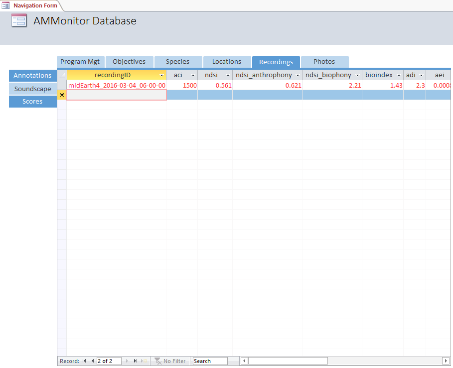

<div></div>

  - [Introduction](#introduction)
  - [Recordings](#recordings)
  - [The Soundscape Table](#the-soundscape-table)
  - [The soundscape() function](#the-soundscape-function)
  - [The Soundscape Table in Access](#the-soundscape-table-in-access)
  - [Chapter Summary](#chapter-summary)
  - [Chapter References](#chapter-references)

# Introduction

An acoustic monitoring program can be used to monitor focal species of
interest. However, it also can be used to monitor the ecosystem as a
whole. This chapter discusses the analysis of “soundscapes” \[1\], which
allow us to document the acoustic properties of an ecosystem during
certain times of the day or season. Monitoring programs can monitor
soundscapes through time and space, allowing an investigation of how
logging, agricultural expansion, energy development, and other land uses
may affect the natural system. Agencies or organizations may have a
natural resource management objective that can be measured with
soundscape analysis. For example, “Minimize the level of anthropogenic
disturbance” can be measured through time and space by quantifying a
recording’s anthrophony, a measure of human-generated acoustic
components within sound samples.

**Soundecology** \[2\] is an R package that calculates several
soundscape indices, such as acoustic complexity, bioindex, acoustic
diversity index, and acoustic evenness index. Many of these concepts are
derived from classic ecological diversity indices such as the
Shannon-Weiner index. Several of these are described in:
Villanueva-Rivera, L. J., B. C. Pijanowski, J. Doucette, and B. Pekin.
2011. A primer of acoustic analysis for landscape ecologists. Landscape
Ecology 26: 1233-1246. doi: 10.1007/s10980-011-9636-9 \[3\].

To illustrate the process of soundscape analysis with **AMMonitor**, we
will use the `dbCreateSample()` function to create a database called
“Chap13.sqlite”, which will be stored in a folder (directory) called
**database** within the **AMMonitor** main directory (which should be
your working directory in R). Recall that `dbCreateSample()` generates
all tables of an **AMMonitor** database, and then pre-populates sample
data into tables specified by the user.

Below, we create sample data for a few necessary tables using
`dbCreateSample()`. We will auto-populate the **soundscape** table with
**AMMonitor** functions later on in the chapter:

``` r
# Load AMMonitor
library(AMMonitor)

# Create a sample database for this chapter
dbCreateSample(db.name = "Chap13.sqlite", 
               file.path = paste0(getwd(),"/database"), 
               tables =  c('people', 'deployment',
                           'equipment', 'locations',
                           'accounts', 'schedule', 'recordings'))
```

    ## An AMMonitor database has been created with the name Chap13.sqlite which consists of the following tables:

    ## accounts, annotations, assessments, classifications, deployment, equipment, library, listItems, lists, locations, logs, objectives, people, photos, priorities, prioritization, recordings, schedule, scores, scriptArgs, scripts, soundscape, spatials, species, sqlite_sequence, templates, temporals

    ## 
    ## Sample data have been generated for the following tables: 
    ## accounts, people, equipment, locations, deployment, recordings, schedule

Now, we connect to the database. First, we initialize a character
object, **db.path**, that holds the database’s full file path. Then, we
create a database connection object, **conx**, using RSQLite’s
`dbConnect()` function, where we identify the SQLite driver in the ‘drv’
argument, and our **db.path** object in the ‘dbname’ argument:

``` r
# Establish the database file path as db.path
db.path <- paste0(getwd(), '/database/Chap13.sqlite')

# Connect to the database
conx <- RSQLite::dbConnect(drv = dbDriver('SQLite'), dbname = db.path)
```

After that, we send a SQL statement that will enforce foreign key
constraints.

``` r
# Turn the SQLite foreign constraints on
RSQLite::dbSendQuery(conn = conx, statement = "PRAGMA foreign_keys = ON;" )
```

    ## <SQLiteResult>
    ##   SQL  PRAGMA foreign_keys = ON;
    ##   ROWS Fetched: 0 [complete]
    ##        Changed: 0

# Recordings

The first step in a soundscape analysis is to collect recordings. As
mentioned in previous chapters, we will assume that deployed equipment
collects new recordings, which are sent to the ‘recording\_drop’
directory in the Dropbox cloud, and then moved to the more permanent
‘recordings’ directory with `dropboxMoveBatch()`; this function also
logs recording metadata to the **recording** table. For the sake of
illustration, we simulate this process by reading in four wave files
that come with the **AMMonitor** package, and writing the files directly
to the ‘recordings’ directory.

``` r
# Load the recordings
data(sampleRecordings)

# Look at the structure of this object 
str(sampleRecordings, max.level = 1)
```

    ## List of 4
    ##  $ :Formal class 'Wave' [package "tuneR"] with 6 slots
    ##  $ :Formal class 'Wave' [package "tuneR"] with 6 slots
    ##  $ :Formal class 'Wave' [package "tuneR"] with 6 slots
    ##  $ :Formal class 'Wave' [package "tuneR"] with 6 slots

Note the recordings object is a list of 4 wave objects (each with 6
slots) that we created with the package **tuneR** \[4\].

We now pretend that these four files were collected by the Middle Earth
monitoring team, and archived with `dropboxMoveBatch()` to the
‘recordings’ folder in the cloud on Dropbox, which also logs metadata
to the **recordings** table (see Chapter 11: Recordings).

``` r
# Write these as wave files to the drop folder
tuneR::writeWave(object = sampleRecordings[[1]], 
                 filename = "recordings/midEarth3_2016-03-12_07-00-00.wav")
tuneR::writeWave(object = sampleRecordings[[2]], 
                 filename = "recordings/midEarth4_2016-03-04_06-00-00.wav")
tuneR::writeWave(object = sampleRecordings[[3]], 
                 filename = "recordings/midEarth4_2016-03-26_07-00-00.wav")
tuneR::writeWave(object = sampleRecordings[[4]], 
                 filename = "recordings/midEarth5_2016-03-21_07-30-00.wav")

# view the recordings table
RSQLite::dbGetQuery(conx, 'SELECT * FROM recordings')
```

    ##                         recordingID locationID equipmentID  startDate startTime                                      filepath                  tz
    ## 1 midEarth3_2016-03-12_07-00-00.wav location@1     equip@3 2016-03-12  07:00:00 /recordings/midEarth3_2016-03-12_07-00-00.wav America/Los_Angeles
    ## 2 midEarth4_2016-03-04_06-00-00.wav location@2     equip@4 2016-03-04  06:00:00 /recordings/midEarth4_2016-03-04_06-00-00.wav America/Los_Angeles
    ## 3 midEarth4_2016-03-26_07-00-00.wav location@2     equip@4 2016-03-26  07:00:00 /recordings/midEarth4_2016-03-26_07-00-00.wav America/Los_Angeles
    ## 4 midEarth5_2016-03-21_07-30-00.wav location@3     equip@5 2016-03-21  07:30:00 /recordings/midEarth5_2016-03-21_07-30-00.wav America/Los_Angeles
    ##   format           timestamp
    ## 1    wav 2018-10-22 17:27:33
    ## 2    wav 2018-10-22 17:27:33
    ## 3    wav 2018-10-22 17:27:33
    ## 4    wav 2018-10-22 17:27:33

As shown, the metadata for the four recordings are stored in the
**recordings** table. The actual files reside in the Dropbox
**recordings** folder, and we can use `dropboxMetadata()` to confirm
this:

``` r
# Check metadata for the cloud based recordings directory 
recordings.meta <- dropboxMetadata(
  directory = 'recordings',
  token.path = 'settings/dropbox-token.RDS')
as.data.frame(recordings.meta[,'path_display'])
```

    ##               recordings.meta[, "path_display"]
    ## 1 /recordings/midEarth4_2016-03-26_07-00-00.wav
    ## 2 /recordings/midEarth3_2016-03-12_07-00-00.wav
    ## 3 /recordings/midEarth4_2016-03-04_06-00-00.wav
    ## 4 /recordings/midEarth5_2016-03-21_07-30-00.wav

As described in Chapter 11: Recordings, we can use the function
`dropboxGetOneFile()` to copy a file to our working directory. Here, we
will copy the file ‘midEarth4\_2016-03-04\_06-00-00.wav’ to our working
directory:

``` r
dropboxGetOneFile(
  file = 'midEarth4_2016-03-04_06-00-00.wav', 
  directory = 'recordings', 
  token.path = 'settings/dropbox-token.RDS', 
  local.directory = getwd())
```

    ## [1] TRUE

Next, we read the file into R’s global environment using **tuneR**’s
`readWave()` function.

``` r
# Read in this wave file into R
wav1 <- tuneR::readWave(filename = 'midEarth4_2016-03-04_06-00-00.wav')

# Show the wave file
wav1
```

    ## 
    ## Wave Object
    ##  Number of Samples:      2343936
    ##  Duration (seconds):     53.15
    ##  Samplingrate (Hertz):   44100
    ##  Channels (Mono/Stereo): Mono
    ##  PCM (integer format):   TRUE
    ##  Bit (8/16/24/32/64):    16

This object is a wav file, an S4 object created by **tuneR**. It is
53.15 seconds long, and has a sampling rate of 44100 samples per second,
with 53.15 \* 44100 = \~ 2343936 number of samples. The file was
recorded with a single channel microphone (mono). We’ll now analyze the
soundscape of this file.

# The Soundscape Table

Before we begin our analysis, let’s view the schema of the
**soundscape** table, which stores soundscape data for a recording:

``` r
# Look at information about the soundscape table
dbTables(db.path = db.path, table = "soundscape")
```

    ## $soundscape
    ##    cid             name         type notnull        dflt_value pk comment
    ## 1    0      recordingID VARCHAR(255)       1              <NA>  1        
    ## 2    1              aci         REAL       0              <NA>  0        
    ## 3    2             ndsi         REAL       0              <NA>  0        
    ## 4    3 ndsi_anthrophony         REAL       0              <NA>  0        
    ## 5    4    ndsi_biophony         REAL       0              <NA>  0        
    ## 6    5         bioindex         REAL       0              <NA>  0        
    ## 7    6              adi         REAL       0              <NA>  0        
    ## 8    7              aei         REAL       0              <NA>  0        
    ## 9    8           minFrq         REAL       0              <NA>  0        
    ## 10   9           maxFrq         REAL       0              <NA>  0        
    ## 11  10        timestamp VARCHAR(255)       1 CURRENT_TIMESTAMP  0

The **soundscape** table has 11 columns, and the primary key is the
*recordingID*. Columns 2 through 10 store soundscape metrics for a given
recordingID, and column 11 logs the timestamp for new entries. Each of
the metrics are calculated by functions written by the authors of the
package **soundecology** \[2\] or by the package **tuneR** \[4\]. The
**AMMonitor** function, `soundscape()`, calls their functions, and logs
the results into the **soundscape** table. The columns are defined as
follows (borrowing liberally from the package helpfiles):

  - aci = acoustic complexity index, calculated with **soundecology**’s
    \[2\] `acoustic_complexity()` function. The aci is based on the
    “observation that many biotic sounds, such as bird songs, are
    characterized by an intrinsic variability of intensities, while some
    types of human generated noise (such as car passing or airplane
    transit) present very constant intensity values”.
  - ndsi = normalized difference soundscape index, calculated with
    **soundecology**’s \[2\] `ndsi()` function. The ndsi seeks to
    “estimate the level of anthropogenic disturbance on the soundscape
    by computing the ratio of human-generated (anthrophony) to
    biological (biophony) acoustic components found in field collected
    sound samples” \[5\].
  - ndsi\_anthrophony = value for the anthrophony portion of the ndsi
    metric, calculated with **soundecology**’s \[2\] `ndsi()` function.
  - ndsi\_biophony = value for the biophony portion of the NDSI metric,
    calculated with **soundecology**’s \[2\] `ndsi()` function.
  - bioindex = bioacoustic index, calculated with **soundecology**’s
    \[2\] `bioacoustic_index()` function. The Bioacoustic Index is
    calculated as the “area under each curve included all frequency
    bands associated with the dB value that was greater than the minimum
    dB value for each curve. The area values are thus a function of both
    the sound level and the number of frequency bands used by the
    avifauna” \[6\].
  - adi = acoustic diversity index, calculated with **soundecology**’s
    \[2\] `acoustic_diversity()` function. The ADI is calculated by
    dividing the spectrogram into bins (default 10) and taking the
    proportion of the signals in each bin above a threshold (default -50
    dBFS). The ADI is the result of the Shannon index applied to these
    bins.
  - aei = acoustic eveness index, calculated with **soundecology**’s
    \[2\] `acoustic_evenness()` function. The AEI is calculated by
    dividing the spectrogram into bins (default 10) and taking the
    proportion of the signals in each bin above a threshold (default -50
    dBFS). The AEI is the result of the Gini index applied to these
    bins.
  - minFrq - the lowest registered frequency across the recording,
    calculated with the package **tuneR**’s \_\_\_ function \[4\].
  - maxFrq - the highest registered frequency across the recording,
    calculated with the package **tuneR**’s \_\_\_ function \[4\].

Although users will not use **soundecology** \[2\] directly, it is
important to illustrate at least one **soundecology** function and note
the many defaults that are employed. Here, we will use the
`acoustic_complexity()` function to compute the acoustic complexity of
our wave file.

``` r
# Load the soundecology package
library(soundecology)

# Run the acoustic_complexity with soundecology defaults
soundecology::acoustic_complexity(soundfile = wav1)
```

    ## 
    ##  max_freq not set, using value of: 22050 
    ## 
    ## 
    ##  min_freq not set, using value of: 0 
    ## 
    ## 
    ##  This is a mono file.
    ## 
    ##  Calculating index. Please wait... 
    ## 
    ##   Acoustic Complexity Index (total): 1500.366

As shown, the acoustic complexity index of our sample file has been
calculated as 1500.366. Notice also that the complexity was calculated
assuming the max\_freq to use when calculating the index is 22050, and
the min\_freq is 0. Two other defaults were used in this simple function
call: ‘j’ = 5 and ‘fft\_w’ = 512, confirmed with the `args()` function:

``` r
args(soundecology::acoustic_complexity)
```

    ## function (soundfile, min_freq = NA, max_freq = NA, j = 5, fft_w = 512) 
    ## NULL

A quick look at the **soundecology** `acoustic_complexity()` helpfiles
reveals that the ‘j’ argument gives the cluster size in seconds, while
the ‘fft\_w’ argument tells the function which FFT window to use.

This simple example highlights the fact that each **soundscape** \[2\]
function has many default values. The **AMMonitor** function
`soundscape()` uses these default values, which may or may not be
desirable for your monitoring program. If you would like to change these
defaults, you may do so by running the `soundscape()` function as a
script (Chapter 20).

# The soundscape() function

At last, we are able to illustrate **AMMonitor**’s `soundscape()`
function. This function has several arguments, the first of which is the
recording to be analyzed, identified by recordingID as logged in the
database. If the file is located in the dropbox cloud, a ‘token.path’
must be provided. The ‘directory’ argument is used to indicate either
the local directory or Dropbox directory where the recording can be
found. Here, we set ‘db.insert’ to FALSE to indicate that we do not wish
to insert the results to our database, and instead will test the
function first:

``` r
results <- AMMonitor::soundscape(db.path = NULL,
               recordingID = 'midEarth4_2016-03-04_06-00-00.wav',
               directory = 'recordings', 
               token.path = NULL,
               db.insert = FALSE)
```

    ## 
    ##  min_freq not set, using value of: 0 
    ## 
    ## 
    ##  This is a mono file.
    ## 
    ##  Calculating index. Please wait... 
    ## 
    ##   Acoustic Complexity Index (total): 1500.366
    ## 
    ## 
    ##  This is a mono file.
    ## 
    ##  Calculating index. Please wait... 
    ## 
    ##   Normalized Difference Soundscape Index: 0.6736117
    ## 
    ## 
    ##  This is a mono file.
    ## 
    ##  Calculating index. Please wait... 
    ## 
    ##   Bioacoustic Index: 46.00534
    ## 
    ## 
    ##  This is a mono file.
    ## 
    ##  Calculating index. Please wait... 
    ## 
    ##   Acoustic Diversity Index: 3.090592
    ## 
    ##  This is a mono file.
    ## 
    ##  Calculating index. Please wait... 
    ## 
    ##   Acoustic Evenness Index: 0.008127

``` r
# view results
results
```

    ##                          recordingID      aci      ndsi ndsi_anthrophony ndsi_biophony bioindex      adi      aei minFrq maxFrq           timestamp
    ## 1: midEarth4_2016-03-04_06-00-00.wav 1500.366 0.6736117        0.5923499      3.037376 46.00534 3.090592 0.008127      0      0 2019-07-24 15:26:33

It is useful to check the results of the function before inserting to
the database to confirm that all is well. Once confirmed, users may
regularly use this function to obtain soundscape metrics for recordings
that are stored in the Dropbox cloud by providing the Dropbox token in
‘token.path’. Here, we will insert the results into our database table
**soundscape** as well.

``` r
# Run soundscape analyses
AMMonitor::soundscape(db.path = db.path,
         recordingID = 'midEarth4_2016-03-04_06-00-00.wav',
         directory = 'recordings', 
         token.path = 'settings/dropbox-token.RDS', 
         db.insert = TRUE)
```

    ## 
    ##  min_freq not set, using value of: 0 
    ## 
    ## 
    ##  This is a mono file.
    ## 
    ##  Calculating index. Please wait... 
    ## 
    ##   Acoustic Complexity Index (total): 1500.366
    ## 
    ## 
    ##  This is a mono file.
    ## 
    ##  Calculating index. Please wait... 
    ## 
    ##   Normalized Difference Soundscape Index: 0.6736117
    ## 
    ## 
    ##  This is a mono file.
    ## 
    ##  Calculating index. Please wait... 
    ## 
    ##   Bioacoustic Index: 46.00534
    ## 
    ## 
    ##  This is a mono file.
    ## 
    ##  Calculating index. Please wait... 
    ## 
    ##   Acoustic Diversity Index: 3.090592
    ## 
    ##  This is a mono file.
    ## 
    ##  Calculating index. Please wait... 
    ## 
    ##   Acoustic Evenness Index: 0.008127
    ## Removing Dropbox Web wave file from temporary directory.

    ##                          recordingID      aci      ndsi ndsi_anthrophony ndsi_biophony bioindex      adi      aei minFrq maxFrq           timestamp
    ## 1: midEarth4_2016-03-04_06-00-00.wav 1500.366 0.6736117        0.5923499      3.037376 46.00534 3.090592 0.008127      0      0 2019-07-24 15:26:42

``` r
# Check database to ensure events were added:
RSQLite::dbGetQuery(conx, "SELECT * FROM soundscape")
```

    ##                         recordingID      aci      ndsi ndsi_anthrophony ndsi_biophony bioindex      adi      aei minFrq maxFrq           timestamp
    ## 1 midEarth4_2016-03-04_06-00-00.wav 1500.366 0.6736117        0.5923499      3.037376 46.00534 3.090592 0.008127      0      0 2019-07-24 15:26:42

As shown, the results of the `soundscape()` function have been uploaded
to the **soundscape** table.

This table can be used to monitor soundscape conditions over time. A
monitoring team may wish to automate the analysis of soundscapes for
each new recording that is collected. We illustrate how a script can be
used to accomplish this task, as described in Chapter 19, Scripts.

Further, if an agency or organization has a natural resource objective
that is related to soundscape condition, results of this table can be
used to assess the current state of the ecosystem with respect to the
stated objective. We discuss such “assessments” in Chapter 20.

# The Soundscape Table in Access

The soundscape table is a secondary tab in the Access Navigation Form,
under the “Recordings” primary tab.

<kbd>



</kbd>

> *Figure 13.1. The soundscape table is populated by R. It is located
> under the Recordings primary tab.*

Notice that there is one entry in sample database (the analysis we ran
earlier in the chapter). The table is displayed in “datasheet” view,
where entries are colored in red to remind users that the table is
populated by R.

# Chapter Summary

In this chapter, you learned the **AMMonitor** approach to analyzing
soundscapes and storing results in the **soundscape** database table.
The `soundscape()` function draws heavily on functions written by the
authors of the package **soundecology** \[2\] or by the package
**tuneR** \[4\] to calculate soundscape metrics. The `soundscape()`
function allows a seamless connection between the database recordingIDs,
the actual recordings that are stored in the cloud, and the results that
are added to the **soundscape** table.

# Chapter References

<div id="refs" class="references">

<div id="ref-Pijanowski2011">

1\. Pijanowski B. C., Villanueva-Rivera L. J., Dumyahn S. L., Farina A.,
Krause B. L., Napoletano et a B. M. Soundscape ecology: The science of
sound in the landscape. BioScience. 2011;61: 203–216. 

</div>

<div id="ref-soundecology">

2\. Villanueva-Rivera LJ, Pijanowski BC. Soundecology: Soundscape
ecology \[Internet\]. 2018. Available:
<https://CRAN.R-project.org/package=soundecology>

</div>

<div id="ref-Villanueva2011">

3\. Villanueva-Rivera L. J., B. C. Pijanowski, J. Doucette, Pekin B. A
primer of acoustic analysis for landscape ecologists. Landscape Ecology.
2011;26: 1233–1246.
doi:[10.1007/s10980-011-9636-9](https://doi.org/10.1007/s10980-011-9636-9)

</div>

<div id="ref-tuneR">

4\. Ligges U. TuneR: Analysis of music and speech (version 1.3.3)
\[Internet\]. Comprehensive R Archive Network; 2018. Available:
<https://cran.r-project.org/web/packages/tuneR/index.html>

</div>

<div id="ref-Kasten">

5\. Kasten EP, Gage SH, Fox J, Joo W. The remote environmental
assessment laboratory’s acoustic library: An archive for studying
soundscape ecology. Ecological Informatics. 2012;12: 50–67. 

</div>

<div id="ref-Boelman">

6\. NT B, GP A, PJ H, RE. M. Multi-trophic invasion resistance in
hawaii: Bioacoustics, field surveys, and airborne remote sensing.
Ecological Applications. 17: 2137–2144. 

</div>

</div>
