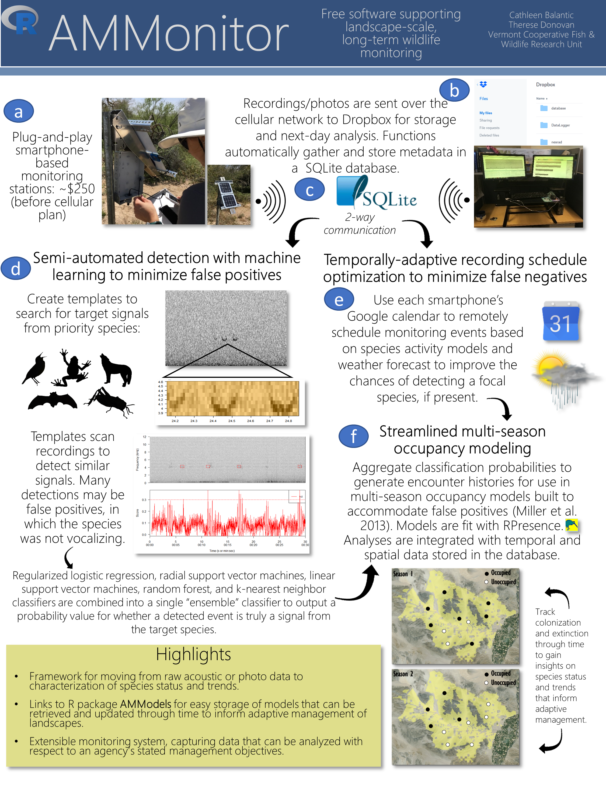

Amid climate change and rapidly shifting land uses, effective methods for monitoring natural resources are critical to support scientifically-informed resource management decisions [@Holling1978; @Walters1986; @Lee1993; @Pollock2002; @Allen2015]. The practice of using Autonomous Monitoring Units (AMUs) to monitor wildlife species has grown immensely in the past decade, with monitoring projects across species from birds, to bats, amphibians, insects, terrestrial mammals, and marine mammals [@August2015, @Burton2015]. 

AMUs have many benefits. Primarily, they can be deployed for long periods of time to collect massive amounts of data, such as audio recordings and photos. Having a record of audio and photo data allows researchers to carefully verify and analyze species identifications *a posteriori* [@Hobson2002]. 

However, automated methods have several limitations. First, individual AMUs can be expensive, running over $800 USD for commercial devices [@WildlifeAcoustics2019], although cost-effective models are becoming more common [@Whytock2017, @Hill2018]. Second, data are typically stored on AMUs until researchers can retrieve it, causing time lapses between data collection, analysis, and results. Such delays hamper the ability to efficiently address pressing ecological challenges and track progress toward management objectives. Third, the data management requirements of an AMU research effort are often immense. A monitoring program is a collection of people, equipment, monitoring locations, location characteristics, research objectives, and data files, with multiple moving parts to manage. Without a comprehensive framework for efficiently moving from raw data collection to results and analysis, monitoring programs are limited in their capacity to characterize ecological processes and inform management decisions [@Gregory2006; @Rehme2011; @Fontaine2011; @Greig2013; @Rist2013; @Fischman2016; @Williams2016]. 

To address these challenges, we have developed **AMMonitor**, an open source R package dedicated to collecting, storing, and analyzing AMU information in a way that 1) is cost-effective, 2) efficiently processes and stores large quantities of diverse data, 3) utilizes statistical learning to improve identification of target events, 4) leverages the vast and growing community of R-based analytics, and 5) seamlessly integrates a wide variety of data analyses to facilitate assessment of the current state of a system with respect to management objectives. Thus, AMMonitor’s primary function is to enable the practice of **a**daptive **m**anagement via a novel and flexible integrated system. 

The **AMMonitor** package builds upon two R packages: (1) **monitoR** [@monitoR], which uses algorithms to automatically search audio files for target species, and (2) **AMModels** [@AMModels], an R package that stores models (analytical outputs) for future use. Our approach uses Android smartphones as AMUs, though this is not required. The package relies on a SQLite database and cloud-based storage to promote collaboration. The **AMMonitor** package was developed with a prototype of 20 AMUs (smartphones) in a 2015-2017 project for the U.S. Bureau of Land Management in California, USA, and places monitoring efforts within an adaptive management framework [@USBLM2016, @BalanticStatistical]. Since then, we have increased the monitoring capacity of the AMUs by enabling timed photographs as well as motion-triggered photographs, allowing the smartphones to act as “cam-trackers.”

Figure 1.1 provides an overview of AMMonitor. 

1. Holling CS, United Nations Environment Programme. Adaptive environmental assessment and management. Laxenburg, Austria; Chichester, New York: International Institute for Applied Systems Analysis; Wiley; 1978. pp. xviii, 377p.

2. Walters C. Adaptive management of renewable resources. New York: Macmillan; 1986. p. 374 p.

3. Lee K. Compass and gyroscope: Integrating science and politics for the environment. Washington DC: Island Press; 1993. p. 255 p.

4. Pollock KH, Nichols JD, Simons TR, Farnsworth GL, Bailey LL, Sauer JR. Large scale wildlife monitoring studies: Statistical methods for design and analysis. Environmetrics. 2002;13: 105–119.

5. Allen CR, Garmestani AS, editors. Adaptive management of social-ecological systems [Internet]. Springer Science Mathplus Business Media; 2015. doi:10.1007/978-94-017-9682-8

6. August T, Harvey M, Lightfoot P, Kilbey D, Papadopoulos T, Jepson P. Emerging technologies for biological recording. Biological Journal of the Linnean Society. 2015;115: 731–749.

7. Burton AC, Neilson E, Moreira D, Ladle A, Steenweg R, Fisher JT, et al. Wildlife camera trapping: A review and recommendations for linking surveys to ecological processes. Journal of Applied Ecology. 2015;52: 675–685.

8. Hobson KA, Rempel RS, Greenwood H, Turnbull B, Van Wilgenburg S. Acoustic surveys of birds using electronic recordings: New potential from an omnidirectional microphone system. Wildlife Society Bulletin. 2002;30: 709–720.

9. Song meter sm4 [acoustic recording hardware] [Internet]. Wildlife Acoustics; 2019. Available: https://www.wildlifeacoustics.com/products/song-meter-sm4

10. Whytock RC, Christie J. Solo: An open source, customizable and inexpensive audio recorder for bioacoustic research. Methods in Ecology and Evolution. 2017;8: 308–312.

11. Hill AP, Prince P, Piña Covarrubias E, Doncaster CP, Snaddon JL, Rogers A. AudioMoth: Evaluation of a smart open acoustic device for monitoring biodiversity and the environment. Methods in Ecology and Evolution. 2018;9: 1199–1211.

12. Gregory R, Ohlson D, Arvai J. Deconstructing adaptive management: Criteria for applications to environmental management. Ecological Applications. 2006;16: 2411–2425.

13. Rehme SE, Powell LA, Allen CR. Multimodel inference and adaptive management. Journal of Environmental Management. 2011;92: 1360–1364.

14. Fontaine JJ. Improving our legacy: Incorporation of adaptive management into state wildlife action plans. Journal of Environmental Management. 2011;92: 1403–1408.

15. Greig LA, Marmorek DR, Murray C, Robinson DCE. Insight into enabling adaptive management. Ecology and Society. 2013;18.

16. Rist L, Felton A, Samuelsson L, Sandstrom C, Rosvall O. A new paradigm for adaptive management. Ecology and Society. 2013;18.

17. Fischman RL, Ruhl JB. Judging adaptive management practices of us agencies. Conservation Biology. 2016;30: 268–275.

18. Williams BK, Brown ED. Technical challenges in the application of adaptive management. Biological Conservation. 2016;195: 255–263.

19. Hafner S, Katz J. MonitoR: Acoustic template detection in r (version 1.0.7) [Internet]. Comprehensive R Archive Network; 2018. Available: http://www.uvm.edu/rsenr/vtcfwru/R/?Page=monitoR/monitoR.htm

20. Katz J, Donovan T. AMModels: Adaptive management model manager (version 0.1.4) [Internet]. Comprehensive R Archive Network; 2018. Available: https://cran.r-project.org/web/packages/AMModels/

21. Riverside east solar energy zone long term monitoring strategy: Final report. U.S. Bureau of Land Management, Environmental Science Division, Argonne National Laboratory; 2016.

22. Balantic C.M., Donovan T. Statistical learning mitigation of false positive detections in automated acoustic wildlife monitoring. 2019.

23. Muller K, Wickham H, Francois R, Bryan J, RStudio. Tibble: Simple data frames (version 2.0.1) [Internet]. Comprehensive R Archive Network; 2019. Available: https://cran.r-project.org/web/packages/tibble/index.html

24. Müller K, Wickham H, James DA, Falcon S. RSQLite: ’SQLite’ interface for r (version 2.1,1) [Internet]. Comprehensive R Archive Network; 2018. Available: https://cran.r-project.org/web/packages/RSQLite/index.html

25. Dowle M, Srinivasan A, Gorecki J, Chirico M, Stetsenko P, Short T, et al. Data.table: Extension of ’data.frame’ (version 1.12.0) [Internet]. Comprehensive R Archive Network; 2019. Available: https://cran.r-project.org/web/packages/data.table/index.html

26. Kuhn M. Caret: Classification and regression training (version 6.0) [Internet]. Comprehensive R Archive Network; 2018. Available: https://cran.r-project.org/web/packages/caret/index.html