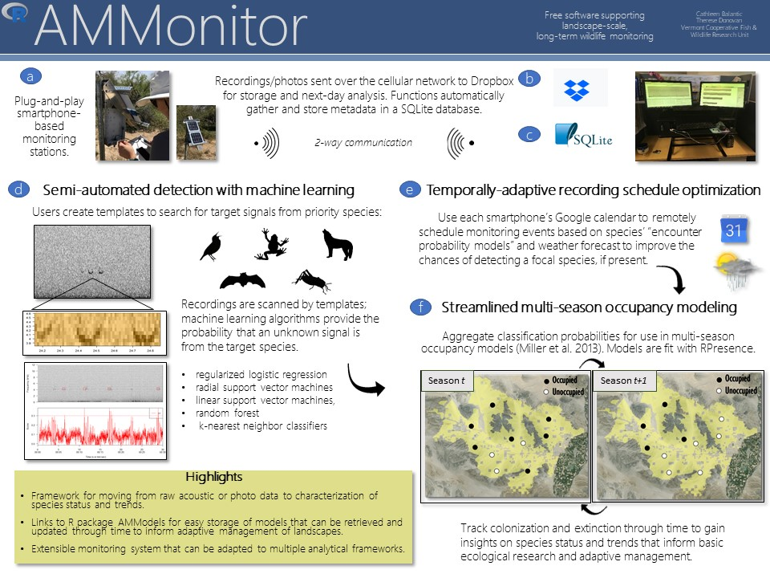
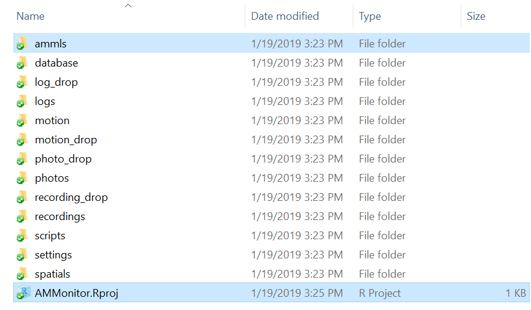

Chapter 1: Getting Started with AMMonitor
================

  - [Key Elements of the AMMonitor
    Approach](#key-elements-of-the-ammonitor-approach)
  - [Installing AMMonitor](#installing-ammonitor)
  - [Cloud-Based Account](#cloud-based-account)
  - [AMMonitor Directory Structure](#ammonitor-directory-structure)
  - [AMModels: A Vehicle for Storing Models in a Model
    Library](#ammodels-a-vehicle-for-storing-models-in-a-model-library)
  - [Chapter Summary](#chapter-summary)
  - [Bibliography](#bibliography)

In this chapter, we outline the R package **AMMonitor**, and provide
guidance on getting started. **AMMonitor** is a multi-purpose monitoring
platform that utilizes (1) AMUs such as smartphones to collect data, (2)
SQLite as a database engine for storing and tracking all components of
the monitoring effort, and (3) a suite of R-based functions for analysis
of monitoring data.

The AMMonitor approach starts with ecological hypotheses or natural
resource management objectives (Figure 1.1). Data are collected to test
these hypotheses or to evaluate the state of a resource with respect to
a management objective. Acoustic recordings and photos are collected on
Android smartphone AMUs, which deliver files to the cloud. Raw and
processed data are stored in a SQLite database. The data can be analyzed
with a wide variety of analytical methods, often models of abundance or
occupancy pattern. These analyses can be stored, and resulting outputs
can be compared with research and monitoring objectives to track
progress toward management goals. The final results are assessed with
respect to hypotheses or objectives.


*Figure 1.1. The general AMMonitor framework begins with basic research
hypotheses or applied resource management objectives (boxed).*

# Key Elements of the AMMonitor Approach

As previously mentioned, **AMMonitor** was developed as a prototype for
monitoring wildlife in sunny California, USA. Our prototype included the
following elements (keyed to Figure 1.2).


*Figure 1.2. A generalized overview of the AMMonitor approach.*

  - Smart phone monitoring: Each cell phone station is fully
    plug-and-play, with an Android cell phone and external microphone
    stored in a weather-proof box mounted to a pole (Figure 1.2a).
    Stations are remote and powered by solar panels. Each cell phone is
    connected to a Google account and receives its recording/photo
    schedule daily via a Google calendar connection when in data
    transmission mode. Audio files, photos, and performance logs are
    sent directly to a linked Dropbox account daily, where they are then
    archived and analyzed using AMMonitor functions (Figure 1.2b).

  - Data Storage and Handling: Raw data, along with some automatically
    processed data, are stored within a SQLite database (Figure 1.2c).
    SQLite is a self-contained, high-reliability, embedded,
    full-featured, public-domain, SQL database engine. It is the most
    used database engine in the world, with a maximum storage of 140
    terabytes. AMMonitor uses the R package, RSQLite \[1\] to connect R
    with the database. Database tables (highlighted in bold in this
    paragraph) store data and metadata about the overall monitoring
    effort. First, a monitoring effort is driven by an agency’s or
    researcher’s **objectives**. These objectives are often, but not
    always, **species**-centered. The **people** table stores
    information about members of the monitoring team. They deploy
    **equipment** across various locations to monitor ecosystems via
    cell phones, each connected to a Google account and tracked through
    the **deployment** table. Location-specific temporal and spatial
    information are stored in the **temporals** and **spatials** tables.
    The deployed equipment collects photos and/or recordings on a
    **schedule** transmitted to each phone’s Google calendar daily. The
    collected files are delivered to and remain in the cloud – metadata
    about cloud-based files are stored in the **photos** and
    **recordings** tables. Team members can manually search files for
    target species or target signals, identified in a signal
    **library**, by logging **annotations** (a process known as
    labeling). General features of an audio file are summarized and
    stored in the **soundscapes** table. To facilitate automated
    detection of target sounds, team members can create **templates** of
    target signals. Templates are run against incoming recordings; the
    **scores** table stores metrics indicating the closeness of a signal
    to the template. Machine learning (ML) classifiers are used to
    return the probability that a detected event is the target signal,
    stored in the **classifications** table. Classifications, along with
    annotations, can be used in a variety of statistical approaches to
    analyze the state of the ecosystem with respect to research
    hypotheses or management objectives. And we’ve come full-circle.

  - Analysis Storage and Handling. While the SQLite database stores much
    of the data, most analytical outputs are stored in an AMModels
    library \[2,3\]. The concept of an AMModels library is extremely
    simple: a library stores the outputs of an R analysis (often in the
    form of a model), along with descriptive metadata, so that they may
    be easily recalled and used in the future. As a brief example, an R
    user may invoke the ‘lm’ function to analyze a dataset in a simple
    linear regression framework. The ‘lm’ function outputs are stored as
    an object of class ‘lm’, which contains a vast amount of
    information, including model inputs, model coefficients, fitting
    information, and residuals. This model, along with its metadata, can
    be stored in an AMModels library. This model can be used to generate
    predictions on new data. In the context of AMMonitor, we use an
    AMModel library to store 1) models that predict species activity
    patterns (e.g., singing) as a function of covariates, 2) machine
    learning classification models that provide the probability that a
    signal is a target signal of interest, and 3) analytical results,
    such as an occupancy analysis or soundscape analysis.

This guide will explain each step of the AMMonitor approach in detail.

# Installing AMMonitor

To begin, use the `install.packages()` function to install
**AMMonitor**.

``` r
library(devtools)
devtools::install_git(url = "https://code.usgs.gov/vtcfwru/ammonitor")
```

The package overview and function index page can be accessed with the
following code:

``` r
# View package overview
help("AMMonitor")

# View function index page
help(package = "AMMonitor")
```

The package itself contains many functions and built-in datasets, which
we will introduce over the course of this book. Below, we display the
first 10 functions and datasets as a tibble \[4\]:

``` r
# List the functions in AMMonitor
as.data.frame(ls("package:AMMonitor"))
```

    # A tibble: 87 x 1
       `ls("package:AMMonitor")`
       <fct>                    
     1 accounts                 
     2 activity_amml            
     3 ammCreateDirectories     
     4 analysis                 
     5 annotatePhoto            
     6 annotateRecording        
     7 annotateRecordingModular 
     8 annotations              
     9 classifications          
    10 classifier_practice      
    # ... with 77 more rows

**AMMonitor** has a handful of package dependencies. These include:

  - RSQLite \[1\] - connects R to a SQLite database.
  - AMModels \[2\] - a vehicle for storing models (analytical output)
    for future use.
  - data.table \[5\]- enables rapid sorting and manipulation of large
    tables.
  - monitoR \[6\]- pits templates against collected recordings to search
    for target signals.
  - caret \[7\] - provides machine learning functions for refining the
    performance of automated detection via **monitoR** templates.

# Cloud-Based Account

The **AMMonitor** framework assumes that files are stored on a
cloud-based system to promote collaboration. Such a system will also
save your own personal computer from filling up with terabytes of
monitoring data. Currently, **AMMonitor** functions assume Dropbox is
the primary cloud-based solution. Future upgrades to the package may
include other solutions, such as Google Drive or Amazon.

Set up your Dropbox account at <http://www.dropbox.com>. Because
monitoring with AMUs can generate a massive amount of data in a short
amount of time, your program may require a subscription account that
accommodates many terabytes of data. The email account you link to
Dropbox should be an email that represents the main monitoring project
(e.g., a gmail account that represents the project rather than any one
individual). In this vignette, our Dropbox account is associated with
‘midEarthMgt@gmail.com’.

After creating a Dropbox account, users can download the
DropboxInstaller from <https://www.dropbox.com/install>, which allows
your personal computer to connect to and sync with the Dropbox account
in the cloud. You do not need to sync the entire Dropbox account to your
computer (and likely would not want to unless the computer has ample
storage space).

# AMMonitor Directory Structure

**AMMonitor** is a multi-purpose monitoring platform, and the
**functions within it rely on a specific directory structure that we
assume all users will implement**.

The function `ammCreateDirectories()` is the first function users will
run to set up a monitoring program with **AMMonitor**. The code below
illustrates how to set up a primary directory called “AMMonitor” on the
E drive in a directory called “Dropbox”.

``` r
# Create the AMMonitor directory structure
ammCreateDirectories(amm.dir.name = "AMMonitor", 
                     file.path = "E:/Dropbox")
```

**Important note: Ensure that this folder is a top-level Dropbox
directory that is not nested inside any other folder**.

If you are an RStudio user, you may wish to associate an R project with
this particular folder so that you can launch this project by clicking
on the .Rproj file, which opens R and sets the folder as your working
directory. If you are not an RStudio user, use the `setwd()` function to
set this main directory as your working directory whenever you use
**AMMonitor**.


*Figure 1.3. Directory structure that is required by the AMMonitor
approach.*

Each (empty) directory will store specific types of information as
introduced below:

  - **ammls**: Stores AMModel libraries (discussed below).
  - **database**: Stores the SQLite database (Chapter 2).
  - **log\_drop**: Stores incoming logs collected by the Tasker Android
    application on smartphone performance (Appendix 2).
  - **logs**: Stores archived logs collected by the Tasker Android
    application on smartphone performance (Appendix 2).
  - **motion\_drop**: Stores incoming photos triggered by a
    motion-detection smartphone application (Chapter 12) .
  - **motion**: Stores archived photos collected by the smartphone as
    motion-triggered events (Chapter 12).
  - **photo\_drop**: Stores incoming photos collected by the smartphone
    as timed events (Chapter 12).
  - **photos**: Stores archived photos collected by the smartphone as
    timed events (Chapter 12).
  - **recording\_drop**: Stores incoming audio recording files (e.g.,
    .wav) captured in acoustic monitoring programs (Chapter 11).
  - **recordings**: Stores archived audio recording files (e.g., .wav)
    captured in acoustic monitoring programs (Chapter 11).
  - **scripts**. Stores R scripts that can be sourced each day to
    automatically process new data (chapter 20).
  - **settings**: Stores files needed to access accounts (e.g., Google
    or Dropbox) via R (multiple chapters).
  - **spatials**: Stores spatial layers associated with locations in a
    monitoring program (rasters and/or shapefiles) as RDS files (Chapter
    6).

We will describe each directory in detail as they become relevant in the
**AMMonitor** workflow. For example, we introduce users to the **AMModel
libraries** below, wherein we will create several libraries to be stored
in the **amml** directory. In the next chapter, we introduce users to
the **AMMonitor** database, where we will create a SQLite database and
store it in the **database** directory.

# AMModels: A Vehicle for Storing Models in a Model Library

The **AMMonitor** SQLite database does much of the heavy lifting for
managing AMMonitor data by tracking people, equipment, metadata about
recordings and photos, and more. To store and manage models, however, we
use the R package, **AMModels** \[2\]. Generally speaking, a “model” is
typically the result of some analysis. An **AMModel** “library” stores a
collection of models as a single R object (the “model library”) that can
be saved to an .RDS file, thus allowing models to be retrieved for
future use. Models may be used for a variety of purposes: a) to generate
predictions, b) to serve as a prior model to be updated with Bayesian
methods as new data are collected, c) to assess the system state with
respect to management objectives, and d) to predict responses to
management activities. Models stored in an **AMModels** library retain
their original R class, can be associated with metadata, and can be
easily saved and retrieved when needed.

In the context of **AMMonitor**, models are used to: (1) inform when
target species are likely to be available for detection (either
acoustically or visually), (2) classify automatically detected targets
as true target signals or false alarms, (3) predict conditions
associated with an overall soundscape, and (4) identify patterns of
species occurrence through time with dynamic occupancy models.

Next, we use the **AMModels** function `amModelLib()` to create four
separate model libraries. `amModelLib()` requires only a description
field, but additional metadata may also be included:

``` r
library(AMModels)

# look at the AMModels help page
# help("AMModels")

# Create a  library called "activity"
activity <- AMModels::amModelLib(description = "This library stores models that predict species activity patterns.")

# Create a library called  classifiers 
classifiers <- AMModels::amModelLib(description = "This library stores classification models (machine learning models) that can be used to predict the probability that a detected signal is from a target species.")

# Create a  library called soundscape
soundscape <- AMModels::amModelLib(description = "This library stores results of a soundscape analysis.")

# Create a library called do_fp
do_fp <- AMModels::amModelLib(description = "This library stores results of dynamic occupancy analyses that can handle false positive detections.")

# Create a list of metadata to be added to each library
info <- list(PI = 'Bilbo Baggins', 
             Organization = 'Middle Earth Conservancy')

# Add metadata to each library
ammlInfo(activity) <- info
ammlInfo(classifiers) <- info
ammlInfo(soundscape) <- info
ammlInfo(do_fp) <- info

# Look at one of the libraries
activity
```

``` 

Description:
[1] This library stores models that predict species activity patterns.

Info:
  PI 
   [1] Bilbo Baggins
  Organization 
   [1] Middle Earth Conservancy

Models:

 --- There are no models --- 

Data:

 --- There are no datasets --- 
```

Here, we view the “activity” library, used to store models that predict
when species will be active and available for detection. For now, all of
the model libraries are empty; we will populate each library as we move
through various chapters.

Note that we have elected to create four distinct model libraries.
However, we could have created a single library which would store all
models related to a monitoring project. **AMMonitor** functions that
require a model will ask you to identify the name of the model library
and the name of the model. As long as you can point to a specific
library and model name, the function will be able to retrieve the model.

For now, we simply need to save the libraries to our “ammls” directory.

``` r
# Save the libraries to the AMMonitor amml folder
saveRDS(object = activity, file = "ammls/activity.RDS")
saveRDS(object = classifiers, file = "ammls/classifiers.RDS")
saveRDS(object = soundscape, file = "ammls/soundscape.RDS")
saveRDS(object = do_fp, file = "ammls/do_fp.RDS")
```

Thoughout this book, we will add models to these libraries.
**AMMonitor** functions will then acquire the models when they are
called into action by the user.

# Chapter Summary

At this point, you have 1) created a file directory required by
AMMonitor, and 2) created four **AMModels** libraries in the **ammls**
directory. You are now ready to create the SQLite database, which stores
information about the entire monitoring effort.

# Bibliography

<div id="refs" class="references">

<div id="ref-RSQLite">

1\. Müller K, Wickham H, James DA, Falcon S. RSQLite: ’SQLite’ interface
for r (version 2.1,1) \[Internet\]. Comprehensive R Archive Network;
2018. Available:
<https://cran.r-project.org/web/packages/RSQLite/index.html>

</div>

<div id="ref-AMModels">

2\. Katz J, Donovan T. AMModels: Adaptive management model manager
(version 0.1.4) \[Internet\]. Comprehensive R Archive Network; 2018.
Available: <https://cran.r-project.org/web/packages/AMModels/>

</div>

<div id="ref-Donovan2018">

3\. Donovan T, Katz J. AMModels: An r package for storing models, data,
and metadata to facilitate adaptive management. PLoS ONE. 2018;13:
1339–1345.
doi:[10.1371/journal.pone.0188966](https://doi.org/10.1371/journal.pone.0188966)

</div>

<div id="ref-tibble">

4\. Muller K, Wickham H, Francois R, Bryan J, RStudio. Tibble: Simple
data frames (version 2.0.1) \[Internet\]. Comprehensive R Archive
Network; 2019. Available:
<https://cran.r-project.org/web/packages/tibble/index.html>

</div>

<div id="ref-datatable">

5\. Dowle M, Srinivasan A, Gorecki J, Chirico M, Stetsenko P, Short T,
et al. Data.table: Extension of ’data.frame’ (version 1.12.0)
\[Internet\]. Comprehensive R Archive Network; 2019. Available:
<https://cran.r-project.org/web/packages/data.table/index.html>

</div>

<div id="ref-monitoR">

6\. Hafner S, Katz J. MonitoR: Acoustic template detection in r (version
1.0.7) \[Internet\]. Comprehensive R Archive Network; 2018. Available:
<http://www.uvm.edu/rsenr/vtcfwru/R/?Page=monitoR/monitoR.htm>

</div>

<div id="ref-caret">

7\. Kuhn M. Caret: Classification and regression training (version 6.0)
\[Internet\]. Comprehensive R Archive Network; 2018. Available:
<https://cran.r-project.org/web/packages/caret/index.html>

</div>

</div>
