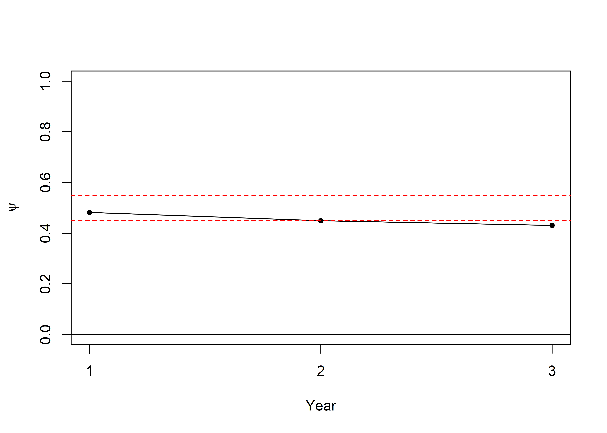
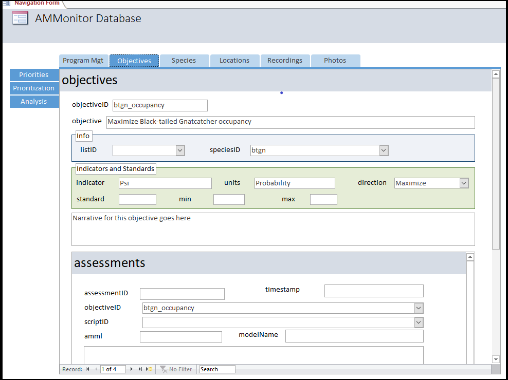

<div></div>

-   [Chapter Introduction](#chapter-introduction)
-   [Create the Chapter Database](#create-the-chapter-database)
-   [The Objectives Table](#the-objectives-table)
-   [The Verdin Dynamic Occupancy
    Analysis](#the-verdin-dynamic-occupancy-analysis)
-   [Assessment of the Verdin Occupancy
    Objective](#assessment-of-the-verdin-occupancy-objective)
-   [Logging the Assessement](#logging-the-assessement)
-   [The Assessments Table in Access](#the-assessments-table-in-access)
-   [Chapter Summary](#chapter-summary)
-   [Chapter References](#chapter-references)

Chapter Introduction
====================

In previous chapters, we explained how the **scores** and
**classifications** tables in an **AMMonitor** database store a wealth
of information about captured signals (see Chapter 17). We further
illustrated just one (of many) potential analyses that use the
**scores** and **classifications** data to address ecological questions
(see Chapter 18). Many of the questions that a research team seeks to
answer are linked to **objectives**, as introduced in Chapter 5, and we
will now return to this important topic.

In the book, “Structured Decision Making: A Practical Guide to
Environmental Management Choices” \[1\], Robin Gregory suggests that the
"statement of objectives can be kept pretty simple. Essentially, they
consist of the thing that matters and (usually) a verb that indicates
the desired direction of change:

1.  Increase revenues to the regional government.
2.  Reduce the probability of extinction of wild salmon.
3.  Minimize emissions of greenhouse gasses.
4.  Maximize year-round employment."

These examples include indicators (also called attributes; what exactly
will be measured, such as revenue, probability of extinction, emissions,
employment) and direction (the intended level or direction, such as
increase, decrease, minimize, maximize, or maintain). Units of measure
may also be specified.

**AMMonitor** facilitates the tracking of objectives generically, but
what is most important from the monitoring perspective is that an
objective can be quantitatively assessed through the analysis of
monitoring data, such as remotely captured acoustic data or images. As
such, example objectives may include:

1.  Maximize occupancy rate of desired species x.
2.  Minimize occupancy rate of undesired species y.
3.  Minimize human-made sounds.

Setting objectives can be difficult, and a discussion of how to set
objectives is well beyond our scope. For additional information, see
\[2\], \[1\], \[3\], \[4\], \[5\], \[6\], \[7\], and \[8\]. In Chapter
5, we described how objectives (of any type) can be logged in the
**AMMonitor** database. Now, we focus on how to assess an objective by
comparing the results of an analysis with the stated objective. The
analysis will be logged in the **assessments** database table to provide
a trace. Unlike other chapters, there are no new **AMMonitor** functions
to explore. The reason is because objectives can vary tremendously, and
each objective may very well require a unique set of instructions for
pitting an analysis output against the objective itself. These
instructions may be stored in a script (logged in the **scripts** table,
and where the actual code is stored in the directory called “scripts”).

Here, we provide a single example of an assessment. We define an
assessment as an analysis conducted to describe the state of affairs,
i.e., the state of the ecological system with respect to the stated
objective. We begin this chapter by reviewing the objectives we
introduced in Chapter 5, focusing on an occupancy objective related to a
small desert songbird, the Verdin (*Auriparus flaviceps*). Next, we use
the dynamic false positive occupancy model from \[9\] (which we ran in
Chapter 18) to assess the current Verdin occupancy status. Finally, we
illustrate some coding approaches (saved in a script) to compare the
objective with the documented occupancy status, and log this assessement
into the **assessments** table.

Create the Chapter Database
===========================

Here, we use `dbCreateSample()` to create a database called
“Chap5.sqlite”, which will be stored in a folder (directory) called
“database” within the **AMMonitor** main directory, which should be your
working directory in R. Recall that `dbCreateSample()` generates all
tables of an **AMMonitor** database, and then pre-populates sample data
into tables specified by the user. For the demonstration purposes of
this chapter, we will only pre-populate a few necessary tables.

``` r
# Create a sample database for this chapter
dbCreateSample(db.name = "Chap19.sqlite", 
               file.path = paste0(getwd(),"/database"), 
               tables =  c("objectives", "species", 
                           "lists", "listItems"))
```

    ## An AMMonitor database has been created with the name Chap19.sqlite which consists of the following tables:

    ## accounts, annotations, assessments, classifications, deployment, equipment, library, listItems, lists, locations, logs, objectives, people, photos, priorities, prioritization, recordings, schedule, scores, scriptArgs, scripts, soundscape, spatials, species, sqlite_sequence, templates, temporals

    ## 
    ## Sample data have been generated for the following tables: 
    ## lists, species, listItems, objectives

Next, we initialize a character object, **db.path**, that holds the
database’s full file path. We connect to the database with RSQLite’s
`dbConnect()` function, where we must identify the SQLite driver in the
‘drv’ argument:

``` r
# Establish the database file path as db.path
db.path <- paste0(getwd(), '/database/Chap19.sqlite')

# Connect to the database
conx <- RSQLite::dbConnect(drv = dbDriver('SQLite'), dbname = db.path)
```

Finally, we send a SQL statement that will enforce foreign key
constraints within the database.

``` r
# Turn the SQLite foreign constraints on
RSQLite::dbSendQuery(conn = conx, statement = 
              "PRAGMA foreign_keys = ON;"
          )
```

    ## <SQLiteResult>
    ##   SQL  PRAGMA foreign_keys = ON;
    ##   ROWS Fetched: 0 [complete]
    ##        Changed: 0

The Objectives Table
====================

Let’s start by reviewing the structure of the **objectives** table:

``` r
# Look at information about the objectives table
dbTables(db.path = db.path, table = "objectives")
```

    ## $objectives
    ##    cid        name         type notnull dflt_value pk comment
    ## 1    0 objectiveID VARCHAR(255)       1         NA  1        
    ## 2    1      listID VARCHAR(255)       0         NA  0        
    ## 3    2   speciesID VARCHAR(255)       0         NA  0        
    ## 4    3   objective VARCHAR(255)       1         NA  0        
    ## 5    4   indicator VARCHAR(255)       0         NA  0        
    ## 6    5       units VARCHAR(255)       0         NA  0        
    ## 7    6   direction VARCHAR(255)       0         NA  0        
    ## 8    7         min         REAL       0         NA  0        
    ## 9    8         max         REAL       0         NA  0        
    ## 10   9    standard         REAL       0         NA  0        
    ## 11  10   narrative         TEXT       0         NA  0

`dbTables()` identifies the name of each column, the primary key, the
type of data stored in each column, and required column entries.

-   *objectiveID* - the table’s primary key (must be unique and less
    than 255 characters). Should be a brief identifier that is easily
    typed.
-   *listID* - a list record that is provided in the **lists** table, if
    applicable.
-   *speciesID* - a species record that is given in the **species**
    table, if applicable.
-   *objective* - the stated objective in report-ready form.
-   *indicator* - specifies what exactly will be measured.
-   *units* - specifies the units of measure.
-   *direction* - indicates the desired direction, such as increase,
    maximize, decrease, minimize, or maintain.
-   *min* - the minimum acceptable target, if applicable.
-   *max* - the maximum acceptable target, if applicable.
-   *standard* - the stated target, if applicable.
-   *narrative* - A text field that allows any number of characters to
    be stored.

This table also contains foreign keys that are linked to other database
tables, identified using the PRAGMA statement below:

``` r
# Return foreign key information for the speciesList table
RSQLite::dbGetQuery(conn = conx, statement = "PRAGMA foreign_key_list(objectives);")
```

    ##   id seq   table      from        to on_update on_delete match
    ## 1  0   0 species speciesID speciesID   CASCADE NO ACTION  NONE
    ## 2  1   0   lists    listID    listID   CASCADE NO ACTION  NONE

Resulting output shows that the field *speciesID* from the table
**objectives** maps to the field *speciesID* in the table **species**.
Additionally, the field *listID* from the table **objectives** maps to
the field *listID* in the table **lists**. Notice that the
**objectives** table simply contains objectives, and does not map
objective hierarchies or identify objectives by type. The reason is that
these characterizations may change depending on context, requiring a
different approach for handling such cases (perhaps in future versions
of **AMMonitor**).

We now will look at the sample objectives that come with the sample
database:

``` r
# Retrieve the first objective, returned as a data.frame
objectives <- RSQLite::dbGetQuery(conn = conx, 
                                  statement = "SELECT * FROM objectives")

# Show the sample objective (columns 1:6)
objectives[1:6]
```

    ##      objectiveID       listID speciesID                                   objective indicator       units
    ## 1       midEarth Middle Earth      <NA>                Conserve native biodiversity      <NA>        <NA>
    ## 2 btgn_occupancy         <NA>      btgn Maximize Black-tailed Gnatcatcher occupancy       Psi Probability
    ## 3 ecdo_occupancy         <NA>      ecdo   Minimize Eurasian Collared-dove occupancy       Psi Probability
    ## 4 verd_occupancy         <NA>      verd                   Maintain Verdin Occupancy       Psi Probability

Here, our sample data consists of four records, and we are displaying
the first six columns only. The first objective’s ID is simply
“midEarth”, and the objective is “Conserve native biodiversity”. The
*listID* for this objective is the list called “Middle Earth” (from the
**lists** table), which identifies all species of Middle Earth. The next
three objectives deal with specific species and their desired occupancy
rates; we have elected to set the primary keys by the species
abbreviation, followed by the word “occupancy” for the primary keys. In
each case, the *listID* is set to &lt;NA&gt;, the *speciesID* is linked
to the primary key in the **species** table, the *indicator* to be
measured is “Psi” (which is the Greek symbol *ψ*, commonly used to
denote occupancy rate), with “Probability” as the *units* of measure.

Objectives are not required to be associated with a **speciesID** or
**listID**, however. For example, in some U.S. National Parks,
monitoring objectives center around maximizing characteristics of
soundscapes.

We now focus on a specific sample objective, centered on the songbird
species, the [Verdin](https://www.allaboutbirds.org/guide/Verdin/id).

``` r
# Show the sample objective (row 4; columns 1, 7:10)
objectives[4,c(1,7:10)]
```

    ##      objectiveID direction  min  max standard
    ## 4 verd_occupancy  Maintain 0.45 0.55      0.4

Here, we see an objective with the *objectiveID* of “verd\_occupancy”.
Note that *direction* is set to “Maintain.” Directions are typically
“Maximize”, “Minimize”, or “Maintain” to indicate which direction the
monitoring (and management) team wishes to push the state of the Verdin
population. Here, we wish to manage such that the *standard* is 0.4, but
can range between the upper (*max*) and lower (*min*) boundary of
acceptable occupancy.

The final column of the **objectives** table (not shown) stores the
objective narrative. The *narrative* field can be used to provide
additional narrative. For example, might include a description of the
type of analysis or analyses that may be used to assess the objective.

The purpose of a monitoring effort is to compare the state of the system
(e.g., Verdin occupancy rate) with a stated objective (which could be a
natural resources objective or a scientific objective). Now that we
understand the Verdin objective, we can analyze our remotely captured
data.

The Verdin Dynamic Occupancy Analysis
=====================================

In Chapter 18, we assumed the Middle Earth team analyzed the
**AMMonitor** acoustic monitoring data with the package, **RPresence**
\[10\] in a multi-season (dynamic) occupancy modeling framework.

As a quick refresher to Chapter 18, we used the function
`occupancySim()` to simulate an encounter history for the Verdin
(necessary because the sample dataset that comes with **AMMonitor** is
too small to run a meaninful analysis directly). The `occupancySim()`
function provides encounter histories like “real” histories from
remotely captured data; these data can be input into a single-species
false positive dynamic occupancy model (‘the Miller Model’). Note that
the current version of `occupancySim()` does not accommodate covariates.

Users may input a desired number of sites (‘n.sites’), seasons
(‘n.seasons’), and ‘surveys.per.season’. In ‘psi’, input the desired
probability of occupancy in the first season; in ‘gamma’, the
probability of colonization of an unoccupied site; and in ‘epsilon’, the
probability of extinction from an occupied site. In ‘p11’, input a value
for detection probability given presence; in ‘p10’, the probability of a
false positive detection at an unoccupied site; and in ‘b’, the
probability a detection will be certain, conditional on detecting the
species at an occupied site.

``` r
# set a random number seed
set.seed(201)

# create a simulated encounter history with 100 sites
sim.eh <- occupancySim(n.sites = 100, 
                       n.seasons = 2, 
                       surveys.per.season = 5,
                       psi = 0.5, 
                       gamma = 0.15, 
                       epsilon = 0.3,
                       p11 = 0.8,
                       p10 = 0.05,
                       b = 0.05)
```

    ## Requested psi: 0.5. Simulated: 0.48.

    ## Requested gamma: 0.15. Simulated: 0.177.

    ## Requested epsilon: 0.3. Simulated: 0.247.

    ## Requested p11: 0.8. Simulated: 0.832.

    ## Requested p10: 0.05. Simulated: 0.045.

    ## Requested b: 0.05. Simulated: 0.045.

`occupancySim()` returns a matrix where the number of rows is equal to
‘n.sites’, and the number of columns is equal to
‘n.seasons’\*‘surveys.per.season’. Notice that because of the random
nature of simulating data, the final dataset’s parameters are not
exactly equal to the requested parameter values; increasing sample size
will generally reduce this difference. Cells are populated with either a
0, 1, or 2. Row names indicate generic location names. Again, column
names follow the pattern of ‘season’-‘survey’; the column name ‘1-1’
indicates season 1, survey 1. ‘1-2’ stands for season 1, survey 2, and
so on. `occupancySim()` also returns messages comparing the
user-specified values against the actual simulated values (which may
differ substantially if given a low value of ‘n.sites’). Below, we view
the first few records of **sim.eh** to confirm its format:

``` r
head(sim.eh)
```

    ##            1-1 1-2 1-3 1-4 1-5 2-1 2-2 2-3 2-4 2-5
    ## location@1   1   1   1   0   1   0   0   0   0   0
    ## location@2   0   0   0   0   0   1   1   1   1   0
    ## location@3   0   0   0   0   0   0   0   1   0   0
    ## location@4   0   0   0   0   0   0   0   0   0   0
    ## location@5   1   1   1   1   0   1   1   1   1   1
    ## location@6   0   0   0   0   1   0   0   0   0   0

Here, we will assume that this Verdin dataset was collected by remotely
deployed acoustic or photographic monitoring. To analyze this dataset
and obtain parameter estimates for occupancy, we will use **RPresence**
functions to fit a Miller et al. 2013 \[9\] dynamic occupancy model with
no covariates. RPresense simply links the program R to the stand-alone
executable program, PRESENCE, which in turn provides a suite of
analytical tools for estimating species distribution patterns through
space and time.

First, we use the **RPresence** function `createPao()` to generate a PAO
(proportion of area occupied) file for input to PRESENCE. The ‘data’
argument takes a raw encounter history matrix as input. Below, we input
our simulated encounter history, **sim.eh**. In ‘nsurveyseason’, we
specify the number of surveys in each season; in our case, there are 5
per season. Into the ‘unitnames’ argument, we input the rownames of the
encounter history, taking care to ensure that they are in the same order
as the sites in the encounter history matrix.

``` r
# Load RPresence
library(RPresence)

# Create pao
one.pao <- createPao(data = sim.eh,             
                     nsurveyseason = rep(5, 2), 
                     unitnames = rownames(sim.eh)) 
```

Next, we create formulas for all six parameters of the Miller model, and
turn them into R data type “formulas” using lapply(form.list,
as.formula). Finally, we use the `occMod()` function to run the
analysis, inputting the **formulas** object to the ‘model’ argument and
**one.pao** to ‘data’. Under ‘type’, we indicate ‘do.fp’ (which stands
for *dynamic occupancy false positives*). We use the ‘randinit’ argument
to tell PRESENCE to use 9 different starting values to help it find the
top of the likelihood function. Lastly, we can give the output file a
name in the ‘outfile’ argument. See [RPresence/PRESENCE
documentation](https://www.mbr-pwrc.usgs.gov/software/presence.html) for
more details.

``` r
# Create a list of formulae for the Miller intercept model
form.list <- list('psi ~ 1', 
                  'gamma ~ 1', 
                  'epsilon ~ 1',
                  'p11 ~ 1', 
                  'p10 ~ 1', 
                  'b ~ 1')

# Convert the formula list to an object of class formula
formulas <- lapply(form.list, as.formula)

# Run the RPresence occMod function; save the output as a model called 'sim.model'
sim.model <- occMod(model = formulas,
             data = one.pao,
             type = 'do.fp',
             randinit = 9,
             outfile = 'm0')

# Look at the structure of the resulting model output
str(sim.model, max.level = 1)
```

    ## List of 12
    ##  $ modname    : chr "psi()gamma()epsilon()p11()p10()b()"
    ##  $ model      :List of 4
    ##  $ dmat       :List of 2
    ##  $ data       :List of 15
    ##   ..- attr(*, "class")= chr "pao"
    ##  $ outfile    : chr "m0"
    ##  $ neg2loglike: num 996
    ##  $ npar       : int 6
    ##  $ aic        : num 1008
    ##  $ beta       :List of 9
    ##  $ real       :List of 6
    ##  $ warnings   :List of 2
    ##  $ version    :List of 2
    ##  - attr(*, "class")= chr [1:2] "occMod" "soFp"

**RPresence** returns a list of outputs, which is packed full of
information about the analysis. We view some key outputs below,
recalling that we simulated a 3 year study. The main “state” of the
system parameters are:

-   psi (*ψ*) = the initial occupancy pattern in year 1
-   gamma (*γ*) = the probability that an unoccuppied site in year *t*-1
    becomes occupied in year *t* (i.e., the probability of colonization)
-   epsilon (*ϵ*) = the probability that an occupied in year *t*-1
    becomes unoccupied in year *t* (i.e., the probability of extinction)

The remaining parameters are detection parameters, and provide
information about the detection process.

``` r
# Retrieve the real parameter estimates from the model, sim.model
estimates <- lapply(sim.model$real, function(x) unlist(x[1, 1:4]))

# Show the estimates
estimates
```

    ## $psi
    ##        est         se lower_0.95 upper_0.95 
    ## 0.48181577 0.05044124 0.38491338 0.58010557 
    ## 
    ## $gamma
    ##        est         se lower_0.95 upper_0.95 
    ## 0.17589612 0.05358439 0.09372997 0.30578770 
    ## 
    ## $epsilon
    ##        est         se lower_0.95 upper_0.95 
    ## 0.25701928 0.06455957 0.15133861 0.40157725 
    ## 
    ## $p11
    ##        est         se lower_0.95 upper_0.95 
    ## 0.84622373 0.01752883 0.80865143 0.87753577 
    ## 
    ## $p10
    ##         est          se  lower_0.95  upper_0.95 
    ## 0.045100016 0.009450511 0.029804930 0.067696454 
    ## 
    ## $b
    ##        est         se lower_0.95 upper_0.95 
    ## 0.05331403 0.01132231 0.03501125 0.08038784

Recall that we can store any model in an **AMModels** library if we wish
to preserve it for posterity. (Recall that we created an **AMModels**
library called do\_fp.RDS, which is housed in the **ammls** directory).
This library stores any/all of the dynamic occupancy false positive
models run by a monitoring program. Below, we demonstrate code for
saving a useful model to the do\_fp **AMModels** library. We will be
able to use this model in the future and update it as needed to evaluate
progress toward our Verdin monitoring objective through time.

``` r
# Read do_fp amml into R: 
do.fp.amml <- readRDS('ammls/do_fp.RDS')

# Turn sim.model into an amModel
am.model <- amModel(model = sim.model, comment = 'Model for Verdin occupancy demonstration.')

# Turn am.model into a named list for insertAMModelLib
am.model.list <- list(verd_sim_occupany = am.model)

# Insert the models into the AMModels library:
do.fp.amml <- insertAMModelLib(models = am.model.list, 
                               amml = do.fp.amml)

# Re-save to amml folder:
saveRDS(do.fp.amml, 'ammls/do_fp.RDS')
```

Assessment of the Verdin Occupancy Objective
============================================

At this point, we have identified an objective for managing the Verdin,
and analyzed our Verdin data with a dynamic occupancy false positive
analysis. Now, we are equipped to assess the objective with respect to
the analysis output. The code below can be written as an R script for
reproducibility.

Recall that our Verdin objective is:

``` r
# Show the  sample objective (row 4; columns 1, 7:10)
objectives <- objectives[4,c(1,7:10)]
objectives
```

    ##      objectiveID direction  min  max standard
    ## 4 verd_occupancy  Maintain 0.45 0.55      0.4

We can use the following code to generate site occupancy rates for each
of the three survey years, and plot them with respect to our stated
objective:

``` r
# set up a vector to hold the psi estimates for each year
psi <- rep(estimates$psi['est'],3)
gamma <- estimates$gamma['est']
epsilon <- estimates$epsilon['est']

# calculate psi for years 2 and 3
for (i in 2:3) {
  psi[i] = psi[i - 1] * (1 - epsilon) + (1 - psi[i - 1]) * gamma
}

# plot 
plot(x = 1:3, 
     y = psi, 
     ylim = c(0,1), 
     pch = 20, 
     xlab = 'Year', 
     xaxt = 'n',
     ylab = expression(psi)) 
axis(side = 1, at = 1:3, labels = TRUE)
     
lines(x = 1:3, y = psi)

abline(h = 0)

# add in the min from the objective
abline(h = objectives[1,'min'], col = 'red', lty = 'dashed')

# add in the  max from the objective
abline(h = objectives[1,'max'], col = 'red', lty = 'dashed')
```



``` r
# Disconnect from the database
# dbDisconnect(conn = RSQLite::SQLite(), dbname = db.path)
```

In Year 1, our Verdin occupancy rate exceeded the 0.35-0.45 minimum and
maximum range for our objective. This triggered adaptive management
action by the Middle Earth monitoring team to nudge the Verdin occupancy
rate downward into the desired range. In Year 2 and Year 3, we were
within our goal range. In future years, if the downward trend in Verdin
occupancy continues to the point that it places us outside the goal
range, this would again trigger modification to the management action.

As can be seen, the Verdin occupancy rate has dipped below the stated
objective in Year 3.

Logging the Assessement
=======================

To log this (simplified) assessment, we now add an entry to the
database’s **assessment** table. Let’s first look at this table’s
schema:

``` r
# Look at information about the assessments table
dbTables(db.path = db.path, table = "assessments")
```

    ## $assessments
    ##   cid         name          type notnull        dflt_value pk comment
    ## 1   0 assessmentID       INTEGER       0              <NA>  1        
    ## 2   1  objectiveID  VARCHAR(255)       1              <NA>  0        
    ## 3   2     scriptID VARCHAR (255)       0              <NA>  0        
    ## 4   3         amml  VARCHAR(255)       0              <NA>  0        
    ## 5   4    modelName  VARCHAR(255)       0              <NA>  0        
    ## 6   5        notes          TEXT       0              <NA>  0        
    ## 7   6    timestamp  VARCHAR(255)       1 CURRENT_TIMESTAMP  0

`dbTables()` returns a list of table schemas, in this case, a list of 1,
which contains a data.frame of information about the **assessments**
table. The *cid* column indicates the column (field) number; *name*
indicates the column name; *type* conveys the data type for that column
as contained within the underlying SQLite database. Thus, the
**assessments** table consists of seven fields (columns):
“assessmentID”, “objectiveID”, “scriptID”, “amml”, “modelName”, and
“notes”, and “timestamp”. Most fields store VARCHAR (variable character
length) data, storing up to 255 characters. In R, VARCHAR data are of
class “character”. The *notnull* column indicates whether an entry is
required for that field. A column’s *dflt\_value* specifies the default
value is used for that field (NA indicates no default value). Lastly,
*pk* indicates whether the field is a primary key. In the
**assessments** table, *assessmentID* is the primary key, which is
automatically assigned by SQLite and is an integer. The *objectiveID*
maps to an objectiveID in the **objectives** table, while the *scriptID*
maps to a scriptID in the **scripts** table. We verify these key
relationships with the following code:

``` r
# Return foreign key information for the scores table
RSQLite::dbGetQuery(conn = conx, statement = "PRAGMA foreign_key_list(assessments);")
```

    ##   id seq      table        from          to on_update on_delete match
    ## 1  0   0    scripts    scriptID    scriptID   CASCADE NO ACTION  NONE
    ## 2  1   0 objectives objectiveID objectiveID   CASCADE NO ACTION  NONE

To register our assessment, we can use a SQLite command, or enter it by
hand in the Access front-end (shown later). Note that we don’t need to
specify the asssessmentID because it is automatically assigned by
SQLite, and we do not need to specify the timestamp because SQLite will
use the default value:

``` r
# Insert records to the assessment table.
RSQLite::dbSendQuery(conn = conx, statement = 
              "INSERT INTO assessments (objectiveID,
                         amml,
                         modelName,
                         notes)
              VALUES ('verd_occupancy',
                      'do.fp',
                      'verd_sim_occupany',
                      'First assessment of verdin occupancy rate.');"
          )
```

    ## <SQLiteResult>
    ##   SQL  INSERT INTO assessments (objectiveID,
    ##                          amml,
    ##                          modelName,
    ##                          notes)
    ##               VALUES ('verd_occupancy',
    ##                       'do.fp',
    ##                       'verd_sim_occupany',
    ##                       'First assessment of verdin occupancy rate.');
    ##   ROWS Fetched: 0 [complete]
    ##        Changed: 1

``` r
# Check database to confirm new records were added
RSQLite::dbGetQuery(conn = conx, 'SELECT * FROM assessments')
```

    ##   assessmentID    objectiveID scriptID  amml         modelName                                      notes           timestamp
    ## 1            1 verd_occupancy     <NA> do.fp verd_sim_occupany First assessment of verdin occupancy rate. 2019-07-05 16:27:56

By registering our assessment, we now formally link a natural resource
objective (verdin occupancy rate) with an analysis (the dynamic
occupancy model with false positives). Our model is stored in our
AMModels library, where it can be recalled at any time. And our script,
if saved, can be registered in the scripts table if desired to preserve
the elements of the analysis.

As this analysis shows, the simulated Verdin occupancy rate has dipped
below the stated objective in Year 3. :worried: Consequently, this
information may spur the Middle Earth team to initiate some management
activities that may increase the occupancy rate back toward the intended
level. Normally, an occupancy model would include some covariates that
can be manipulated by management activities. For example, if Verdin
local extinction from a site is related to vegetation structure at the
site, then management activities that alter vegetation structure can be
used to reduce site extinction risk. If Verdin colonization of empty
sites is a function of patch connectivity, then management activities
that promote connectivity can be used to increase colonization of empty
sites. Both of these management activities can help push the Verdin
toward’s it intended objective.

The Assessments Table in Access
===============================

An assessment is stored directly with its objective, and thus can be
located under the main tab called Objectives. An assessment can be
logged manually, or can be logged via a SQL command as we illustrated
earlier.

<kbd>


</kbd>

> *Figure 20.1. Assessments are stored with the objective they are
> intended to assess. Objectives can be be scientific objectives, or
> natural resource management objectives.*

Chapter Summary
===============

The “AM” portion of the AMMonitor package stands for “Adaptive
Management”. Agencies are increasingly called upon to implement their
natural resource management programs within an adaptive management (AM)
framework. Adaptive management is a key initiative for the U.S.
Department of Interior, which offers the following definition \[12\]:

“Adaptive management promotes flexible decision making that can be
adjusted in the face of uncertainties as outcomes from management
actions and other events become better understood. Careful monitoring of
these outcomes both advances scientific understanding and helps adjust
policies or operations as part of an iterative learning process.
Adaptive management also recognizes the importance of natural
variability in contributing to ecological resilience and productivity.
It is not a ‘trial and error’ process, but rather emphasizes learning
while doing. Adaptive management does not represent an end in itself,
but rather a means to more effective decisions and enhanced benefits.
Its true measure is in how well it helps meet environmental, social, and
economic goals, increases scientific knowledge, and reduces tensions
among stakeholders.”

This chapter introduces the AMMonitor approach for linking natural
resource objectives with a particular analysis. As monitoring
progresses, the analyses themselves (models) provide the current state
of a natural resource system, and our current understanding of the
environmental factors that drive the system itself. AMMonitor may help
to enable this practice for monitoring programs that utilize remotely
captured data.

Chapter References
==================

1. Gregory R. Structured decision making: A practical guide to
environmental management choices. New York: Wiley-Blackwell; 2012. p.
312 p.

2. Keeney RL. Developing objectives and attributes. In: Edwards W, Miles
RFJ, Winterfeldt D von, editors. Advances in decision analysis.
Cambridge University Press; pp. 104–128.
doi:[10.1017/cbo9780511611308.008](https://doi.org/10.1017/cbo9780511611308.008)

3. Conroy M, Peterson J. Decision making in natural resource management:
A structured, adaptive approach \[Internet\]. Wiley-Blackwell; 2013.
Available:
<http://www.wiley.com/WileyCDA/WileyTitle/productCd-0470671742.html>

4. Goodwin P, Wright G. Decision analysis for management judgment. John
Wiley & Sons; 2014.

5. Walters C. Adaptive management of renewable resources. New York:
Macmillan; 1986. p. 374 p.

6. Fuller AK. Decision making in natural resource management: A
structured adaptive approach. Journal of Wildlife Management. 2014;78:
175–176.

7. Williams BK. Adaptive management of natural resources-framework and
issues. Journal of Environmental Management. 2011;92: 1346–1353.

8. Runge MC. An introduction to adaptive management for threatened and
endangered species. Journal of Fish and Wildlife Management. 2011;2:
220–233.

9. Miller D. A., Nichols J. D., Gude J. A., Rich L. N., Podruzny K. M.,
Hines J. E., et al. Determining occurrence dynamics when false positives
occur: Estimating the range dynamics of wolves from public survey data.
PLoS one. 2013;8: e65808.

10. Hines J. RPresence for presence: Software to estimate patch
occupancy and related parameters (version 12.10) \[Internet\]. U.S.
Geological Survey, Patuxent Wildlife Research Center; 2018. Available:
<https://www.mbr-pwrc.usgs.gov/software/presence.html>

11. Fiske IJ, Chandler RB. Unmarked: An r package for fitting
hierarchical models of wildlife occurrence and abundance. Journal of
Statistical Software. 2011;43: 1–23.

12. Williams BK, Brown ED. Adaptive management: The u.s. Department of
interior applications guide. U.S. Department of the Interior,
Washington, DC. 2012.
