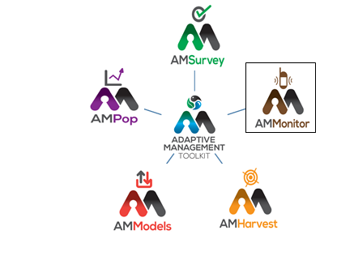

## AMMonitor: Remote Monitoring of Biodiversity in an Adaptive Framework

### Welcome to the **AMMonitor** wiki!  AMMonitor is an R package for remote monitoring of biodiversity in an adaptive framework. It is part of the Adaptive Management Toolkit - a family of R packages for adaptive management of natural resources.

<kbd>

</kbd>

###  In the right hand panel, you will see links to each chapter.  The chapters build on each other, and consequently are intended to be worked through in sequence.  See you in Chapter 0:  Motivation and Gratitude.